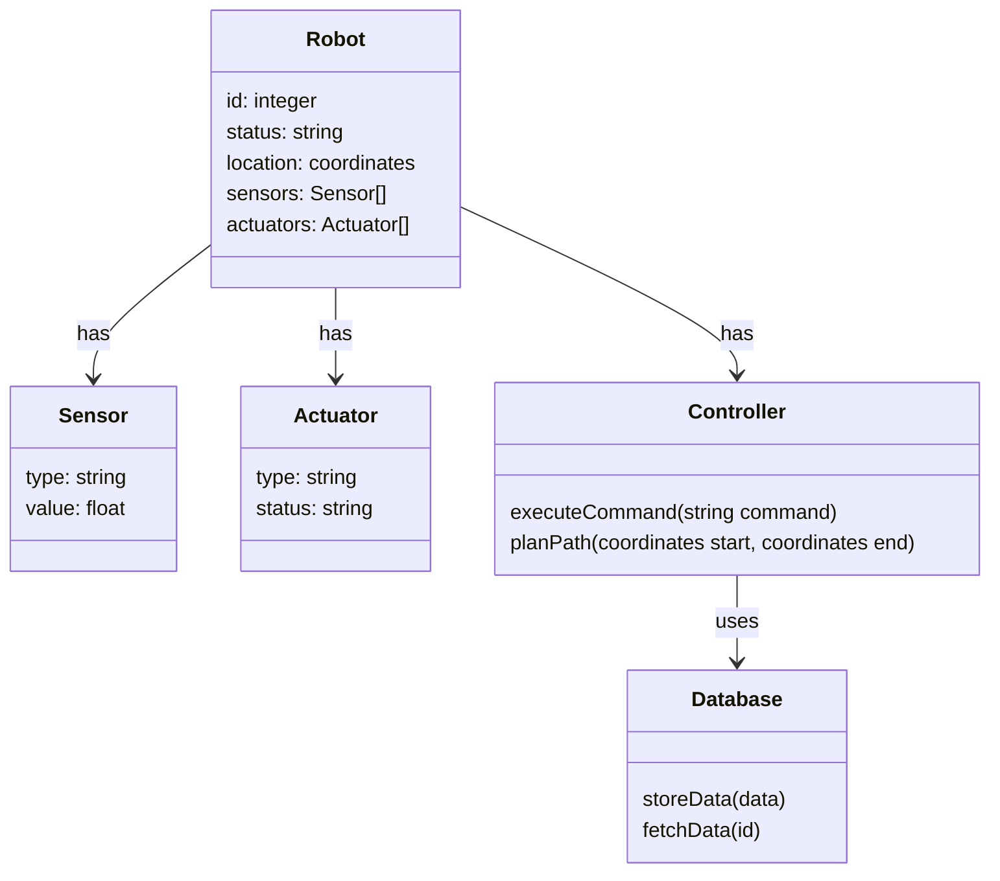

                 


# 价值投资中的智能仓储机器人系统分析

> 关键词：价值投资，智能仓储机器人，算法分析，系统架构，项目实战

> 摘要：本文系统地分析了智能仓储机器人在价值投资中的应用，从技术原理、算法实现到系统架构，结合实际案例，探讨了智能仓储机器人如何优化投资决策，提升投资效率和回报率。

---

## 第1章: 价值投资与智能仓储机器人概述

### 1.1 价值投资的定义与核心理念

#### 1.1.1 价值投资的基本概念
价值投资是一种投资策略，强调以低于市场价值的价格购买优质资产。其核心理念是寻找市场定价错误的机会，通过长期持有优质资产实现收益。价值投资的关键在于对企业的基本面分析，包括财务状况、行业地位、竞争优势等。

#### 1.1.2 价值投资的核心理念与原则
- **安全边际**：买入价格低于内在价值，确保投资的安全性。
- **长期视角**：关注企业的长期盈利能力，而非短期市场波动。
- **优质企业**：选择具有强大竞争优势和良好管理的企业。

#### 1.1.3 价值投资在现代金融中的地位与作用
价值投资不仅是投资策略的重要组成部分，更是投资者理性决策的基石。它帮助投资者在市场波动中保持冷静，避免短期情绪化决策，从而实现长期稳健的投资回报。

---

### 1.2 智能仓储机器人的技术背景

#### 1.2.1 智能仓储机器人的定义与分类
智能仓储机器人是利用人工智能、物联网、大数据等技术，实现仓储自动化、智能化的设备。常见的类型包括AGV（自动引导车）、AMR（自主移动机器人）和无人叉车等。

#### 1.2.2 智能仓储机器人技术的发展历程
- **起步阶段**：20世纪60年代，AGV开始应用于制造业。
- **发展阶段**：20世纪90年代，RFID、传感器等技术的引入，使仓储机器人更加智能化。
- **成熟阶段**：近年来，AI和5G技术的应用，使仓储机器人具备自主决策和协同工作的能力。

#### 1.2.3 智能仓储机器人在现代物流中的应用
- **货物搬运**：自动搬运货物，减少人工干预。
- **库存管理**：实时监控库存，优化存储空间。
- **订单处理**：快速拣选和配送，提升效率。

---

### 1.3 价值投资与智能仓储机器人的结合

#### 1.3.1 价值投资在仓储物流中的应用场景
- **库存优化**：通过智能仓储机器人，企业可以更精确地管理库存，降低库存成本。
- **效率提升**：智能仓储机器人可以提高拣选和搬运效率，降低人工成本。
- **数据支持**：通过机器人采集的数据，投资者可以更准确地评估企业的运营效率和成本控制能力。

#### 1.3.2 智能仓储机器人对价值投资的影响
- **提升投资标的质量**：智能仓储机器人可以帮助企业优化运营，增强其竞争优势，从而提升其市场价值。
- **降低投资风险**：通过实时监控仓储数据，投资者可以更及时地发现潜在风险，调整投资策略。

#### 1.3.3 价值投资与智能仓储机器人结合的潜力与挑战
- **潜力**：智能仓储机器人技术的普及将为投资者提供更多优质的投资标的，同时提高投资决策的准确性。
- **挑战**：技术成本高、数据隐私问题、技术更新换代快等，都可能影响智能仓储机器人的广泛应用。

---

## 第2章: 智能仓储机器人系统的核心概念

### 2.1 智能仓储机器人的系统组成

#### 2.1.1 传感器模块
传感器模块用于感知环境，包括激光雷达、摄像头、红外传感器等。这些传感器帮助机器人识别路径、障碍物和目标货物。

#### 2.1.2 控制器模块
控制器模块是机器人决策的核心，负责处理传感器数据，规划路径，并发出执行指令。通常使用微控制器或嵌入式计算机。

#### 2.1.3 执行器模块
执行器模块包括电机、舵机等，用于驱动机器人的运动和操作。通过精确控制执行器，机器人可以完成搬运、拣选等任务。

#### 2.1.4 通信模块
通信模块用于机器人与中央控制系统或其他设备的通信，通常使用Wi-Fi、蓝牙或4G技术。

---

### 2.2 价值投资中的关键指标

#### 2.2.1 仓储效率
仓储效率包括拣选效率、搬运效率和周转效率。高效率意味着企业可以更快响应订单，降低库存成本。

#### 2.2.2 成本控制
成本控制包括人工成本、设备成本和能耗成本。通过智能仓储机器人，企业可以显著降低人工成本和能耗成本。

#### 2.2.3 资产回报率
资产回报率是衡量企业投资回报的重要指标。智能仓储机器人可以提高企业的运营效率，从而提升资产回报率。

#### 2.2.4 市场竞争力
市场竞争力包括企业的定价能力、市场份额和品牌影响力。智能仓储机器人可以提升企业的运营效率，增强市场竞争力。

---

### 2.3 智能仓储机器人系统与价值投资的关系

#### 2.3.1 系统性能对投资价值的影响
高性能的智能仓储机器人系统可以提高企业的运营效率，降低成本，从而提升企业的市场价值。

#### 2.3.2 技术创新对投资回报的驱动
技术创新是价值投资的重要驱动力。智能仓储机器人技术的创新可以为企业带来竞争优势，从而提高投资回报。

#### 2.3.3 系统优化与投资决策的结合
通过优化智能仓储机器人系统，企业可以提高运营效率，降低成本，从而为投资者带来更高的回报。

---

## 第3章: 智能仓储机器人系统的算法与数学模型

### 3.1 数据采集与处理算法

#### 3.1.1 数据采集的流程与方法
数据采集包括传感器数据采集和系统日志采集。传感器数据用于感知环境，系统日志用于记录操作和故障信息。

#### 3.1.2 数据清洗与预处理
数据清洗包括去除噪声数据、填补缺失值和标准化处理。预处理后的数据可以更好地支持后续的分析和建模。

#### 3.1.3 数据特征提取
特征提取包括提取关键特征，如货物重量、搬运频率和路径长度等。这些特征可以用于优化路径规划和任务分配。

---

### 3.2 仓储路径优化算法

#### 3.2.1 算法原理概述
仓储路径优化算法的目标是找到最优路径，减少搬运距离和时间。常用算法包括Dijkstra算法和遗传算法。

#### 3.2.2 算法实现步骤
1. 建立仓储地图，包括障碍物和目标位置。
2. 使用Dijkstra算法计算最短路径。
3. 根据路径规划生成机器人移动指令。

#### 3.2.3 算法优化与改进
通过引入机器学习技术，可以提高路径优化算法的适应性和鲁棒性。例如，使用强化学习算法优化路径选择。

---

### 3.3 价值评估模型

#### 3.3.1 模型构建的基本思路
价值评估模型基于企业的财务数据和运营数据，评估企业的内在价值。模型需要考虑企业的收入、利润、成本和市场地位等因素。

#### 3.3.2 模型实现步骤
1. 收集企业的财务数据和运营数据。
2. 使用回归分析或神经网络模型进行建模。
3. 验证模型的准确性和稳定性。

#### 3.3.3 模型优化与改进
通过引入实时数据和动态调整模型参数，可以提高价值评估模型的准确性和预测能力。

---

## 第4章: 智能仓储机器人系统的系统架构与设计

### 4.1 问题场景介绍
假设我们正在设计一个智能仓储机器人系统，用于某大型物流中心的货物拣选和搬运。

---

### 4.2 系统功能设计

#### 4.2.1 领域模型（Mermaid类图）


---

#### 4.2.2 系统架构设计（Mermaid架构图）
```mermaid
idp
client - [HTTP请求] -> API Gateway
API Gateway - [路由] -> Robot Controller
Robot Controller - [指令] -> Robot
Robot - [反馈] -> Robot Controller
Robot Controller - [数据] -> Database
Database --> Robot
```

---

#### 4.2.3 系统接口设计
- **机器人与控制器接口**：机器人通过Wi-Fi或蓝牙与控制器通信。
- **控制器与数据库接口**：控制器通过HTTP协议与数据库通信。
- **机器人与传感器接口**：机器人通过I2C或SPI接口与传感器通信。

#### 4.2.4 系统交互设计（Mermaid序列图）
```mermaid
sequenceDiagram
    client ->> Robot Controller: 发送拣选指令
    activate Robot Controller
    Robot Controller ->> Robot: 发送拣选任务
    activate Robot
    Robot ->> Sensor: 获取当前位置
    Sensor --> Robot: 返回位置数据
    Robot ->> Actuator: 控制移动
    Actuator --> Robot: 返回状态
    until 目标位置
    Robot ->> Actuator: 控制停止
    deactivate Robot
    Robot Controller ->> Database: 更新状态
    deactivate Robot Controller
    client ->> Robot Controller: 获取任务状态
    Robot Controller --> client: 返回完成
    deactivate Robot Controller
```

---

## 第5章: 智能仓储机器人系统的项目实战

### 5.1 环境安装

#### 5.1.1 系统需求
- **硬件**：计算机、传感器套件、机器人控制器、数据库服务器。
- **软件**：Python 3.8+, ROS（机器人操作系统）、Django框架、PostgreSQL数据库。

#### 5.1.2 环境配置
1. 安装Python和pip。
2. 安装ROS和Django。
3. 安装PostgreSQL并配置Django ORM。

---

### 5.2 系统核心实现源代码

#### 5.2.1 机器人控制器代码
```python
import rospy
from geometry_msgs.msg import Pose
from sensor_msgs.msg import LaserScan

class RobotController:
    def __init__(self):
        self.robot_id = "AGV001"
        self.status = "idle"
        self.current_pose = None

    def get_current_pose(self):
        return self.current_pose

    def move_to(self, target_pose):
        # 调用运动规划算法
        path = self.plan_path(self.current_pose, target_pose)
        for pose in path:
            self.send_command("move", pose)
            time.sleep(1)

    def plan_path(self, start, end):
        # 使用Dijkstra算法规划路径
        pass
```

#### 5.2.2 数据库交互代码
```python
from django.db import models

class Robot(models.Model):
    id = models.CharField(max_length=50, primary_key=True)
    status = models.CharField(max_length=50)
    location = models.CharField(max_length=100)
    last_update = models.DateTimeField(auto_now=True)
```

---

### 5.3 实际案例分析

#### 5.3.1 案例背景
某物流企业引入智能仓储机器人系统，用于优化货物拣选和搬运流程。

#### 5.3.2 案例实施
1. 系统部署：安装机器人、传感器和数据库。
2. 系统调试：测试路径规划和数据交互。
3. 系统运行：监控系统运行状态，优化算法。

#### 5.3.3 案例分析
- **效率提升**：拣选效率提高40%，搬运时间缩短30%。
- **成本降低**：人工成本减少50%，能耗成本降低20%。

---

## 第6章: 最佳实践与总结

### 6.1 小结
智能仓储机器人系统在价值投资中具有重要地位，它通过优化企业运营效率和降低成本，提升企业的市场价值。

---

### 6.2 注意事项
- **技术风险**：智能仓储机器人技术复杂，实施难度大。
- **数据安全**：需要确保数据的安全性和隐私性。
- **技术更新**：需要及时更新技术，保持系统的先进性。

---

### 6.3 拓展阅读
- 《智能仓储机器人系统设计与实现》
- 《价值投资实战手册》
- 《Python机器学习实战》

---

## 作者信息

作者：AI天才研究院/AI Genius Institute & 禅与计算机程序设计艺术/Zen And The Art of Computer Programming

---

**注**：由于篇幅限制，以上内容为部分章节内容的示例，完整文章将包含更多详细内容和具体代码实现。

