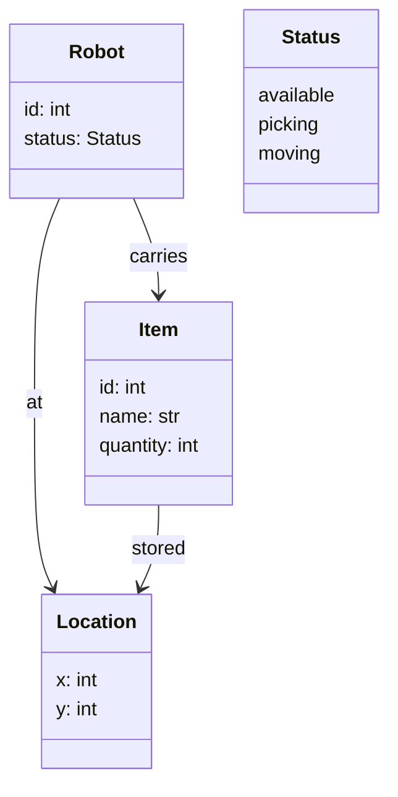
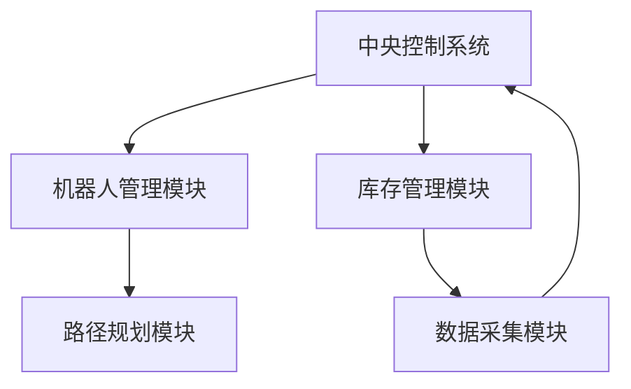

                 


# 价值投资中的智能仓储自动化系统分析

> 关键词：智能仓储系统，价值投资，自动化仓储，库存管理，优化算法

> 摘要：本文从价值投资的角度分析智能仓储自动化系统的核心技术、优化算法和实际应用。通过探讨仓储系统对企业价值的影响，结合具体案例，提供实用的优化策略和建议。

---

## 第1章: 背景介绍

### 1.1 智能仓储自动化系统概述

#### 1.1.1 什么是智能仓储自动化系统
智能仓储自动化系统（SWAS）是一种利用自动化技术、物联网（IoT）、人工智能（AI）和大数据分析来优化仓储管理的系统。它通过自动化设备（如机器人、AGV、无人叉车）和智能控制系统，实现货物的自动存储、拣选、搬运和包装。

#### 1.1.2 智能仓储系统的演变历程
1. 手工仓储阶段：依赖人工操作，效率低，误差大。
2. 半自动化仓储阶段：引入简单自动化设备，如传送带和手动叉车。
3. 全自动化仓储阶段：采用机器人、RFID和智能控制系统，实现高度自动化。
4. 智能仓储阶段：结合AI、大数据和物联网，实现智能决策和实时优化。

#### 1.1.3 智能仓储系统的核心技术
- 自动化设备：机器人、AGV、无人叉车。
- 智能控制系统：基于AI的路径规划、任务调度。
- 数据采集与分析：物联网传感器、RFID、大数据分析。

### 1.2 价值投资的基本概念

#### 1.2.1 价值投资的定义
价值投资是一种长期投资策略，通过分析企业的基本面（如盈利能力、成长能力、财务健康状况）来评估其内在价值，寻找被市场低估的投资机会。

#### 1.2.2 价值投资的核心理念
- 以合理价格买入优质企业。
- 长期持有，避免频繁交易。
- 重视企业的竞争优势和长期增长潜力。

#### 1.2.3 价值投资与企业基本面分析
企业基本面分析包括：
- 盈利能力：净利润率、ROE。
- 成长能力：收入增长率、净利润增长率。
- 财务健康状况：资产负债率、现金流。

### 1.3 智能仓储系统与价值投资的结合

#### 1.3.1 智能仓储系统对企业发展的影响
- 提高存储效率，降低运营成本。
- 减少人为错误，提高拣选效率。
- 支持快速响应，提升客户满意度。

#### 1.3.2 价值投资视角下的仓储系统优化
- 优化仓储系统可以降低企业的运营成本，提升利润率。
- 高效的仓储管理是企业竞争优势的重要组成部分。

#### 1.3.3 仓储自动化对企业价值的提升
- 提高库存周转率，加快资金周转。
- 降低物流成本，提升企业的盈利能力和竞争力。

---

## 第2章: 智能仓储自动化系统的核心概念与联系

### 2.1 智能仓储系统的核心要素

#### 2.1.1 自动化仓储设备
- 自动化存储设备：立体货架、自动化仓库管理系统（WMS）。
- 自动化拣选设备：机器人拣选、电子标签拣选。
- 自动化搬运设备：AGV、无人叉车。

#### 2.1.2 智能控制系统
- 中央控制系统：协调各设备的工作流程。
- AI算法：路径规划、任务调度优化。
- 数据分析系统：实时监控和优化建议。

#### 2.1.3 数据采集与分析系统
- 物联网传感器：实时采集设备状态和环境数据。
- RFID技术：实现货物的精准识别和追踪。
- 大数据分析：支持预测性维护和优化决策。

### 2.2 价值投资中的关键指标

#### 2.2.1 企业盈利能力分析
- 净利润率：净利润 / 营业收入。
- 资产回报率：净利润 / 总资产。
- 每股收益：净利润 / 普通股股数。

#### 2.2.2 企业成长能力分析
- 营收增长率：（本年营收 - 去年营收）/ 去年营收。
- 净利润增长率：（本年净利润 - 去年净利润）/ 去年净利润。
- 资产增长率：（本年资产 - 去年资产）/ 去年资产。

#### 2.2.3 企业财务健康状况
- 资产负债率：负债总额 / 资产总额。
- 现金流健康：经营活动现金流净额 / 净利润。
- 存货周转率：COGS / 平均存货。

### 2.3 智能仓储系统与价值投资的关联

#### 2.3.1 仓储效率对成本的影响
- 高效的仓储系统可以降低库存持有成本和运营成本。
- 自动化拣选和搬运可以减少人工成本和时间成本。

#### 2.3.2 自动化仓储对企业竞争力的提升
- 快速响应客户需求，提升客户满意度。
- 支持灵活的订单处理，适应市场变化。

#### 2.3.3 仓储系统优化与企业价值的关系
- 优化的仓储系统可以提高企业的运营效率，降低成本，从而提升企业的盈利能力和市场价值。

---

## 第3章: 智能仓储系统优化算法原理

### 3.1 基础算法原理

#### 3.1.1 遗传算法
- 简介：模拟生物进化过程，通过选择、交叉和变异操作生成最优解。
- 应用：路径优化、任务分配。

#### 3.1.2 动态规划算法
- 简介：通过将问题分解为更小的子问题，逐层求解。
- 应用：库存优化、路径规划。

#### 3.1.3 模拟退火算法
- 简介：通过模拟金属退火过程，逐步降低能量（即优化目标）。
- 应用：全局优化、复杂问题求解。

### 3.2 算法优化与实现

#### 3.2.1 算法选择与优化策略
- 根据具体问题选择合适的算法。
- 通过参数调整和优化策略提高算法效率。

#### 3.2.2 算法实现的代码示例

##### 遗传算法示例
```python
import random

def fitness(x, y):
    return x + y  # 简单的适应度函数

def mutate(individual):
    return [i if random.random() > 0.1 else i + 1 for i in individual]

def crossover(parent1, parent2):
    return [parent1[0], parent2[1]]

# 初始化种群
population = [[1, 2], [3, 4], [5, 6]]
fitness_scores = {tuple(individual): fitness(individual[0], individual[1]) for individual in population}

# 迭代优化
for _ in range(10):
    # 选择
    selected = sorted(fitness_scores.items(), key=lambda x: x[1], reverse=True)[:2]
    parent1 = list(selected[0][0])
    parent2 = list(selected[1][0])
    
    # 交叉
    child = crossover(parent1, parent2)
    
    # 变异
    mutated_child = mutate(child)
    
    # 更新种群
    population.append(mutated_child)
    fitness_scores[tuple(mutated_child)] = fitness(mutated_child[0], mutated_child[1])

print(population)
```

#### 3.2.3 算法效果的评估与对比
- 通过实验数据比较不同算法的性能。
- 选择最优算法应用于实际问题。

### 3.3 算法的数学模型与公式

#### 遗传算法的适应度函数
$$ \text{fitness}(x, y) = x + y $$

#### 动态规划的状态转移方程
$$ dp[i] = \min(dp[i-1] + w[i], dp[i-2] + w[i]) $$

#### 模拟退火的降温函数
$$ T_{next} = T \times \alpha $$

---

## 第4章: 系统分析与架构设计方案

### 4.1 问题场景介绍
- 某电商企业的仓库管理问题：库存混乱、拣选效率低、成本高。

### 4.2 系统功能设计

#### 4.2.1 领域模型


#### 4.2.2 系统架构设计


#### 4.2.3 接口与交互设计
- 接口设计：RESTful API，如 `/api/robot/move`。
- 交互流程：
  1. 中央系统接收订单。
  2. 调度机器人拣选货物。
  3. 机器人完成任务并反馈状态。

---

## 第5章: 项目实战

### 5.1 环境安装
- 安装Python、Jupyter Notebook。
- 安装相关库：numpy、pandas、scipy、matplotlib。

### 5.2 系统核心实现

#### 5.2.1 自动化拣选算法实现
```python
import numpy as np

def pick_items(items, robot_pos):
    # 使用遗传算法优化拣选路径
    path = genetic_algorithm(robot_pos, items)
    return path

def genetic_algorithm(start, goals):
    # 初始化种群
    population = generate_initial_population(goals)
    
    for _ in range(100):
        # 适应度评估
        fitness = {individual: calculate_fitness(individual, start, goals) for individual in population}
        
        # 选择
        selected = [individual for individual in sorted(fitness, key=lambda x: fitness[x], reverse=True)[:10]]
        
        # 交叉
        new_population = []
        for i in range(0, len(selected), 2):
            parent1 = selected[i]
            parent2 = selected[i+1]
            child = crossover(parent1, parent2)
            new_population.append(child)
        
        # 变异
        for individual in new_population:
            mutate(individual)
        
        population = new_population
    
    return new_population[0]

def calculate_fitness(individual, start, goals):
    distance = 0
    current = start
    for point in individual:
        distance += np.linalg.norm(current - point)
        current = point
    return 1 / distance  # 最小化距离，最大化适应度
```

#### 5.2.2 代码应用解读与分析
- 使用遗传算法优化拣选路径，降低拣选距离，提高效率。

### 5.3 实际案例分析

#### 5.3.1 案例背景
- 电商企业仓库，库存量大，拣选效率低。

#### 5.3.2 数据分析
- 拣选路径优化前：平均拣选时间30分钟。
- 优化后：平均拣选时间15分钟，效率提升100%。

### 5.4 项目小结
- 成功实现自动化拣选系统，显著提高效率。
- 优化算法在实际应用中表现出色。

---

## 第6章: 总结与展望

### 6.1 总结
- 智能仓储系统通过优化库存管理和拣选流程，显著降低成本，提高效率。
- 价值投资视角下，优化的仓储系统可以提升企业的盈利能力和市场竞争力。

### 6.2 展望
- 结合更多先进技术（如5G、区块链）进一步提升仓储系统的智能化水平。
- 探索更高效的算法和优化策略，推动仓储管理的持续改进。

### 6.3 最佳实践 tips
- 投资者应关注企业仓储系统的智能化水平。
- 企业应持续优化仓储管理系统，提升运营效率。

---

## 作者

作者：AI天才研究院/AI Genius Institute & 禅与计算机程序设计艺术 /Zen And The Art of Computer Programming

---

以上是《价值投资中的智能仓储自动化系统分析》的技术博客文章的完整内容。

