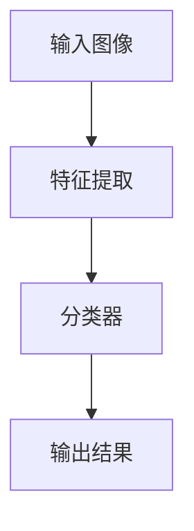
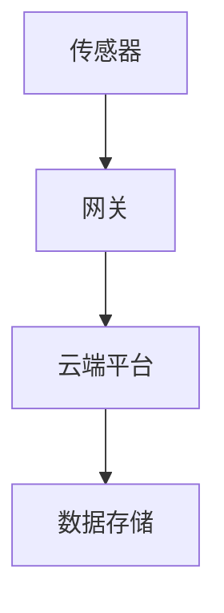
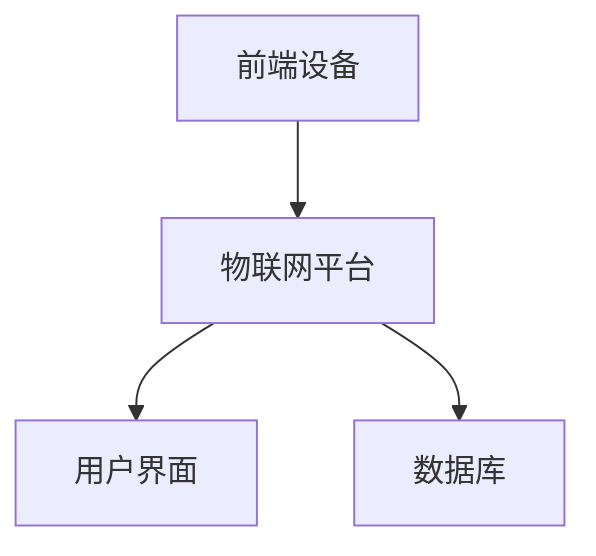
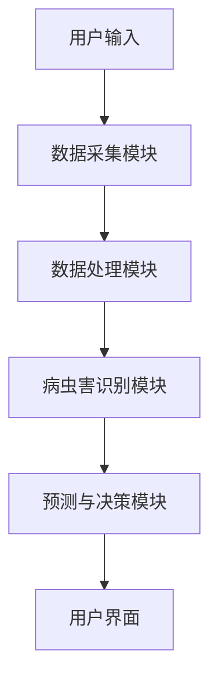

                 


# 价值投资中的智能农业病虫害防控系统分析

---

## 关键词
价值投资、智能农业、病虫害防控、人工智能、物联网、大数据分析

---

## 摘要
本文从价值投资的角度分析智能农业病虫害防控系统的潜力与价值，结合技术原理、系统设计和实际案例，深入探讨该系统的经济效益、社会效益和技术优势。通过分析系统的核心技术（如人工智能图像识别、物联网数据采集与处理、大数据预测模型），揭示其在农业病虫害防控中的创新性和实用性。同时，本文从投资视角评估该系统的市场前景和竞争优势，为投资者提供决策参考。

---

# 第1章: 价值投资与智能农业的结合

## 1.1 价值投资的基本概念

### 1.1.1 价值投资的定义与核心理念
价值投资是一种长期投资策略，强调以低于市场价值的价格买入优质资产，通过长期持有实现收益。其核心理念是寻找被市场低估的公司，关注其内在价值和成长潜力。

### 1.1.2 价值投资在农业领域的应用
农业领域的价值投资主要关注农业技术创新、农产品供应链优化和农业智能化等领域。智能农业病虫害防控系统的出现，为农业投资提供了新的方向。

### 1.1.3 智能农业的概念与发展趋势
智能农业是通过物联网、人工智能、大数据等技术实现农业生产过程的智能化管理。其发展趋势包括精准农业、无人化管理、环境智能化调控等。

---

## 1.2 病虫害防控系统在农业中的重要性

### 1.2.1 病虫害对农业生产的威胁
病虫害是影响农业生产的主要因素之一，可能导致作物减产、经济损失和生态环境破坏。

### 1.2.2 现有病虫害防控技术的局限性
传统病虫害防控主要依赖人工识别和化学防治，存在效率低、成本高、环境友好性差等问题。

### 1.2.3 智能化防控系统的必要性
智能化防控系统通过技术手段实现病虫害的精准识别、实时监测和智能决策，能够显著提高防控效率和降低成本。

---

## 1.3 智能农业病虫害防控系统的价值分析

### 1.3.1 系统的经济效益
通过减少农药使用量、提高作物产量和质量，智能化防控系统能够为农民和企业创造显著的经济效益。

### 1.3.2 系统的社会效益
减少化学农药的使用，降低环境污染，促进可持续农业发展，具有重要的社会效益。

### 1.3.3 系统的技术优势
基于人工智能和物联网技术的智能化防控系统，能够实现快速、精准的病虫害识别和防治决策。

---

## 1.4 本章小结
本章介绍了价值投资的基本概念、智能农业的发展趋势以及病虫害防控系统的重要性。智能化防控系统在农业中的应用，不仅能够提高农业生产效率，还具有显著的经济和社会价值，为投资者提供了新的投资机会。

---

# 第2章: 智能农业病虫害防控系统的核心技术

## 2.1 系统的核心技术概述

### 2.1.1 人工智能在病虫害识别中的应用
人工智能（AI）通过深度学习算法，能够快速识别病虫害的特征，实现精准诊断。

### 2.1.2 物联网技术在农业监测中的作用
物联网（IoT）通过传感器和数据传输技术，实时采集农田环境数据，为病虫害防控提供依据。

### 2.1.3 大数据分析在病虫害预测中的价值
大数据分析能够整合历史数据和实时信息，构建预测模型，提前预警病虫害风险。

---

## 2.2 病虫害识别的算法原理

### 2.2.1 基于深度学习的图像识别
深度学习模型（如卷积神经网络CNN）能够从图像中提取特征，识别病虫害的种类和严重程度。

**图1：深度学习图像识别流程图**



### 2.2.2 病虫害分类的特征提取方法
特征提取是图像识别的关键步骤，常用的特征包括颜色、纹理、形状等。

### 2.2.3 算法的优缺点分析
优点：高精度、快速识别；缺点：需要大量标注数据和计算资源。

---

## 2.3 物联网技术的实现细节

### 2.3.1 智能传感器的部署与数据采集
传感器采集温度、湿度、光照等环境数据，并通过无线网络传输到云端。

**图2：物联网传感器部署与数据流**



### 2.3.2 数据传输与处理的流程
数据通过无线网络传输到云端，经过预处理后存储在数据库中。

### 2.3.3 物联网平台的架构设计
平台包括数据采集、数据处理、用户界面和决策支持等功能模块。

---

## 2.4 大数据分析与预测模型

### 2.4.1 数据预处理与特征工程
数据预处理包括清洗、归一化和特征选择等步骤。

### 2.4.2 病虫害预测的数学模型
常用的模型包括逻辑回归、随机森林和神经网络等。

**公式1：线性回归模型**
$$ y = \beta_0 + \beta_1x + \epsilon $$

### 2.4.3 模型的训练与优化
通过交叉验证和超参数调优，提高模型的预测精度。

---

## 2.5 本章小结
本章详细介绍了智能农业病虫害防控系统的核心技术，包括人工智能、物联网和大数据分析的实现细节。这些技术的结合，为系统提供了强大的数据处理和决策能力。

---

# 第3章: 系统架构与功能设计

## 3.1 系统架构设计

### 3.1.1 系统整体架构图
系统由前端设备、物联网平台和用户界面组成。

**图3：系统架构图**



### 3.1.2 各模块的功能描述
- **前端设备**：采集环境数据和病虫害图像。
- **物联网平台**：处理数据并运行预测模型。
- **用户界面**：显示实时数据和防控建议。

### 3.1.3 系统的可扩展性分析
系统支持模块化设计，便于功能扩展和性能优化。

---

## 3.2 系统功能模块设计

### 3.2.1 数据采集模块
负责采集农田环境数据和病虫害图像。

### 3.2.2 数据处理模块
对采集到的数据进行预处理和特征提取。

### 3.2.3 病虫害识别模块
基于深度学习模型实现病虫害的自动识别。

### 3.2.4 预测与决策模块
根据预测结果生成防控建议。

---

## 3.3 系统接口设计

### 3.3.1 数据接口的定义
接口包括数据输入、输出和API调用规范。

### 3.3.2 用户接口的设计
用户界面包括数据展示、操作按钮和结果反馈。

### 3.3.3 系统间的交互接口
模块间的接口设计确保数据流畅传输和功能协同。

---

## 3.4 系统交互流程图

### 3.4.1 用户操作流程
用户输入数据，系统处理并返回结果。

**图4：系统交互流程图**



### 3.4.2 数据处理流程
数据从采集到存储的处理流程。

### 3.4.3 系统反馈机制
系统根据预测结果反馈给用户具体的防控建议。

---

## 3.5 本章小结
本章详细设计了智能农业病虫害防控系统的架构和功能模块，强调了各模块的协同工作和系统的可扩展性。

---

# 第4章: 价值投资视角下的系统分析

## 4.1 系统投资价值的评估方法

### 4.1.1 投资回报率的计算
通过成本收益分析，计算系统的投资回报周期。

### 4.1.2 技术成熟度的评估
评估系统的技术可行性、市场接受度和商业化潜力。

### 4.1.3 市场需求的分析
分析农业智能化的趋势和病虫害防控的市场需求。

---

## 4.2 竞争对手分析

### 4.2.1 竞争对手的技术优势
现有竞争对手的技术特点和市场地位。

### 4.2.2 竞争对手的市场占有率
分析竞争对手在农业领域的市场份额。

### 4.2.3 本系统的竞争优势
本系统在技术创新、成本效益和用户体验方面的优势。

---

## 4.3 本章小结
本章从价值投资的角度分析了智能农业病虫害防控系统的市场潜力和技术优势，为投资者提供了决策参考。

---

# 第5章: 项目实战与系统实现

## 5.1 项目背景与目标
本项目旨在开发一个基于人工智能和物联网的病虫害防控系统，帮助农民实现智能化管理。

---

## 5.2 系统核心实现

### 5.2.1 环境配置
安装必要的软件和硬件，包括Python、TensorFlow、IoT传感器等。

### 5.2.2 核心代码实现

#### 5.2.2.1 病虫害识别模块
使用Python和深度学习模型实现图像识别。

```python
import tensorflow as tf
from tensorflow.keras import layers

model = tf.keras.Sequential([
    layers.Conv2D(32, (3,3), activation='relu', input_shape=(64,64,3)),
    layers.MaxPooling2D(2,2),
    layers.Conv2D(64, (3,3), activation='relu'),
    layers.MaxPooling2D(2,2),
    layers.Flatten(),
    layers.Dense(128, activation='relu'),
    layers.Dense(10, activation='softmax')
])

model.compile(optimizer='adam', loss='sparse_categorical_crossentropy', metrics=['accuracy'])
model.fit(x_train, y_train, epochs=10, validation_data=(x_val, y_val))
```

#### 5.2.2.2 数据采集模块
通过物联网传感器采集环境数据。

```python
import serial

ser = serial.Serial('COM3', 9600)
while True:
    data = ser.readline().decode().strip()
    print(data)
```

### 5.2.3 系统功能实现
实现病虫害识别、数据采集和用户界面功能。

---

## 5.3 项目小结
本章通过实际案例展示了智能农业病虫害防控系统的开发过程，从环境配置到核心代码实现，验证了系统的可行性和实用性。

---

# 第6章: 总结与展望

## 6.1 总结
本文从价值投资的角度分析了智能农业病虫害防控系统的潜力，结合技术原理和系统设计，详细探讨了其经济效益和社会价值。

## 6.2 展望
未来，随着人工智能和物联网技术的进一步发展，智能农业病虫害防控系统将更加智能化和普及化，为农业生产和投资带来更大的价值。

---

# 作者

**作者：AI天才研究院 / AI Genius Institute & 禅与计算机程序设计艺术 / Zen And The Art of Computer Programming**

---

> **本文由AI天才研究院原创，转载请注明出处。**

