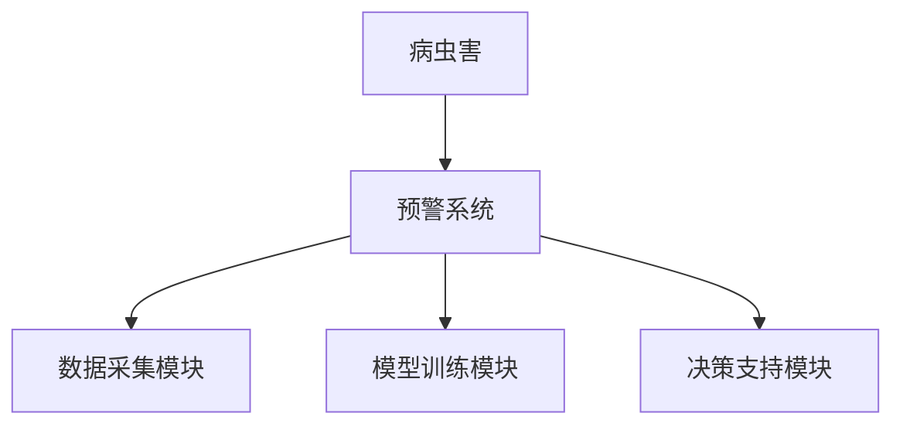
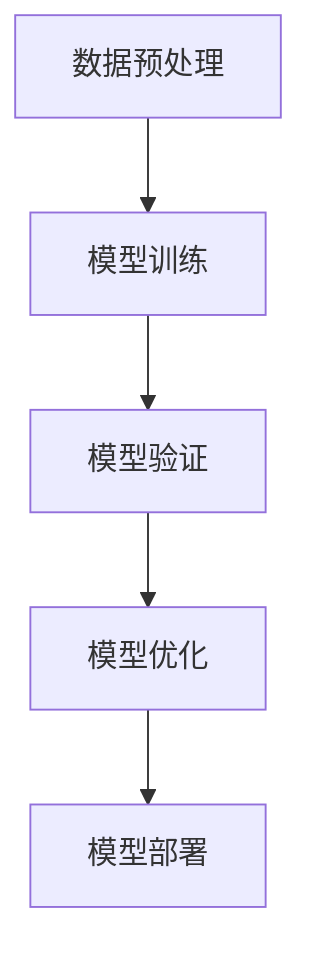
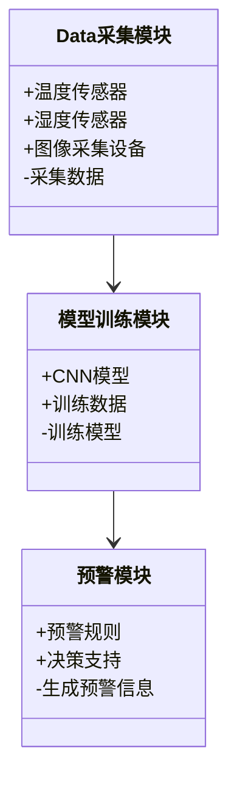
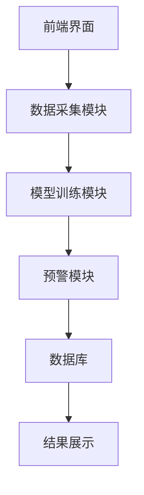

                 


# 价值投资中的智能农业病虫害预警系统分析

> 关键词：智能农业，病虫害预警，价值投资，机器学习，系统架构

> 摘要：本文从价值投资的角度分析智能农业病虫害预警系统的开发与应用，深入探讨其技术原理、系统架构、算法实现和投资价值。通过分析系统的核心概念、算法原理和实际案例，揭示其在农业智能化中的重要地位和投资潜力。

---

## 第1章: 背景与概述

### 1.1 问题背景
#### 1.1.1 病虫害对农业的影响
病虫害是影响农业生产的主要因素之一，每年造成巨大的经济损失。传统病虫害防治主要依赖人工经验，存在效率低、成本高、预警不及时等问题。

#### 1.1.2 传统病虫害预警的局限性
传统病虫害预警方法依赖人工观察和经验判断，存在以下问题：
- 数据采集不全面
- 预警不及时
- 方法不够科学
- 成本较高

#### 1.1.3 智能化预警的必要性
随着人工智能技术的发展，智能病虫害预警系统能够通过图像识别、机器学习等技术实现精准预警，帮助农民减少损失。

### 1.2 价值投资与智能农业的结合
#### 1.2.1 价值投资的核心理念
价值投资强调长期投资，关注企业的内在价值和成长潜力。在农业领域，智能农业病虫害预警系统具有广阔的应用前景和投资价值。

#### 1.2.2 智能农业的定义与特点
智能农业是将现代信息技术与农业生产相结合的新型农业模式，具有高效性、精准性和可持续性等特点。

#### 1.2.3 病虫害预警系统的投资价值
智能病虫害预警系统能够提高农业生产效率，降低损失，具有显著的经济效益和社会价值。

### 1.3 系统目标与意义
#### 1.3.1 系统的核心目标
实现病虫害的早期预警、精准防治，提高农业生产效率。

#### 1.3.2 系统的预期效益
- 提高农作物产量
- 降低农民损失
- 节省防治成本

#### 1.3.3 对农业智能化的推动作用
智能病虫害预警系统是农业智能化的重要组成部分，能够推动农业向高效、精准方向发展。

---

## 第2章: 核心概念与联系

### 2.1 核心概念原理
#### 2.1.1 数据采集与处理
系统通过多光谱相机、温湿度传感器等设备采集农田环境数据和病虫害图像数据。

#### 2.1.2 模型训练与优化
利用机器学习算法对采集的数据进行训练，构建病虫害识别模型。

#### 2.1.3 预警机制与决策支持
基于模型预测结果，系统自动生成预警信息，并提供防治决策建议。

### 2.2 核心概念属性对比表
| 概念 | 属性 | 描述 |
|------|------|------|
| 数据源 | 类型 | 多光谱图像、环境数据、历史数据 |
| 模型 | 算法 | CNN、RNN、随机森林 |
| 预警系统 | 级别 | 低、中、高风险 |

### 2.3 实体关系图


---

## 第3章: 算法原理讲解

### 3.1 算法选择与优化
#### 3.1.1 算法选择
选择适合病虫害图像识别的算法，如卷积神经网络（CNN）和随机森林。

#### 3.1.2 算法优化
通过数据增强、超参数优化等方法提升模型性能。

### 3.2 算法实现步骤


### 3.3 算法实现代码
```python
import numpy as np
import tensorflow as tf
from tensorflow.keras import layers

# 数据预处理
def preprocess_data(data):
    # 归一化处理
    data = data / 255.0
    return data

# 构建CNN模型
def build_model(input_shape):
    model = tf.keras.Sequential()
    model.add(layers.Conv2D(32, (3,3), activation='relu', input_shape=input_shape))
    model.add(layers.MaxPooling2D(pool_size=(2,2)))
    model.add(layers.Conv2D(64, (3,3), activation='relu'))
    model.add(layers.MaxPooling2D(pool_size=(2,2)))
    model.add(layers.Flatten())
    model.add(layers.Dense(128, activation='relu'))
    model.add(layers.Dense(1, activation='sigmoid'))
    return model

# 模型训练
def train_model(model, X_train, y_train, epochs=10):
    model.compile(optimizer='adam', loss='binary_crossentropy', metrics=['accuracy'])
    model.fit(X_train, y_train, epochs=epochs, validation_split=0.2)
    return model

# 使用模型进行预测
def predict_model(model, X_test):
    predictions = model.predict(X_test)
    return predictions
```

---

## 第4章: 系统分析与架构设计

### 4.1 问题场景介绍
系统需要实现病虫害的实时监测和预警，帮助农民及时采取防治措施。

### 4.2 项目介绍
项目目标是开发一个高效、准确的智能病虫害预警系统，实现以下功能：
- 数据采集与传输
- 病虫害识别与预警
- 防治决策支持

### 4.3 系统功能设计


### 4.4 系统架构设计


---

## 第5章: 项目实战

### 5.1 环境安装
需要安装以下工具和库：
- Python 3.6+
- TensorFlow 2.0+
- OpenCV
- 数据库（MySQL）

### 5.2 系统核心实现
实现步骤：
1. 数据采集与预处理
2. 模型训练与优化
3. 系统集成与测试

### 5.3 实际案例分析
通过实际案例分析系统在病虫害预警中的应用效果。

---

## 第6章: 最佳实践与投资建议

### 6.1 投资要点
- 选择具有技术优势的团队
- 关注市场需求和政策支持
- 评估系统的经济回报

### 6.2 风险提示
- 技术风险：算法优化和模型迭代
- 市场风险：需求变化和技术替代
- 运营风险：数据采集和系统维护

### 6.3 未来展望
随着人工智能技术的不断进步，智能农业病虫害预警系统将更加智能化和精准化，投资潜力巨大。

---

## 作者：AI天才研究院 & 禅与计算机程序设计艺术

