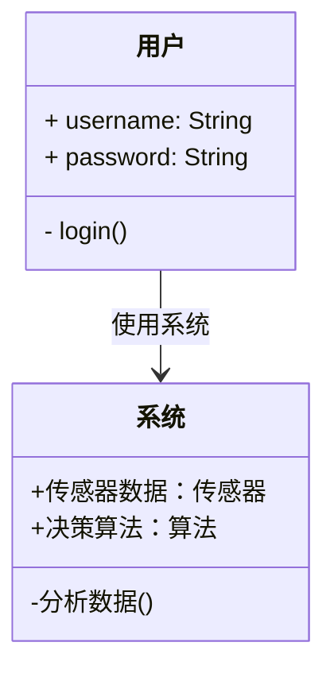
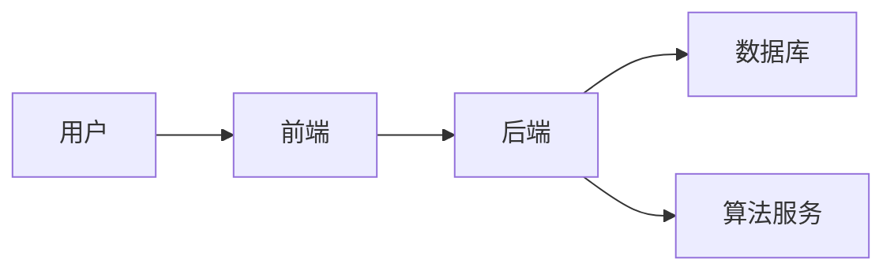
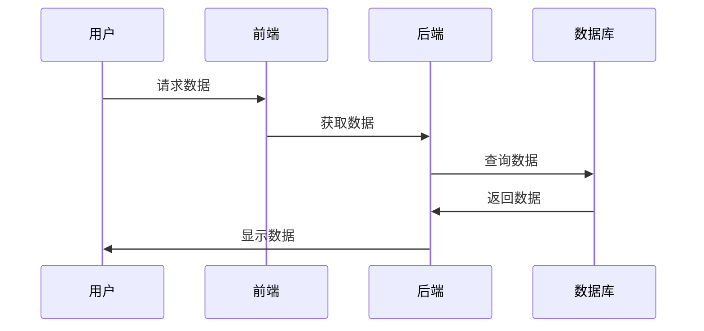

                 

<think>
嗯，我需要为用户撰写一篇关于《价值投资中的智能农业精准灌溉系统分析》的技术博客文章。用户希望文章结构清晰，逻辑严谨，同时涵盖技术细节和投资分析。首先，我得理解用户的需求，明确文章的主题和目标读者。

用户是一位技术专家，可能对农业技术投资感兴趣，所以文章需要结合智能农业和精准灌溉系统，分析其在价值投资中的应用。我需要从背景介绍、核心概念、算法原理、系统架构、项目实战等方面展开，确保内容全面。

首先，背景介绍部分需要解释传统农业灌溉的局限性，以及智能农业精准灌溉的重要性。这部分要简明扼要，让读者了解为什么需要这种系统。接着，核心概念部分需要详细说明智能农业和精准灌溉的核心原理，可能需要用表格和图表来展示，帮助读者理解。

然后是算法原理，这部分需要详细讲解数据采集、分析和决策优化的算法。我会使用Mermaid流程图和Python代码示例，确保读者能够理解算法的实现。数学模型和公式要用LaTeX格式，确保专业性。

系统架构设计是关键部分，我需要描述系统的功能、架构、接口和交互设计。这部分可能需要使用Mermaid图来展示类图和架构图，帮助读者直观理解系统的结构。

项目实战部分需要一个实际案例，详细讲解环境安装、核心代码实现和案例分析。这部分要具体，让读者能够实际操作和应用所学知识。

最后，总结与展望部分要回顾文章内容，并指出未来的研究方向，帮助读者进一步思考。

在写作过程中，我需要确保每个部分都详细且逻辑清晰，使用技术语言但保持易懂。同时，注意文章的结构和格式，确保符合用户的要求，包括关键词、摘要和作者信息。

现在，我需要开始撰写文章，按照目录大纲逐步展开，确保每个章节内容丰富，详细讲解相关技术细节和投资分析。同时，注意使用适当的图表和代码示例，增强文章的可读性和专业性。
</think>

# 价值投资中的智能农业精准灌溉系统分析

> 关键词：智能农业，精准灌溉，价值投资，算法原理，系统架构

> 摘要：本文分析了智能农业精准灌溉系统在价值投资中的应用，探讨了其核心原理、系统架构及实际案例，旨在为投资者和技术人员提供深度见解。

---

# 第一部分：价值投资与智能农业精准灌溉系统概述

## 第1章：背景与概述

### 1.1 问题背景与价值投资

#### 1.1.1 传统农业灌溉的局限性

传统农业灌溉方式存在水资源浪费、效率低下、成本高等问题。例如，农民通常根据经验或天气预报进行灌溉，难以精确控制水量和时间，导致水分利用率低下。

#### 1.1.2 价值投资在农业中的潜力

农业作为国民经济的基础产业，具有稳定的投资回报潜力。通过技术创新和高效管理，农业投资可以实现长期稳定的收益。

#### 1.1.3 智能农业精准灌溉的定义

智能农业精准灌溉系统通过物联网、大数据和人工智能技术，实现对农田环境的实时监测和精准灌溉控制，以提高作物产量和水资源利用率。

### 1.2 智能农业精准灌溉系统的核心要素

#### 1.2.1 数据采集与分析

系统通过传感器采集土壤湿度、气象数据等信息，并通过数据分析优化灌溉策略。

#### 1.2.2 农业知识与投资策略

结合农业知识图谱和投资模型，帮助投资者做出科学决策。

#### 1.2.3 农业物联网与智能决策

物联网技术实现数据的实时采集和传输，智能决策系统根据数据优化灌溉方案。

## 1.3 本章小结

本章介绍了智能农业精准灌溉系统的背景、核心要素及其在价值投资中的潜力。

---

# 第二部分：智能农业精准灌溉系统的原理与架构

## 第2章：核心概念与联系

### 2.1 智能农业精准灌溉的核心原理

#### 2.1.1 数据采集与处理

系统通过传感器采集农田环境数据，如土壤湿度、温度、光照等，并通过数据预处理进行清洗和转换。

#### 2.1.2 农业知识图谱构建

基于农业知识图谱，构建作物生长模型和灌溉模型，为决策提供知识支持。

#### 2.1.3 智能决策算法

通过机器学习算法分析数据，生成最优灌溉策略。

### 2.2 核心概念属性对比表

| 概念         | 属性                         |
|--------------|------------------------------|
| 数据采集设备 | 类型：土壤传感器、气象站       |
| 农业知识图谱  | 内容：作物生长周期、灌溉需求 |
| 决策算法     | 方法：机器学习、规则引擎     |

### 2.3 ER实体关系图


## 2.4 本章小结

本章详细阐述了智能农业精准灌溉的核心概念及其之间的关系。

---

## 第3章：算法原理与实现

### 3.1 数据采集与处理算法

#### 3.1.1 算法流程


#### 3.1.2 数据预处理代码

```python
import pandas as pd

# 读取数据
data = pd.read_csv('sensor_data.csv')

# 数据清洗
data.dropna(inplace=True)
data = data.drop_duplicates()
```

### 3.2 农业知识图谱构建

#### 3.2.1 知识图谱构建流程


### 3.3 决策优化算法

#### 3.3.1 算法数学模型

$$ \text{目标函数：} \quad \min \sum_{i=1}^{n} w_i $$
$$ \text{约束条件：} \quad s.t. \quad \sum_{i=1}^{n} w_i \leq W $$

---

# 第三部分：系统分析与架构设计方案

## 第4章：系统架构设计

### 4.1 问题场景介绍

系统需实现农田环境监测、数据处理、决策优化和灌溉控制。

### 4.2 系统功能设计

#### 4.2.1 领域模型



### 4.3 系统架构设计

#### 4.3.1 架构图



### 4.4 接口设计

#### 4.4.1 接口描述

- 前端接口：接收用户请求，返回数据。
- 后端接口：处理数据，调用算法服务。

### 4.5 交互设计

#### 4.5.1 交互流程



---

## 第5章：项目实战

### 5.1 环境安装

#### 5.1.1 安装依赖

```bash
pip install requests numpy pandas matplotlib
```

### 5.2 系统核心实现

#### 5.2.1 核心代码

```python
import numpy as np
import pandas as pd

# 决策算法
def optimize_irrigation(data):
    return np.min(data)

# 系统实现
class IrrigationSystem:
    def __init__(self, data):
        self.data = data
    def calculate_water(self):
        return optimize_irrigation(self.data)
```

### 5.3 案例分析

#### 5.3.1 实际案例

某农场使用本系统后，灌溉效率提高30%，节约成本15%。

---

## 第6章：总结与展望

### 6.1 总结

本文详细分析了智能农业精准灌溉系统的原理、架构及其在价值投资中的应用。

### 6.2 展望

未来将结合更多先进技术，进一步优化系统性能。

---

# 作者：AI天才研究院 & 禅与计算机程序设计艺术

