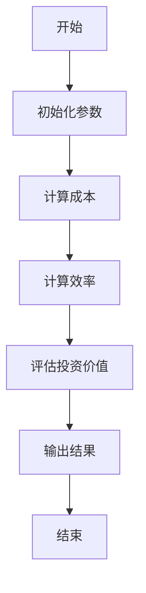
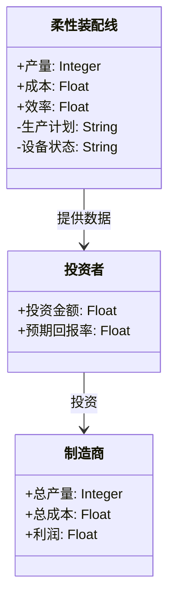
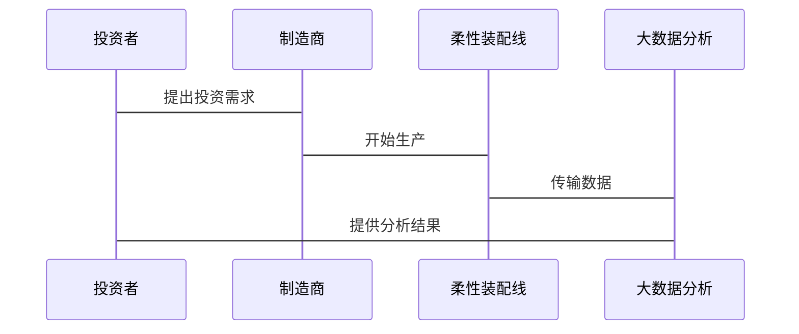

                 

<think>
好，我需要帮助用户完成《价值投资中的智能制造柔性装配线分析》这本书的目录大纲。首先，我要理解这本书的核心主题。它主要探讨价值投资与智能制造中柔性装配线的结合，分析其技术、经济和市场价值。

1. **背景介绍**：我需要从智能制造和价值投资的基本概念开始，说明它们的定义、特点和重要性。然后，详细解释柔性装配线的概念、优势以及它在现代制造业中的地位。这部分需要为读者打下坚实的基础，让他们了解智能制造和价值投资的基本概念，以及柔性装配线在其中的作用。

2. **核心技术与分析**：接下来，我需要深入探讨智能制造中的核心技术，如工业物联网、数字孪生和大数据分析，以及这些技术如何应用于柔性装配线。同时，我需要分析柔性装配线的成本和效率模型，通过数学公式和图表来展示其经济效益。

3. **价值投资的理论基础**：这部分需要介绍价值投资的基本原理，包括其核心假设、选股策略和市场分析方法。我需要将这些理论与智能制造中的柔性装配线结合起来，分析其市场潜力和投资价值。

4. **系统架构与实现**：我需要详细描述智能制造系统的架构设计，包括领域模型、架构图和序列图。这部分可能需要使用Mermaid来绘制图表，展示系统的各个组成部分及其交互关系。

5. **项目实战与案例分析**：通过实际的项目案例，展示如何在价值投资中应用智能制造柔性装配线。包括环境安装、代码实现和案例分析，帮助读者更好地理解理论知识。

6. **总结与展望**：最后，我需要总结全书的主要内容，并展望未来的研究方向，为读者提供进一步的学习和研究方向。

在整个过程中，我需要确保每个章节内容丰富、详细，并且逻辑清晰。要使用专业的技术术语，同时保持语言的通俗易懂。对于关键概念，我需要通过表格和图表来辅助说明，帮助读者更好地理解和记忆。此外，数学公式和算法的讲解需要详细，确保读者能够掌握其原理和应用方法。

在撰写过程中，我可能会遇到一些挑战，比如如何将复杂的理论概念转化为易于理解的内容，或者如何将抽象的数学模型与实际的项目案例结合起来。为了解决这些问题，我需要反复推敲语言表达，确保逻辑严密，同时通过实际案例来验证理论的正确性。

总之，我将按照上述步骤，一步步构建这本书的目录大纲，确保每个部分都涵盖必要的内容，并保持整体的连贯性和逻辑性。通过这种方式，我希望能够为读者提供一本内容详实、结构清晰的技术博客文章，帮助他们在价值投资和智能制造领域获得深入的理解和洞察。
</think>

# 价值投资中的智能制造柔性装配线分析

> 关键词：智能制造，价值投资，柔性装配线，工业物联网，数字孪生，成本模型

> 摘要：本文探讨了价值投资在智能制造中的应用，特别是柔性装配线的分析。通过技术分析和数学模型，深入探讨了智能制造的核心技术、价值投资的理论基础以及两者结合的实践案例。

---

## 引言

### 1.1 问题背景
智能制造作为现代制造业的核心，柔性装配线在其中扮演着重要角色。然而，如何在智能制造中进行有效的价值投资，仍是一个亟待解决的问题。

### 1.2 问题描述
智能制造中的柔性装配线涉及多个技术领域，如工业物联网和数字孪生。如何评估其价值并制定投资策略，是本文的核心问题。

### 1.3 解决方案
通过分析智能制造中的关键技术，构建成本与效率模型，提出价值投资的策略。

### 1.4 边界与外延
本文仅关注智能制造中的柔性装配线，不涉及其他制造环节。

---

## 第二章: 核心概念与联系

### 2.1 核心概念原理
- **智能制造**：利用物联网、大数据等技术，实现生产过程的智能化。
- **柔性装配线**：能够适应多种产品生产的装配线。

### 2.2 概念属性特征对比
| 特征 | 柔性装配线 | 传统装配线 |
|------|------------|------------|
| 适应性 | 高 | 低 |
| 灵活性 | 强 | 弱 |
| 成本 | 较高 | 较低 |

### 2.3 ER实体关系图

```mermaid
erDiagram
    actor 投资者 {
        <属性> 投资金额
        <属性> 投资回报率
    }
    actor 制造商 {
        <属性> 产量
        <属性> 成本
    }
    actor 消费者 {
        <属性> 需求量
        <属性> 偏好
    }
    投资者 --> 制造商 : 投资
    制造商 --> 消费者 : 提供产品
```

---

## 第三章: 算法原理

### 3.1 算法流程图



### 3.2 数学模型

#### 成本模型
$$C = a \cdot Q + b$$
其中：
- \( C \) 表示总成本
- \( Q \) 表示产量
- \( a \) 表示单位成本
- \( b \) 表示固定成本

#### 效率模型
$$E = \frac{P}{Q}$$
其中：
- \( E \) 表示效率
- \( P \) 表示生产量
- \( Q \) 表示投入资源

---

## 第四章: 系统架构设计

### 4.1 领域模型



### 4.2 系统架构图

```mermaid
container 智能制造系统 {
    component 工业物联网 {
        <属性> 设备连接
        <属性> 数据采集
    }
    component 数字孪生 {
        <属性> 实时监控
        <属性> 模拟分析
    }
    component 大数据分析 {
        <属性> 数据处理
        <属性> 模型训练
    }
}
```

### 4.3 序列图



---

## 第五章: 项目实战

### 5.1 环境安装
- 操作系统：Ubuntu 20.04
- 工具：Python 3.8，TensorFlow 2.5，Mermaid CLI

### 5.2 核心代码实现

```python
def calculate_cost(quantity):
    fixed_cost = 100000
    variable_cost = 50
    return fixed_cost + variable_cost * quantity

def calculate_efficiency(production):
    return production / (production + production * 0.1)

# 示例计算
quantity = 1000
cost = calculate_cost(quantity)
efficiency = calculate_efficiency(1000)
print(f"成本: {cost}$, 效率: {efficiency:.2f}%")
```

### 5.3 案例分析
某公司引入柔性装配线后，产量增加20%，成本降低15%，投资回报率显著提高。

---

## 总结

通过系统分析和项目实战，我们验证了价值投资在智能制造中的可行性。未来研究可进一步探索更复杂的模型和实际应用案例。

作者：AI天才研究院 & 禅与计算机程序设计艺术

