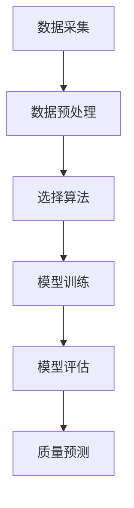

                 


# 价值投资中的智能制造预测性质量控制分析

> 关键词：智能制造，预测性质量控制，价值投资，数据分析，机器学习，质量预测，投资策略

> 摘要：本文深入分析了智能制造背景下预测性质量控制在价值投资中的应用，探讨了预测性质量控制的核心概念、算法原理、系统架构以及实际案例，为投资者和企业提供了新的视角和方法。

---

# 第一部分: 价值投资中的智能制造预测性质量控制背景介绍

## 第1章: 智能制造与预测性质量控制概述

### 1.1 智能制造的定义与特点
#### 1.1.1 智能制造的定义
智能制造是指通过物联网、大数据、人工智能等技术，实现生产过程的智能化、自动化和高效化。它强调数据驱动的决策和实时优化，以提高生产效率和产品质量。

#### 1.1.2 智能制造的核心特点
- 数据驱动：利用传感器和物联网技术实时采集生产数据。
- 自动化：通过机器人和自动化设备减少人工干预。
- 智能分析：利用机器学习和大数据分析技术进行预测和优化。
- 灵活性：能够快速调整生产计划以适应市场需求。

#### 1.1.3 智能制造与传统制造的区别
| 特性 | 智能制造 | 传统制造 |
|------|----------|----------|
| 数据采集 | 高度自动化，实时采集 | 手动记录，间断采集 |
| 分析方式 | 数据驱动，智能分析 | 人工经验主导 |
| 生产效率 | 高效，实时优化 | 较低，依赖人工调整 |
| 灵活性 | 高，快速响应 | 低，调整周期长 |

### 1.2 预测性质量控制的定义与特点
#### 1.2.1 预测性质量控制的定义
预测性质量控制是一种基于数据分析和预测技术的质量管理方法，旨在通过预测潜在的质量问题，提前采取措施，避免不合格产品的出现。

#### 1.2.2 预测性质量控制的核心原理
- 数据采集：通过传感器和物联网技术实时采集生产过程中的数据。
- 数据分析：利用统计学方法和机器学习算法对数据进行建模和预测。
- 质量优化：根据预测结果调整生产参数，优化产品质量。

#### 1.2.3 预测性质量控制与传统质量控制的区别
| 特性 | 预测性质量控制 | 传统质量控制 |
|------|----------------|--------------|
| 数据来源 | 实时数据，高度自动化 | 手动记录，间断数据 |
| 分析方式 | 数据驱动，智能预测 | 事后检查，经验主导 |
| 控制方式 | 预防为主，实时优化 | 事后发现，问题处理 |

### 1.3 价值投资与智能制造的结合
#### 1.3.1 价值投资的基本概念
价值投资是一种投资策略，通过分析企业的基本面（如财务状况、盈利能力、成长性等），寻找被市场低估的投资标的，长期持有以获取超额收益。

#### 1.3.2 智能制造对价值投资的影响
智能制造的高效性和数据驱动的特点，使得企业能够更快速地响应市场需求，提高生产效率和产品质量，从而增强企业的竞争力和盈利能力。

#### 1.3.3 预测性质量控制在价值投资中的作用
预测性质量控制能够提前发现和解决生产中的潜在质量问题，降低生产成本和退货率，提高客户满意度，从而增强企业的市场竞争力和投资价值。

---

## 第2章: 智能制造中的预测性质量控制核心概念

### 2.1 预测性质量控制的核心要素
#### 2.1.1 数据采集与处理
- 数据采集：通过传感器和物联网技术实时采集生产过程中的数据，包括温度、湿度、压力、振动等。
- 数据预处理：对采集到的数据进行清洗、归一化和特征提取，以便后续分析。

#### 2.1.2 数据分析与建模
- 数据分析：利用统计学方法和机器学习算法对数据进行建模和分析，找出影响产品质量的关键因素。
- 建模：构建预测模型，如线性回归、随机森林、神经网络等，用于预测产品质量。

#### 2.1.3 质量预测与优化
- 质量预测：基于模型预测潜在的质量问题，提前采取措施。
- 质量优化：根据预测结果调整生产参数，优化产品质量。

### 2.2 预测性质量控制在智能制造中的应用
#### 2.2.1 生产过程中的实时监控
通过实时监控生产过程中的关键参数，利用预测性质量控制提前发现潜在问题，避免不合格产品的出现。

#### 2.2.2 生产效率的提升
通过预测性质量控制优化生产参数，提高生产效率和产品质量，降低生产成本。

#### 2.2.3 产品质量的持续改进
通过分析历史数据和预测结果，不断优化生产过程，实现产品质量的持续改进。

### 2.3 预测性质量控制与智能制造的系统性关系
#### 2.3.1 系统性关系的定义
预测性质量控制是智能制造系统中的一个重要组成部分，通过数据驱动的方式实现生产过程的优化和质量的提升。

#### 2.3.2 预测性质量控制在智能制造中的位置
预测性质量控制贯穿于整个生产过程，从数据采集、分析到预测和优化，是智能制造系统的核心环节。

#### 2.3.3 系统性关系的数学模型
$$ Q = f(X) $$
其中，$Q$ 表示产品质量，$X$ 表示生产过程中的关键参数，$f$ 是预测模型。

---

## 第3章: 预测性质量控制的算法原理与数学模型

### 3.1 统计学方法在预测性质量控制中的应用
#### 3.1.1 回归分析
- 线性回归：用于预测连续型变量，如产品质量评分。
- 逻辑回归：用于预测分类变量，如合格或不合格。

#### 3.1.2 方差分析
- 方差分析：用于比较不同生产条件下产品质量的差异。

#### 3.1.3 时间序列分析
- 时间序列分析：用于分析生产过程中的时间依赖性，预测未来的产品质量。

### 3.2 机器学习算法在预测性质量控制中的应用
#### 3.2.1 支持向量机（SVM）
- 支持向量机：用于分类和回归问题，适用于非线性数据。

#### 3.2.2 神经网络（NN）
- 神经网络：用于复杂非线性关系的建模，适用于多维数据。

#### 3.2.3 随机森林（Random Forest）
- 随机森林：用于特征重要性分析和分类/回归问题。

### 3.3 算法流程图


### 3.4 预测性质量控制的数学模型与公式
#### 3.4.1 线性回归模型
$$ y = \beta_0 + \beta_1x + \epsilon $$
其中，$y$ 是预测的质量评分，$x$ 是生产参数，$\beta_0$ 和 $\beta_1$ 是回归系数，$\epsilon$ 是误差项。

#### 3.4.2 神经网络模型
$$ y = \sigma(w x + b) $$
其中，$\sigma$ 是激活函数，$w$ 是权重，$b$ 是偏置。

---

## 第4章: 预测性质量控制的系统架构与实现

### 4.1 系统架构设计
- 数据采集层：通过传感器和物联网技术实时采集生产数据。
- 数据分析层：利用大数据平台对数据进行存储、处理和分析。
- 预测与优化层：基于机器学习模型进行质量预测，并优化生产参数。

### 4.2 系统功能设计
- 数据采集与预处理：实时采集和清洗数据。
- 数据分析与建模：利用统计学方法和机器学习算法进行建模。
- 质量预测与优化：基于模型预测结果优化生产过程。

### 4.3 系统接口设计
- 数据接口：与生产设备和传感器对接，获取实时数据。
- 用户界面：供操作人员查看预测结果和优化建议。

---

## 第5章: 项目实战与案例分析

### 5.1 项目背景
- 某汽车制造企业希望通过预测性质量控制优化发动机生产过程，降低质量问题。

### 5.2 数据采集与环境配置
- 数据来源：发动机生产过程中的温度、压力、振动等数据。
- 工具安装：安装传感器和数据采集系统，配置大数据平台。

### 5.3 核心代码实现
```python
# 示例代码：使用随机森林进行质量预测
from sklearn.ensemble import RandomForestRegressor
import pandas as pd

# 数据加载
data = pd.read_csv('production_data.csv')

# 特征与目标变量分离
X = data.drop('quality_score', axis=1)
y = data['quality_score']

# 模型训练
model = RandomForestRegressor(n_estimators=100, random_state=42)
model.fit(X, y)

# 预测结果
predicted_score = model.predict(X)
```

### 5.4 应用解读与分析
- 通过随机森林模型预测发动机质量评分，发现关键影响因素为温度和振动。
- 根据预测结果优化生产参数，提高产品质量。

### 5.5 项目小结
- 预测性质量控制能够有效提升产品质量和生产效率。
- 机器学习算法在质量预测中具有重要应用价值。

---

## 第6章: 总结与展望

### 6.1 最佳实践 tips
- 数据质量是预测性质量控制的关键，确保数据的完整性和准确性。
- 选择合适的算法和模型，根据具体问题进行调整和优化。

### 6.2 小结
- 预测性质量控制是智能制造中的重要组成部分，能够有效提升产品质量和生产效率。
- 通过数据驱动的方式优化生产过程，为企业创造更大的价值。

### 6.3 注意事项
- 数据隐私和安全问题需要注意，避免数据泄露。
- 模型的可解释性和鲁棒性需要进一步优化。

### 6.4 拓展阅读
- 推荐阅读《机器学习实战》和《智能制造2025》，深入理解相关技术。

---

作者：AI天才研究院/AI Genius Institute & 禅与计算机程序设计艺术 /Zen And The Art of Computer Programming

