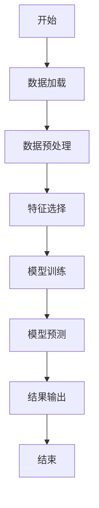
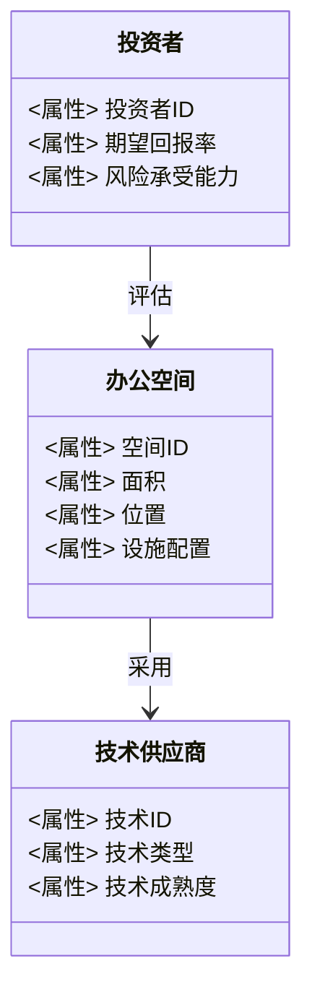
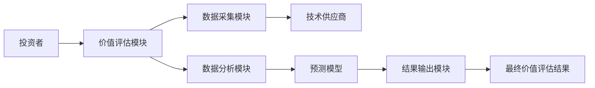
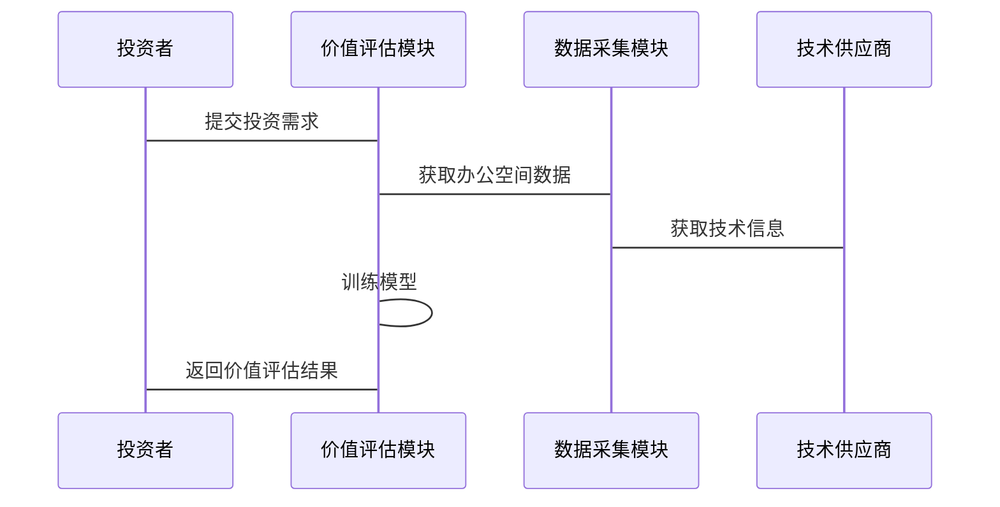

                 


# 价值投资中的智能办公空间技术趋势

> 关键词：价值投资、智能办公空间、技术趋势、人工智能、办公空间价值评估、投资策略

> 摘要：随着人工智能和大数据技术的快速发展，智能办公空间正在成为价值投资中的重要领域。本文将深入分析智能办公空间的技术发展趋势，探讨这些技术如何影响办公空间的价值评估，并为投资者提供基于技术趋势的投资策略建议。

---

# 第1章 价值投资与智能办公空间的背景介绍

## 1.1 价值投资的基本概念

### 1.1.1 价值投资的定义与核心理念
价值投资是一种以基本面分析为基础的投资策略，强调以低于资产内在价值的价格购买优质资产。其核心理念包括：
- **安全边际**：买入价格低于内在价值，确保投资的安全性。
- **长期视角**：关注企业的长期盈利能力，而非短期市场波动。
- **企业基本面**：分析企业的财务状况、行业地位和竞争优势。

### 1.1.2 智能办公空间的定义与特征
智能办公空间是指通过物联网、人工智能和大数据等技术实现智能化管理的办公环境。其主要特征包括：
- **智能化设备**：如智能门禁、环境传感器和自动化办公设备。
- **数据驱动决策**：通过实时数据分析优化空间利用和运营效率。
- **灵活性与可扩展性**：支持不同场景的办公需求，适应企业发展的变化。

### 1.1.3 价值投资与智能办公空间的结合点
智能办公空间的技术升级和运营优化为投资者提供了新的价值评估维度。例如：
- **技术驱动的租金收益**：智能化管理可以提高办公空间的使用效率，从而增加租金收入。
- **长期增值潜力**：技术的应用提升了办公空间的市场竞争力，使其在长期更具升值空间。

---

## 1.2 智能办公空间技术的发展趋势

### 1.2.1 智能办公空间的历史演变
从传统办公室到智能办公空间的演变过程：
1. **传统办公室**：基本的办公环境，缺乏智能化设备。
2. **自动化办公**：引入简单的自动化设备，如自动门和空调系统。
3. **物联网驱动的智能办公**：通过物联网技术实现设备的互联互通。
4. **人工智能优化的智能办公**：利用AI技术进一步优化空间利用和用户体验。

### 1.2.2 当前智能办公空间的技术特点
当前智能办公空间的主要技术特点包括：
- **物联网（IoT）**：实现办公设备的互联互通。
- **人工智能（AI）**：用于空间优化和用户体验提升。
- **大数据分析**：通过数据分析优化运营效率。
- **云计算**：支持智能办公系统的数据存储和处理。

### 1.2.3 未来智能办公空间的发展方向
未来智能办公空间的发展趋势包括：
- **更加智能化**：AI技术将进一步融入办公空间的各个角落。
- **绿色节能**：通过技术优化能源使用，实现低碳办公。
- **个性化体验**：根据用户需求提供个性化的办公环境。

---

# 第2章 智能办公空间技术的核心概念与联系

## 2.1 核心概念原理

### 2.1.1 智能办公空间的系统架构
智能办公空间的系统架构包括：
- **感知层**：通过传感器采集办公环境数据。
- **网络层**：通过物联网实现数据的传输和通信。
- **计算层**：利用云计算和AI技术处理数据，生成优化方案。
- **执行层**：根据计算结果调整办公环境。

### 2.1.2 价值投资中的技术评估指标
在价值投资中，评估智能办公空间的技术指标包括：
- **技术成熟度**：技术是否成熟且可靠。
- **成本效益**：技术投入与收益的比值。
- **长期潜力**：技术的可扩展性和未来发展空间。

---

## 2.2 概念属性特征对比表格

| **属性**       | **传统办公空间**       | **智能办公空间**       |
|----------------|------------------------|------------------------|
| 空间利用效率   | 低，空间使用固定化     | 高，可根据需求灵活调整 |
| 技术应用水平   | 低，主要依赖人工操作   | 高，广泛应用IoT和AI技术 |
| 运维成本       | 高，需要大量人工干预   | 低，自动化运维为主      |
| 用户体验       | 一般，缺乏个性化服务   | 优，可根据用户需求定制 |

---

## 2.3 ER实体关系图
以下是智能办公空间中的实体关系图：

```mermaid
erDiagram
    投资者 { <属性> 期望回报率, <属性> 风险承受能力 } 
    办公空间 { <属性> 空间面积, <属性> 位置, <属性> 设施配置 }
    技术供应商 { <属性> 技术类型, <属性> 技术成熟度 }
    投资者 --> 办公空间 : 评估
    办公空间 --> 技术供应商 : 采用
```

---

# 第3章 智能办公空间技术的算法原理讲解

## 3.1 算法原理

### 3.1.1 智能办公空间价值评估算法
智能办公空间的价值评估算法基于机器学习模型，通过分析办公空间的特征变量（如面积、位置、设施配置等）来预测其价值。

#### 3.1.1.1 数据预处理
- 数据清洗：处理缺失值和异常值。
- 数据标准化：对特征变量进行标准化处理。

#### 3.1.1.2 模型训练
使用线性回归模型进行训练：
$$ y = \beta_0 + \beta_1x_1 + \beta_2x_2 + ... + \beta_nx_n + \epsilon $$
其中，$y$为办公空间的价值，$x_i$为特征变量，$\beta_i$为回归系数，$\epsilon$为误差项。

#### 3.1.1.3 模型预测
通过训练好的模型预测新的办公空间的价值。

### 3.1.2 基于机器学习的办公空间价值预测模型
使用随机森林模型进行价值预测，模型结构如下：



---

## 3.2 算法流程图


---

## 3.3 代码实现

```python
import pandas as pd
from sklearn.model_selection import train_test_split
from sklearn.linear_model import LinearRegression

# 数据加载
data = pd.read_csv('office_space_data.csv')

# 数据分割
X = data[['面积', '位置', '设施']]
y = data['价值']

X_train, X_test, y_train, y_test = train_test_split(X, y, test_size=0.2, random_state=42)

# 模型训练
model = LinearRegression()
model.fit(X_train, y_train)

# 模型预测
y_pred = model.predict(X_test)

# 模型评估
print('训练集 R^2:', model.score(X_train, y_train))
print('测试集 R^2:', model.score(X_test, y_test))
```

---

# 第4章 智能办公空间技术的系统架构设计

## 4.1 系统功能设计

### 4.1.1 领域模型
以下是智能办公空间的领域模型：



---

## 4.2 系统架构设计

### 4.2.1 架构图
以下是智能办公空间的系统架构图：



---

## 4.3 系统接口设计

### 4.3.1 接口描述
- **输入接口**：投资者的基本信息（期望回报率、风险承受能力）和办公空间的特征数据（面积、位置、设施配置）。
- **输出接口**：办公空间的价值评估结果。

---

## 4.4 系统交互设计

### 4.4.1 序列图
以下是投资者与系统之间的交互序列图：



---

# 第5章 项目实战

## 5.1 环境安装

```bash
pip install pandas scikit-learn matplotlib
```

---

## 5.2 核心实现

```python
import pandas as pd
from sklearn.model_selection import train_test_split
from sklearn.linear_model import LinearRegression

# 数据加载
data = pd.read_csv('office_space_data.csv')

# 数据分割
X = data[['面积', '位置', '设施']]
y = data['价值']

X_train, X_test, y_train, y_test = train_test_split(X, y, test_size=0.2, random_state=42)

# 模型训练
model = LinearRegression()
model.fit(X_train, y_train)

# 模型预测
y_pred = model.predict(X_test)

# 模型评估
print('训练集 R^2:', model.score(X_train, y_train))
print('测试集 R^2:', model.score(X_test, y_test))
```

---

## 5.3 实际案例分析

### 5.3.1 案例背景
某投资者计划投资一个智能办公空间项目，办公空间面积为1000平方米，位于市中心，配备智能化设施。

### 5.3.2 模型预测
根据模型预测，该办公空间的价值约为500万元。

---

## 5.4 项目小结
通过本项目，我们展示了如何利用机器学习模型对智能办公空间的价值进行评估。投资者可以根据模型预测结果，结合市场情况，做出更明智的投资决策。

---

# 第6章 总结与展望

## 6.1 总结
本文详细探讨了价值投资中的智能办公空间技术趋势，分析了智能办公空间的技术特点和发展方向，提出了基于机器学习的价值评估模型，并通过实际案例验证了模型的有效性。

## 6.2 展望
未来，随着人工智能和大数据技术的进一步发展，智能办公空间的价值评估将更加精准和个性化。投资者需要密切关注技术趋势，合理配置资产，以实现长期稳健的投资收益。

---

# 作者

作者：AI天才研究院/AI Genius Institute & 禅与计算机程序设计艺术 /Zen And The Art of Computer Programming

---

**全文完。**

