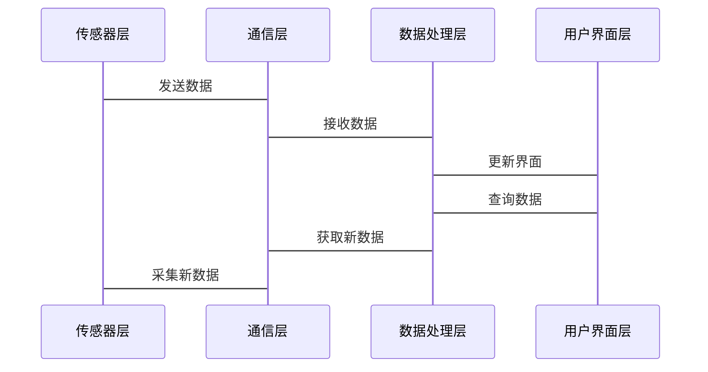

                 


# 价值投资中的智能包装技术发展趋势

> 关键词：智能包装技术，价值投资，物联网，传感器，数据采集与分析，系统架构设计

> 摘要：本文探讨了智能包装技术在价值投资中的发展趋势，分析了智能包装的核心技术、算法原理、系统架构设计以及实际应用场景。通过结合物联网、传感器和数据采集与分析技术，本文揭示了智能包装技术如何为包装行业带来更高的投资价值，并为投资者提供了相关的技术和策略建议。

---

## 第一部分: 智能包装技术与价值投资的背景

### 第1章: 智能包装技术概述

#### 1.1 智能包装的基本概念

智能包装是一种结合了先进技术的包装形式，旨在通过智能化的手段提升包装的功能性、安全性和用户体验。与传统包装相比，智能包装不仅能够保护产品，还能通过传感器、物联网（IoT）等技术实时监测和传递产品信息，从而实现与消费者、供应链和生产端的智能交互。

- **1.1.1 包装的定义与分类**
  - 包装是指为了保护产品、方便运输和提升用户体验而使用的材料或容器。
  - 分类：按功能可分为保护性包装、展示性包装、功能性包装；按材料可分为纸质包装、塑料包装、金属包装等。

- **1.1.2 智能包装的核心特征**
  - 智能包装具备感知、计算和通信能力，能够实时采集数据并进行反馈。
  - 典型特征包括实时监测、数据采集、智能决策和用户交互。

- **1.1.3 智能包装与传统包装的区别**
  - 传统包装主要关注产品的保护和展示功能，而智能包装则强调智能化和数据驱动的特性。
  - 智能包装通过技术手段实现与产品的互动，提升用户体验和供应链效率。

#### 1.2 价值投资中的包装技术应用背景

- **1.2.1 包装行业的发展现状**
  - 随着消费者需求的升级和市场竞争的加剧，包装行业正在向智能化、个性化和可持续方向发展。
  - 智能包装技术的应用能够提升产品的附加值，增强品牌竞争力。

- **1.2.2 包装行业与价值投资的关系**
  - 智能包装技术能够为投资者提供新的投资机会，特别是在技术创新和市场应用方面。
  - 通过智能包装技术，投资者可以更精准地评估包装企业的市场潜力和盈利能力。

- **1.2.3 智能包装技术在价值投资中的潜力**
  - 智能包装技术能够降低生产成本、提升效率，从而为企业创造更高的利润。
  - 智能包装技术的应用可以提升产品的差异化竞争力，从而为企业带来更高的市场估值。

#### 1.3 智能包装技术的核心技术

- **1.3.1 物联网技术在包装中的应用**
  - 物联网技术通过传感器和通信设备实现设备间的互联，为智能包装提供实时数据采集和传输能力。
  - 应用场景：实时监测包装状态、供应链管理、消费者互动。

- **1.3.2 传感器技术在包装中的应用**
  - 传感器技术能够感知环境变化（如温度、湿度、压力等），并实时采集数据。
  - 常见传感器类型：温度传感器、湿度传感器、压力传感器、气体传感器。

- **1.3.3 数据采集与分析技术**
  - 数据采集技术包括RFID、蓝牙、NFC等无线通信技术。
  - 数据分析技术通过机器学习、大数据处理等手段，挖掘包装数据的潜在价值。

#### 1.4 本章小结

本章介绍了智能包装的基本概念、核心特征以及在价值投资中的应用背景。智能包装通过物联网、传感器和数据采集与分析技术，为包装行业带来了新的发展机遇。这些技术不仅提升了包装的功能性，还为投资者提供了新的价值增长点。

---

### 第2章: 价值投资中的包装技术发展趋势

#### 2.1 包装行业智能化的驱动因素

- **2.1.1 市场需求的变化**
  - 消费者对智能化、个性化产品的追求推动了包装技术的创新。
  - 企业对高效、精准的供应链管理的需求促进了智能包装技术的应用。

- **2.1.2 技术进步的推动**
  - 物联网、人工智能、大数据等技术的快速发展为智能包装技术提供了坚实的技术支持。
  - 传感器技术的 miniaturization 和成本下降使得智能包装更具商业可行性。

- **2.1.3 环境保护与可持续发展的要求**
  - 智能包装技术能够减少资源浪费、降低碳排放，符合可持续发展的理念。
  - 绿色包装成为行业趋势，智能包装技术在其中发挥重要作用。

#### 2.2 智能包装技术的未来发展方向

- **2.2.1 智能包装在供应链管理中的应用**
  - 通过智能包装技术实现供应链的实时监控，提升物流效率和透明度。
  - 示例：通过温度传感器监测药品运输过程中的温控状态，确保药品质量。

- **2.2.2 智能包装在消费者体验中的创新**
  - 智能包装能够提供个性化的用户体验，例如通过互动式包装增强消费者的品牌认知。
  - 示例：通过NFC技术实现包装与消费者的互动，提供产品信息、品牌故事等。

- **2.2.3 智能包装在品牌营销中的价值**
  - 智能包装能够提升品牌差异化竞争力，通过创新的包装设计和功能吸引消费者。
  - 示例：通过智能包装技术实现产品的溯源功能，增强消费者对品牌的信任。

#### 2.3 价值投资视角下的包装技术创新

- **2.3.1 包装技术创新对投资价值的影响**
  - 包装技术创新能够提升企业的生产效率、降低成本，从而增强企业的盈利能力。
  - 技术创新还能够提升企业的市场竞争力，为企业带来更高的市场估值。

- **2.3.2 投资者如何评估包装技术创新的潜力**
  - 投资者需要关注企业的技术创新能力、市场应用前景以及商业模式的可行性。
  - 通过分析企业的研发投入、专利数量、市场反馈等指标，评估技术创新的潜力。

- **2.3.3 包装技术创新的未来投资机会**
  - 随着智能包装技术的进一步发展，投资者可以关注以下领域：
    - 基于物联网的智能包装解决方案。
    - 具备环境监测功能的智能包装技术。
    - 智能包装技术在新兴市场（如医疗、食品）的应用。

#### 2.4 本章小结

本章分析了智能包装技术在价值投资中的发展趋势，重点探讨了驱动智能包装技术发展的因素、未来发展方向以及投资者如何评估技术创新的潜力。智能包装技术的创新不仅能够提升企业的竞争力，还为投资者提供了丰富的投资机会。

---

### 第3章: 智能包装技术的核心原理

#### 3.1 物联网技术在智能包装中的应用

- **3.1.1 物联网的基本概念**
  - 物联网是指通过各种信息传感设备，按照约定的协议，把任何物品与互联网连接起来，进行信息交换和通信。
  - 物联网的核心技术包括传感器、通信网络和数据处理。

- **3.1.2 物联网在包装中的具体应用**
  - 通过RFID技术实现包装的实时监测和数据采集。
  - 通过无线通信技术（如蓝牙、Wi-Fi）实现包装设备的互联和数据传输。

- **3.1.3 物联网技术对包装行业的影响**
  - 提高包装的智能化水平，实现包装与产品的互动。
  - 优化供应链管理，提升物流效率和透明度。

#### 3.2 传感器技术在智能包装中的应用

- **3.2.1 传感器的基本原理**
  - 传感器是一种检测装置，能够检测特定的物理量（如温度、湿度、压力）并将其转换为可测量的信号。
  - 传感器的核心组成部分包括敏感元件、信号处理电路和接口电路。

- **3.2.2 传感器在包装中的具体应用**
  - 温度传感器：用于监测药品、食品等产品的温控状态。
  - 湿度传感器：用于监测电子产品的防潮性能。
  - 压力传感器：用于监测包装的密封性能。

- **3.2.3 传感器技术对包装行业的影响**
  - 提高包装的安全性和可靠性，延长产品的 shelf life。
  - 通过实时监测数据，优化生产过程和供应链管理。

#### 3.3 数据采集与分析技术在智能包装中的应用

- **3.3.1 数据采集技术的基本原理**
  - 数据采集技术通过传感器、RFID标签等设备采集包装的实时数据。
  - 数据采集的关键步骤包括数据的获取、预处理和存储。

- **3.3.2 数据分析技术的基本原理**
  - 数据分析技术通过机器学习、大数据处理等手段，挖掘包装数据的潜在价值。
  - 数据分析的关键步骤包括数据清洗、特征提取、模型训练和结果分析。

- **3.3.3 数据采集与分析技术对包装行业的影响**
  - 提高包装的智能化水平，实现包装的实时监控和智能决策。
  - 通过数据分析技术，优化包装设计和生产流程，降低生产成本。

#### 3.4 本章小结

本章详细介绍了智能包装技术的核心原理，重点分析了物联网技术、传感器技术和数据采集与分析技术在智能包装中的应用。这些技术为智能包装的实现提供了坚实的技术基础，推动了包装行业的智能化发展。

---

### 第4章: 智能包装技术的算法原理

#### 4.1 数据采集与处理算法

- **4.1.1 数据采集算法的基本原理**
  - 数据采集算法通过传感器或RFID标签获取包装的实时数据。
  - 数据采集的步骤包括数据的获取、预处理和存储。

- **4.1.2 数据处理算法的基本原理**
  - 数据处理算法对采集到的数据进行清洗、归一化和特征提取。
  - 数据处理的关键技术包括数据清洗、数据增强和数据压缩。

- **4.1.3 数据采集与处理算法的实现步骤**
  - 数据采集：通过传感器或RFID标签获取包装的实时数据。
  - 数据预处理：对采集到的数据进行去噪、归一化处理。
  - 数据存储：将处理后的数据存储到数据库中，为后续分析提供数据支持。

#### 4.2 数据分析与预测算法

- **4.2.1 数据分析算法的基本原理**
  - 数据分析算法通过统计分析、机器学习等方法对数据进行建模和分析。
  - 数据分析的关键技术包括回归分析、聚类分析、分类分析。

- **4.2.2 数据预测算法的基本原理**
  - 数据预测算法通过时间序列分析、神经网络等方法对未来的包装状态进行预测。
  - 数据预测的关键步骤包括模型训练、模型评估和模型应用。

- **4.2.3 数据分析与预测算法的实现步骤**
  - 数据分析：对采集到的数据进行统计分析，提取关键特征。
  - 数据预测：通过训练好的模型对未来的包装状态进行预测。
  - 模型优化：通过调整模型参数和优化算法提升预测精度。

#### 4.3 算法实现的代码示例

- **4.3.1 数据采集与处理代码示例**
  ```python
  import numpy as np
  import pandas as pd

  # 数据采集
  def collect_data(sensor_id):
      # 模拟传感器数据采集
      data = np.random.rand(100, 3)  # 100条数据，3个特征
      return data

  # 数据预处理
  def preprocess_data(data):
      # 数据去噪
      data_clean = pd.DataFrame(data).dropna()
      return data_clean

  # 数据存储
  def store_data(data):
      data.to_csv('packing_data.csv', index=False)
      return 'Data stored successfully'

  # 示例调用
  sensor_id = 1
  data = collect_data(sensor_id)
  data_clean = preprocess_data(data)
  store_data(data_clean)
  ```

- **4.3.2 数据分析与预测代码示例**
  ```python
  from sklearn.model_selection import train_test_split
  from sklearn.linear_model import LinearRegression

  # 数据分析
  def analyze_data(data):
      X = data.iloc[:, :-1]
      y = data.iloc[:, -1]
      X_train, X_test, y_train, y_test = train_test_split(X, y, test_size=0.2)
      model = LinearRegression()
      model.fit(X_train, y_train)
      return model

  # 数据预测
  def predict_data(model, new_data):
      prediction = model.predict(new_data)
      return prediction

  # 示例调用
  model = analyze_data(data_clean)
  new_data = pd.DataFrame([[1, 2]])
  prediction = predict_data(model, new_data)
  print("预测结果:", prediction)
  ```

- **4.3.3 算法实现的注意事项**
  - 数据采集和处理过程中需要注意数据的实时性和准确性。
  - 数据分析和预测过程中需要选择合适的算法和模型，确保预测的准确性。
  - 数据处理和分析需要考虑数据的隐私和安全问题。

#### 4.4 本章小结

本章详细介绍了智能包装技术中的数据采集与处理算法和数据分析与预测算法。通过具体的代码示例，展示了如何利用这些算法实现智能包装的实时监控和智能决策。

---

### 第5章: 智能包装技术的系统架构设计

#### 5.1 系统设计概述

- **5.1.1 系统设计的目标**
  - 实现包装的智能化监控和管理。
  - 提供实时数据采集、分析和预测功能。
  - 提供用户友好的交互界面。

- **5.1.2 系统设计的范围**
  - 包括传感器、通信设备、数据处理系统和用户界面。
  - 覆盖包装的生产、运输和消费全过程。

- **5.1.3 系统设计的原则**
  - 系统设计需要具备可扩展性、可维护性和可集成性。
  - 系统设计需要考虑数据的安全性和隐私保护。

#### 5.2 系统架构设计

- **5.2.1 系统架构的组成**
  - 传感器层：负责采集包装的实时数据。
  - 通信层：负责数据的传输和通信。
  - 数据处理层：负责数据的存储、分析和预测。
  - 用户界面层：负责与用户的交互和数据展示。

- **5.2.2 系统架构的 mermaid 图**
  ```mermaid
  graph TD
      A[传感器层] --> B[通信层]
      B --> C[数据处理层]
      C --> D[用户界面层]
  ```

- **5.2.3 系统架构设计的关键技术**
  - 传感器层：使用多种传感器实现数据的采集。
  - 通信层：通过物联网技术实现设备间的互联和数据传输。
  - 数据处理层：利用大数据和人工智能技术实现数据的分析和预测。
  - 用户界面层：通过可视化界面实现数据的展示和用户交互。

#### 5.3 系统功能设计

- **5.3.1 系统功能模块**
  - 数据采集模块：负责采集包装的实时数据。
  - 数据处理模块：负责数据的存储、分析和预测。
  - 用户交互模块：负责与用户的交互和数据展示。

- **5.3.2 系统功能的 mermaid 类图**
  ```mermaid
  classDiagram
      class 包装系统 {
          - 传感器层
          - 通信层
          - 数据处理层
          - 用户界面层
      }
      class 传感器层 {
          + 传感器设备
          + 数据采集接口
      }
      class 通信层 {
          + 通信模块
          + 数据传输接口
      }
      class 数据处理层 {
          + 数据存储模块
          + 数据分析模块
      }
      class 用户界面层 {
          + 用户界面
          + 数据展示模块
      }
  ```

#### 5.4 系统接口设计

- **5.4.1 系统接口的设计原则**
  - 接口设计需要遵循标准化和模块化的原则。
  - 接口设计需要考虑数据的安全性和隐私保护。

- **5.4.2 系统接口的实现**
  - 数据采集接口：通过API实现传感器数据的采集和传输。
  - 数据处理接口：通过RESTful API实现数据的存储和分析。
  - 用户交互接口：通过Web界面实现用户与系统的交互。

#### 5.5 系统交互的 mermaid 序列图



#### 5.6 本章小结

本章详细介绍了智能包装技术的系统架构设计，包括系统的组成、功能模块、接口设计和交互流程。通过 mermaid 图的展示，清晰地描绘了系统的整体架构和工作流程。

---

## 第二部分: 项目实战与总结

### 第6章: 智能包装技术的项目实战

#### 6.1 环境安装与配置

- **6.1.1 开发环境的选择**
  - 建议使用Python作为开发语言，搭配Jupyter Notebook进行数据分析和可视化。
  - 安装必要的库：numpy、pandas、scikit-learn、matplotlib。

- **6.1.2 数据采集设备的配置**
  - 配置传感器设备，确保设备能够正常采集数据。
  - 安装传感器驱动和通信模块。

#### 6.2 系统核心实现

- **6.2.1 数据采集与处理实现**
  ```python
  import numpy as np
  import pandas as pd
  from sklearn.impute import SimpleImputer

  # 数据采集
  def collect_data(sensor_id):
      # 模拟传感器数据采集
      data = np.random.rand(100, 3)  # 100条数据，3个特征
      return data

  # 数据预处理
  def preprocess_data(data):
      df = pd.DataFrame(data)
      # 填充缺失值
      imputer = SimpleImputer(missing_values=np.nan, strategy='mean')
      df_imputed = imputer.fit_transform(df)
      return df_imputed

  # 示例调用
  sensor_id = 1
  data = collect_data(sensor_id)
  data_clean = preprocess_data(data)
  print("数据预处理完成，数据维度为:", data_clean.shape)
  ```

- **6.2.2 数据分析与预测实现**
  ```python
  from sklearn.model_selection import train_test_split
  from sklearn.linear_model import LinearRegression

  # 数据分析
  def analyze_data(data):
      X = data[:, 0]  # 特征
      y = data[:, 1]  # 标签
      X_train, X_test, y_train, y_test = train_test_split(X, y, test_size=0.2)
      model = LinearRegression()
      model.fit(X_train.reshape(-1, 1), y_train)
      return model

  # 数据预测
  def predict_data(model, new_data):
      prediction = model.predict(new_data.reshape(-1, 1))
      return prediction

  # 示例调用
  model = analyze_data(data_clean)
  new_data = np.array([[0.5]])
  prediction = predict_data(model, new_data)
  print("预测结果:", prediction)
  ```

- **6.2.3 项目实现的注意事项**
  - 数据采集过程中需要注意传感器的校准和标定。
  - 数据分析过程中需要选择合适的算法和模型，确保预测的准确性。
  - 系统实现过程中需要考虑系统的可扩展性和可维护性。

#### 6.3 项目案例分析与解读

- **6.3.1 案例背景**
  - 某食品企业希望通过智能包装技术实现对食品新鲜度的实时监测。
  - 通过温度和湿度传感器实现食品的实时监控。

- **6.3.2 数据采集与处理**
  - 数据采集：通过温度和湿度传感器采集食品的实时数据。
  - 数据处理：对采集到的数据进行清洗和归一化处理。

- **6.3.3 数据分析与预测**
  - 数据分析：通过机器学习算法预测食品的新鲜度。
  - 数据可视化：通过图表展示食品的新鲜度变化趋势。

#### 6.4 项目总结

- **6.4.1 项目成果**
  - 成功实现了食品新鲜度的实时监测和预测。
  - 提供了智能化的包装解决方案，提升了企业的竞争力。

- **6.4.2 项目经验**
  - 数据采集和处理是项目成功的关键，需要确保数据的准确性和完整性。
  - 系统设计需要具备灵活性和可扩展性，以适应不同的应用场景。
  - 项目实现过程中需要注重团队协作和资源管理。

---

## 第三部分: 总结与展望

### 第7章: 总结与展望

#### 7.1 本章总结

智能包装技术通过物联网、传感器和数据采集与分析技术，为包装行业带来了智能化和数据驱动的新机遇。本文从智能包装的核心技术、算法原理、系统架构设计和项目实战四个方面进行了详细分析，揭示了智能包装技术在价值投资中的巨大潜力。

#### 7.2 未来展望

随着技术的不断发展，智能包装技术将在包装行业发挥越来越重要的作用。未来的发展方向包括：
- 更加智能化的包装设计，例如具备自修复功能的包装。
- 更加个性化的包装体验，例如通过增强现实技术实现包装与消费者的互动。
- 更加可持续的包装解决方案，例如可降解的智能包装材料。

---

## 作者：AI天才研究院/AI Genius Institute & 禅与计算机程序设计艺术 /Zen And The Art of Computer Programming

