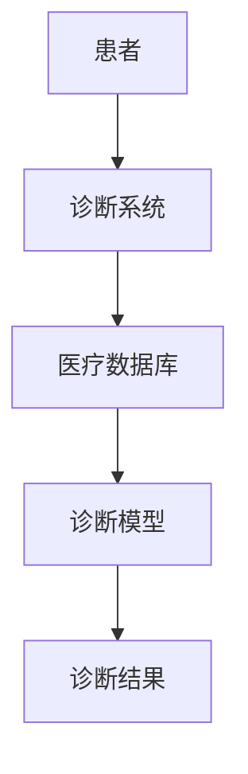
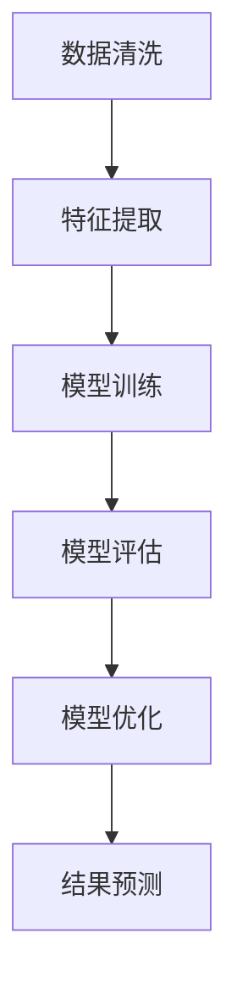
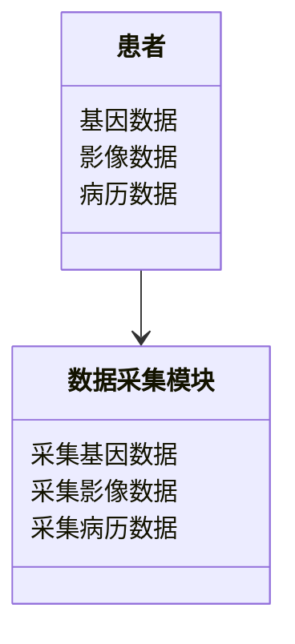
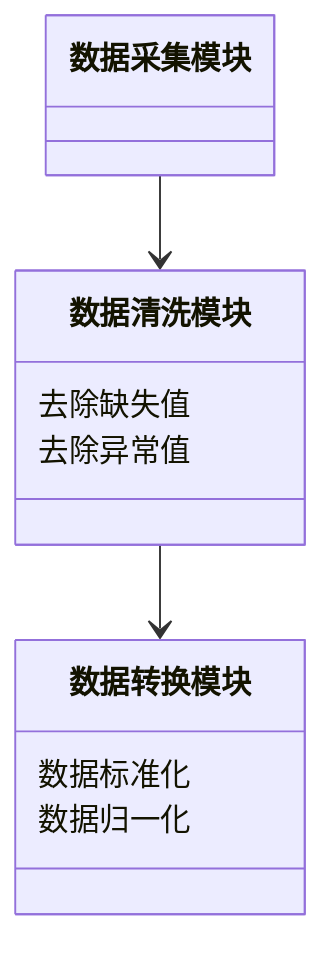
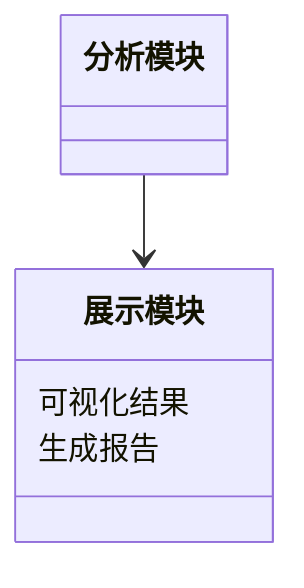
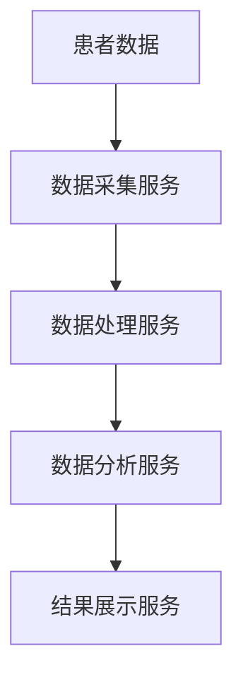
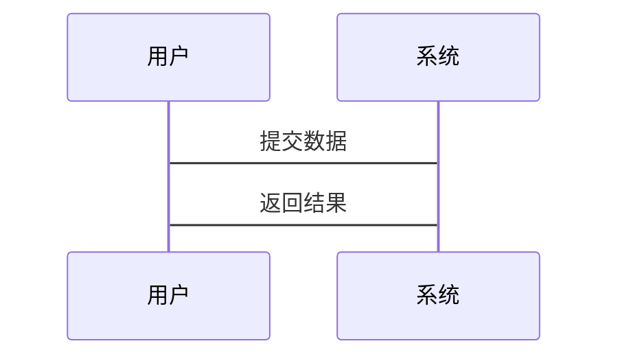
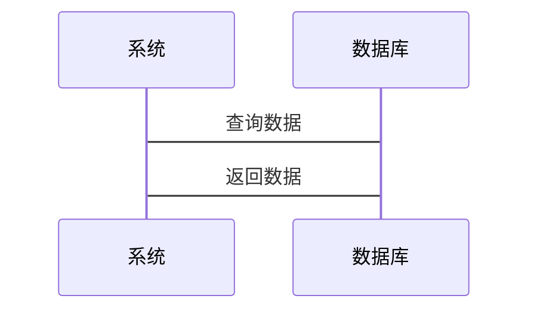

                 

<think>
嗯，我需要写一篇关于“价值投资中的智能化精准医疗诊断系统分析”的技术博客文章。首先，我得理解这个主题到底是什么意思。价值投资是一种投资策略，强调长期稳定的投资回报，而精准医疗则是利用现代技术对疾病进行个性化治疗。这两者结合起来，可能会涉及到如何利用精准医疗的数据和技术来辅助价值投资的决策。

我需要先明确文章的结构，用户已经提供了一个详细的目录大纲，我需要按照这个大纲来展开内容。首先，文章的标题是《价值投资中的智能化精准医疗诊断系统分析》，关键词包括价值投资、精准医疗、智能化诊断系统、机器学习、医疗数据分析、投资决策优化。摘要部分需要简明扼要地概括文章的核心内容，即探讨智能化精准医疗诊断系统如何帮助投资者做出更有效的投资决策。

接下来是正文部分，分为六个主要章节。第一章是“价值投资与精准医疗诊断的结合”，需要介绍价值投资和精准医疗的基本概念，分析两者结合的必要性，并讨论技术支撑的重要性。这部分需要确保读者能够理解这两个领域的基本概念和它们结合的意义。

第二章是“智能化精准医疗诊断系统的核心概念”，需要详细讲解系统的定义、关键技术和价值评估。这里可能需要使用一些图表来展示系统架构和实体关系，比如用Mermaid图来表示系统的各个模块和它们之间的关系。

第三章是“智能化诊断系统的算法原理”，这里需要介绍机器学习在诊断中的应用，常用算法，以及算法实现的流程。数学模型和公式是必不可少的，比如线性回归、逻辑回归的公式，并用代码示例来展示如何实现这些算法。

第四章是“智能化精准医疗诊断系统的架构设计”，需要分析问题场景，设计系统功能、架构、接口和交互。这部分可能需要绘制类图、架构图和序列图，帮助读者理解系统的整体结构和各个模块的协作。

第五章是“智能化精准医疗诊断系统的项目实战”，需要详细描述项目实施步骤，包括环境搭建、数据处理、特征提取、模型训练和结果分析。代码实现部分要具体，比如数据清洗、特征工程和模型训练的代码示例。

第六章是“智能化精准医疗诊断系统的最佳实践与总结”，需要总结系统的分析关键点，提出投资策略的注意事项，并展望未来的发展方向。这部分要结合实际案例，给出有实用价值的建议。

在写作过程中，我需要确保每一部分都详细且逻辑清晰，同时使用专业的技术语言，但又要保持易懂。比如，在算法原理部分，我会先解释什么是机器学习，再介绍常用的算法如线性回归和逻辑回归，然后通过公式和代码示例来展示它们的应用。

另外，使用图表来辅助说明也是一个重要的部分。比如，在系统架构设计中，我会用Mermaid图来展示系统的各个模块及其关系，帮助读者更好地理解系统的构成。

最后，我需要在文章末尾加上作者信息，确保文章的完整性和专业性。

总的来说，我需要按照目录大纲一步一步地展开内容，确保每个部分都涵盖必要的细节，同时保持整体的逻辑性和连贯性。这样才能写出一篇既有深度又易于理解的技术博客文章。
</think>

# 价值投资中的智能化精准医疗诊断系统分析

## 关键词：价值投资、精准医疗、智能化诊断系统、机器学习、医疗数据分析、投资决策优化

## 摘要：  
智能化精准医疗诊断系统通过结合现代信息技术和医疗数据分析，为价值投资者提供了更为精准和高效的决策支持。本文分析了该系统的背景、核心概念、算法原理、系统架构，并通过实际案例展示了其在价值投资中的应用。最后，提出了系统的最佳实践和未来发展建议。

---

## 第1章: 价值投资与精准医疗诊断的结合

### 1.1 价值投资的定义与特点
价值投资是一种长期投资策略，强调以低于内在价值的价格购买优质资产，以实现长期稳定的收益。其核心在于对标的资产的深入研究和长期持有。

#### 1.1.1 价值投资的核心理念
- **长期持有**：价值投资者相信时间的力量，通过长期持有优质资产获得收益。
- **安全边际**：买入价格低于内在价值，以降低投资风险。
- **基本面分析**：通过分析企业的财务状况、行业地位、竞争优势等因素，评估其内在价值。

#### 1.1.2 价值投资在医疗领域的应用
医疗行业具有较高的技术门槛和较长的研发周期，价值投资在该领域的应用主要集中在以下几个方面：
- **创新药企业**：评估新药的研发进展、市场潜力和盈利能力。
- **医疗器械公司**：分析产品的技术优势、市场占有率和成长性。
- **医疗服务机构**：考察其运营效率、成本控制和盈利能力。

#### 1.1.3 精准医疗诊断系统的概念
精准医疗诊断系统利用人工智能、大数据分析等技术，通过对患者的个体化数据进行深度分析，提供个性化的诊断和治疗方案。

### 1.2 精准医疗诊断系统的背景与现状
精准医疗是医疗行业发展的趋势，其核心在于通过基因测序、影像分析等技术，实现疾病的早期诊断和精准治疗。

#### 1.2.1 精准医疗的定义与特点
- **定义**：精准医疗是一种基于患者个体特征（基因、环境、生活方式等）的个性化医疗模式。
- **特点**：高度个性化、精准性高、治疗效果好、副作用小。

#### 1.2.2 精准医疗诊断系统的现状
随着人工智能和大数据技术的发展，精准医疗诊断系统在临床应用中逐渐普及。其主要应用包括：
- **疾病早期筛查**：通过AI算法分析医学影像，辅助医生进行疾病早期诊断。
- **治疗方案优化**：基于患者的基因信息，制定个性化用药方案。
- **疗效预测**：通过数据分析预测治疗效果，优化治疗方案。

#### 1.2.3 价值投资与精准医疗诊断的结合
价值投资者可以通过精准医疗诊断系统，深入分析医疗企业的技术创新能力、市场竞争力和未来成长潜力，从而做出更为明智的投资决策。

### 1.3 价值投资中的智能化诊断系统分析
智能化诊断系统为价值投资者提供了强大的数据支持和分析工具，帮助其更好地评估投资标的的价值。

#### 1.3.1 智能化诊断系统的必要性
- **数据支持**：医疗行业的数据复杂且量大，智能化诊断系统能够高效处理这些数据，为投资者提供准确的分析结果。
- **决策支持**：通过AI算法和大数据分析，智能化诊断系统能够发现数据中的潜在规律，帮助投资者识别投资机会和风险。

#### 1.3.2 系统的核心功能与目标
智能化精准医疗诊断系统的功能包括：
- 数据采集与处理：收集患者的医疗数据，并进行清洗和预处理。
- 数据分析与建模：利用机器学习算法对数据进行分析，构建预测模型。
- 结果展示与解读：将分析结果以可视化的方式呈现，帮助医生和投资者理解数据。

#### 1.3.3 系统的边界与外延
- **边界**：智能化诊断系统仅提供数据分析支持，不直接参与投资决策。
- **外延**：系统可以与其他医疗信息系统集成，提供更全面的解决方案。

### 1.4 本章小结
本章介绍了价值投资和精准医疗诊断的基本概念，并分析了两者结合的必要性和实现路径。智能化精准医疗诊断系统为价值投资者提供了强大的工具支持，帮助其做出更为明智的投资决策。

---

## 第2章: 智能化精准医疗诊断系统的核心概念

### 2.1 系统核心概念的定义与属性
智能化精准医疗诊断系统的核心概念包括数据采集、数据处理、数据分析和结果展示。

#### 2.1.1 数据采集模块
- **定义**：数据采集模块负责收集患者的医疗数据，包括基因测序数据、影像数据、电子健康记录等。
- **特点**：数据来源多样，格式复杂，需要进行清洗和预处理。

#### 2.1.2 数据处理模块
- **定义**：数据处理模块对采集到的数据进行清洗、转换和标准化处理。
- **特点**：处理过程需要考虑数据的质量和一致性。

#### 2.1.3 数据分析模块
- **定义**：数据分析模块利用机器学习算法对数据进行建模和分析，生成预测结果。
- **特点**：算法选择和模型调优是关键。

#### 2.1.4 结果展示模块
- **定义**：结果展示模块将分析结果以可视化的方式呈现，帮助用户理解和决策。
- **特点**：界面友好，支持交互式分析。

### 2.2 核心概念的对比分析
以下是核心概念的对比分析表：

| 模块         | 定义与特点                                                                 |
|--------------|---------------------------------------------------------------------------|
| 数据采集模块 | 收集患者的医疗数据，包括基因测序数据、影像数据、电子健康记录等。        |
| 数据处理模块 | 对采集到的数据进行清洗、转换和标准化处理，确保数据质量和一致性。       |
| 数据分析模块 | 利用机器学习算法对数据进行建模和分析，生成预测结果。                   |
| 结果展示模块 | 将分析结果以可视化的方式呈现，帮助用户理解和决策，界面友好，支持交互式分析。 |

### 2.3 系统实体关系图


### 2.4 本章小结
本章详细介绍了智能化精准医疗诊断系统的核心概念，并通过对比分析和实体关系图展示了系统的整体架构。

---

## 第3章: 智能化精准医疗诊断系统的算法原理

### 3.1 机器学习在诊断系统中的应用
机器学习是一种人工智能技术，通过数据训练模型，实现对新数据的预测和分类。

#### 3.1.1 机器学习的定义与特点
- **定义**：机器学习是一种通过数据训练模型，使其能够从数据中学习并做出预测的技术。
- **特点**：数据驱动、模型自适应、非线性关系。

#### 3.1.2 常用机器学习算法
以下是常用的机器学习算法对比表：

| 算法类型     | 描述                                                                 |
|--------------|-----------------------------------------------------------------------|
| 线性回归     | 用于预测连续型变量，假设变量之间存在线性关系。                     |
| 逻辑回归     | 用于分类问题，假设数据服从 logistic 分布。                       |
| 支持向量机（SVM） | 用于分类和回归问题，通过找到数据的最优分隔线。                  |
| 随机森林     | 通过构建多棵决策树并进行投票或平均，提高模型的准确性和鲁棒性。      |
| 神经网络     | 通过多层感知器模拟人脑神经网络，适用于复杂的数据模式识别。          |

#### 3.1.3 算法选择的依据
- **数据类型**：连续型数据适合线性回归，分类数据适合逻辑回归或随机森林。
- **数据规模**：大规模数据适合神经网络，小规模数据适合逻辑回归或SVM。
- **模型解释性**：需要解释性时选择线性回归或逻辑回归，不需要时选择随机森林或神经网络。

### 3.2 诊断系统的数学模型
以下是线性回归和逻辑回归的数学模型：

#### 3.2.1 线性回归模型
$$ y = \beta_0 + \beta_1 x + \epsilon $$
其中，$y$ 是目标变量，$x$ 是自变量，$\beta_0$ 和 $\beta_1$ 是回归系数，$\epsilon$ 是误差项。

#### 3.2.2 逻辑回归模型
$$ P(Y=1|X) = \frac{e^{\beta_0 + \beta_1 x}}{1 + e^{\beta_0 + \beta_1 x}} $$
其中，$P(Y=1|X)$ 是在给定特征 $X$ 的条件下，事件发生的概率。

#### 3.2.3 支持向量机模型
支持向量机的目标是找到一个超平面，使得数据点与超平面之间的距离最大化。

### 3.3 算法实现的流程图


### 3.4 本章小结
本章详细介绍了机器学习在诊断系统中的应用，包括常用算法、数学模型和实现流程。

---

## 第4章: 智能化精准医疗诊断系统的架构设计

### 4.1 问题场景介绍
在医疗诊断中，医生需要快速、准确地诊断患者的病情，同时投资者需要根据诊断结果评估相关企业的投资价值。

### 4.2 系统功能设计
系统功能设计包括数据采集、数据处理、数据分析和结果展示。

#### 4.2.1 数据采集模块


#### 4.2.2 数据处理模块


#### 4.2.3 数据分析模块


#### 4.2.4 结果展示模块


### 4.3 系统架构设计
系统架构设计包括单体架构和分布式架构。

#### 4.3.1 单体架构
单体架构适合小型项目，所有功能模块集成在一个系统中。


#### 4.3.2 分布式架构
分布式架构适合大型项目，各功能模块分别部署在不同的服务器上。



### 4.4 系统接口设计
系统接口设计包括数据接口和API接口。

#### 4.4.1 数据接口
数据接口用于数据的输入和输出，常见的数据接口包括CSV、Excel和数据库接口。

#### 4.4.2 API接口
API接口用于系统之间的通信，常见的API接口包括RESTful API和GraphQL API。

### 4.5 系统交互设计
系统交互设计包括用户与系统、系统与数据库的交互。

#### 4.5.1 用户与系统交互


#### 4.5.2 系统与数据库交互


### 4.6 本章小结
本章详细介绍了智能化精准医疗诊断系统的架构设计，包括功能设计、架构设计、接口设计和交互设计。

---

## 第5章: 智能化精准医疗诊断系统的项目实战

### 5.1 项目背景与目标
本项目旨在开发一个智能化精准医疗诊断系统，帮助医生和投资者做出更高效的诊断和投资决策。

### 5.2 项目实施步骤
项目实施步骤包括需求分析、数据采集、数据处理、模型训练和结果展示。

#### 5.2.1 需求分析
需求分析包括功能需求和非功能需求。

#### 5.2.2 数据采集
数据采集包括基因数据、影像数据和病历数据的采集。

#### 5.2.3 数据处理
数据处理包括数据清洗、数据转换和数据增强。

#### 5.2.4 模型训练
模型训练包括选择算法、训练模型和评估模型。

#### 5.2.5 结果展示
结果展示包括可视化结果和生成报告。

### 5.3 项目核心实现源代码
以下是Python实现的线性回归代码示例：

```python
import numpy as np
from sklearn.linear_model import LinearRegression
from sklearn.metrics import mean_squared_error

# 生成数据
X = np.array([1, 2, 3, 4, 5]).reshape(-1, 1)
y = [2, 4, 5, 4, 5]

# 训练模型
model = LinearRegression()
model.fit(X, y)

# 预测结果
y_pred = model.predict(X)
print("预测结果:", y_pred)

# 模型评估
print("均方误差:", mean_squared_error(y, y_pred))
```

### 5.4 项目小结
本章通过实际案例展示了智能化精准医疗诊断系统的项目实施过程，包括需求分析、数据处理、模型训练和结果展示。

---

## 第6章: 智能化精准医疗诊断系统的最佳实践与总结

### 6.1 最佳实践
- **数据质量**：确保数据的准确性和完整性。
- **模型选择**：根据数据特点选择合适的算法。
- **系统集成**：实现与其他医疗信息系统的无缝集成。

### 6.2 系统分析的关键点
- **数据驱动**：系统的核心是数据的采集和分析。
- **算法优化**：算法的选择和优化直接影响系统的性能。
- **系统架构**：系统的架构设计影响系统的扩展性和维护性。

### 6.3 投资策略的注意事项
- **长期视角**：价值投资需要长期持有优质资产。
- **风险控制**：通过分散投资和安全边际降低风险。
- **持续学习**：保持对新技术和新知识的学习和更新。

### 6.4 未来的发展方向
- **多模态数据融合**：整合多种数据源，提高诊断的准确性和全面性。
- **AI芯片优化**：利用专用硬件加速模型训练和推理。
- **云计算与边缘计算结合**：实现数据的分布式存储和计算。

### 6.5 本章小结
本章总结了智能化精准医疗诊断系统的最佳实践，提出了投资策略的注意事项，并展望了未来的发展方向。

---

## 作者：AI天才研究院/AI Genius Institute & 禅与计算机程序设计艺术/Zen And The Art of Computer Programming

---

以上是《价值投资中的智能化精准医疗诊断系统分析》的完整目录大纲和部分内容。希望这篇文章能为您提供有价值的信息和启发。

