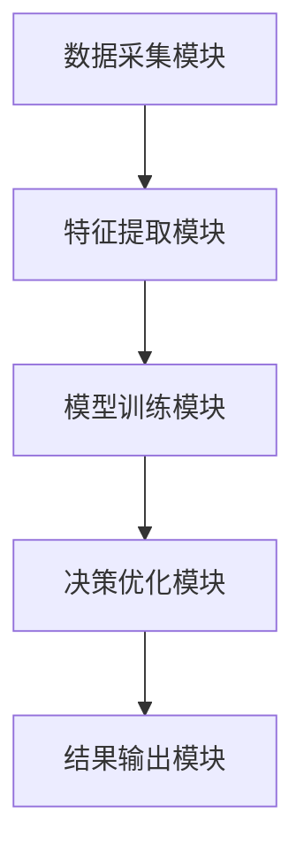

                 


# 价值投资中的智能化精准放疗系统分析

## 关键词：
价值投资、智能化精准放疗系统、系统分析、算法原理、数学建模

## 摘要：
本文将探讨如何将智能化精准放疗系统的理念和方法应用于价值投资领域。通过分析系统的各个组成部分，包括特征提取、分类算法、系统架构等，结合实际案例和数学建模，为投资者提供一种系统化、智能化的投资决策方法。

---

# 第1章: 价值投资的背景与现状

## 1.1 价值投资的基本概念
### 1.1.1 价值投资的定义
价值投资是一种投资策略，旨在通过分析企业的基本面（如财务状况、行业地位、盈利能力等），找到被市场低估的投资标的。其核心理念是寻找具有长期稳定增长潜力的公司，并在合理估值时买入。

### 1.1.2 价值投资的核心理念
- **安全边际**：买入价格低于内在价值，确保投资的安全性。
- **长期视角**：关注企业的长期增长潜力，而非短期波动。
- **逆向思维**：在市场恐慌时寻找机会，在市场狂热时保持冷静。

### 1.1.3 价值投资在现代金融中的地位
尽管价值投资在某些时期表现不如其他策略（如动量策略、趋势跟踪策略），但其长期稳定性和风险控制使其在投资领域占据重要地位，尤其是在机构投资中。

## 1.2 精准放疗系统的概念
### 1.2.1 放疗的基本原理
放疗是一种利用放射性粒子杀死癌细胞的治疗方法。精准放疗通过高精度定位和剂量控制，最大限度地杀死癌细胞，同时减少对周围健康组织的损伤。

### 1.2.2 精准放疗的定义
精准放疗是结合了现代医学影像技术、生物靶向技术和放射治疗技术的综合治疗方法，旨在实现治疗的个体化和精准化。

### 1.2.3 精准放疗在医疗中的应用
精准放疗通过实时影像引导、生物标记物分析和剂量优化，显著提高了治疗效果和患者生存质量。

## 1.3 价值投资与精准放疗系统的结合
### 1.3.1 两者的共同点
- **精确性**：两者都需要精准的分析和判断。
- **个性化**：价值投资关注企业的个性化特征，精准放疗关注患者的个性化治疗方案。
- **长期目标**：两者都追求长期效果而非短期利益。

### 1.3.2 系统化投资决策的必要性
传统价值投资依赖于投资者的个人经验和判断，而智能化精准放疗系统通过系统化的方法，可以减少人为误差，提高决策的准确性。

### 1.3.3 智能化精准放疗系统的提出
通过借鉴精准放疗的思路，构建一个基于数据分析的投资系统，利用算法和数学模型，实现对投资标的的精准分析和决策。

## 1.4 本章小结
价值投资和精准放疗系统虽然领域不同，但在方法论上有许多相似之处。将精准放疗的系统化思路引入价值投资，可以提高投资决策的科学性和精确性。

---

# 第2章: 智能化精准放疗系统的理论基础

## 2.1 系统核心概念与原理
### 2.1.1 系统架构
智能化精准放疗系统包括数据采集、特征提取、模型训练、决策优化和结果输出五个模块。

### 2.1.2 核心算法
- **特征提取**：利用文本挖掘、NLP技术分析公司财报和新闻。
- **分类算法**：使用随机森林、支持向量机（SVM）等机器学习算法进行分类。

### 2.1.3 数据流分析
从数据源（如财务报表、市场数据、新闻资讯）到最终的决策输出，数据流需要经过清洗、预处理、特征提取和建模等步骤。

---

## 2.2 算法原理讲解
### 2.2.1 特征提取
通过分析公司财报、行业趋势和市场情绪等多维度数据，提取能够反映公司价值的核心特征。

### 2.2.2 分类算法
#### 2.2.2.1 随机森林
随机森林是一种基于决策树的集成学习算法，通过随机采样和特征选择，提高模型的泛化能力。

#### 2.2.2.2 支持向量机（SVM）
SVM通过构建超平面，将数据分为可分区域，适用于高维数据的分类问题。

---

## 2.3 数学模型与公式
### 2.3.1 特征权重计算公式
$$ w_i = \frac{f_i}{\sum_{j=1}^{n} f_j} $$
其中，\( w_i \) 表示第 \( i \) 个特征的权重，\( f_i \) 表示该特征的重要性评分。

### 2.3.2 分类模型的损失函数
$$ L = -\sum_{i=1}^{n} y_i \log(p_i) + (1 - y_i) \log(1 - p_i) $$
其中，\( y_i \) 为真实标签，\( p_i \) 为模型预测概率。

---

## 2.4 系统架构设计
### 2.4.1 系统模块划分
- **数据采集模块**：从数据库中获取公司财务数据和市场数据。
- **特征提取模块**：对数据进行清洗、预处理和特征提取。
- **模型训练模块**：使用机器学习算法训练分类模型。
- **决策优化模块**：根据模型输出结果，优化投资组合。
- **结果输出模块**：生成投资建议和风险评估报告。

### 2.4.2 系统架构图


---

## 2.5 本章小结
智能化精准放疗系统通过系统化的方法，将价值投资的决策过程转化为一个可量化、可优化的系统，为投资者提供了科学的投资决策支持。

---

# 第3章: 智能化精准放疗系统的实现

## 3.1 项目实战
### 3.1.1 环境安装
- Python 3.8+
- NumPy、Pandas、Scikit-learn、XGBoost等库。

### 3.1.2 核心代码实现
#### 3.1.2.1 数据预处理
```python
import pandas as pd
import numpy as np

# 数据加载
df = pd.read_csv('investment_data.csv')

# 数据清洗
df.dropna(inplace=True)
df = pd.get_dummies(df, columns=['行业', '市场情绪'])
```

#### 3.1.2.2 特征提取
```python
from sklearn.decomposition import PCA

# PCA降维
pca = PCA(n_components=10)
principal_components = pca.fit_transform(df[['营收', '净利润', '毛利率', '研发投入']])
```

#### 3.1.2.3 模型训练
```python
from sklearn.ensemble import RandomForestClassifier
from sklearn.metrics import accuracy_score

# 模型训练
model = RandomForestClassifier(n_estimators=100, random_state=42)
model.fit(principal_components, df['是否低估'].values)
```

#### 3.1.2.4 模型评估
```python
y_pred = model.predict(principal_components)
print("准确率：", accuracy_score(df['是否低估'].values, y_pred))
```

### 3.1.3 案例分析
通过实际案例分析，验证系统的有效性和准确性。例如，分析某公司在系统中的估值和实际市场表现。

---

## 3.2 系统优化与小结
通过对系统的优化和调整，进一步提高模型的准确率和稳定性。同时，总结系统在实际应用中的优势和不足。

---

# 第4章: 最佳实践与总结

## 4.1 小结
智能化精准放疗系统的引入，为价值投资提供了一种系统化、科学化的决策方法，能够显著提高投资效率和准确性。

## 4.2 注意事项
- 数据质量是系统的关键，需确保数据来源的可靠性和完整性。
- 模型的泛化能力需要通过充分的测试和验证。
- 系统需要定期更新和优化，以适应市场的变化。

## 4.3 拓展阅读
推荐相关领域的书籍和论文，帮助读者进一步深入学习。

---

# 作者：AI天才研究院 & 禅与计算机程序设计艺术

---

通过以上内容，我们可以看到，智能化精准放疗系统在价值投资中的应用，不仅提高了投资决策的科学性，还为投资者提供了一种系统化、可优化的投资方法。

