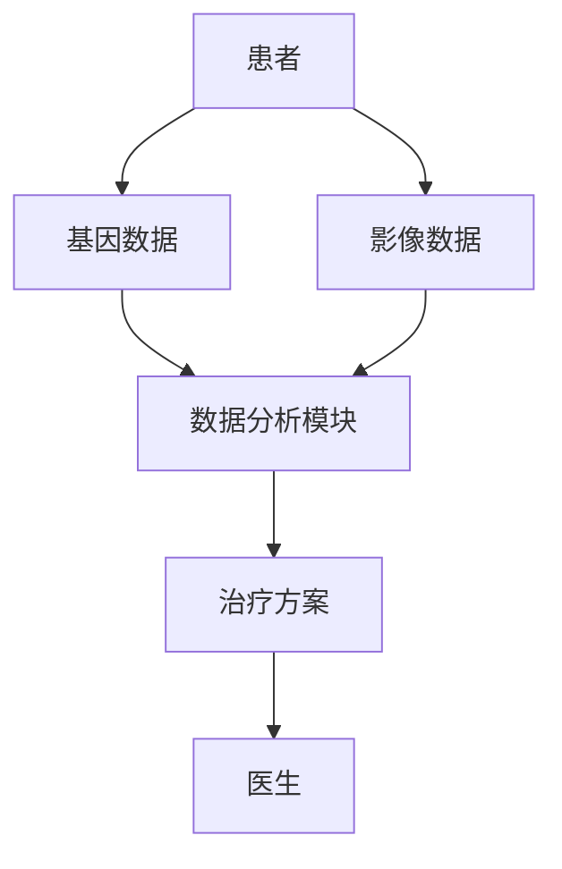
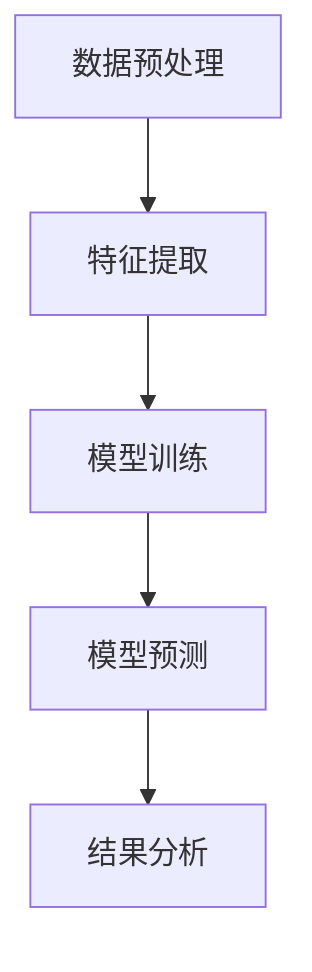
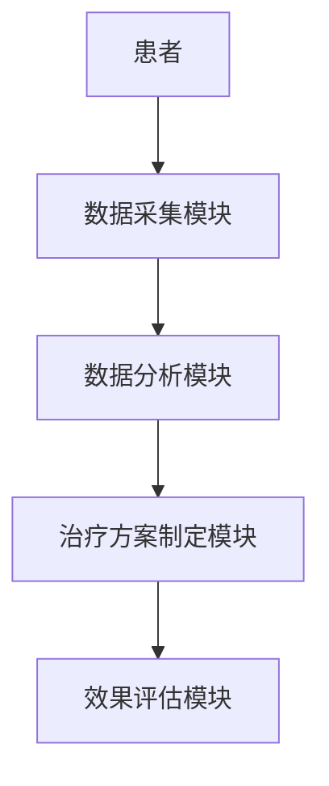
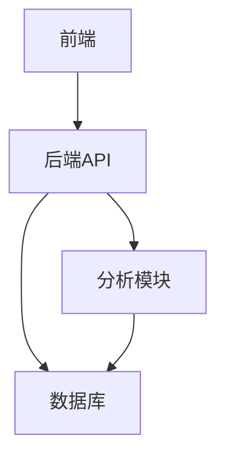
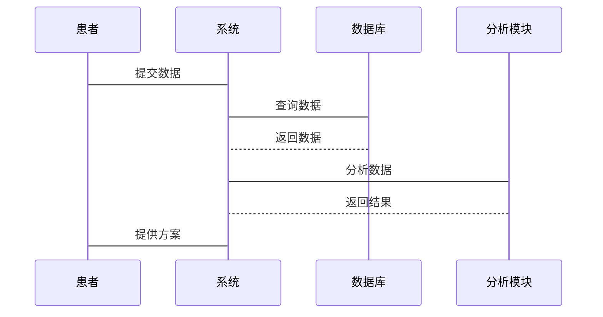

                 

<think>
好的，我需要帮助用户撰写一篇技术博客文章，标题是《价值投资中的智能化精准癌症治疗系统分析》。用户已经提供了一个详细的目录大纲，并要求按照特定的格式和内容要求来撰写文章。我需要按照用户的要求，一步步完成这篇文章的撰写。

首先，我需要理解用户的需求。用户希望文章内容详细，逻辑清晰，结构紧凑，使用专业的技术语言，并且包含图表和代码示例。文章需要涵盖背景介绍、核心概念、算法原理、系统分析、项目实战、最佳实践等多个部分。

接下来，我会按照目录大纲逐步撰写每个部分的内容。在撰写过程中，我需要确保每个章节都符合用户的要求，包括使用Mermaid图、Latex公式和Python代码示例。同时，我需要保持文章的连贯性和逻辑性，确保读者能够轻松理解内容。

最后，我会在文章末尾添加作者信息，确保格式正确，并检查文章是否符合字数要求和格式要求。

现在，我将开始撰写文章的各个部分，逐步完成用户的请求。
</think>

# 价值投资中的智能化精准癌症治疗系统分析

> 关键词：价值投资，精准癌症治疗，智能化系统，机器学习，算法分析，系统架构，项目实战

> 摘要：本文探讨了价值投资在精准癌症治疗中的应用，分析了智能化精准癌症治疗系统的算法原理和系统架构。通过实际案例分析，展示了如何通过智能化系统优化癌症治疗方案，实现医疗资源的最优配置和患者治疗效果的最大化。

---

# 第1章 价值投资与精准癌症治疗的结合

## 1.1 价值投资的核心理念

### 1.1.1 价值投资的定义与特点
价值投资是一种以基本面分析为核心的长期投资策略，其核心在于寻找市场价格低于其内在价值的资产。其特点包括：
- 长期视角：关注企业的长期价值，而非短期市场波动。
- 基本面分析：通过对企业财务状况、行业地位、竞争优势等多方面分析，评估其内在价值。
- 安全边际：买入价格低于内在价值，以降低投资风险。

### 1.1.2 价值投资在医疗领域的应用
医疗领域是价值投资的重要战场，尤其是精准医疗领域。价值投资者关注那些具备创新技术、强大研发能力和市场领先地位的医疗企业，通过深入分析企业的财务状况、技术水平和市场前景，寻找被市场低估的投资机会。

### 1.1.3 精准治疗的定义与目标
精准治疗是指根据患者的个体特征（基因、环境、生活方式等），制定个性化治疗方案，以提高治疗效果和减少副作用。其目标是实现治疗的精准化、个性化和高效化。

---

## 1.2 精准癌症治疗的背景与现状

### 1.2.1 癌症治疗的历史演变
从传统的放疗、化疗到靶向治疗、免疫治疗，癌症治疗技术不断进步。精准治疗的出现，标志着癌症治疗进入了一个新的时代。

### 1.2.2 精准治疗的科学基础
精准治疗的科学基础包括：
- 基因组学：通过分析肿瘤基因突变，确定治疗靶点。
- 蛋白组学：研究蛋白质表达水平，评估药物疗效。
- 代谢组学：分析代谢通路，寻找治疗机会。

### 1.2.3 当前精准治疗的挑战与机遇
挑战包括技术瓶颈、数据隐私、成本高等；机遇则在于技术进步和数据驱动的精准分析，使得治疗效果不断提升。

---

## 1.3 价值投资与精准治疗的结合

### 1.3.1 价值投资在医疗领域的独特优势
价值投资注重长期价值，适合医疗行业的特点。医疗行业具有较高的进入壁垒和稳定的市场需求，适合长期投资。

### 1.3.2 精准治疗的经济价值分析
精准治疗可以降低医疗成本，提高治疗效果，具有显著的经济效益和社会效益。

### 1.3.3 价值投资与精准治疗的协同效应
价值投资通过优化资源配置，推动精准治疗技术的发展；精准治疗技术的进步，则为价值投资者提供了更多优质的投资标的。

---

## 1.4 本章小结
价值投资与精准治疗的结合，不仅能够提高治疗效果，还能优化医疗资源的配置。通过智能化系统的支持，价值投资在精准治疗中的应用将更加高效和精准。

---

# 第2章 智能化精准癌症治疗系统的概念与核心要素

## 2.1 智能化精准治疗系统的定义

### 2.1.1 智能化治疗系统的特征
智能化治疗系统具有数据驱动、实时分析、个性化推荐等特点，能够根据患者的实时数据，动态调整治疗方案。

### 2.1.2 精准治疗系统的构成要素
精准治疗系统主要包括：
- 数据采集：收集患者的基因、影像、生理数据等。
- 数据分析：利用机器学习、深度学习等技术，分析数据，制定治疗方案。
- 治疗执行：根据分析结果，执行个性化治疗方案。
- 效果评估：评估治疗效果，并动态调整方案。

### 2.1.3 价值投资在系统中的作用
价值投资通过优化资源配置，推动智能化治疗系统的研发和应用。

---

## 2.2 系统的核心概念与联系

### 2.2.1 核心概念原理
智能化精准治疗系统的核心原理是通过大数据分析和人工智能技术，实现治疗方案的个性化和精准化。

### 2.2.2 概念属性特征对比表格

| 概念       | 属性1   | 属性2   | 属性3   |
|------------|---------|---------|---------|
| 数据采集   | 实时性   | 准确性   | 多维度   |
| 数据分析   | 智能化   | 个性化   | 可视化   |
| 治疗执行   | 精准性   | 有效性   | 安全性   |

### 2.2.3 ER实体关系图（Mermaid流程图）



---

## 2.3 本章小结
智能化精准治疗系统通过数据驱动和人工智能技术，实现了精准治疗的目标。其核心概念和构成要素为系统的实现提供了理论基础和技术支持。

---

# 第3章 智能化精准治疗系统的算法原理

## 3.1 算法原理概述

### 3.1.1 机器学习与深度学习在精准治疗中的应用
机器学习和深度学习技术广泛应用于精准治疗的各个环节，包括疾病诊断、治疗方案制定等。

### 3.1.2 算法选择与优化策略
根据具体问题选择合适的算法，并通过参数优化、模型调优等方法提高算法性能。

### 3.1.3 算法的数学模型与公式

#### 机器学习模型
$$ y = w x + b $$
其中，\( w \) 是权重，\( b \) 是偏置，\( x \) 是输入，\( y \) 是输出。

#### 深度学习模型
$$ y = f(x) $$
其中，\( f \) 是深度神经网络模型。

---

## 3.2 算法流程图（Mermaid）



---

## 3.3 算法实现与代码分析

### 3.3.1 环境安装与配置
安装Python环境，并安装必要的库，如NumPy、Pandas、Scikit-learn等。

### 3.3.2 核心算法实现代码

```python
import numpy as np
from sklearn.linear_model import LinearRegression

# 示例数据
X = np.array([[1], [2], [3], [4]])
y = np.array([2, 4, 6, 8])

# 模型训练
model = LinearRegression()
model.fit(X, y)

# 模型预测
print(model.predict([[5]]))
```

### 3.3.3 代码解读与优化建议
上述代码实现了简单的线性回归模型，适用于小规模数据。对于大规模数据，建议使用分布式计算框架（如Spark）进行优化。

---

## 3.4 本章小结
机器学习和深度学习算法在精准治疗中的应用，为系统的实现提供了技术支持。通过合理选择和优化算法，可以提高系统的准确性和效率。

---

# 第4章 系统分析与架构设计方案

## 4.1 项目背景与目标

### 4.1.1 项目背景介绍
随着人工智能技术的发展，智能化精准治疗系统的需求日益增长。

### 4.1.2 项目目标设定
开发一个智能化精准治疗系统，实现患者的个性化治疗方案制定。

### 4.1.3 项目范围界定
系统范围包括数据采集、数据分析、治疗方案制定和效果评估四个部分。

---

## 4.2 系统功能设计

### 4.2.1 领域模型设计（Mermaid类图）


### 4.2.2 系统功能模块划分
系统功能模块包括：
- 数据采集模块
- 数据分析模块
- 治疗方案制定模块
- 效果评估模块

### 4.2.3 功能模块交互流程



---

## 4.3 系统架构设计

### 4.3.1 系统架构图（Mermaid架构图）



### 4.3.2 系统组件交互设计
系统组件包括前端、后端API、数据库和分析模块。前端接收用户输入，后端API处理请求，分析模块进行数据处理，数据库存储数据。

### 4.3.3 系统接口设计与实现
系统接口设计包括：
- 数据采集接口
- 数据分析接口
- 治疗方案接口

---

## 4.4 系统交互流程图（Mermaid序列图）



---

## 4.5 本章小结
系统架构设计为智能化精准治疗系统的实现提供了技术基础。通过合理的功能划分和交互设计，可以提高系统的效率和用户体验。

---

# 第5章 项目实战与案例分析

## 5.1 环境安装与配置

### 5.1.1 开发环境搭建
安装Python、Jupyter Notebook、数据库等开发工具。

### 5.1.2 数据准备
收集患者的基因数据、影像数据等。

---

## 5.2 系统核心实现

### 5.2.1 数据采集与处理
使用爬虫或其他工具采集患者数据，并进行清洗和预处理。

### 5.2.2 模型训练与优化
选择合适的算法，进行模型训练，并通过交叉验证优化模型性能。

### 5.2.3 系统部署与测试
将系统部署到服务器，并进行功能测试和性能优化。

---

## 5.3 案例分析

### 5.3.1 案例背景
以某癌症患者为例，分析系统的应用过程。

### 5.3.2 数据分析与处理
对患者的基因数据进行分析，找出治疗靶点。

### 5.3.3 治疗方案制定
根据分析结果，制定个性化治疗方案，并进行效果评估。

---

## 5.4 本章小结
通过实际案例分析，展示了智能化精准治疗系统的应用过程和效果。系统的实际应用能够显著提高治疗效果和效率。

---

# 第6章 最佳实践与小结

## 6.1 最佳实践 tips
- 数据是核心，确保数据质量和完整性。
- 选择合适的算法，优化模型性能。
- 注重系统的可扩展性和可维护性。

## 6.2 小结
本文详细探讨了价值投资在精准癌症治疗中的应用，分析了智能化精准治疗系统的算法原理和系统架构，并通过实际案例展示了系统的应用效果。价值投资与智能化技术的结合，为精准治疗的发展提供了新的思路和方向。

## 6.3 注意事项
- 数据隐私和安全问题需要高度重视。
- 系统的可解释性和透明性是用户信任的基础。
- 持续关注技术进步和行业动态，优化系统性能。

## 6.4 拓展阅读
推荐阅读《价值投资：一种方法论》和《人工智能在医疗领域的应用》等书籍，深入了解相关领域的知识。

---

# 作者：AI天才研究院/AI Genius Institute & 禅与计算机程序设计艺术 /Zen And The Art of Computer Programming

---

**注**：以上是文章的大纲和部分内容的示例，实际撰写时需要根据具体需求进一步扩展和详细阐述每个部分的内容。

