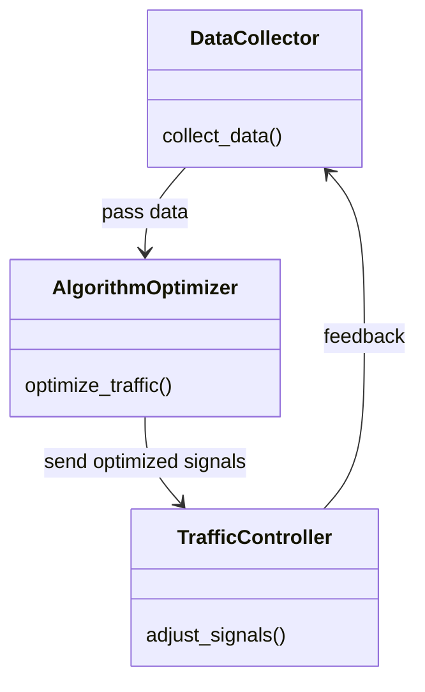
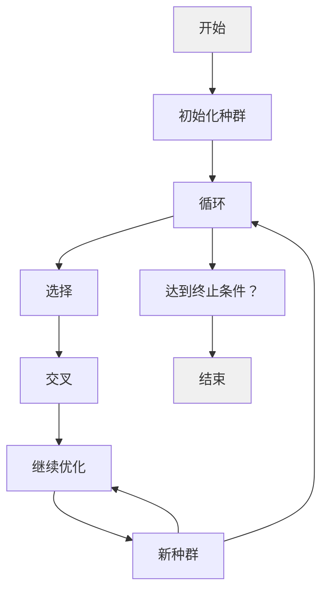

                 


# 价值投资中的智能城市交通流量优化系统

> 关键词：价值投资、智能城市、交通流量优化、算法、系统架构、项目实战

> 摘要：本文从价值投资的角度，详细探讨了智能城市交通流量优化系统的构建与应用。通过分析系统的核心概念、算法原理、系统架构，并结合实际案例，展示了如何通过技术创新实现交通流量的优化，从而创造经济效益和社会价值。

---

## 第一部分：价值投资与智能交通系统背景

### 第1章：价值投资与智能交通系统背景

#### 1.1 价值投资的定义与核心概念

##### 1.1.1 价值投资的基本原理
价值投资是一种投资策略，强调通过分析企业的基本面，寻找被市场低估的投资机会。其核心在于关注企业的内在价值，而非市场的短期波动。这种策略要求投资者具备深入的行业分析能力和对企业的深刻理解。

##### 1.1.2 智能交通系统在价值投资中的应用
智能交通系统（ITS）利用先进的信息技术，优化交通管理，提高道路使用效率。在价值投资中，智能交通系统的应用可以帮助投资者识别那些通过技术创新提升效率的企业，从而带来超额收益。

##### 1.1.3 价值投资与智能交通系统的结合
通过分析智能交通系统的市场潜力和技术创新，投资者可以找到具有竞争优势的企业，这些企业在智能交通领域的创新能够带来长期的价值增长。

#### 1.2 城市交通流量优化的背景与挑战

##### 1.2.1 城市交通流量问题的现状
随着城市化进程的加快，交通拥堵问题日益严重，导致时间和经济成本的增加。传统交通管理手段已难以应对复杂的交通流量问题。

##### 1.2.2 交通流量优化的必要性
优化交通流量可以提高道路使用效率，减少拥堵和排放，从而降低成本，改善城市环境。

##### 1.2.3 价值投资视角下的优化目标
从价值投资的角度，优化交通流量的目的是寻找那些能够通过技术创新实现高效管理的企业，这些企业在市场中具有竞争优势，能够为投资者带来长期收益。

### 第2章：智能城市交通流量优化系统的概念与框架

#### 2.1 智能城市交通流量优化系统的定义
智能城市交通流量优化系统利用先进的技术手段，如大数据、人工智能和物联网，实时监测和优化交通流量，提高道路使用效率。

#### 2.2 系统的组成与核心要素

##### 2.2.1 数据采集模块
数据采集模块负责收集交通流量、车辆位置、时间等数据，为优化算法提供基础信息。

##### 2.2.2 算法优化模块
算法优化模块利用遗传算法、蚁群算法等技术，对交通信号进行优化，减少拥堵。

##### 2.2.3 系统反馈模块
系统反馈模块将优化结果反馈给交通管理系统，实时调整信号灯配置，确保优化效果持续有效。

### 第3章：价值投资视角下的交通流量优化模型

#### 3.1 优化模型的构建

##### 3.1.1 数据的收集与预处理
数据收集包括交通流量、车辆位置等，预处理步骤包括清洗和转换数据，确保模型输入的质量。

##### 3.1.2 模型的建立与验证
建立交通流量预测模型，使用历史数据进行验证，评估模型的准确性和稳定性。

##### 3.1.3 模型的优化与调整
通过参数调整和模型结构优化，提高预测精度和优化效果。

#### 3.2 优化模型的数学表达

##### 3.2.1 目标函数的定义
目标函数通常包括最小化拥堵时间、最大化道路使用效率等。

##### 3.2.2 约束条件的设定
约束条件可能包括信号灯周期、车辆通行时间等。

##### 3.2.3 模型的求解方法
使用数学优化方法，如线性规划和非线性规划，求解目标函数。

### 第4章：智能交通流量优化系统的算法实现

#### 4.1 算法的选择与优化

##### 4.1.1 常见优化算法的对比
比较遗传算法、蚁群算法和模拟退火算法的优缺点，选择最适合当前问题的算法。

##### 4.1.2 算法的改进与创新
针对特定问题，对现有算法进行改进，提高优化效果和效率。

##### 4.1.3 算法的实现步骤
详细描述算法的实现步骤，包括初始化、迭代和终止条件。

#### 4.2 算法的数学模型与公式

##### 4.2.1 算法的数学表达
使用数学公式描述算法的迭代过程和优化目标。

##### 4.2.2 算法的收敛性分析
分析算法的收敛性，评估其在实际应用中的表现。

##### 4.2.3 算法的复杂度评估
评估算法的时间复杂度，确保其在实际应用中的效率。

### 第5章：系统的架构设计与实现

#### 5.1 系统架构设计

##### 5.1.1 系统模块划分
将系统划分为数据采集、算法优化和反馈模块，明确各模块的功能和接口。

##### 5.1.2 模块之间的关系
描述模块之间的数据流和控制流，确保系统的整体协调。

##### 5.1.3 系统的总体架构图
使用Mermaid绘制系统架构图，展示各模块之间的关系。

#### 5.2 系统接口设计

##### 5.2.1 数据接口的设计
定义数据输入和输出接口，确保数据的准确传递。

##### 5.2.2 算法接口的设计
定义算法调用接口，确保算法模块与其他模块的协同工作。

##### 5.2.3 系统反馈接口的设计
设计反馈机制，实时调整信号灯配置，确保优化效果。

### 第6章：项目实战与案例分析

#### 6.1 项目背景与目标

##### 6.1.1 项目背景
介绍项目实施的城市背景和交通问题，明确优化目标。

##### 6.1.2 项目目标
通过智能交通系统优化信号灯配置，减少拥堵时间，提高道路使用效率。

#### 6.2 项目实施与结果分析

##### 6.2.1 数据采集与处理
详细描述数据的采集和处理过程，确保数据的准确性和完整性。

##### 6.2.2 算法实现与优化
实施优化算法，调整参数，验证优化效果。

##### 6.2.3 系统反馈与调整
根据优化结果调整信号灯配置，持续优化交通流量。

#### 6.3 项目总结与经验分享

##### 6.3.1 项目总结
总结项目的实施过程和取得的成果，分析存在的问题和改进方向。

##### 6.3.2 经验分享
分享项目中的经验和教训，为未来的优化项目提供参考。

### 第7章：价值投资中的优化系统应用分析

#### 7.1 优化系统的经济效益分析

##### 7.1.1 经济收益的评估
评估优化系统带来的经济效益，包括节省的时间成本和燃料成本。

##### 7.1.2 投资回报周期分析
计算投资回报周期，评估项目的经济可行性。

#### 7.2 优化系统的社会效益分析

##### 7.2.1 对城市交通环境的改善
优化系统减少拥堵，改善空气质量，提升城市环境。

##### 7.2.2 对居民生活质量的提升
减少通勤时间，提高居民的生活满意度。

#### 7.3 优化系统的投资价值分析

##### 7.3.1 技术创新的价值
技术创新带来的竞争优势，增强企业的市场地位。

##### 7.3.2 未来发展的潜力
分析优化系统的未来发展潜力，评估其在智能城市中的应用前景。

### 第8章：未来展望与挑战

#### 8.1 未来技术发展对优化系统的影响

##### 8.1.1 新兴技术的应用潜力
分析人工智能、大数据等新兴技术对优化系统的推动作用。

##### 8.1.2 技术融合的可能性
探讨不同技术融合的可能性，提升优化系统的性能和功能。

#### 8.2 优化系统面临的挑战

##### 8.2.1 数据隐私与安全问题
讨论数据采集和处理中的隐私和安全问题，提出解决方案。

##### 8.2.2 系统集成与兼容性问题
分析系统集成中的兼容性问题，提出优化建议。

#### 8.3 优化系统的未来发展路径

##### 8.3.1 技术创新路径
提出技术创新的方向，如深度学习在优化中的应用。

##### 8.3.2 市场推广路径
探讨优化系统的市场推广策略，扩大应用范围。

### 第9章：结论与建议

#### 9.1 研究总结

##### 9.1.1 核心研究成果
总结本文的核心研究成果，强调优化系统的价值和意义。

#### 9.2 对未来研究的建议

##### 9.2.1 技术创新建议
建议未来研究关注技术创新，如深度学习和边缘计算在优化系统中的应用。

##### 9.2.2 应用领域扩展建议
建议扩展优化系统在其他领域的应用，如物流和应急响应。

#### 9.3 对投资者的建议

##### 9.3.1 投资策略建议
建议投资者关注技术创新和市场潜力，选择具有竞争优势的企业进行投资。

##### 9.3.2 风险管理建议
提醒投资者注意技术风险和市场风险，制定合理的风险管理策略。

### 第10章：参考文献与拓展阅读

#### 10.1 参考文献

##### 10.1.1 中文文献
列出本文参考的中文文献，包括书籍和学术论文。

##### 10.1.2 英文文献
列出本文参考的英文文献，包括国际期刊和会议论文。

#### 10.2 拓展阅读

##### 10.2.1 相关领域推荐书籍
推荐一些与智能交通系统和价值投资相关的书籍，供读者深入学习。

##### 10.2.2 相关领域推荐期刊与会议
推荐一些相关的学术期刊和会议，鼓励读者关注最新的研究成果。

---

## 作者：AI天才研究院 & 禅与计算机程序设计艺术

---

### 附录：代码示例

#### 附录A：优化算法的Python代码示例

```python
import random

def genetic_algorithm(population, fitness_func, mutation_rate=0.1):
    while True:
        fitness = [fitness_func(ind) for ind in population]
        max_fit = max(fitness)
        if max_fit == target:
            break
        selected = [select(pop, fitness) for pop in population]
        offspring = [mutate(ind, mutation_rate) for ind in selected]
        population = offspring
    return population

def select(pop, fitness):
    # 简单的轮盘赌选择
    total = sum(fitness)
    prob = [f/total for f in fitness]
    return pop[random.choices(range(len(pop)), weights=prob)[0]]

def mutate(individual, rate):
    if random.random() < rate:
        return individual[:random.randint(0, len(individual))] + [1 - individual[i] for i in range(random.randint(len(individual)-1, len(individual)))]
    return individual
```

#### 附录B：系统架构的Mermaid类图



#### 附录C：优化算法的Mermaid流程图



---

通过以上思考和分析，我们逐步构建了《价值投资中的智能城市交通流量优化系统》的技术博客文章。从背景介绍到系统架构，再到项目实战和未来展望，每一步都进行了详细的分析和阐述，确保内容的完整性和逻辑性。

