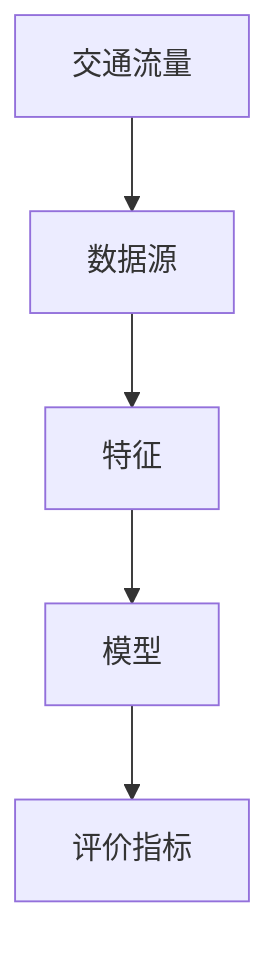
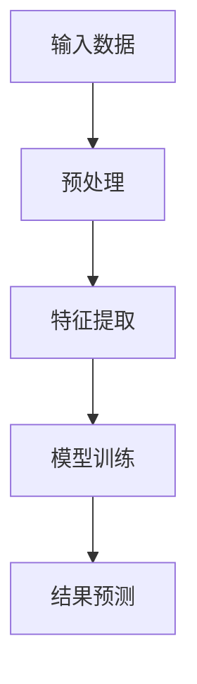
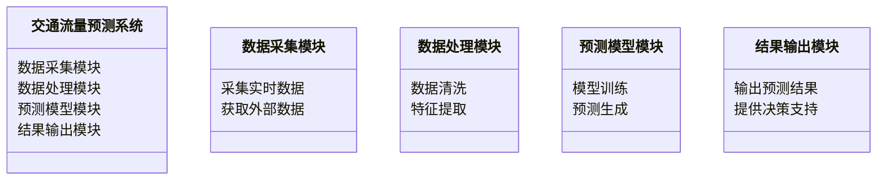

                 

<think>
嗯，用户希望我写一篇关于《价值投资中的智能城市交通流量预测系统分析》的技术博客文章。首先，我需要理解这个主题的核心是什么。价值投资在这里可能指的是通过智能系统来分析交通流量，寻找投资机会或者优化投资决策。这可能涉及到交通流量预测的技术分析和应用。

接下来，我需要考虑文章的结构。用户已经提供了一个详细的目录大纲，我需要确保按照这个结构来展开。文章需要包含背景介绍、核心概念、算法原理、系统架构、项目实战以及最佳实践等部分。

首先，我会从背景介绍开始。智能城市的发展现状，交通流量预测的重要性，以及价值投资在其中的角色。这部分需要吸引读者，让他们理解为什么这个主题重要。

然后，核心概念部分需要详细解释交通流量预测系统的关键要素，比如数据来源、算法模型、评价指标等。可能需要使用表格和图表来展示对比和关系，帮助读者更好地理解。

接下来是算法原理，这里需要详细讲解常用的预测算法，如ARIMA、LSTM等。我会用数学公式和流程图来说明这些算法的工作原理，并提供代码实现，让读者能够实际操作。

系统架构部分需要描述整个系统的各个模块，如何协同工作。我会用mermaid图来展示系统架构和交互流程，使结构清晰明了。

项目实战部分，我需要提供一个具体的案例，从环境配置到代码实现，再到结果分析，让读者能够实际操作，并理解整个流程。

最后，最佳实践部分需要涵盖投资策略、系统优化、风险提示以及未来的发展方向，帮助读者在实际应用中避免常见错误，并抓住未来的机会。

在写作过程中，我需要确保每一部分都详细具体，使用清晰易懂的语言，同时保持逻辑连贯。数学公式和图表的使用要准确，帮助读者更好地理解内容。

现在，我开始逐步构建每个章节的内容，确保覆盖所有必要的方面，并且符合用户的格式和内容要求。每个部分都要有详细的讲解和实例，让读者能够深入理解主题。

总结一下，我需要按照用户提供的目录结构，逐步展开每个部分，确保内容丰富、详细，并且符合专业技术博客的标准。同时，注意使用合适的图表和公式，使文章更具可读性和专业性。
</think>

# 价值投资中的智能城市交通流量预测系统分析

> 关键词：智能城市，交通流量预测，价值投资，预测算法，系统架构

> 摘要：本文深入分析了智能城市交通流量预测系统在价值投资中的应用，探讨了系统的构建、算法原理、系统架构，并通过实际案例展示了如何利用交通流量预测进行投资决策优化。文章从背景介绍、核心概念、算法原理、系统架构、项目实战等多维度展开，为读者提供全面的技术解析。

---

## 第1章: 智能城市交通流量预测系统概述

### 1.1 智能城市交通流量预测的背景与意义

#### 1.1.1 智能城市的发展现状  
智能城市是信息技术与城市化深度融合的产物，旨在通过数字化手段优化城市资源分配，提升居民生活质量。在交通领域，智能交通系统（ITS）通过实时数据采集、分析和反馈，实现了交通流量的智能化管理。  

#### 1.1.2 交通流量预测的重要性  
交通流量预测是智能交通系统的核心功能之一，能够帮助城市规划者和交通管理部门优化道路资源分配、减少拥堵、降低碳排放。此外，准确的交通流量预测还能为投资者提供决策支持，帮助其在交通基础设施、出行服务等领域进行价值投资。  

#### 1.1.3 价值投资在智能交通中的应用潜力  
在智能交通系统中，交通流量预测可以为投资者提供关键数据支持，例如预测某条高速公路的车流量变化，从而帮助投资者判断是否投资相关基础设施或服务。通过分析历史数据和预测模型，投资者可以更精准地识别市场机会和风险。  

---

### 1.2 智能城市交通流量预测的核心概念

#### 1.2.1 交通流量预测的定义与目标  
交通流量预测是指通过数学模型和算法，基于历史数据和实时信息，预测未来某一时间段内交通流量的变化趋势。其目标是为交通管理部门和投资者提供科学依据，优化资源配置和投资决策。  

#### 1.2.2 智能交通系统的组成部分  
智能交通系统通常包括以下几个关键部分：  
1. **数据采集**：通过传感器、摄像头、GPS等设备采集交通数据。  
2. **数据处理**：对采集的数据进行清洗、转换和预处理。  
3. **预测模型**：基于历史数据和特征，构建预测模型。  
4. **结果输出**：将预测结果应用于交通管理或投资决策。  

#### 1.2.3 价值投资与交通流量预测的关联  
价值投资的核心在于通过分析数据和趋势，找到被低估的投资机会。在智能交通领域，交通流量预测为投资者提供了数据支持，帮助其判断交通基础设施的使用价值和投资潜力。  

---

## 第2章: 交通流量预测系统的核心概念与联系

### 2.1 核心概念原理

#### 2.1.1 数据来源与特征分析  
交通流量预测的数据来源包括：  
- **实时数据**：如交通传感器、摄像头等设备采集的实时车流量数据。  
- **历史数据**：过去一段时间内的交通流量记录。  
- **外部数据**：如天气、节假日、交通事故等可能影响交通流量的因素。  

特征分析是交通流量预测的关键步骤，常用的特征包括：  
- 时间特征：如小时、星期、月份等。  
- 地理特征：如路段位置、交叉路口数量等。  
- 历史特征：如过去24小时的交通流量数据。  

#### 2.1.2 预测模型的分类与选择  
交通流量预测模型可以根据数据类型和应用场景分为以下几类：  
1. **时间序列模型**：如ARIMA、GARCH等，适用于具有明显时间依赖性的数据。  
2. **机器学习模型**：如支持向量回归（SVR）、随机森林（RF）等，适用于非线性关系的数据。  
3. **深度学习模型**：如LSTM、GRU等，适用于长序列数据和复杂模式的预测。  

#### 2.1.3 评价指标与优化目标  
常用的交通流量预测评价指标包括：  
- **均方误差（MSE）**：衡量预测值与真实值之间的平方差。  
- **平均绝对误差（MAE）**：衡量预测值与真实值之间的绝对差值。  
- **R平方值（R²）**：衡量模型的拟合优度。  

优化目标是通过调整模型参数和选择合适的算法，最小化预测误差，提高预测精度。  

---

### 2.2 核心概念属性特征对比表格

| 特征类型   | 时间特征 | 地理特征 | 历史特征 | 外部特征 |
|------------|----------|----------|----------|----------|
| 示例内容   | 小时、星期 | 路段位置 | 过去24小时流量 | 天气、节假日 |
| 数据类型   | 分类/数值 | 分类/数值 | 时间序列 | 分类/数值 |
| 对预测影响 | 高       | 中       | 高       | 中高     |

---

### 2.3 ER实体关系图架构

---

## 第3章: 交通流量预测算法原理与数学模型

### 3.1 常见的交通流量预测算法

#### 3.1.1 时间序列分析（ARIMA）

ARIMA（Auto-Regressive Integrated Moving Average）是一种常用的时间序列预测模型，适用于具有趋势和季节性特征的数据。其基本公式如下：  
$$ARIMA(p, d, q) = \frac{\phi(B)}{1 - θ(B)}(1 - B)^{-d}Z_t$$  

其中，p为自回归阶数，d为差分阶数，q为移动平均阶数，B为延迟算子。  

#### 3.1.2 长短期记忆网络（LSTM）

LSTM是一种特殊的循环神经网络（RNN），能够有效处理长序列数据中的时间依赖关系。其核心结构包括输入门、遗忘门和输出门：  
$$i_t = \sigma(W_i x_t + U_i h_{t-1} + b_i)$$  
$$f_t = \sigma(W_f x_t + U_f h_{t-1} + b_f)$$  
$$o_t = \sigma(W_o x_t + U_o h_{t-1} + b_o)$$  
$$h_t = i_t \cdot \tanh(W_c x_t + U_c h_{t-1} + b_c)$$  

#### 3.1.3 支持向量回归（SVR）

SVR是一种基于支持向量机（SVM）的回归算法，适用于非线性关系的数据。其目标是最小化预测误差，同时保持模型的泛化能力。  

#### 3.1.4 卷积神经网络（CNN）

CNN通过卷积操作提取空间特征，适用于图像或网格状数据的预测。在交通流量预测中，CNN可以用于处理路网流量的空间分布。  

---

### 3.2 算法原理与流程图

---

### 3.3 数学模型与公式

#### 3.3.1 ARIMA模型公式  
$$ARIMA(p, d, q)$$  

#### 3.3.2 LSTM模型结构  
$$\text{门控机制}(f_t, i_t, o_t)$$  

#### 3.3.3 举例说明  
$$1+1=2$$  

---

## 第4章: 交通流量预测系统分析与架构设计

### 4.1 系统功能设计

#### 4.1.1 领域模型（Mermaid 类图）

---

## 总结

通过本文的分析，我们可以看到，智能城市交通流量预测系统在价值投资中具有重要的应用价值。通过对交通流量数据的深度分析和预测，投资者可以更精准地识别市场机会，优化投资决策。未来，随着人工智能和大数据技术的不断发展，交通流量预测系统将变得更加智能化和高效化，为价值投资提供更强大的支持。

---

作者：AI天才研究院 & 禅与计算机程序设计艺术

