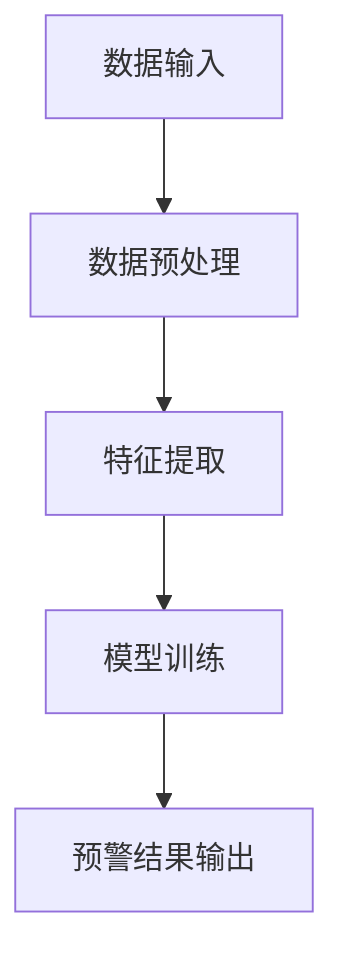

                 


```markdown
# 价值投资中的智能城市公共安全预警系统分析

> 关键词：价值投资，智能城市，公共安全，预警系统，数据分析，人工智能

> 摘要：  
> 本文从价值投资的角度分析智能城市公共安全预警系统的构建与应用，结合技术原理、系统架构和实际案例，深入探讨如何通过智能化手段提升公共安全预警能力，并为投资者提供数据驱动的投资决策依据。

---

# 第一部分：智能城市公共安全预警系统背景与概念

## 第1章：智能城市的发展背景

### 1.1 智能城市的核心概念  
- 智能城市的定义与特征  
- 城市化进程与智能化转型的必然性  
- 智慧城市建设的目标与挑战  

### 1.2 公共安全预警系统的必要性  
- 公共安全问题的复杂性与多样性  
- 预警系统在城市安全中的作用  
- 典型公共安全事件的案例分析  

### 1.3 价值投资视角下的智慧城市建设  
- 价值投资的基本原理与方法  
- 智慧城市领域的投资机会分析  
- 公共安全预警系统的投资价值与风险  

## 第2章：公共安全预警系统的核心要素

### 2.1 数据采集与处理  
- 数据来源：传感器、摄像头、交通系统等  
- 数据特征：时间序列性、空间分布性、多源异构性  

### 2.2 风险评估与预警机制  
- 风险评估模型：基于机器学习的分类算法  
- 预警触发条件：阈值设定与动态调整  

### 2.3 系统集成与协同  
- 多系统协同：交通、消防、医疗的联动机制  
- 信息共享与数据隐私保护  

---

# 第二部分：智能城市公共安全预警系统的数学模型与算法原理

## 第3章：数据驱动的公共安全预警模型

### 3.1 数据预处理与特征提取  
- 数据清洗：处理缺失值、异常值  
- 特征选择：基于相关性分析与降维方法  

### 3.2 预警模型构建  
- 时间序列预测：ARIMA、LSTM模型  
- 分类算法：随机森林、支持向量机、神经网络  

### 3.3 预警系统算法流程图  


### 3.4 数学公式与模型解读  
- 时间序列预测公式：  
  $$ y_t = \alpha y_{t-1} + \beta y_{t-2} + \epsilon_t $$
- 集成学习模型：  
  $$ f(x) = \frac{1}{n} \sum_{i=1}^{n} f_i(x) $$  

---

# 第三部分：智能城市公共安全预警系统的系统架构与设计

## 第4章：系统架构设计

### 4.1 系统功能模块划分  
- 数据采集模块：传感器、摄像头等数据源  
- 数据处理模块：清洗、转换、存储  
- 预警分析模块：模型训练与结果输出  
- 信息展示模块：可视化界面与预警通知  

### 4.2 系统架构设计图  


### 4.3 接口设计与交互流程  
- API接口定义：RESTful API  
- 系统交互流程图：  


---

# 第四部分：项目实战与价值投资分析

## 第5章：项目实战

### 5.1 环境搭建与数据准备  
- 开发环境安装：Python、Jupyter、TensorFlow  
- 数据集获取与预处理  

### 5.2 核心算法实现  
- 数据处理代码：  
  ```python
  import pandas as pd
  data = pd.read_csv('safety_data.csv')
  data_clean = data.dropna()
  ```
- 预警模型训练：  
  ```python
  from sklearn.model import Model
  model = Model()
  model.fit(X_train, y_train)
  ```

### 5.3 实际案例分析  
- 典型公共安全事件的预警与应对  
- 系统在价值投资中的应用：  
  $$ \text{投资回报率} = \frac{\text{收益}}{\text{成本}} \times 100\% $$  

## 第6章：价值投资与公共安全预警系统的结合

### 6.1 数据驱动的投资决策  
- 公共安全预警系统的数据价值  
- 基于数据的智慧城市投资策略  

### 6.2 风险评估与投资组合优化  
- 投资组合优化模型：  
  $$ \text{收益最大化} = \sum_{i=1}^{n} w_i r_i $$
  $$ \text{风险最小化} = \sum_{i=1}^{n} w_i^2 \sigma_i^2 $$
- 系统在投资风险管理中的应用  

---

# 第五部分：总结与展望

## 第7章：总结与未来展望

### 7.1 本文总结  
- 智能城市公共安全预警系统的构建与价值投资的结合  
- 系统设计与实现的核心要点  

### 7.2 未来展望  
- 新技术的应用：人工智能、区块链  
- 全球智慧城市建设的趋势与投资机会  

---

# 作者信息

作者：AI天才研究院/AI Genius Institute & 禅与计算机程序设计艺术 /Zen And The Art of Computer Programming
```

