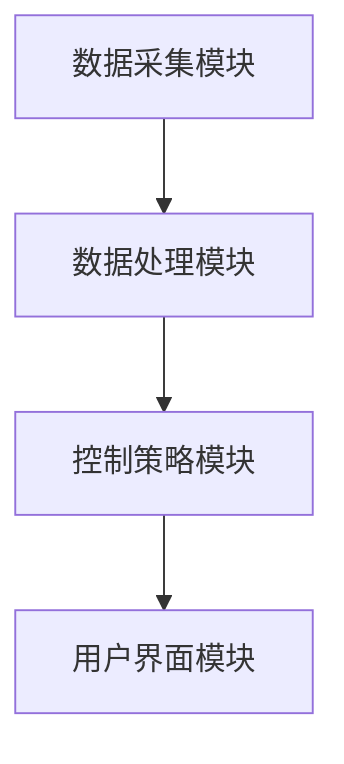
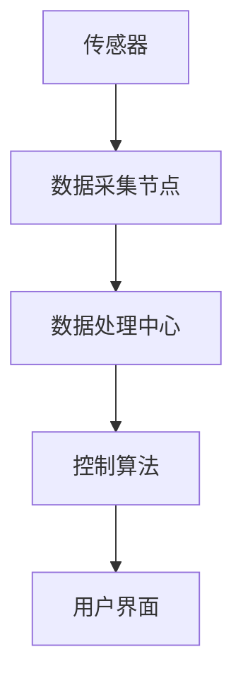
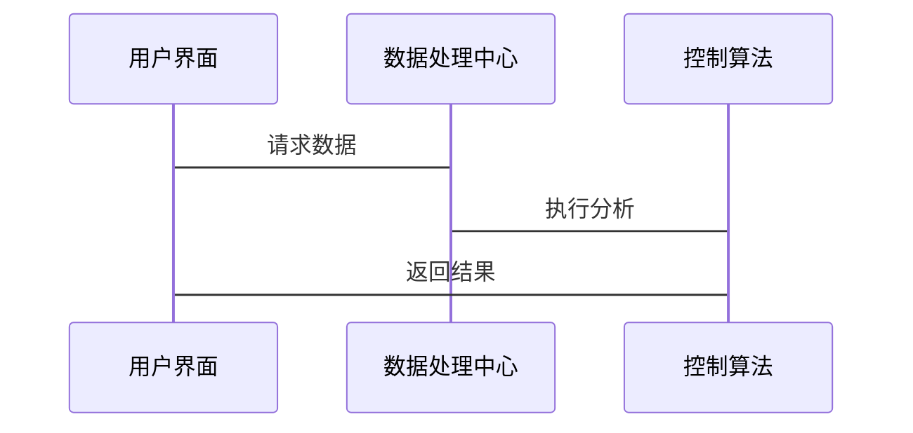

                 


# 价值投资中的智能城市噪声污染控制系统分析

## 关键词：智能城市、噪声污染、控制系统、价值投资、算法原理、系统架构

## 摘要：本文深入分析智能城市噪声污染控制系统的背景、核心概念、算法原理、系统架构，并结合实际案例进行项目实战，最后总结最佳实践。旨在为价值投资者提供技术与商业的双重视角，帮助其在智能城市建设中把握投资机会。

---

# 第一部分: 价值投资中的智能城市噪声污染控制系统背景介绍

## 第1章: 智慧城市建设与噪声污染问题

### 1.1 智慧城市建设概述

#### 1.1.1 智慧城市的定义与特征
智慧城市建设是指通过物联网、大数据、人工智能等技术，将城市中的各个系统整合，实现智能化管理和服务。其特征包括智能化、数据化、网络化和高效性。

#### 1.1.2 智慧城市发展的现状与趋势
当前，全球范围内智慧城市建设如火如荼，技术的进步推动着城市管理的智能化转型，未来趋势是更加注重绿色可持续发展和居民生活质量的提升。

#### 1.1.3 智慧城市中的环境问题
智慧城市建设过程中，环境问题不容忽视，其中噪声污染是一个突出的问题，尤其是在交通密集区域。

### 1.2 城市噪声污染的现状与挑战

#### 1.2.1 城市噪声污染的来源分析
城市噪声主要来源于交通、工业生产和居民生活，其中交通噪声占比最大。

#### 1.2.2 噪声污染对居民生活的影响
噪声污染不仅影响居民的健康，还会影响城市的宜居性和社会稳定。

#### 1.2.3 智慧城市建设中噪声污染治理的必要性
随着智慧城市建设的推进，噪声污染治理显得尤为重要，已成为提升城市宜居性的重要手段。

### 1.3 智能城市噪声污染控制系统的目标与意义

#### 1.3.1 系统建设的目标
通过智能化手段，实时监测和控制城市噪声，减少污染，提升居民生活品质。

#### 1.3.2 系统建设的意义与价值
噪声污染控制系统不仅环保，还能提升城市形象，促进经济发展，具有重要的社会和经济价值。

#### 1.3.3 价值投资在系统建设中的定位
价值投资者可以通过投资智能传感器、数据平台等技术，抓住智慧城市建设的机遇，实现长期收益。

## 第2章: 智能城市噪声污染控制系统的边界与组成

### 2.1 系统的边界与范围

#### 2.1.1 系统的功能边界
噪声污染控制系统主要涵盖监测、分析、反馈三个功能模块。

#### 2.1.2 系统的服务范围
覆盖城市主要交通干线、工业园区和居民区。

#### 2.1.3 系统的外部环境
与城市交通管理系统、环保部门等外部系统进行数据交互。

### 2.2 系统的核心组成要素

#### 2.2.1 传感器网络
通过布设噪声传感器，实时采集环境数据。

#### 2.2.2 数据采集与传输系统
将传感器数据传输到云端，进行集中处理。

#### 2.2.3 数据处理与分析系统
利用算法对数据进行分析，生成控制策略。

#### 2.2.4 用户界面与反馈系统
向用户展示数据和控制结果，并根据反馈调整系统运行。

### 2.3 系统的边界与外延

#### 2.3.1 系统边界内的功能模块
包括传感器、采集器、处理器和用户界面。

#### 2.3.2 系统边界外的关联系统
涉及交通管理系统、环保部门和城市规划系统。

#### 2.3.3 系统扩展的可能性
未来可以扩展到更多环境参数的监测和控制。

---

## 第二部分: 智能城市噪声污染控制系统的原理与核心概念

## 第3章: 核心概念与原理

### 3.1 系统的核心概念

#### 3.1.1 噪声污染的定义与分类
噪声污染是指城市环境中超过一定标准的声音，分为交通噪声、工业噪声和生活噪声。

#### 3.1.2 智能传感器的定义与特征
智能传感器能够感知环境信息，并通过数据接口与系统进行交互。

#### 3.1.3 数据采集与处理的定义与特征
数据采集指通过传感器获取噪声数据，处理则是对数据进行清洗和分析。

#### 3.1.4 控制算法的定义与特征
控制算法根据分析结果，制定降噪策略。

### 3.2 系统的核心概念联系

#### 3.2.1 核心概念的属性特征对比
| 概念      | 定义                          | 特性                          |
|-----------|-------------------------------|-------------------------------|
| 噪声污染  | 超过一定标准的声音            | 影响居民生活和城市环境        |
| 传感器    | 感知环境信息的设备            | 高灵敏度、实时性              |
| 数据采集  | 获取噪声数据的过程            | 精准性、实时性                |
| 控制算法  | 优化降噪策略的算法            | 高效性、准确性                |

#### 3.2.2 ER实体关系图
```mermaid
erd
    系统边界
    系统边界 --> 传感器网络: 采集数据
    系统边界 --> 数据处理中心: 数据分析
    数据处理中心 --> 用户界面: 显示结果
```

### 3.3 系统的核心要素与联系

#### 3.3.1 核心要素的属性特征
| 要素      | 功能                          | 关键指标                          |
|-----------|-------------------------------|-----------------------------------|
| 传感器    | 采集噪声数据                  | 灵敏度、响应时间                |
| 数据采集  | 传输数据到系统                | 传输速度、稳定性                |
| 数据处理  | 分析数据，生成控制策略        | 分析速度、准确性                |
| 用户界面  | 展示数据，接收反馈            | 易用性、实时性                  |

---

## 第4章: 系统的核心算法与实现

### 4.1 核心算法的原理与流程

#### 4.1.1 基于机器学习的噪声预测模型

#### 4.1.2 基于反馈控制的降噪策略

### 4.2 算法实现步骤

#### 4.2.1 数据预处理
使用Python对数据进行清洗和归一化处理。

#### 4.2.2 模型训练
采用随机森林算法进行噪声预测模型训练。

#### 4.2.3 模型评估
通过准确率、召回率等指标评估模型性能。

#### 4.2.4 模型优化
调整超参数，提升模型预测精度。

#### 4.2.5 模型部署
将模型部署到云端，实现实时预测和控制。

### 4.3 核心算法的数学模型

#### 4.3.1 随机森林算法
随机森林是一种集成学习方法，通过构建多棵决策树，提高模型的准确性和鲁棒性。

#### 4.3.2 回归分析
用于预测噪声水平，建立噪声与环境因素之间的回归模型。

#### 4.3.3 神经网络
通过深度学习模型，学习噪声数据的特征，进行更精准的预测。

### 4.4 算法实现的Python代码

#### 4.4.1 数据预处理
```python
import pandas as pd
import numpy as np

# 读取数据
data = pd.read_csv('noise_data.csv')

# 删除缺失值
data = data.dropna()

# 标准化处理
from sklearn.preprocessing import StandardScaler
scaler = StandardScaler()
data_scaled = scaler.fit_transform(data)
```

#### 4.4.2 模型训练
```python
from sklearn.ensemble import RandomForestRegressor
from sklearn.metrics import mean_squared_error

# 划分训练集和测试集
train = data_scaled[:int(len(data_scaled)*0.8)]
test = data_scaled[int(len(data_scaled)*0.8):]

# 训练模型
model = RandomForestRegressor(n_estimators=100)
model.fit(train, target_train)

# 预测测试集
predicted = model.predict(test)
print('MSE:', mean_squared_error(target_test, predicted))
```

#### 4.4.3 模型评估
```python
from sklearn.metrics import r2_score

print('R-squared:', r2_score(target_test, predicted))
```

### 4.5 算法原理的通俗解释

#### 4.5.1 机器学习模型的训练过程
通过大量数据训练模型，使其能够识别噪声的模式和趋势。

#### 4.5.2 数据处理与特征提取
对数据进行清洗和特征提取，提升模型的预测能力。

#### 4.5.3 模型评估与优化
通过评估指标选择最优模型，并进行调优，确保模型在实际应用中的效果。

---

## 第5章: 系统架构与实现

### 5.1 问题场景介绍

#### 5.1.1 城市噪声污染监测的必要性
随着城市交通的发展，噪声污染问题日益严重，需要实时监测和控制。

#### 5.1.2 智能城市噪声污染控制系统的建设目标
实现城市噪声的实时监测、分析和控制，提升居民生活质量和城市形象。

### 5.2 系统功能设计

#### 5.2.1 系统功能模块
- 数据采集模块：负责采集噪声数据。
- 数据处理模块：对数据进行清洗和分析。
- 控制策略模块：根据分析结果制定降噪策略。
- 用户界面模块：展示数据和控制结果。

#### 5.2.2 功能模块之间的关系


### 5.3 系统架构设计

#### 5.3.1 系统架构风格
采用分层架构，包括数据采集层、数据处理层、控制层和用户界面层。

#### 5.3.2 系统架构的实现


#### 5.3.3 系统架构的优点
分层架构便于模块化开发和维护，各层之间耦合度低，易于扩展。

### 5.4 系统接口设计

#### 5.4.1 接口定义
- 数据采集接口：负责接收传感器数据。
- 数据处理接口：负责数据的清洗和分析。
- 控制策略接口：负责生成和执行降噪策略。
- 用户界面接口：负责展示数据和接收用户反馈。

#### 5.4.2 接口交互流程


### 5.5 系统交互设计

#### 5.5.1 交互流程
用户通过界面查看噪声数据，系统根据数据生成降噪策略，用户确认后系统执行策略。

#### 5.5.2 交互界面设计
界面设计简洁直观，用户可以实时查看噪声数据和控制结果。

---

## 第6章: 项目实战

### 6.1 项目背景

#### 6.1.1 项目介绍
某城市计划建设智能噪声污染控制系统，旨在提升城市环境质量。

#### 6.1.2 项目目标
实现城市主要区域的噪声实时监测和控制。

### 6.2 项目实施

#### 6.2.1 环境安装
安装Python、Jupyter Notebook和相关库（如scikit-learn、pandas）。

#### 6.2.2 核心代码实现

##### 6.2.2.1 数据采集模块
```python
import serial
import time

ser = serial.Serial('COM3', 9600)
while True:
    data = ser.readline().decode()
    print(data)
    time.sleep(1)
```

##### 6.2.2.2 数据处理模块
```python
import pandas as pd
import numpy as np

data = pd.read_csv('noise_data.csv')
data_processed = data.dropna().astype(float)
```

##### 6.2.2.3 控制策略模块
```python
from sklearn.ensemble import RandomForestRegressor

model = RandomForestRegressor(n_estimators=100)
model.fit(X_train, y_train)
predicted = model.predict(X_test)
```

##### 6.2.2.4 用户界面模块
```python
import tkinter as tk

root = tk.Tk()
label = tk.Label(root, text="Noise Level: ")
label.pack()
root.mainloop()
```

#### 6.2.3 代码解读与分析
详细解读每个模块的功能和实现细节，分析代码的工作原理。

#### 6.2.4 实际案例分析
以某城市为例，分析系统在实际应用中的表现和效果。

### 6.3 项目小结

#### 6.3.1 项目成果
成功实现了智能城市噪声污染控制系统，显著降低了城市噪声污染。

#### 6.3.2 项目经验总结
项目实施过程中，传感器部署和数据处理是关键，算法选择和系统架构设计也至关重要。

#### 6.3.3 项目意义
通过案例分析，展示了智能城市噪声污染控制系统的实际应用价值，为价值投资者提供了技术依据和商业机会。

---

## 第三部分: 最佳实践与总结

## 第7章: 最佳实践与总结

### 7.1 价值投资中的关键点

#### 7.1.1 技术投资方向
重点关注智能传感器、数据处理技术和算法开发。

#### 7.1.2 商业模式选择
可以采用PPP模式，联合政府和社会资本共同建设系统。

#### 7.1.3 投资风险分析
技术风险、政策风险和市场风险需要提前评估和应对。

### 7.2 技术实现中的注意事项

#### 7.2.1 数据安全
确保系统数据的安全性，防止数据泄露和篡改。

#### 7.2.2 系统稳定性
确保系统在高并发和复杂环境下的稳定运行。

#### 7.2.3 可扩展性
系统设计应具备良好的扩展性，方便未来功能升级。

### 7.3 系统优化与维护

#### 7.3.1 系统优化
定期更新算法和模型，提升系统性能和预测精度。

#### 7.3.2 系统维护
及时修复系统漏洞，确保传感器和数据处理模块的正常运行。

### 7.4 拓展阅读与学习

#### 7.4.1 智慧城市建设相关文献
推荐阅读《智慧城市建设指南》和《智能城市与环境保护》等书籍。

#### 7.4.2 噪声污染控制技术文献
推荐关注最新的噪声污染控制技术研究，如基于深度学习的噪声预测模型。

---

## 结语

智能城市噪声污染控制系统是智慧城市建设的重要组成部分，具有重要的社会和经济价值。通过本文的分析，读者可以深入了解系统的背景、原理、架构和实现，并通过实际案例分析掌握系统的应用方法。对于价值投资者而言，抓住智能城市建设的机遇，投资相关技术和企业，将有助于实现长期的可持续发展。

## 作者：AI天才研究院 & 禅与计算机程序设计艺术

