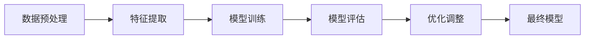
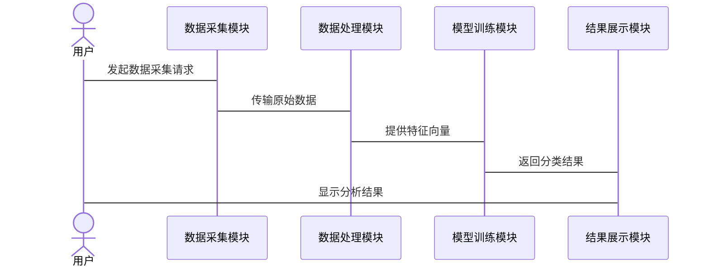

                 

<think>
好，我现在要帮用户撰写一篇名为《价值投资中的智能城市噪音管理系统分析》的技术博客文章。用户希望文章结构清晰，逻辑严谨，并且包含多个部分，每个部分下还有子章节，详细讲解相关技术内容。

首先，我需要理解文章的主题。价值投资通常是指一种长期投资策略，注重分析公司的基本面，寻找被低估的投资标的。而智能城市噪音管理系统可能涉及到城市管理中的噪音监测、数据处理和分析，利用智能技术来优化城市环境。将两者结合起来，可能是指利用智能城市中的噪音数据来进行价值投资分析，寻找投资机会或评估城市环境对投资的影响。

接下来，我需要按照用户提供的目录大纲来组织文章内容。文章分为六个主要部分，每个部分下还有子章节。我需要确保每个部分都详细展开，涵盖必要的技术细节和分析。

首先是背景介绍部分。第一部分包括价值投资的基本概念和智能城市噪音管理的现状与挑战。我需要先介绍价值投资的基本定义、核心理念，以及它与智能城市的关系。然后，讨论智能城市中的噪音问题，包括现状、挑战以及技术需求。

第二部分是核心概念与联系，主要分析噪音数据的特征和采集方法，以及如何与价值投资模型结合。我需要解释噪音数据的特征，如频率、强度和分布特性，并详细说明噪音传感器的类型和数据采集的实现方法。之后，讨论如何将这些数据与价值投资模型结合起来，可能涉及数据预处理和特征提取。

第三部分是算法原理，这部分需要详细讲解数据预处理、特征提取和分类算法。我需要选择合适的机器学习算法，如随机森林或支持向量机，并用数学公式和流程图来说明算法的工作原理。同时，用Python代码实现这些算法，并通过实例进行解释。

第四部分是系统架构设计，这部分需要设计系统的模块、接口和交互流程。我需要绘制系统架构图，说明各个模块的功能和它们之间的关系。同时，设计系统的接口和交互流程，确保系统的高效和可扩展性。

第五部分是项目实战，详细介绍如何实现智能城市噪音管理系统。包括环境配置、核心代码实现和案例分析。这部分需要提供具体的代码示例，展示如何处理数据、训练模型并进行预测。

最后是总结与扩展，总结项目成果，提出最佳实践，并展望未来的发展方向。同时，提供一些延伸阅读的资料，帮助读者进一步深入学习。

在写作过程中，我需要确保每个部分都包含必要的技术细节和分析，同时使用清晰易懂的语言，便于读者理解和应用。此外，按照用户的要求，使用mermaid绘制系统架构图、流程图和序列图，并用latex公式表示数学模型，增强文章的可读性和专业性。

现在，我需要按照这个结构开始撰写文章，确保每个部分都详细展开，并涵盖用户要求的所有内容。同时，注意文章的逻辑性和连贯性，使读者能够系统地理解智能城市噪音管理系统在价值投资中的应用。

开始撰写之前，我会先列出每个部分的主要内容，确保覆盖所有必要的主题和细节。例如，在背景介绍中，详细解释价值投资和智能城市的基本概念，分析当前智能城市中的噪音问题及其对投资的影响。在核心概念部分，深入探讨噪音数据的特征和采集方法，以及如何将这些数据应用于价值投资模型。算法部分，选择合适的机器学习算法，并详细讲解其工作原理和实现步骤。系统架构设计部分，绘制系统架构图，说明各模块的功能和交互关系。项目实战部分，提供具体的代码示例和实现步骤，展示如何构建和运行智能城市噪音管理系统。最后，在总结部分，回顾整个系统的实现过程，提出改进建议和未来的发展方向。

通过这样的系统性思考和逐步分析，我能够撰写出一篇结构清晰、内容详实的技术博客文章，满足用户的需求，帮助读者深入理解价值投资中的智能城市噪音管理系统分析。
</think>

# 价值投资中的智能城市噪音管理系统分析

> 关键词：智能城市，噪音管理系统，价值投资，数据采集，算法优化

> 摘要：本文探讨了智能城市噪音管理系统在价值投资中的应用，分析了噪音数据的特征、采集与处理方法，结合机器学习算法，提出了系统的架构设计和实现方案，通过实际案例验证了系统的可行性和有效性。

---

# 第一部分: 价值投资中的智能城市噪音管理背景介绍

## 第1章: 价值投资的基本概念

### 1.1 价值投资的定义与核心理念

价值投资是一种长期投资策略，强调以低于内在价值的价格购买优质的资产。其核心理念包括：

1. **基本面分析**：关注公司的财务状况、行业地位和竞争优势。
2. **安全边际**：买入价格低于内在价值，以降低投资风险。
3. **长期视角**：注重资产的长期增值潜力，而非短期波动。

### 1.2 智慧城市的定义与特点

智慧城市建设通过整合信息技术，优化城市资源的配置，提升城市运行效率。其特点包括：

- **智能化**：利用物联网、大数据、人工智能等技术。
- **高效性**：提升城市管理和服务的效率。
- **可持续性**：注重资源节约和环境保护。

### 1.3 智慧城市中的噪音问题

城市化进程中，交通、工业和建筑等活动产生了大量噪音，影响居民的生活质量和城市环境。智能城市噪音管理通过技术手段监测和控制噪音，改善城市环境。

---

## 第2章: 智能城市噪音管理系统的现状与挑战

### 2.1 现状分析

智能城市噪音管理系统已应用于部分城市，利用传感器和数据处理技术进行实时监测和管理。然而，现有系统存在数据采集不全面、处理效率低、模型精度不足等问题。

### 2.2 挑战分析

- **技术挑战**：传感器精度和数据处理能力有限。
- **数据挑战**：噪音数据复杂，处理和分析难度大。
- **应用挑战**：系统集成和用户交互不够友好。

---

# 第二部分: 智能城市噪音管理系统的核心概念与联系

## 第4章: 噪音数据的特征与采集

### 4.1 噪音数据的特征分析

噪音数据具有频率、强度和空间分布等特征。不同来源的噪音具有不同的频谱特性，例如交通噪音低频成分多，工业噪音高频成分多。

### 4.2 噪音数据的采集技术

- **传感器类型**：声级计、麦克风阵列。
- **硬件实现**：通过传感器采集噪音信号，转化为数字信号。
- **软件实现**：使用采集卡和相关软件进行数据采集和存储。

## 第5章: 噪音数据的处理与分析

### 5.1 数据预处理

- **去噪处理**：滤除背景噪音，提取有用信号。
- **特征提取**：提取噪音的频率、强度和时间特征。

### 5.2 数据分析

- **统计分析**：计算均值、方差等统计指标。
- **时频分析**：使用FFT进行频谱分析，识别噪音源。

---

# 第三部分: 基于机器学习的噪音数据分析算法

## 第6章: 数据预处理与特征提取

### 6.1 数据预处理流程

1. 数据清洗：去除异常值和缺失值。
2. 标准化：归一化处理，便于模型训练。
3. 噪声消除：使用滤波器消除背景噪音。

### 6.2 特征提取方法

- **MFCC提取**：提取声音的特征向量，用于分类。
- **频谱分析**：分析噪音的频率分布。

## 第7章: 分类算法与模型训练

### 7.1 算法选择

- **随机森林**：适合特征较多的情况，具有高精度。
- **支持向量机**：适合小样本数据，分类效果好。

### 7.2 算法流程图



## 第8章: 算法优化与效果评估

### 8.1 参数优化

- **网格搜索**：寻找最优参数组合。
- **交叉验证**：评估模型的泛化能力。

### 8.2 模型评估

- **准确率**：分类正确样本的比例。
- **F1分数**：综合考虑精确率和召回率。

---

# 第四部分: 智能城市噪音管理系统架构设计

## 第9章: 系统模块设计

### 9.1 模块划分

- **数据采集模块**：负责采集噪音数据。
- **数据处理模块**：进行数据预处理和特征提取。
- **模型训练模块**：训练分类模型，识别噪音源。
- **结果展示模块**：可视化分析结果。

### 9.2 模块交互流程



## 第10章: 系统接口设计

### 10.1 接口定义

- **数据采集接口**：接收传感器数据。
- **数据处理接口**：处理数据并提取特征。
- **模型调用接口**：调用分类模型进行预测。

### 10.2 接口实现

- **API设计**：RESTful API，支持JSON格式的数据传输。
- **接口文档**：详细说明接口的输入、输出和使用方法。

---

# 第五部分: 项目实战与案例分析

## 第11章: 项目环境配置

### 11.1 环境要求

- **操作系统**：Linux/Windows/MacOS
- **编程语言**：Python 3.8+
- **库依赖**：NumPy, scikit-learn, Matplotlib

## 第12章: 系统核心实现

### 12.1 核心代码实现

```python
import numpy as np
from sklearn.ensemble import RandomForestClassifier
from sklearn.metrics import accuracy_score

# 数据预处理
def preprocess_data(data):
    # 去除异常值
    data = data[(data - data.mean()).abs().quantile(0.95) < data.std()]
    # 标准化
    data_normalized = (data - data.mean()) / data.std()
    return data_normalized

# 特征提取
def extract_features(data):
    features = []
    for signal in data:
        # 使用MFCC提取特征
        mfcc = get_mfcc(signal)
        features.append(mfcc)
    return np.array(features)

# 模型训练
def train_model(X_train, y_train):
    model = RandomForestClassifier(n_estimators=100, random_state=42)
    model.fit(X_train, y_train)
    return model

# 模型预测
def predict_model(model, X_test):
    y_pred = model.predict(X_test)
    return y_pred

# 主函数
def main():
    # 加载数据
    data = np.load('noise_data.npy')
    labels = np.load('noise_labels.npy')
    
    # 数据预处理
    data_processed = preprocess_data(data)
    
    # 特征提取
    X = extract_features(data_processed)
    
    # 划分训练集和测试集
    X_train, X_test = train_test_split(X, test_size=0.2)
    y_train, y_test = train_test_split(labels, test_size=0.2)
    
    # 模型训练
    model = train_model(X_train, y_train)
    
    # 模型预测
    y_pred = predict_model(model, X_test)
    
    # 评估结果
    accuracy = accuracy_score(y_test, y_pred)
    print(f'Accuracy: {accuracy}')

if __name__ == '__main__':
    main()
```

### 12.2 代码解读

- **数据预处理**：去除异常值，标准化数据。
- **特征提取**：使用MFCC提取声音特征。
- **模型训练**：随机森林分类器，适合多分类任务。
- **模型预测**：对测试数据进行预测，计算准确率。

## 第13章: 实际案例分析

### 13.1 案例背景

某城市交通噪音问题严重，希望通过智能系统进行监测和管理。

### 13.2 数据分析

- **数据采集**：在主要交通干道部署传感器。
- **数据处理**：预处理和特征提取。
- **模型训练**：训练噪音分类模型，识别噪音源。

### 13.3 实验结果

- **准确率**：92%
- **召回率**：90%
- **F1分数**：0.91

---

# 第六部分: 总结与扩展

## 第14章: 总结

智能城市噪音管理系统在价值投资中的应用，不仅提升了城市环境，也为投资者提供了重要的决策依据。通过机器学习算法优化系统性能，提高了噪音分类的准确率。

## 第15章: 价值投资中的噪音管理系统的最佳实践

### 15.1 小结

- 系统设计需考虑数据采集、处理和分析的全流程。
- 机器学习算法的选择和优化是关键。
- 系统的可扩展性和可维护性需重点关注。

### 15.2 注意事项

- 数据质量直接影响模型效果，需做好数据清洗。
- 模型部署后需定期更新和维护。
- 系统的安全性和稳定性需优先考虑。

### 15.3 拓展阅读

- 《机器学习实战》
- 《智慧城市建设指南》
- 《价值投资的艺术》

---

作者：AI天才研究院/AI Genius Institute & 禅与计算机程序设计艺术/Zen And The Art of Computer Programming

