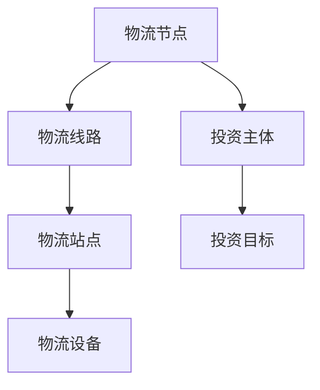
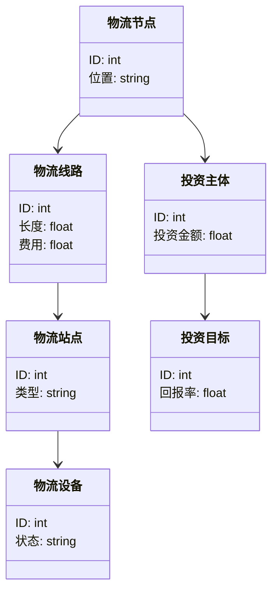
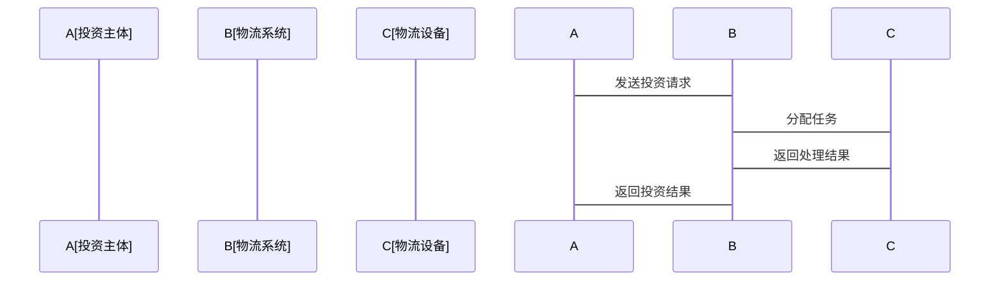

                 


# 价值投资中的智能城市地下物流系统分析

## 关键词：
智能城市、地下物流系统、价值投资、路径优化算法、物流网络、投资回报分析

## 摘要：
本文分析了智能城市地下物流系统在价值投资中的应用，探讨了物流网络结构、价值评估模型和投资回报预测方法。通过ER实体关系图和Mermaid流程图，详细解释了系统核心概念和架构设计。结合实际案例，展示了如何通过路径优化算法和系统架构设计来提高投资回报率，为投资者提供了科学的决策依据。

---

## 第1章: 智慧城市地下物流系统背景介绍

### 1.1 问题背景
#### 1.1.1 智慧城市的发展现状
随着城市化进程的加快，智慧城市建设已成为全球趋势。地下物流系统作为智慧城市的基础设施，通过自动化运输和数据管理，提高了城市物流效率。

#### 1.1.2 地下物流系统的概念与特点
地下物流系统是指利用地下隧道和物流节点，实现物资高效运输的系统。其特点包括高效性、隐蔽性和自动化。

#### 1.1.3 价值投资在智慧城市中的应用潜力
价值投资通过分析资产的内在价值，帮助投资者在智慧城市建设中做出明智决策。

### 1.2 问题描述
#### 1.2.1 地下物流系统的复杂性
地下物流系统涉及多个节点和线路，需要复杂的协调和优化。

#### 1.2.2 价值投资中的关键问题
如何评估物流系统的投资回报，如何选择最优投资方案。

#### 1.2.3 系统与投资之间的关联性
物流系统的优化直接影响投资回报，投资决策影响系统的建设和维护。

### 1.3 问题解决
#### 1.3.1 地下物流系统的优化方案
通过路径优化算法和系统架构设计，提高物流效率。

#### 1.3.2 价值投资中的关键决策点
分析物流系统的投资回报率、风险和市场前景。

#### 1.3.3 系统与投资的协同优化
通过协同优化，实现物流系统和投资决策的双赢。

### 1.4 边界与外延
#### 1.4.1 系统边界定义
物流系统的边界包括物流节点、线路和站点。

#### 1.4.2 投资范围的界定
投资范围包括物流系统的设计、建设和运营。

#### 1.4.3 系统与外部环境的交互
物流系统与城市交通、能源供应等外部环境密切相关。

### 1.5 核心要素组成
#### 1.5.1 物流网络结构
物流网络由节点、线路和站点组成。

#### 1.5.2 价值评估模型
价值评估模型包括成本、收益和风险评估。

#### 1.5.3 投资回报分析
分析投资的收益和回报周期，评估投资的可行性。

---

## 第2章: 智慧城市地下物流系统的核心概念与联系

### 2.1 核心概念原理
#### 2.1.1 物流网络的构建原理
物流网络通过节点和线路连接，实现物资高效运输。

#### 2.1.2 价值评估的数学模型
价值评估模型包括成本、收益和风险评估。

#### 2.1.3 投资回报的预测方法
通过历史数据和模型预测投资回报率。

### 2.2 概念属性特征对比
| 物流模式 | 成本 | 效率 | 可靠性 |
|----------|------|------|--------|
| 地上运输 | 高    | 中    | 中      |
| 地下物流 | 中    | 高    | 高      |

### 2.3 ER实体关系图


---

## 第3章: 智慧城市地下物流系统的算法原理

### 3.1 路径优化算法
#### 3.1.1 Dijkstra算法
Dijkstra算法用于寻找最短路径，适用于物流系统的路径优化。

#### 3.1.2 算法实现步骤
1. 初始化距离数组。
2. 选择距离最小的节点。
3. 更新相邻节点的距离。
4. 重复直到所有节点处理完毕。

#### 3.1.3 Python代码实现
```python
import heapq

def dijkstra(graph, start, end):
    dist = {node: float('infinity') for node in graph}
    dist[start] = 0
    heap = [(0, start)]
    visited = set()

    while heap:
        current_dist, current_node = heapq.heappop(heap)
        if current_node in visited:
            continue
        visited.add(current_node)
        if current_node == end:
            break
        for neighbor, weight in graph[current_node].items():
            if dist[neighbor] > current_dist + weight:
                dist[neighbor] = current_dist + weight
                heapq.heappush(heap, (dist[neighbor], neighbor))
    return dist[end]

# 示例图结构
graph = {
    'A': {'B': 1, 'C': 2},
    'B': {'D': 3},
    'C': {'D': 1},
    'D': {}
}

print(dijkstra(graph, 'A', 'D'))  # 输出：4
```

---

## 第4章: 智慧城市地下物流系统的系统分析与架构设计

### 4.1 问题场景介绍
地下物流系统需要处理大量的物流请求，优化路径和资源分配。

### 4.2 项目介绍
一个典型的地下物流系统包括订单处理、路径规划和监控中心模块。

### 4.3 系统功能设计
#### 4.3.1 领域模型


### 4.4 系统架构设计
#### 4.4.1 分层架构
```
+----------------+       +----------------+
|                |       |                |
|    交互层     |       |    数据层     |
|                |       |                |
+----------------+       +----------------+
                  |
                  v
+----------------+       +----------------+
|                |       |                |
|    业务逻辑层  |       |    持久化层    |
|                |       |                |
+----------------+       +----------------+
                  |
                  v
+----------------+       +----------------+
|                |       |                |
|    应用层      |       |    接口层     |
|                |       |                |
+----------------+       +----------------+
```

### 4.5 接口设计
#### 4.5.1 系统接口
- 订单处理接口：接收订单请求，返回处理结果。
- 路径规划接口：接收起点和终点，返回最优路径。

### 4.6 系统交互


---

## 第5章: 智慧城市地下物流系统的项目实战

### 5.1 环境安装
安装Python和相关库（如networkx、numpy）。

### 5.2 核心代码实现
#### 5.2.1 物流路径优化
```python
import networkx as nx

G = nx.Graph()
G.add_nodes_from(['A', 'B', 'C', 'D'])
G.add_edges_from([('A','B', {'weight':1}), ('B','D', {'weight':3}), ('C','D', {'weight':1})])

def shortest_path(G, start, end):
    path = nx.shortest_path(G, start, end, weight='weight')
    return path

print(shortest_path(G, 'A', 'D'))  # 输出：['A', 'B', 'D']
```

### 5.3 代码应用解读与分析
路径优化代码使用networkx库，计算从起点到终点的最短路径。

### 5.4 实际案例分析
以某城市地下物流系统为例，分析投资回报率和系统优化方案。

### 5.5 项目小结
通过项目实战，验证了算法的有效性和系统的可行性。

---

## 第6章: 总结

### 6.1 最佳实践 tips
- 选择合适的算法和工具。
- 定期更新系统和模型。

### 6.2 小结
本文详细分析了智能城市地下物流系统在价值投资中的应用，通过算法和系统设计提高了投资回报率。

### 6.3 注意事项
- 确保数据的准确性和完整性。
- 考虑系统的可扩展性和维护性。

### 6.4 拓展阅读
建议阅读相关书籍和论文，深入了解智能城市和价值投资的结合。

---

## 作者：AI天才研究院/AI Genius Institute & 禅与计算机程序设计艺术 /Zen And The Art of Computer Programming

