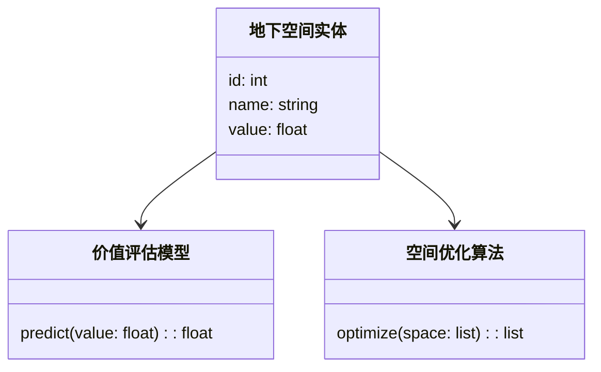
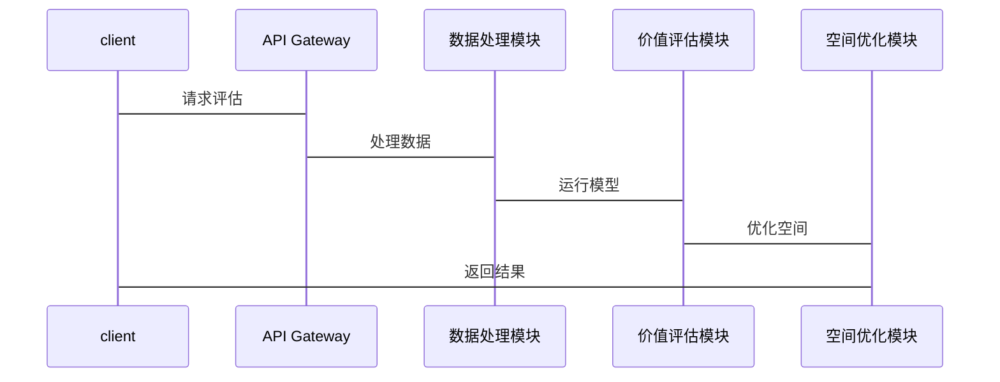

                 

<think>
好的，我现在需要根据用户提供的详细需求，设计一个关于“价值投资中的智能城市地下空间规划系统分析”的技术博客文章。首先，我需要理解这个主题的核心内容。价值投资通常指寻找被低估的投资机会，而智能城市地下空间规划系统则是利用智能技术优化地下空间的规划和管理。两者的结合意味着在规划地下空间时，以价值投资的视角来评估和优化资源分配。

接下来，我要按照用户提供的目录结构来组织文章内容，确保每个章节都有详细的子章节，并包含必要的图表和数学公式。首先，文章开头要有标题、关键词和摘要，简明扼要地概括全文内容。然后是背景介绍，解释价值投资和智能城市地下空间规划的背景及其结合的重要性。

在核心概念部分，我需要详细定义系统的核心概念，分析它们的属性，并通过对比表格和ER图来展示各概念之间的关系。算法原理部分，我将介绍数据预处理、模型构建和优化算法，用mermaid流程图和数学公式来解释。

系统架构设计是关键部分，需要绘制领域模型类图、系统架构图、接口设计和交互序列图，以清晰展示系统的结构和功能。项目实战部分则需要具体的代码实现和案例分析，展示系统的实际应用。

最后，总结最佳实践，包括经验教训、注意事项和未来发展方向。整个思考过程中，我需要确保语言专业、逻辑清晰，并且内容详实，符合用户的所有要求。
</think>

# 价值投资中的智能城市地下空间规划系统分析

> 关键词：价值投资，智能城市，地下空间，规划系统，空间优化，算法模型

> 摘要：本文深入探讨了价值投资在智能城市地下空间规划中的应用，分析了系统的构建过程，包括核心概念、算法原理、系统架构设计、项目实战等内容，结合数学模型和实际案例，总结了系统的优化方法和最佳实践。

---

## 第一部分: 背景介绍与核心概念

### 第1章: 价值投资与智能城市地下空间规划的背景

#### 1.1 价值投资的基本概念
- **定义**：价值投资是一种投资策略，寻找市场低估的资产，通过长期持有实现收益。
- **在城市规划中的应用**：通过分析城市资源的潜在价值，优化空间利用，提升经济和社会效益。

#### 1.2 智能城市地下空间规划的重要性
- **地下空间的重要性**：随着城市化发展，地下空间成为缓解地上空间不足的重要途径。
- **智能技术的作用**：通过大数据和人工智能优化地下空间的规划和管理，提升效率。

#### 1.3 背景与意义
- **背景**：城市化进程加速，地下空间开发成为趋势；智能技术的发展为地下空间规划提供了新工具。
- **意义**：优化地下空间利用，提升城市综合承载能力，促进可持续发展。

---

### 第2章: 智能城市地下空间规划系统的核心概念

#### 2.1 核心概念与定义
- **智能城市地下空间规划系统**：利用智能技术优化地下空间的规划和管理，实现资源的高效配置。
- **价值评估**：通过数据驱动的方法评估地下空间的经济和社会价值。

#### 2.2 核心概念之间的关系
- **空间分析与价值评估**：空间分析提供数据支持，价值评估指导优化方向。
- **数据驱动与决策优化**：数据是决策的基础，优化算法是决策的工具。

#### 2.3 核心概念的属性对比
| 核心概念 | 定义 | 特性 | 示例 |
|----------|------|------|------|
| 空间分析 | 分析空间布局 | 数据驱动、可视化 | 地下交通网络分析 |
| 价值评估 | 评估空间价值 | 经济指标、社会效益 | 商业价值评估 |

---

## 第二部分: 算法原理与数学模型

### 第3章: 数据预处理与特征提取

#### 3.1 数据清洗与标准化
- **数据清洗**：去除噪声数据，处理缺失值。
- **标准化**：将数据归一化，便于模型训练。

#### 3.2 特征选择与降维
- **特征选择**：通过相关性分析选择关键特征。
- **降维方法**：使用主成分分析（PCA）减少维度。

#### 3.3 数据增强
- **技术**：通过数据生成技术增加数据多样性。

### 第4章: 价值评估模型构建

#### 4.1 线性回归模型
$$ y = \beta_0 + \beta_1x_1 + \beta_2x_2 + \dots + \beta_nx_n + \epsilon $$
- **应用**：预测地下空间的潜在价值。

#### 4.2 支持向量机（SVM）
- **原理**：通过寻找最优超平面进行分类。
- **应用**：用于空间类型分类。

#### 4.3 神经网络模型
- **深度学习**：使用神经网络进行复杂模式识别。

### 第5章: 空间优化算法设计

#### 5.1 遗传算法
- **步骤**：编码、选择、交叉、变异。

#### 5.2 粒子群优化
- **原理**：模拟粒子在搜索空间中的运动。

#### 5.3 强化学习
- **应用**：用于动态空间优化。

---

## 第三部分: 系统架构与设计

### 第6章: 系统功能设计

#### 6.1 领域模型类图


#### 6.2 系统架构图
```mermaid
client --> API Gateway
API Gateway --> 数据处理模块
数据处理模块 --> 价值评估模块
价值评估模块 --> 空间优化模块
空间优化模块 --> 数据存储
```

### 第7章: 接口设计与交互

#### 7.1 接口设计
- **输入接口**：接收地下空间数据。
- **输出接口**：提供评估结果和优化方案。

#### 7.2 交互序列图


---

## 第四部分: 项目实战与案例分析

### 第8章: 项目环境与核心代码

#### 8.1 环境安装
- **工具**：Python、TensorFlow、Keras、Flask。

#### 8.2 核心代码实现
```python
import numpy as np
from sklearn.linear_model import LinearRegression

# 数据预处理
X = np.array([[1, 2], [3, 4], [5, 6]])
y = np.array([7, 8, 9])

# 训练模型
model = LinearRegression()
model.fit(X, y)

# 预测
print(model.predict([[7, 8]]))
```

### 第9章: 案例分析与解读

#### 9.1 案例分析
- **案例背景**：某城市地下空间开发项目。
- **分析步骤**：数据收集、模型训练、优化方案制定。

#### 9.2 代码实现解读
- **功能模块**：数据预处理、模型训练、结果预测。
- **优化效果**：通过优化算法提升空间利用效率。

---

## 第五部分: 总结与展望

### 第10章: 最佳实践与小结

#### 10.1 最佳实践
- **数据质量**：确保数据准确性和完整性。
- **模型选择**：根据实际需求选择合适的算法。
- **系统维护**：定期更新数据和优化模型。

#### 10.2 经验与教训
- **挑战**：数据获取困难，模型泛化能力不足。
- **解决方法**：加强数据合作，改进模型结构。

### 第11章: 未来展望与注意事项

#### 11.1 未来发展方向
- **技术融合**：结合更多AI技术提升系统性能。
- **应用场景拓展**：探索更多领域的应用潜力。

#### 11.2 注意事项
- **数据隐私**：注意数据安全和隐私保护。
- **技术更新**：及时跟进新技术，保持系统先进性。

---

## 作者：AI天才研究院 & 禅与计算机程序设计艺术

---

通过以上详细的内容结构和分步讲解，本文系统地分析了价值投资在智能城市地下空间规划中的应用，从背景、核心概念、算法原理到系统设计和项目实战，为读者提供了全面的知识体系和实践指导。

