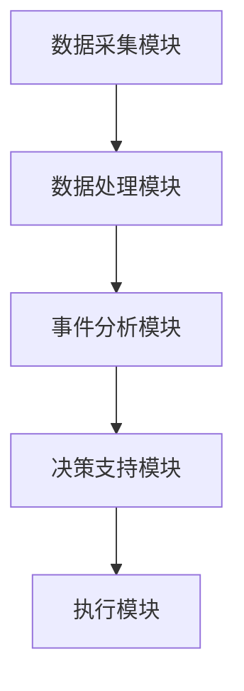

                 


# 价值投资中的智能城市应急响应系统分析

## 关键词：
智能城市、应急响应系统、价值投资、数据分析、算法优化、系统架构

## 摘要：
本文深入探讨了在智能城市背景下，如何利用价值投资的方法分析应急响应系统的效率和效果。通过分析系统的核心原理、算法优化、架构设计和项目实战，展示了如何利用技术手段提升应急管理能力，实现资源的最优配置。

---

## 第1章：智能城市应急响应系统概述

### 1.1 问题背景
- 城市化进程加速，应急管理压力增大。
- 传统应急响应系统效率低，资源浪费严重。
- 智能化应急响应系统的需求日益迫切。

### 1.2 问题描述
- 应急响应系统需要实时监控、快速决策和高效执行。
- 价值投资方法可用于评估系统的经济效益和效率。

### 1.3 问题解决
- 利用数据分析和人工智能技术优化应急响应流程。
- 通过价值投资模型实现资源的最优分配。

### 1.4 系统边界与外延
- 系统边界包括数据采集、事件分析和决策支持模块。
- 外部系统如交通、医疗等的交互是系统扩展的重要部分。

### 1.5 核心概念组成
- 数据采集模块：实时收集城市各区域的数据。
- 事件分析模块：识别和分类紧急事件。
- 决策支持模块：基于数据分析提供最优解决方案。

---

## 第2章：智能城市应急响应系统的核心原理

### 2.1 核心概念原理
- 数据驱动的实时监控：利用传感器和大数据技术实时采集和分析城市数据。
- 人工智能在事件预测中的应用：使用机器学习模型预测事件的发生概率和影响范围。
- 价值投资模型在资源分配中的作用：通过评估资源的使用效率和经济效益，优化资源分配。

### 2.2 概念属性对比表
| 比较项 | 传统应急响应系统 | 智能应急响应系统 |
|--------|------------------|------------------|
| 数据来源 | 单一来源         | 多源数据         |
| 响应时间 | 较长             | 实时响应         |
| 资源分配 | 非最优           | 最优分配         |

### 2.3 ER实体关系图
```mermaid
er
    entity(应急响应系统) {
        id
        name
        description
    }
    entity(数据源) {
        id
        type
        source
    }
    entity(事件) {
        id
        type
        timestamp
    }
    entity(决策模块) {
        id
        rule_set
        outcome
    }
    entity(执行模块) {
        id
        action
        status
    }
    relation(数据源 --> 事件, "触发事件")
    relation(事件 --> 决策模块, "输入决策依据")
    relation(决策模块 --> 执行模块, "输出执行指令")
```

---

## 第3章：算法原理

### 3.1 数据预处理算法
- 使用清洗和归一化处理数据，确保算法输入的质量。

### 3.2 事件预测算法
- 使用随机森林算法预测事件发生的概率和影响范围。

### 3.3 资源优化算法
- 应用线性规划模型优化资源配置，减少浪费。

---

## 第4章：系统分析与架构设计

### 4.1 系统架构设计


### 4.2 接口设计
- 数据接口：与传感器和数据库交互。
- API接口：与其他系统如交通和医疗系统对接。

### 4.3 交互流程
```mermaid
sequence
    participant 用户
    participant 数据采集模块
    participant 事件分析模块
    participant 决策支持模块
    participant 执行模块
    用户 -> 数据采集模块: 提交请求
    数据采集模块 -> 事件分析模块: 发送数据
    事件分析模块 -> 决策支持模块: 分析结果
    决策支持模块 -> 执行模块: 下达指令
    执行模块 -> 用户: 返回结果
```

---

## 第5章：项目实战

### 5.1 环境安装
- 安装Python、数据处理库和机器学习框架。

### 5.2 核心代码实现
```python
import numpy as np
from sklearn.ensemble import RandomForestClassifier

# 示例代码：事件预测
data = np.array([[1, 2, 3], [4, 5, 6]])
model = RandomForestClassifier()
model.fit(data, [0, 1])
预测结果 = model.predict(new_data)
```

### 5.3 案例分析
- 以火灾为例，展示系统如何优化应急响应流程，减少损失。

### 5.4 项目总结
- 项目实现的效益：提高效率、降低成本、提升准确性。

---

## 第6章：总结

### 6.1 最佳实践 tips
- 数据质量是关键，确保数据的准确性和及时性。
- 模型选择需结合实际场景，避免过度复杂。

### 6.2 小结
- 价值投资方法与智能技术的结合，显著提升了应急响应系统的效率和效果。

### 6.3 注意事项
- 数据隐私和系统安全需高度重视。
- 持续优化模型，适应城市发展的需求。

### 6.4 拓展阅读
- 推荐相关书籍和文献，供深入学习。

---

## 作者：
作者：AI天才研究院 & 禅与计算机程序设计艺术

---

通过以上分析和设计，本文系统地介绍了智能城市应急响应系统的构建和优化方法，结合价值投资的视角，为提升应急管理能力提供了新的思路。

