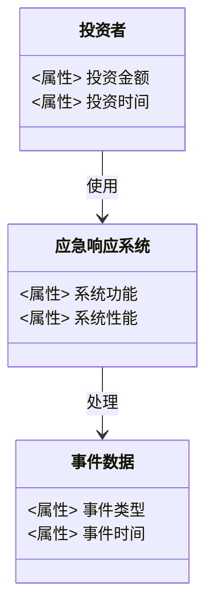
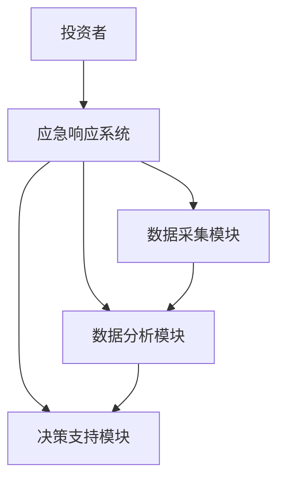
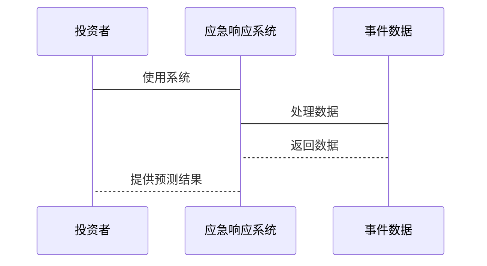

                 


# 价值投资中的智能城市应急响应系统分析

> 关键词：智能城市、应急响应系统、价值投资、算法原理、系统架构、项目实战

> 摘要：本文从价值投资的角度分析智能城市应急响应系统，探讨其在投资中的潜力与价值。通过详细分析系统的组成、算法原理、系统架构及实际案例，揭示其在投资决策中的重要性。文章旨在为投资者提供深入的技术与经济分析，帮助其做出明智的投资决策。

---

## 第1章: 智慧城市应急响应系统概述

### 1.1 智慧城市的概念与背景

#### 1.1.1 智慧城市的定义与发展
智慧城市是通过技术手段将城市中的各个系统（如交通、能源、医疗、应急响应等）进行整合，以提高城市运行效率和居民生活质量。应急响应系统作为智慧城市的重要组成部分，负责在突发事件中快速反应，减少损失。

#### 1.1.2 应急响应系统的概念与作用
应急响应系统是指在突发事件（如自然灾害、恐怖袭击等）发生时，能够快速识别、评估、决策并执行响应措施的系统。其作用包括减少人员伤亡、降低财产损失、提高救援效率等。

#### 1.1.3 价值投资与智慧城市的关系
价值投资是一种长期投资策略，通过分析企业的内在价值进行投资。智慧城市应急响应系统的建设与运营具有较高的社会价值和经济价值，符合价值投资的理念。投资者可以通过分析系统的经济效益、市场前景等因素，寻找具有投资潜力的项目。

---

### 1.2 智慧城市应急响应系统的核心要素

#### 1.2.1 系统的基本组成
智能城市应急响应系统通常包括以下几个部分：
- 数据采集与处理模块
- 智能分析与预测模块
- 应急决策支持模块
- 执行与反馈模块

#### 1.2.2 应急响应的流程与机制
1. 数据采集：通过传感器、摄像头等设备收集突发事件的相关数据。
2. 数据分析：利用大数据和人工智能技术对数据进行处理和分析。
3. 决策支持：基于分析结果，生成应急响应方案。
4. 执行与反馈：执行响应措施，并实时反馈执行结果。

#### 1.2.3 系统的智能化特点
- 高度自动化：系统能够自动识别突发事件并启动响应。
- 数据驱动：依赖大数据分析和机器学习技术。
- 多部门协同：系统能够协调多个部门共同参与应急响应。

---

## 第2章: 智慧城市应急响应系统的核心概念与联系

### 2.1 系统核心概念的原理

#### 2.1.1 数据采集与处理
数据采集是应急响应系统的基础，通过传感器、摄像头等设备实时采集突发事件的相关数据。数据处理包括数据清洗、转换和存储。

#### 2.1.2 智能分析与预测
利用机器学习算法对数据进行分析，预测突发事件的发展趋势和影响范围。常用的算法包括支持向量机（SVM）、随机森林（Random Forest）和深度学习模型（如LSTM）。

#### 2.1.3 应急决策支持
基于分析结果，系统生成应急响应方案，包括人员疏散、资源调配等。决策支持模块通常结合专家系统和优化算法，确保方案的最优性。

---

### 2.2 核心概念的属性对比表格

表2-1: 应急响应系统核心概念属性对比

| 属性       | 数据采集与处理 | 智能分析与预测 | 应急决策支持 |
|------------|----------------|----------------|--------------|
| 输入       | 实时数据流     | 分析数据       | 预测结果     |
| 输出       | 处理后的数据   | 预测结果       | 应急方案     |
| 关键技术   | 物联网技术     | 机器学习       | 优化算法     |
| 目标       | 数据准确性     | 预测准确性     | 方案最优性   |

---

### 2.3 ER实体关系图

```mermaid
erDiagram
    class 投资者 {
        <属性> 投资金额
        <属性> 投资时间
    }
    class 应急响应系统 {
        <属性> 系统功能
        <属性> 系统性能
    }
    class 事件数据 {
        <属性> 事件类型
        <属性> 事件时间
    }
    投资者 --> 应急响应系统 : 使用
    应急响应系统 --> 事件数据 : 处理
```

---

## 第3章: 应急响应系统算法原理

### 3.1 算法原理概述

#### 3.1.1 算法的基本原理
应急响应系统的核心算法包括数据预处理、模型训练和预测。数据预处理包括数据清洗和特征提取；模型训练使用机器学习算法；预测基于训练好的模型生成结果。

#### 3.1.2 算法的输入输出
- 输入：突发事件的相关数据（如地理位置、事件类型、时间等）。
- 输出：预测结果和应急方案。

#### 3.1.3 算法的优化方向
通过优化算法参数和引入新的模型（如深度学习）来提高预测准确性和响应速度。

---

### 3.2 算法流程图

```mermaid
graph TD
    A[开始] --> B[数据采集]
    B --> C[数据预处理]
    C --> D[模型训练]
    D --> E[模型预测]
    E --> F[结果输出]
    F ->
```

---

### 3.3 算法实现代码

```python
# 数据预处理
import pandas as pd
from sklearn.model_selection import train_test_split
from sklearn.ensemble import RandomForestClassifier

# 数据加载
data = pd.read_csv('event_data.csv')

# 特征提取
X = data[['location', 'event_type', 'time']]
y = data['label']

# 数据分割
X_train, X_test, y_train, y_test = train_test_split(X, y, test_size=0.2)

# 模型训练
model = RandomForestClassifier()
model.fit(X_train, y_train)

# 模型预测
y_pred = model.predict(X_test)

# 结果输出
print("预测准确率：", accuracy_score(y_test, y_pred))
```

---

## 第4章: 系统架构设计

### 4.1 问题场景介绍
本节将分析智能城市应急响应系统的应用场景，包括自然灾害、公共安全事件等。

### 4.2 系统功能设计

#### 4.2.1 领域模型类图


#### 4.2.2 系统架构设计


#### 4.2.3 系统接口设计
- 数据接口：与传感器、数据库等接口对接。
- 用户接口：提供给投资者和应急人员使用的界面。

#### 4.2.4 系统交互序列图


---

## 第5章: 项目实战

### 5.1 环境安装
需要安装Python、机器学习库（如scikit-learn、xgboost）和数据可视化工具（如Matplotlib）。

### 5.2 系统核心实现源代码

```python
# 系统核心实现代码
import numpy as np
import pandas as pd
from sklearn.ensemble import RandomForestClassifier
from sklearn.metrics import accuracy_score

# 数据加载
data = pd.read_csv('event_data.csv')

# 特征提取
X = data[['location', 'event_type', 'time']]
y = data['label']

# 数据分割
X_train, X_test, y_train, y_test = train_test_split(X, y, test_size=0.2)

# 模型训练
model = RandomForestClassifier()
model.fit(X_train, y_train)

# 模型预测
y_pred = model.predict(X_test)

# 结果输出
print("预测准确率：", accuracy_score(y_test, y_pred))
```

### 5.3 代码应用解读与分析
通过上述代码，我们可以训练一个随机森林模型，用于预测突发事件的类型和影响范围。模型的准确率越高，系统的应急响应能力越强，从而具有更高的投资价值。

### 5.4 实际案例分析
以某城市地震应急响应系统为例，分析系统的实际运行情况和投资回报。

### 5.5 项目小结
通过实际案例分析，我们可以看到智能城市应急响应系统在投资中的巨大潜力。投资者可以通过分析系统的性能、市场前景等因素，做出明智的投资决策。

---

## 第6章: 总结与展望

### 6.1 本章总结
本文从价值投资的角度分析了智能城市应急响应系统，探讨了其在投资中的潜力与价值。通过详细分析系统的组成、算法原理、系统架构及实际案例，揭示了其在投资决策中的重要性。

### 6.2 未来展望
未来，随着人工智能和大数据技术的不断发展，智能城市应急响应系统将更加智能化和高效化。投资者可以通过技术创新和市场拓展，进一步挖掘其投资价值。

---

## 附录

### 附录A: 术语表
- 智慧城市：通过技术手段整合城市资源，提高运行效率和居民生活质量。
- 应急响应系统：在突发事件中快速反应、减少损失的系统。
- 价值投资：通过分析企业的内在价值进行投资。

### 附录B: 数据来源
- 数据来源：公开数据集和实际项目案例。

### 附录C: 参考文献
- 文献1：智慧城市的发展与应用
- 文献2：应急响应系统的算法研究
- 文献3：价值投资与技术创新

---

作者：AI天才研究院 & 禅与计算机程序设计艺术

