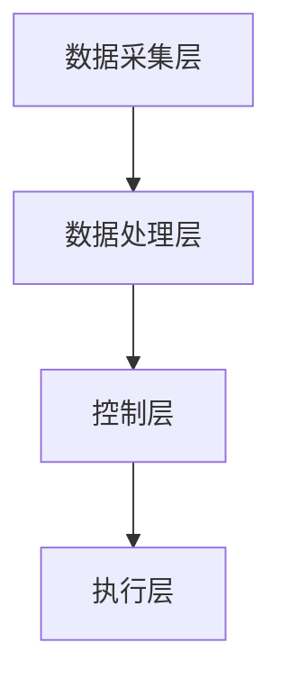

                 


# 价值投资中的智能城市微气候调节系统分析

> 关键词：智能城市、微气候调节系统、价值投资、算法优化、系统架构

> 摘要：本文将详细分析智能城市中微气候调节系统的价值投资潜力。从系统的背景介绍到核心概念，再到算法原理和系统架构，最后结合实际案例进行分析，全面探讨该系统的投资价值和应用场景。

---

## 第一部分：智能城市微气候调节系统概述

### 第1章：微气候调节系统的背景与价值投资潜力

#### 1.1 微气候调节系统的定义与背景

- **微气候调节系统的定义**：微气候调节系统是一种通过智能传感器和自动化设备调节局部气候条件的系统，旨在优化城市环境质量。

- **智能城市中的微气候调节需求**：随着城市化进程的加快，城市热岛效应、空气质量等问题日益突出，微气候调节系统成为解决这些问题的关键技术。

- **价值投资视角下的系统分析**：从投资角度来看，微气候调节系统的建设和运营具有较高的经济效益和社会价值。

---

### 第2章：微气候调节系统的核心要素与功能

#### 2.1 系统的核心要素

- **传感器网络**：用于实时监测环境参数，如温度、湿度、空气质量等。

- **数据处理系统**：对传感器数据进行分析，生成调节指令。

- **控制系统**：根据指令调整调节设备的运行状态。

- **调节设备**：如喷雾装置、通风设备等，用于实际调节气候条件。

#### 2.2 系统的功能模块

- **数据采集模块**：负责收集环境数据。

- **数据分析模块**：对数据进行处理和预测。

- **控制模块**：根据分析结果生成控制指令。

- **执行模块**：实际执行调节操作。

---

## 第二部分：微气候调节系统的算法与数学模型

### 第3章：优化算法在微气候调节中的应用

#### 3.1 遗传算法的原理与应用

- **遗传算法的基本原理**：模拟生物进化过程，通过选择、交叉和变异操作生成优化解。

- **在微气候调节中的应用**：用于优化传感器布置、调节设备控制参数等。

#### 3.2 算法的数学模型

- **适应度函数**：衡量算法输出的优劣，例如：

  $$适应度函数 = \sum_{i=1}^{n} (目标值 - 实际值)^2$$

- **优化过程**：通过迭代优化，找到最优解。

#### 3.3 算法实现的Python代码示例

```python
def fitness(population):
    return sum((x - target) ** 2 for x in population)

def evolve(population):
    # 计算适应度
    fitness = [fitness_function(individual) for individual in population]
    # 选择
    selected = selection(population, fitness)
    # 交叉
    crossed = crossover(selected)
    # 变异
    mutated = mutation(crossed)
    return mutated
```

---

## 第三部分：智能城市微气候调节系统的架构设计

### 第4章：系统架构与交互设计

#### 4.1 系统架构设计

- **分层架构**：包括数据采集层、数据处理层、控制层和执行层。

- **模块化设计**：各功能模块相对独立，便于维护和扩展。

#### 4.2 系统交互设计

- **用户界面**：提供直观的操作界面，方便用户监控和管理。

- **系统接口**：与其他城市管理系统（如交通系统、能源系统）进行数据交互。

#### 4.3 系统架构图



---

## 第四部分：项目实战与案例分析

### 第5章：微气候调节系统的实际应用

#### 5.1 项目环境安装

- **软件环境**：Python 3.8+, 数据库：MySQL, 开发工具：PyCharm。

- **硬件环境**：传感器模块、单片机、网络通信设备。

#### 5.2 系统核心实现代码

```python
import serial
import time

# 传感器数据读取
ser = serial.Serial('COM3', 9600)
data = ser.readline().decode().strip()
ser.close()

# 数据分析与处理
def process_data(data):
    # 数据解析
    pass

# 系统控制
def control_system(command):
    # 发送指令
    pass
```

#### 5.3 案例分析与解读

- **案例背景**：某智能城市试点项目中，微气候调节系统成功降低了局部区域的温度，提升了空气质量。

- **数据分析**：通过传感器数据和系统运行记录，验证系统的实际效果。

---

## 第五部分：总结与扩展

### 第6章：系统的总结与未来展望

#### 6.1 系统的优点与不足

- **优点**：环境改善显著，经济效益和社会效益兼备。

- **不足**：初期投资较大，技术复杂度高。

#### 6.2 未来发展方向

- **智能化升级**：结合AI技术，实现更智能的调节策略。

- **扩展应用**：在更多城市和地区推广，解决更多的环境问题。

#### 6.3 投资建议

- **长期价值**：随着技术进步和市场需求增加，微气候调节系统具有较高的投资价值。

---

## 作者

作者：AI天才研究院/AI Genius Institute & 禅与计算机程序设计艺术 /Zen And The Art of Computer Programming

---

通过以上目录大纲，文章将系统地介绍智能城市微气候调节系统在价值投资中的潜力，涵盖系统的背景、核心概念、算法原理、架构设计和实际应用，为读者提供全面的视角和深入的分析。

