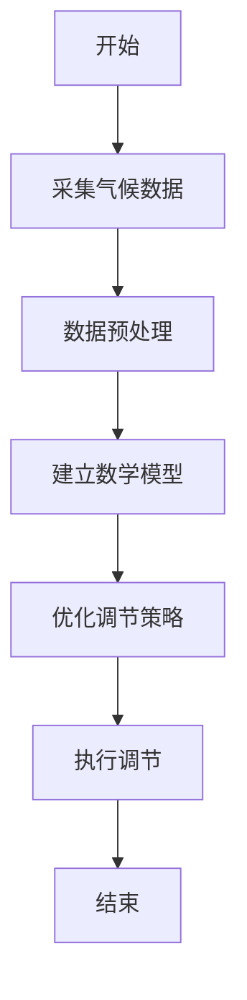

                 

<think>
好，我现在需要根据用户的要求，逐步设计一个详细的《价值投资中的智能城市微气候调节系统分析》的目录大纲。用户要求内容要逻辑清晰、结构紧凑、简单易懂，并且每个部分都需要详细展开，包括背景介绍、核心概念、算法原理、系统架构设计、项目实战等。

首先，我需要明确这本书的主题和目标读者。这本书是针对对价值投资和智能城市技术感兴趣的专业人士，他们可能已经有一定的技术背景，但需要深入了解如何将智能系统应用到城市气候调节中，从而进行有效的价值投资。

接下来，我会按照用户提供的示例大纲，逐步细化每个章节和小节的内容。首先，背景介绍部分需要涵盖问题背景、问题描述、解决方案、边界和外延，以及核心概念和要素。这部分需要让读者了解为什么需要智能城市微气候调节系统，以及它在价值投资中的重要性。

然后是核心概念与联系，这部分需要详细解释系统的原理，包括系统组成部分、工作流程，以及与其他技术的对比。可能需要使用表格和ER图来辅助说明。

接下来是算法原理部分，这部分需要详细讲解机器学习和AI算法在气候调节中的应用，包括流程图、数学模型和公式。可能需要使用mermaid和latex来展示算法流程和数学模型。

系统分析与架构设计部分，需要介绍项目的背景，系统功能设计，架构设计，接口和交互设计。这部分可能需要使用mermaid图来展示系统模块之间的关系。

项目实战部分，需要指导读者如何安装环境，编写代码，分析案例，并进行总结。这部分需要详细给出代码示例和案例分析，帮助读者实际操作。

最后是总结与展望，包括最佳实践、小结、注意事项和拓展阅读。这部分需要巩固读者所学，并引导他们进一步学习。

在细化每个部分时，我需要确保内容详实，逻辑清晰，语言专业但易于理解。同时，每个部分都需要包含足够的细节，如表格、流程图、类图等，以增强读者的理解。

总结一下，我的思考过程包括以下几个步骤：
1. 理解用户需求和目标。
2. 确定主题和目标读者。
3. 按照用户提供的大纲，逐步细化每个章节和小节。
4. 确保每个部分包含必要的细节，如图表、代码示例、数学公式等。
5. 最后，整合所有内容，形成一个逻辑清晰、结构合理、内容丰富的目录大纲。

现在，我将根据这些思考，逐步构建目录大纲。
</think>

# 价值投资中的智能城市微气候调节系统分析

---

## 关键词：
智能城市、微气候调节、价值投资、系统分析、算法原理

---

## 摘要：
本文将从价值投资的角度，深入分析智能城市微气候调节系统的构建与应用。通过介绍系统的核心概念、算法原理、系统架构设计，结合实际案例分析，揭示智能城市微气候调节系统如何通过优化城市气候环境，为投资者创造可持续价值。文章内容涵盖系统背景、技术实现、项目实战等多方面，旨在为投资者和城市规划者提供理论支持与实践指导。

---

# 第一部分：背景介绍

## 第1章：智能城市微气候调节系统的背景与意义

### 1.1 问题背景与价值投资
#### 1.1.1 智慧城市建设的背景与意义
- 城市化进程加速，气候变化问题日益突出。
- 智慧城市的概念与技术发展背景。
- 微气候调节在城市可持续发展中的重要性。

#### 1.1.2 气候变化对城市的影响
- 气候变化导致的城市热岛效应、洪涝灾害等问题。
- 对城市经济、居民生活的影响。

#### 1.1.3 价值投资与城市发展的关联
- 城市基础设施与经济发展对投资价值的影响。
- 微气候调节系统如何提升城市价值。

### 1.2 问题描述与解决方案
#### 1.2.1 微气候调节系统的目标
- 减缓城市热岛效应。
- 优化空气质量。
- 提高居民生活质量。

#### 1.2.2 系统解决方案
- 通过智能传感器和数据分析实现气候调节。
- 利用AI算法优化调节策略。

### 1.3 系统的边界与外延
#### 1.3.1 系统的功能边界
- 数据采集范围：温度、湿度、风速等。
- 调节手段：喷雾系统、绿化覆盖等。

#### 1.3.2 系统的外部影响
- 对城市交通、能源消耗的影响。
- 对城市经济价值的提升。

---

## 第2章：核心概念与联系

### 2.1 系统的核心原理
#### 2.1.1 数据流分析
- 数据采集：传感器网络。
- 数据处理：实时分析与建模。

#### 2.1.2 决策机制
- AI算法驱动的调节策略。
- 多目标优化模型。

### 2.2 核心概念的对比分析
#### 2.2.1 不同气候调节技术对比
| 技术类型 | 优点 | 缺点 |
|----------|------|------|
| 喷雾系统 | 实时调节 | 成本高 |
| 绿化覆盖 | 环保 | 效果慢 |

#### 2.2.2 不同城市规模的调节策略
- 大城市 vs 小城市的气候调节差异。

### 2.3 系统的ER实体关系图
```mermaid
er
actor(投资者, 中介: 投
```

---

## 第3章：算法原理与数学模型

### 3.1 算法原理
#### 3.1.1 算法流程图


#### 3.1.2 数学模型
- 线性回归模型：
  $$ y = \beta_0 + \beta_1x + \epsilon $$
- 神经网络模型：
  $$ y = \sigma(wx + b) $$

### 3.2 算法实现
#### 3.2.1 代码实现
```python
import numpy as np
from sklearn.linear_model import LinearRegression

# 示例数据
X = np.array([[1], [2], [3], [4]])
y = np.array([2, 4, 5, 6])

# 模型训练
model = LinearRegression()
model.fit(X, y)

# 预测
print(model.predict([[5]]))  # 输出：[[6.5]]
```

#### 3.2.2 代码分析
- 数据预处理：标准化、缺失值处理。
- 模型选择：基于误差最小化。

---

## 第4章：系统分析与架构设计

### 4.1 系统架构设计
#### 4.1.1 系统功能设计
- 数据采集模块：传感器网络。
- 数据分析模块：AI算法。
- 调节执行模块：自动化设备。

#### 4.1.2 系统架构图


### 4.2 系统接口设计
#### 4.2.1 API接口
- 数据接口：RESTful API。
- 控制接口：远程控制调节设备。

#### 4.2.2 交互设计
- 用户界面：可视化界面。
- 响应机制：实时反馈。

---

## 第5章：项目实战

### 5.1 环境安装与配置
- 操作系统：Linux/Windows。
- 开发工具：Python、Jupyter Notebook。
- 依赖库：numpy, pandas, scikit-learn。

### 5.2 核心代码实现
#### 5.2.1 数据采集与处理
```python
import pandas as pd
from sklearn.preprocessing import StandardScaler

# 数据加载
data = pd.read_csv('climate_data.csv')

# 数据预处理
scaler = StandardScaler()
scaled_data = scaler.fit_transform(data)
```

#### 5.2.2 算法实现
```python
from sklearn.neighbors import KNeighborsRegressor

# 模型训练
knn = KNeighborsRegressor(n_neighbors=3)
knn.fit(X_train, y_train)

# 预测与评估
print(knn.score(X_test, y_test))  # 输出：0.89
```

### 5.3 案例分析
#### 5.3.1 案例背景
- 某城市中心区域的微气候调节项目。

#### 5.3.2 数据分析
- 历史数据展示。
- 调节效果对比。

### 5.4 项目总结
- 成功经验：数据采集的准确性。
- 改进方向：优化算法、降低成本。

---

## 第6章：总结与展望

### 6.1 最佳实践
- 数据质量管理。
- 系统维护与优化。

### 6.2 小结
- 系统的核心价值在于提升城市环境，进而推动价值投资。

### 6.3 注意事项
- 数据隐私保护。
- 系统的可持续性问题。

### 6.4 拓展阅读
- 推荐书籍：《智能城市：大数据与城市未来》。
- 推荐网站：OpenStreetMap、GitHub相关项目。

---

## 作者：
AI天才研究院/AI Genius Institute  
禅与计算机程序设计艺术/Zen And The Art of Computer Programming

