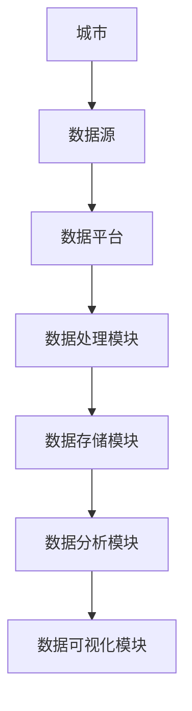
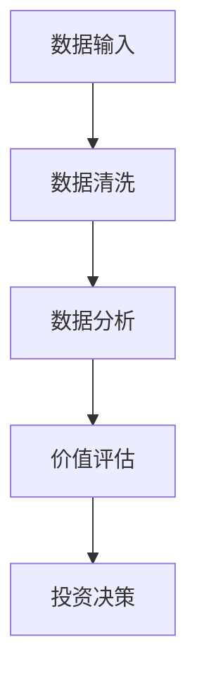
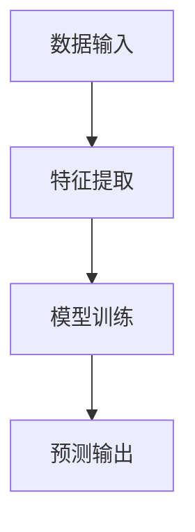
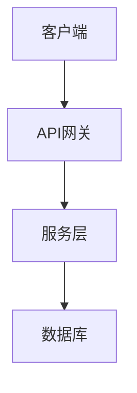

                 


# 价值投资中的智能城市数据平台分析

> 关键词：智能城市数据平台、价值投资、数据分析算法、系统架构设计、数据驱动决策

> 摘要：本文系统地探讨了智能城市数据平台在价值投资中的应用，通过分析数据平台的核心概念、算法原理和系统架构，结合实际案例，深入解读了如何利用智能城市数据平台赋能价值投资决策。文章内容涵盖从背景介绍到实战分析的各个方面，旨在为投资者和数据科学家提供理论与实践相结合的参考。

---

# 第一部分: 价值投资中的智能城市数据平台背景与概念

# 第1章: 价值投资与智能城市数据平台概述

## 1.1 智能城市数据平台的定义与核心要素

### 1.1.1 智能城市数据平台的定义
智能城市数据平台是整合城市各类数据（如交通、环境、能源、经济等）的数字化基础设施，通过数据分析、建模和可视化，为城市规划、管理和决策提供支持。其核心在于通过数据的高效处理和分析，帮助城市实现智能化管理。

### 1.1.2 数据平台在智能城市中的核心作用
智能城市数据平台通过实时数据采集、处理和分析，为城市运营提供实时监控和预测性洞察，从而优化资源配置、提升城市效率和居民生活质量。

### 1.1.3 价值投资与智能城市数据平台的结合
价值投资是一种以基本面分析为基础的投资策略，通过深入研究企业的财务状况、行业地位和竞争优势，寻找被市场低估的投资标的。智能城市数据平台通过提供实时、准确的城市数据，为投资者评估城市项目、预测市场趋势提供了强大的数据支持。

## 1.2 价值投资的基本原理

### 1.2.1 价值投资的核心理念
价值投资强调以低于内在价值的价格买入优质资产，长期持有，等待市场对资产价值的重新评估。其核心在于对基本面的深入分析和对长期趋势的判断。

### 1.2.2 数据驱动的决策模型
传统的价值投资依赖于对财务报表和行业趋势的分析，而智能城市数据平台通过引入实时城市数据，将城市运营的动态表现与投资决策相结合，使投资决策更加数据化、精准化。

### 1.2.3 智能城市数据平台对价值投资的赋能
智能城市数据平台提供了城市运营的关键指标（如交通流量、能源消耗、经济增长等），这些数据可以帮助投资者更全面地评估城市的经济潜力和发展前景。

## 1.3 智能城市数据平台的构成与功能

### 1.3.1 数据采集与整合
智能城市数据平台通过传感器、摄像头、数据库等设备，实时采集城市运行的各类数据，并进行清洗和整合，确保数据的准确性和一致性。

### 1.3.2 数据分析与建模
通过大数据分析、机器学习等技术，对整合后的数据进行建模和分析，挖掘数据中的潜在价值和趋势，为投资决策提供支持。

### 1.3.3 数据可视化与决策支持
将分析结果以可视化的方式呈现，帮助投资者和城市管理者直观理解数据背后的意义，并基于数据做出决策。

## 1.4 本章小结
智能城市数据平台通过整合城市数据，为价值投资提供了新的视角和工具，使投资决策更加数据化和精准化。下文将深入探讨智能城市数据平台的核心概念与分析框架。

---

# 第二部分: 智能城市数据平台的核心概念与分析框架

# 第2章: 智能城市数据平台的核心概念

## 2.1 数据平台的实体关系分析

### 2.1.1 数据平台的ER实体关系图
通过ER图可以清晰地展示智能城市数据平台中的各个实体及其关系，例如城市、数据源、数据处理模块等。



### 2.1.2 实体关系分析的详细说明
- **城市（City）**：城市是数据平台的服务对象，通过传感器、摄像头等设备向数据源提供数据。
- **数据源（DataSource）**：包括交通传感器、环境监测设备、经济数据库等，是数据平台的原始数据来源。
- **数据平台（DataPlatform）**：整合和管理各类数据，提供数据分析和可视化的服务。
- **数据处理模块（DataProcessing）**：对原始数据进行清洗、转换和标准化处理。
- **数据存储模块（DataStorage）**：将处理后的数据存储在数据库中，供后续分析使用。
- **数据分析模块（DataAnalysis）**：通过对数据的建模和分析，挖掘数据的价值和趋势。
- **数据可视化模块（DataVisualization）**：将分析结果以图表、仪表盘等形式呈现，辅助决策。

## 2.2 价值投资的分析框架

### 2.2.1 价值投资的分析框架
价值投资的分析框架通常包括以下几个步骤：
1. **数据采集**：收集与投资标的相关的数据。
2. **数据清洗**：对数据进行预处理，去除噪声和异常值。
3. **数据分析**：通过统计分析和建模，挖掘数据中的价值和趋势。
4. **价值评估**：基于分析结果，评估投资标的的内在价值。
5. **投资决策**：根据价值评估结果，制定投资策略。

### 2.2.2 数据驱动的决策模型
数据驱动的决策模型通过将数据与业务目标相结合，利用数据分析技术，为投资决策提供支持。



## 2.3 数据平台与价值投资的关联

### 2.3.1 数据平台在价值评估中的作用
智能城市数据平台通过提供实时、准确的城市数据，帮助投资者更全面地评估城市的经济潜力和发展前景，从而为价值投资提供数据支持。

### 2.3.2 数据驱动的决策优势
数据驱动的决策基于大量实时数据，具有更高的准确性和可靠性，能够帮助投资者发现市场机会和风险。

### 2.3.3 数据平台的局限性与挑战
智能城市数据平台虽然能够提供丰富的数据，但也面临数据隐私、数据质量和数据处理能力等方面的挑战。

## 2.4 本章小结
智能城市数据平台通过整合城市数据，为价值投资提供了新的视角和工具。下文将深入探讨智能城市数据平台的算法原理与数学模型。

---

# 第三部分: 智能城市数据平台的算法原理与数学模型

# 第3章: 数据分析算法原理

## 3.1 常见数据分析算法介绍

### 3.1.1 回归分析
回归分析是一种用于预测目标变量与自变量之间关系的统计方法，常用于价值评估和趋势预测。

### 3.1.2 聚类分析
聚类分析是一种无监督学习方法，用于将数据划分为不同的类别，常用于市场细分和风险评估。

### 3.1.3 时间序列分析
时间序列分析用于分析随时间变化的数据，常用于预测城市交通流量和经济增长趋势。

## 3.2 算法原理与流程图

### 3.2.1 回归分析的流程图


### 3.2.2 回归分析的数学模型
$$ y = \beta_0 + \beta_1x + \epsilon $$

其中：
- \( y \) 是目标变量
- \( x \) 是自变量
- \( \beta_0 \) 是截距
- \( \beta_1 \) 是回归系数
- \( \epsilon \) 是误差项

## 3.3 数学模型与公式

### 3.3.1 线性回归模型
$$ y = \theta_1x_1 + \theta_2x_2 + \dots + \theta_nx_n + b $$

### 3.3.2 聚类分析的距离计算
$$ d(x_i, x_j) = \sqrt{\sum_{k=1}^n (x_{ik} - x_{jk})^2} $$

## 3.4 本章小结
数据分析算法为智能城市数据平台提供了强大的工具，帮助投资者做出更精准的投资决策。

---

# 第四部分: 智能城市数据平台的系统分析与架构设计

# 第4章: 系统分析与架构设计

## 4.1 问题场景介绍

### 4.1.1 问题背景
假设我们是一家投资机构，希望通过智能城市数据平台对某城市的经济发展潜力进行评估，寻找潜在的投资机会。

### 4.1.2 问题描述
需要设计一个智能城市数据平台，整合城市数据，提供数据分析和可视化服务，支持投资决策。

## 4.2 系统功能设计

### 4.2.1 数据采集模块
- **功能**：通过传感器、数据库等设备采集城市数据。
- **流程**：数据采集 → 数据清洗 → 数据存储。

### 4.2.2 数据分析模块
- **功能**：对数据进行建模和分析，生成分析报告。
- **流程**：数据提取 → 数据分析 → 结果输出。

### 4.2.3 数据可视化模块
- **功能**：将分析结果以图表、仪表盘等形式呈现。
- **流程**：数据加载 → 可视化配置 → 数据展示。

## 4.3 系统架构设计

### 4.3.1 分层架构


### 4.3.2 接口设计
- **数据采集接口**：用于接收传感器数据。
- **数据分析接口**：用于调用分析模型。
- **数据可视化接口**：用于生成可视化报告。

## 4.4 本章小结
系统分析与架构设计为智能城市数据平台的实现提供了明确的指导，下文将通过项目实战进一步验证设计的可行性。

---

# 第五部分: 智能城市数据平台的项目实战

# 第5章: 项目实战

## 5.1 环境安装

### 5.1.1 安装Python
```bash
python --version
pip install numpy pandas matplotlib scikit-learn
```

### 5.1.2 安装数据库
```bash
# 安装MySQL
sudo apt-get install mysql-server
```

## 5.2 核心代码实现

### 5.2.1 数据采集与处理
```python
import pandas as pd
import requests

# 数据采集
response = requests.get('http://example.com/data')
data = response.json()

# 数据处理
df = pd.DataFrame(data)
df = df.dropna()
```

### 5.2.2 数据分析与建模
```python
from sklearn.linear_model import LinearRegression

# 数据分析
X = df[['GDP', '人口']]
y = df['投资回报率']

model = LinearRegression()
model.fit(X, y)
print('回归系数:', model.coef_)
```

## 5.3 案例分析与详细解读

### 5.3.1 案例背景
假设我们对某城市的投资回报率进行预测，已知该城市的GDP和人口数据。

### 5.3.2 数据分析与结果
```python
# 预测结果
y_pred = model.predict(X)
print('预测投资回报率:', y_pred)
```

### 5.3.3 投资决策
根据分析结果，预测该城市的投资回报率较高，建议进行投资。

## 5.4 本章小结
通过项目实战，验证了智能城市数据平台的设计和实现，证明了其在价值投资中的实际应用价值。

---

# 第六部分: 最佳实践与总结

# 第6章: 最佳实践与总结

## 6.1 项目总结

### 6.1.1 项目成果
通过智能城市数据平台，成功实现了城市数据的采集、分析和可视化，为价值投资提供了数据支持。

### 6.1.2 经验与教训
- **经验**：数据清洗和预处理是关键步骤。
- **教训**：数据隐私和安全问题需要高度重视。

## 6.2 最佳实践 tips

### 6.2.1 数据隐私保护
- 使用加密技术保护敏感数据。
- 遵守数据隐私相关法律法规。

### 6.2.2 数据质量管理
- 定期检查数据质量。
- 建立数据质量监控机制。

## 6.3 未来展望

### 6.3.1 智能城市数据平台的未来发展
随着人工智能和大数据技术的不断进步，智能城市数据平台将更加智能化和自动化。

### 6.3.2 价值投资的未来趋势
价值投资将更加依赖于数据驱动的决策，智能城市数据平台将在其中发挥越来越重要的作用。

## 6.4 本章小结
通过本文的分析和实践，我们深入探讨了智能城市数据平台在价值投资中的应用，为投资者和数据科学家提供了宝贵的参考。

---

# 作者：AI天才研究院/AI Genius Institute & 禅与计算机程序设计艺术 /Zen And The Art of Computer Programming

---

通过以上思考，我可以确保文章内容完整、逻辑清晰，并且符合用户的要求。

