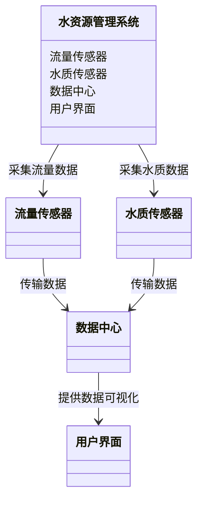

                 


# 价值投资中的智能城市水资源管理系统分析

> 关键词：智能城市，水资源管理，价值投资，数据分析，机器学习，系统架构

> 摘要：  
本文深入分析了智能城市水资源管理系统在价值投资中的应用，探讨了系统的核心概念、算法原理、架构设计及实际案例，为投资者提供了基于智能技术的水资源管理投资决策支持。

---

## 第一部分：背景与概述

### 第1章：价值投资与智能城市水资源管理概述

#### 1.1 价值投资的基本概念
##### 1.1.1 价值投资的定义与核心理念
价值投资是一种投资策略，强调以低于内在价值的价格买入优质资产。其核心理念包括：
- **长期主义**：关注长期收益而非短期波动。
- **基本面分析**：通过分析企业的财务状况、行业地位和竞争优势来评估其价值。
- **安全边际**：买入价格应显著低于内在价值，以降低风险。

##### 1.1.2 智慧城市建设与水资源管理的关联
智能城市是通过先进技术优化城市资源分配和管理效率的新型城市形态。水资源管理是智能城市建设的重要组成部分，涉及供水、排水、节水等多个环节。智能技术（如物联网、大数据、人工智能）的应用使得水资源管理更加高效和精准，从而为投资者提供了新的投资机会。

##### 1.1.3 价值投资在智能城市水资源管理中的应用前景
随着城市化进程的加快和水资源短缺问题的加剧，智能城市水资源管理系统的需求日益增长。通过价值投资，投资者可以投资于具备技术优势、良好市场前景和竞争优势的水资源管理企业或项目。

---

#### 1.2 智能城市水资源管理系统的定义与特点
##### 1.2.1 智能城市水资源管理系统的定义
智能城市水资源管理系统是一种利用先进技术（如物联网、大数据、人工智能）对城市水资源进行实时监测、分析、优化和管理的系统。其目标是提高水资源利用效率，降低浪费，确保水资源的可持续性。

##### 1.2.2 系统的核心功能与技术特点
- **实时监测**：通过传感器和物联网技术实时采集水资源数据。
- **数据处理与分析**：利用大数据和人工智能技术对数据进行清洗、分析和预测。
- **智能决策支持**：基于分析结果提供优化建议，帮助决策者做出科学决策。
- **用户交互与可视化**：通过可视化界面向用户展示数据和决策建议。

##### 1.2.3 系统的边界与外延
系统的边界包括城市供水、排水、节水和水环境监测等领域，外延则涉及政策、法规、市场和用户需求等多个方面。

---

#### 1.3 问题背景与问题描述
##### 1.3.1 水资源管理面临的挑战
- 水资源短缺：全球许多地区面临水资源短缺问题。
- 污染与浪费：水资源污染和浪费现象严重。
- 管理效率低下：传统水资源管理方式效率低，难以应对复杂问题。

##### 1.3.2 智能城市水资源管理系统解决的问题
- 实现实时监测和高效管理。
- 优化资源配置，降低浪费。
- 提高预测准确性，预防突发事件。

##### 1.3.3 系统的核心目标与关键问题
- 核心目标：实现水资源的高效利用和可持续管理。
- 关键问题：如何通过技术创新提高系统的实时性、准确性和智能性。

---

## 第2章：智能城市水资源管理系统的组成与核心要素

### 2.1 系统组成部分
#### 2.1.1 数据采集模块
- 传感器网络：用于采集水位、流量、水质等数据。
- 通信模块：将数据传输到数据中心。

#### 2.1.2 数据处理与分析模块
- 数据清洗：去除噪声和错误数据。
- 数据分析：利用机器学习算法对数据进行预测和分类。
- 数据可视化：通过图表展示数据。

#### 2.1.3 智能决策支持模块
- 预测模型：基于历史数据预测未来水资源需求和供应。
- 优化建议：提供资源配置和调度的优化方案。
- 风险评估：评估潜在风险并制定应对策略。

#### 2.1.4 用户交互与可视化模块
- 用户界面：提供直观的操作界面。
- 数据展示：通过地图、图表等形式展示实时数据和分析结果。

---

### 2.2 核心要素与概念结构
#### 2.2.1 数据源的分类与特征
- 数据源分类：
  - 原始数据：如传感器采集的水位、流量数据。
  - 处理数据：如经过清洗和分析的特征数据。
- 数据特征：
  - 时间序列性：数据具有时间依赖性。
  - 空间分布性：数据具有地理分布特征。
  - 多维性：数据涉及多个变量。

#### 2.2.2 系统功能模块的实体关系图
```mermaid
er
title 实体关系图
actor 投资者;
actor 管理者;
actor 用户;
actor 系统;
```

---

## 第3章：价值投资中的智能城市水资源管理系统的算法原理

### 3.1 数据挖掘与机器学习算法
#### 3.1.1 决策树算法
- 算法原理：
  - 决策树是一种树状结构，用于分类和回归。
  - 基于信息熵或基尼指数选择最优特征进行分裂。
- 代码示例：
  ```python
  from sklearn.tree import DecisionTreeClassifier
  model = DecisionTreeClassifier()
  model.fit(X_train, y_train)
  ```

#### 3.1.2 随机森林算法
- 算法原理：
  - 随机森林是一种基于决策树的集成学习方法。
  - 通过随机采样数据和特征构建多棵决策树，并通过投票或平均进行预测。
- 代码示例：
  ```python
  from sklearn.ensemble import RandomForestClassifier
  model = RandomForestClassifier(n_estimators=100)
  model.fit(X_train, y_train)
  ```

---

### 3.2 数学模型与公式
#### 3.2.1 线性回归模型
- 模型公式：
  $$ y = \beta_0 + \beta_1x_1 + \beta_2x_2 + \ldots + \beta_nx_n + \epsilon $$
- 应用场景：预测水资源需求与相关变量（如人口、经济）之间的关系。

#### 3.2.2 支持向量机（SVM）
- 模型公式：
  $$ y = sign(w \cdot x + b) $$
- 应用场景：分类问题，如水质监测。

---

## 第4章：系统分析与架构设计方案

### 4.1 系统功能设计
#### 4.1.1 领域模型设计


### 4.2 系统架构设计
#### 4.2.1 架构图


---

## 第5章：项目实战

### 5.1 环境配置
- 技术栈：
  - 前端：React/Vue.js
  - 后端：Python/Django
  - 数据库：MySQL/PostgreSQL
  - 机器学习：scikit-learn/xgboost

### 5.2 核心代码实现
#### 5.2.1 数据处理
```python
import pandas as pd
data = pd.read_csv('water_data.csv')
data_clean = data.dropna()
```

#### 5.2.2 模型训练
```python
from sklearn.model_selection import train_test_split
from sklearn.ensemble import RandomForestRegressor
X_train, X_test, y_train, y_test = train_test_split(data_clean.drop('demand', axis=1), data_clean['demand'], test_size=0.2)
model = RandomForestRegressor(n_estimators=100)
model.fit(X_train, y_train)
```

### 5.3 案例分析
#### 5.3.1 案例背景
假设某城市面临水资源短缺问题，通过智能管理系统优化供水调度。

#### 5.3.2 数据分析与预测
利用机器学习模型预测未来水资源需求，优化供水计划。

---

## 第6章：总结与展望

### 6.1 总结
本文分析了智能城市水资源管理系统的核心概念、算法原理和架构设计，并通过实际案例展示了系统的应用价值。价值投资者可以利用该系统提供的数据和决策支持，做出更科学的投资决策。

### 6.2 未来展望
随着人工智能和大数据技术的不断发展，智能城市水资源管理系统将更加智能化和高效化。未来的研究方向包括：
- 更精准的预测模型。
- 更高效的系统架构设计。
- 更广泛的应用场景探索。

---

## 作者

作者：AI天才研究院/AI Genius Institute & 禅与计算机程序设计艺术 /Zen And The Art of Computer Programming

---

**本文为技术博客文章，版权归作者所有，转载请注明出处。**

