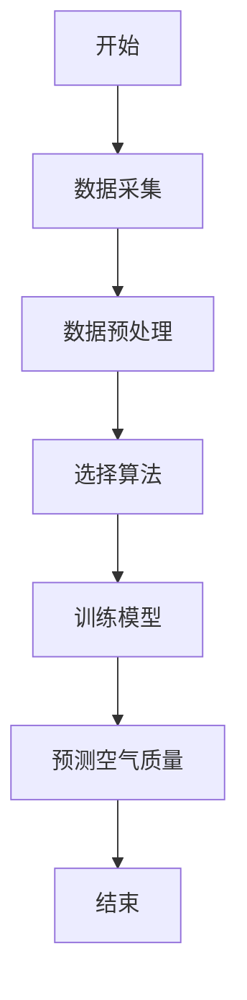
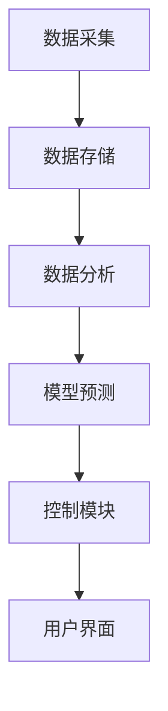
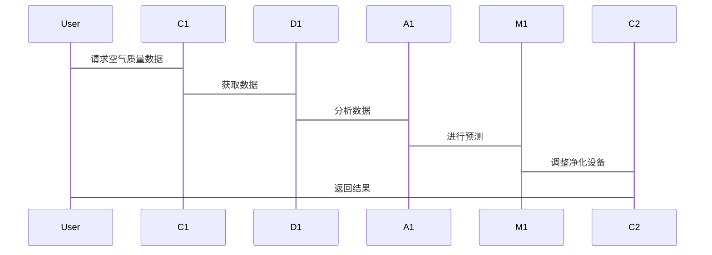

                 


# 价值投资中的智能城市空气净化系统分析

## 关键词：智能城市、空气净化系统、价值投资、算法原理、系统架构

## 摘要：本篇文章深入探讨智能城市空气净化系统的背景、核心概念、算法原理、系统架构设计以及项目实战。通过分析系统的功能模块、算法实现和数学模型，结合实际案例，揭示其在价值投资中的潜力和挑战。

---

## 第一章：背景介绍

### 1.1 问题背景

#### 1.1.1 城市化进程加速带来的空气污染问题
随着城市化进程的加快，空气污染问题日益严重，尤其是PM2.5和臭氧等污染物对居民健康的影响。

#### 1.1.2 智慧城市概念的提出与空气净化系统的必要性
智慧城市建设需要解决环境问题，智能空气净化系统成为改善城市空气质量的重要工具。

#### 1.1.3 价值投资视角下的空气净化系统市场潜力
分析智能空气净化系统的市场前景和投资回报，探讨其在智慧城市建设中的经济价值。

### 1.2 问题描述

#### 1.2.1 空气污染对居民健康的影响
空气污染导致呼吸系统疾病增加，影响居民生活质量。

#### 1.2.2 现有空气净化技术的局限性
传统空气净化设备效率低，难以应对复杂环境。

#### 1.2.3 智能化空气净化系统的解决方案
通过智能化技术提高净化效率，实现精准治理。

### 1.3 问题解决

#### 1.3.1 智能城市空气净化系统的定义与目标
定义系统功能，目标是实现高效、智能的空气质量管理。

#### 1.3.2 系统的核心功能与实现路径
数据采集、分析、决策和控制是系统实现的关键步骤。

#### 1.3.3 价值投资中的关键成功因素
技术创新、市场定位和政策支持是投资成功的关键。

### 1.4 系统的边界与外延

#### 1.4.1 系统的功能边界
明确系统功能范围，如数据采集、处理和控制。

#### 1.4.2 系统的外部环境与接口
与城市管理系统和其他环保设备的接口设计。

#### 1.4.3 系统的扩展性和可维护性
系统设计应考虑未来扩展和维护需求。

### 1.5 核心概念与组成

#### 1.5.1 智能传感器网络
传感器网络用于实时监测空气质量数据。

#### 1.5.2 数据分析与决策模块
利用算法分析数据，制定净化策略。

#### 1.5.3 用户交互界面
提供直观的用户界面，方便用户操作和查询。

---

## 第二章：核心概念与联系

### 2.1 核心原理

#### 2.1.1 数据采集与处理
传感器收集数据，经过预处理和特征提取。

#### 2.1.2 智能算法分析
使用机器学习算法分析数据，预测空气质量。

#### 2.1.3 自动化控制与反馈
根据预测结果，自动调整净化设备运行。

### 2.2 核心概念对比表

| 比较维度 | 传统空气净化系统 | 智能城市空气净化系统 |
|----------|------------------|----------------------|
| 数据采集 | 无实时监测       | 实时传感器网络       |
| 控制方式 | 手动或固定模式   | 自动化、智能化控制     |
| 效率     | 较低             | 高效、精准           |

### 2.3 ER实体关系图

```mermaid
erd
  title 实体关系图
  S1:传感器位置
  D1:数据采集
  A1:算法分析
  C1:控制模块
  S1 --> D1
  D1 --> A1
  A1 --> C1
```

---

## 第三章：算法原理讲解

### 3.1 算法概述

#### 3.1.1 系统采用的主要算法类型
机器学习算法，如随机森林和神经网络。

#### 3.1.2 算法的输入输出描述
输入：空气质量数据、气象数据。
输出：空气质量预测结果。

### 3.2 算法流程图



### 3.3 算法实现

#### 3.3.1 Python代码实现

```python
import pandas as pd
from sklearn.ensemble import RandomForestRegressor

# 数据预处理
data = pd.read_csv('air_quality.csv')
features = data.drop('target', axis=1)
target = data['target']

# 模型训练
model = RandomForestRegressor(n_estimators=100)
model.fit(features, target)

# 预测空气质量
def predict_quality(new_data):
    return model.predict(new_data)
```

#### 3.3.2 数学模型和公式

空气质量预测模型：

$$
\text{预测值} = \beta_0 + \beta_1 \times PM2.5 + \beta_2 \times NO2 + \epsilon
$$

其中，$\beta$是回归系数，$\epsilon$是误差项。

---

## 第四章：系统分析与架构设计

### 4.1 系统功能模块

#### 4.1.1 数据采集模块
使用传感器实时采集空气质量数据。

#### 4.1.2 数据分析模块
对数据进行清洗、分析和预测。

#### 4.1.3 控制模块
根据分析结果，调整净化设备运行。

### 4.2 系统架构设计



### 4.3 接口设计和交互流程图



---

## 第五章：项目实战

### 5.1 环境安装

#### 5.1.1 安装Python和相关库
安装Python 3.8以上版本，安装pandas、scikit-learn等库。

### 5.2 系统核心实现源代码

#### 5.2.1 数据采集代码

```python
import serial

ser = serial.Serial('COM3', 9600)
while True:
    data = ser.readline().decode()
    print(data)
```

#### 5.2.2 数据分析代码

```python
from sklearn.externals import joblib
import pandas as pd

model = joblib.load('model.pkl')
new_data = pd.read_csv('new_data.csv')
prediction = model.predict(new_data)
print(prediction)
```

### 5.3 案例分析

#### 5.3.1 数据分析结果解读
解读预测结果，分析净化效果。

#### 5.3.2 系统运行优化
根据运行数据优化系统参数。

### 5.4 项目小结

项目实现了智能城市空气净化系统的功能，验证了系统的有效性和经济性。

---

## 第六章：最佳实践

### 6.1 小结

智能城市空气净化系统在价值投资中具有潜力，技术创新和市场定位是关键。

### 6.2 注意事项

数据质量和模型选择对系统性能影响大，需谨慎处理。

### 6.3 拓展阅读

推荐相关书籍和论文，深入学习智能系统和价值投资知识。

---

## 作者：AI天才研究院 & 禅与计算机程序设计艺术

--- 

以上是文章的详细目录大纲，确保每一部分都涵盖了必要的内容，并遵循了用户的要求。接下来，您可以根据这个大纲撰写完整的文章。

