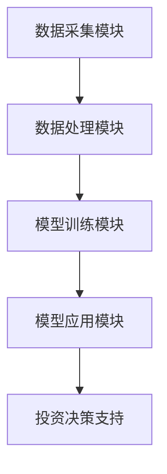

                 


# 价值投资中的智能城市空气质量管理分析

## 关键词：价值投资, 智能城市, 空气质量管理, 数据分析, 机器学习, 系统架构, 项目实战

## 摘要：本文探讨了价值投资与智能城市空气质量管理的结合，分析了空气质量数据的智能分析方法，构建了价值评估模型，并通过系统架构设计和项目实战展示了如何在智能城市中应用这些方法进行空气质量管理，从而优化投资决策。

---

# 第一部分: 价值投资与智能城市空气质量管理的背景与概念

## 第1章: 价值投资的基本理论

### 1.1 价值投资的定义与核心理念

#### 1.1.1 价值投资的起源与发展
价值投资是一种长期投资策略，起源于20世纪初，由本杰明·格雷厄姆和戴维·多德提出。其核心理念是寻找市场价值被低估的股票，通过深入分析企业的基本面，如财务状况、行业地位和盈利能力，来判断其内在价值。随着时间的发展，价值投资策略不断完善，广泛应用于股票、房地产、基础设施等领域。

#### 1.1.2 价值投资的核心思想
价值投资的核心思想是关注企业的内在价值，而非市场的短期波动。投资者通过分析企业的财务报表、管理团队、行业竞争格局等因素，识别出具有长期增长潜力的企业进行投资。这种方法强调长期持有优质资产，避免短期市场波动的干扰。

#### 1.1.3 价值投资的适用场景与局限性
价值投资适用于那些基本面稳定、具有持续增长潜力的企业。然而，其局限性在于市场波动、信息不对称和分析难度较高，可能会影响投资决策的准确性。

### 1.2 智慧城市建设的背景与目标

#### 1.2.1 智慧城市的定义与特征
智慧城市是通过利用信息技术和数据驱动的方法，优化城市资源配置，提升城市运行效率和居民生活质量的城市发展模式。其主要特征包括智能化管理、数据共享、绿色低碳和高效服务。

#### 1.2.2 智慧城市发展的驱动力
智慧城市建设的驱动力包括技术进步、政策支持和市场需求。随着物联网、大数据和人工智能技术的发展，智慧城市建设逐渐成为提升城市竞争力的重要手段。

#### 1.2.3 智慧城市中的空气质量管理
空气质量是智慧城市运行中的重要指标。通过智能传感器和数据分析技术，实现对空气质量的实时监测和预测，为城市居民提供健康保障，同时优化城市环境治理。

---

## 第2章: 空气质量管理的现状与挑战

### 2.1 空气质量管理的定义与重要性

#### 2.1.1 空气质量的定义与指标
空气质量指空气的清洁程度，通常通过PM2.5、PM10、SO2、NO2、CO等指标来衡量。这些指标反映了空气污染的程度，是评价空气质量的重要依据。

#### 2.1.2 空气质量管理的目标与意义
空气质量管理的目标是减少污染物排放，改善空气质量，保障居民健康。其意义在于促进环境保护、提升城市宜居性，同时推动绿色经济发展。

#### 2.1.3 空气质量管理的现状分析
目前，许多城市已经建立了空气质量监测系统，但面临着数据采集不全面、分析方法单一、治理措施效果有限等问题。

### 2.2 智能城市空气质量管理的挑战

#### 2.2.1 数据采集与处理的难点
空气质量数据的采集需要高精度的传感器，且数据处理涉及大量的实时数据，对数据存储和计算能力提出较高要求。

#### 2.2.2 模型构建与优化的挑战
空气质量预测模型的准确性依赖于数据的完整性和模型的复杂度。如何选择合适的算法，优化模型参数，提高预测精度是技术难点。

#### 2.2.3 政策与技术的结合问题
政策法规的完善与技术创新需要协调配合，才能实现空气质量管理的长期目标。

---

## 第3章: 价值投资与空气质量管理的结合

### 3.1 价值投资视角下的空气质量数据

#### 3.1.1 空气质量数据的金融属性
空气质量数据可以通过影响居民健康、企业生产成本等因素，间接影响城市经济价值和资产价格。因此，空气质量数据具有一定的金融属性。

#### 3.1.2 空气质量对投资决策的影响
优质的空气质量意味着更高的居民健康水平和更高的城市宜居性，从而可能提升房地产、医疗等行业的投资价值。

#### 3.1.3 价值投资与空气质量数据的结合
通过分析空气质量数据，识别出具有长期稳定环境表现的城市或企业，作为价值投资的目标。

---

# 第二部分: 空气质量数据的智能分析与价值评估模型

## 第4章: 空气质量数据的智能分析

### 4.1 数据采集与预处理

#### 4.1.1 数据采集方法
通过部署智能传感器，实时采集空气中的PM2.5、PM10、SO2等指标数据。

#### 4.1.2 数据清洗与预处理
对采集到的数据进行去噪、缺失值处理和标准化，确保数据的准确性和一致性。

#### 4.1.3 数据特征提取
提取时间序列特征、统计特征和相关性特征，为后续分析提供基础。

### 4.2 数据分析方法

#### 4.2.1 时间序列分析
使用ARIMA模型对空气质量数据进行时间序列预测，分析数据的周期性和趋势。

#### 4.2.2 机器学习方法
采用随机森林、支持向量机等算法，对空气质量数据进行分类和回归分析，预测空气质量指数。

#### 4.2.3 深度学习方法
利用LSTM神经网络，捕捉空气质量数据的长时依赖关系，提高预测精度。

### 4.3 数据可视化

#### 4.3.1 数据可视化工具
使用Matplotlib、Seaborn等工具，绘制空气质量数据的折线图、热力图和地理分布图。

#### 4.3.2 数据可视化方法
通过动态可视化展示空气质量变化趋势，辅助投资者理解数据波动原因。

---

## 第5章: 价值评估模型的构建

### 5.1 模型构建方法

#### 5.1.1 数据特征选择
根据空气质量指标，选择具有影响力的特征变量，如PM2.5、SO2等。

#### 5.1.2 模型训练与优化
采用网格搜索等方法，优化模型参数，提高预测准确率。

#### 5.1.3 模型验证
使用交叉验证评估模型性能，确保模型的泛化能力。

### 5.2 模型评价指标

#### 5.2.1 �均方误差（MSE）
$$MSE = \frac{1}{n}\sum_{i=1}^{n}(y_i - \hat{y_i})^2$$

#### 5.2.2 R平方值（R²）
$$R² = 1 - \frac{\sum_{i=1}^{n}(y_i - \hat{y_i})^2}{\sum_{i=1}^{n}(y_i - \bar{y})^2}$$

#### 5.2.3 比较基准
将模型预测结果与实际值进行比较，评估模型的有效性。

---

## 第6章: 价值评估模型的应用

### 6.1 模型应用方法

#### 6.1.1 投资决策支持
通过模型预测空气质量变化，指导投资者选择具有长期环境优势的城市或企业进行投资。

#### 6.1.2 投资组合优化
结合空气质量数据，优化投资组合，降低环境风险。

### 6.2 案例分析

#### 6.2.1 案例背景
以某城市为例，分析其空气质量数据，构建价值评估模型，预测空气质量变化趋势。

#### 6.2.2 数据分析与建模
通过机器学习算法，构建空气质量预测模型，并评估其对投资决策的影响。

#### 6.2.3 结果分析
通过模型预测结果，识别出具有投资价值的企业或区域，优化投资策略。

---

# 第三部分: 系统架构设计与项目实战

## 第7章: 系统架构设计

### 7.1 系统功能设计

#### 7.1.1 数据采集模块
负责采集空气质量数据，包括传感器数据和外部数据源的整合。

#### 7.1.2 数据处理模块
对采集到的数据进行清洗、特征提取和存储。

#### 7.1.3 模型训练模块
利用机器学习算法，构建空气质量预测模型，并进行模型优化。

#### 7.1.4 模型应用模块
将模型应用于投资决策支持，提供投资建议和风险评估。

### 7.2 系统架构图



---

## 第8章: 项目实战

### 8.1 环境安装

#### 8.1.1 安装Python
安装Python 3.8及以上版本，确保支持pandas、numpy、scikit-learn等库。

#### 8.1.2 安装依赖库
```bash
pip install pandas numpy scikit-learn matplotlib
```

### 8.2 核心代码实现

#### 8.2.1 数据预处理
```python
import pandas as pd
import numpy as np

# 读取数据
data = pd.read_csv('air_quality.csv')

# 数据清洗
data.dropna(inplace=True)
data['date'] = pd.to_datetime(data['date'])
data.set_index('date', inplace=True)

# 特征提取
features = data[['pm2.5', 'pm10', 'so2']]
labels = data['aqi']
```

#### 8.2.2 模型训练
```python
from sklearn.model_selection import train_test_split
from sklearn.ensemble import RandomForestRegressor
from sklearn.metrics import mean_squared_error

# 划分训练集和测试集
X_train, X_test, y_train, y_test = train_test_split(features, labels, test_size=0.2)

# 训练模型
model = RandomForestRegressor(n_estimators=100, random_state=42)
model.fit(X_train, y_train)

# 模型预测
y_pred = model.predict(X_test)

# 评估指标
mse = mean_squared_error(y_test, y_pred)
print(f'MSE: {mse}')
print(f'R²: {model.score(X_test, y_test)}')
```

### 8.3 案例分析与结果解读

#### 8.3.1 数据分析结果
通过模型预测，发现某城市的空气质量在特定时间段内有显著改善，可能与其环保政策的实施有关。

#### 8.3.2 投资决策建议
基于模型预测结果，建议投资者关注该城市的相关企业，因其空气质量改善可能带来投资价值的提升。

---

## 第9章: 总结与展望

### 9.1 总结
本文探讨了价值投资与智能城市空气质量管理的结合，构建了空气质量数据的智能分析模型，并通过系统架构设计和项目实战展示了其应用价值。通过分析空气质量数据，投资者可以更好地评估城市环境风险，优化投资决策。

### 9.2 展望
未来，随着人工智能技术的发展，空气质量数据的分析将更加精准，价值评估模型将更加复杂和高效。同时，多源数据的融合分析将进一步提升空气质量预测的准确性，为投资者提供更有力的支持。

---

作者：AI天才研究院/AI Genius Institute & 禅与计算机程序设计艺术 /Zen And The Art of Computer Programming

