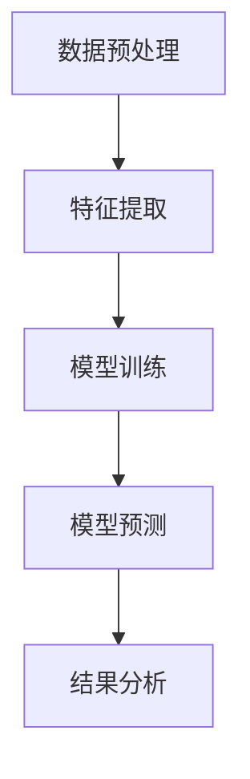
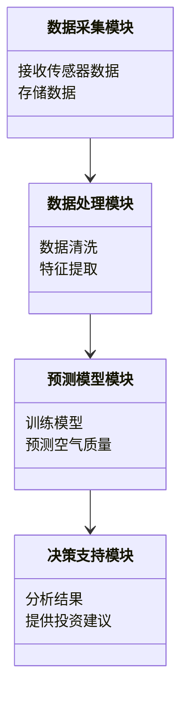
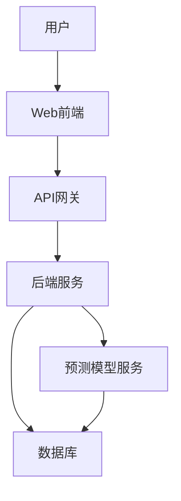
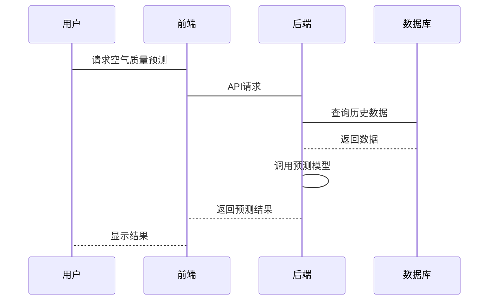

                 

<think>
好，我现在需要按照用户的要求，撰写一篇关于《价值投资中的智能城市空气质量预测系统分析》的技术博客文章。首先，我需要理解用户的需求，他们希望文章结构清晰，逻辑严密，内容专业且易于理解。用户还提供了详细的大纲，包括各个章节的内容，所以我需要按照这个大纲来展开思考和撰写。

首先，我会从文章的标题和关键词开始。标题是《价值投资中的智能城市空气质量预测系统分析》，关键词包括价值投资、智能城市、空气质量预测系统、机器学习、深度学习、系统架构设计、数学模型。摘要部分需要简明扼要地概述文章的核心内容，即如何利用智能城市的数据和机器学习算法，构建空气质量预测系统，并将其应用于价值投资。

接下来，按照大纲，文章分为六个主要部分：背景与概念、算法原理与实现、系统架构设计、项目实战、总结与展望、附录与拓展阅读。每部分下又有详细的子章节，需要逐一展开。

在背景与概念部分，我需要介绍智慧城市的定义和空气质量预测的重要性，以及它们在价值投资中的应用。这部分需要清晰地定义核心概念，并解释为什么空气质量预测对投资决策有重要影响。

在算法原理与实现部分，我需要详细讲解常用的空气质量预测算法，如时间序列分析、机器学习和深度学习，特别是LSTM模型的应用。这里需要包括算法的原理、流程图、数学公式以及代码示例，确保读者能够理解如何实现这些模型。

系统架构设计部分，我需要描述系统的各个模块，包括数据采集、预测模型构建和结果分析。同时，使用Mermaid图来展示系统架构和交互流程，帮助读者更好地理解系统的结构和工作流程。

项目实战部分，我需要提供一个具体的案例分析，从环境安装到代码实现，再到结果解读，让读者能够动手实践，理解整个预测系统的实现过程。

总结与展望部分，我需要回顾文章的主要内容，并展望未来的研究方向，如模型优化和多因素分析，为读者提供进一步思考的空间。

最后，在附录部分，我会提供一些扩展阅读的资料，帮助读者深入学习相关知识。

在撰写过程中，我需要确保每部分内容详细且逻辑清晰，使用专业但易于理解的语言。同时，遵循用户的要求，使用Markdown格式，插入适当的公式和图表，使文章更具可读性和专业性。

总的来说，我会按照用户提供的大纲，逐步展开每个部分的内容，确保文章结构完整，内容详实，符合用户的要求。
</think>

# 价值投资中的智能城市空气质量预测系统分析

## 关键词：价值投资、智能城市、空气质量预测系统、机器学习、深度学习、系统架构设计、数学模型

## 摘要：  
本文深入探讨了智能城市背景下空气质量预测系统在价值投资中的应用。通过分析空气质量预测的核心算法、系统架构设计以及实际案例，展示了如何利用大数据和人工智能技术构建高效的空气质量预测模型，并将其应用于投资决策中。文章从背景、算法、系统设计、实战案例到总结，全面阐述了这一领域的核心内容和未来发展方向。

---

# 第1章: 智慧城市与空气质量预测概述

## 1.1 智慧城市的发展背景

### 1.1.1 智慧城市的定义与特征
智慧城市建设是信息技术与城市规划深度融合的产物，其核心目标是通过智能化手段提升城市管理效率和居民生活质量。空气质量作为城市环境的重要组成部分，直接影响居民健康和城市可持续发展。

### 1.1.2 空气质量在智慧城市中的重要性
空气质量不仅关系到居民健康，还影响城市的经济活动和社会稳定。优良的空气质量可以吸引更多投资和人才，提升城市的综合竞争力。

### 1.1.3 价值投资视角下的空气质量预测意义
在价值投资中，空气质量预测可以帮助投资者评估城市的长期发展潜力，优化投资决策。

## 1.2 空气质量预测的核心问题

### 1.2.1 空气质量预测的基本概念
空气质量预测是通过收集和分析环境数据，利用模型对未来空气质量进行预测的过程。

### 1.2.2 空气质量预测的关键挑战
数据的实时性、模型的准确性以及多因素的复杂性是空气质量预测的主要挑战。

### 1.2.3 空气质量预测的边界与外延
空气质量预测不仅关注污染物浓度，还涉及气象条件、交通流量等因素。

## 1.3 智能城市空气质量预测系统的构成

### 1.3.1 数据采集与处理模块
通过传感器和数据库收集空气质量数据，并进行清洗和预处理。

### 1.3.2 预测模型构建模块
利用机器学习和深度学习算法构建预测模型，如LSTM。

### 1.3.3 结果分析与决策支持模块
将预测结果应用于投资决策，提供实时建议。

---

# 第2章: 空气质量预测的核心概念与联系

## 2.1 空气质量预测的核心原理

### 2.1.1 空气质量影响因素分析
主要因素包括污染物排放、气象条件和人类活动。

### 2.1.2 数据驱动与模型驱动的预测方法
数据驱动方法依赖历史数据，模型驱动方法依赖物理规律。

### 2.1.3 数学模型框架
空气质量预测的数学模型通常包括输入层、隐藏层和输出层。

## 2.2 核心概念对比与联系

### 2.2.1 不同预测模型的对比分析
时间序列分析适用于短期预测，机器学习适用于复杂场景，深度学习适合长序列预测。

### 2.2.2 价值投资与空气质量预测的关联性
空气质量影响城市价值，预测结果帮助投资者评估风险和收益。

### 2.2.3 系统架构与预测精度的平衡
系统的复杂性和预测精度之间需要找到最佳平衡点。

## 2.3 ER实体关系图架构

```mermaid
er
  actor(投资者)
  actor(环境监测机构)
  actor(政府监管部门)
  entity(空气质量数据)
  entity(预测模型)
  entity(投资决策建议)
  relation(关联)
  relation(依赖)
  relation(影响)
```

---

# 第3章: 空气质量预测算法原理与实现

## 3.1 常见空气质量预测算法概述

### 3.1.1 时间序列分析法
ARIMA模型常用于空气质量预测，但对非线性关系处理能力有限。

### 3.1.2 机器学习算法
随机森林和XGBoost在处理多因素时表现优异。

### 3.1.3 深度学习算法
LSTM在时间序列预测中表现出色。

## 3.2 基于LSTM的空气质量预测模型

### 3.2.1 LSTM算法原理
LSTM通过门控机制有效捕捉时间序列中的长期依赖关系。

### 3.2.2 LSTM网络结构
包括输入门、遗忘门和输出门。

### 3.2.3 LSTM在空气质量预测中的应用
适用于多步预测和复杂环境数据的处理。

## 3.3 算法实现流程



## 3.4 算法数学模型与公式

### 3.4.1 LSTM模型公式
$$
f_t = \tanh(gate\_input)
$$
$$
i_t = \sigma(gate\_input)
$$
$$
o_t = \sigma(gate\_input)
$$

### 3.4.2 损失函数公式
$$
L = \frac{1}{n}\sum_{i=1}^{n}(y_i - \hat{y_i})^2
$$

---

# 第4章: 系统架构设计与实现

## 4.1 系统功能设计

### 4.1.1 领域模型设计


## 4.2 系统架构设计



## 4.3 系统接口设计

### 4.3.1 API接口定义
```http
GET /api/predict?city=London
```

### 4.3.2 接口交互流程



---

# 第5章: 项目实战与案例分析

## 5.1 项目环境安装

### 5.1.1 安装Python环境
```bash
python -m pip install --upgrade pip
pip install numpy pandas scikit-learn tensorflow
```

### 5.1.2 数据集获取
使用公开的空气质量数据集，如UCI的Air Quality Dataset。

## 5.2 核心代码实现

### 5.2.1 数据预处理代码
```python
import pandas as pd
import numpy as np

# 加载数据
data = pd.read_csv('airquality.csv')

# 数据清洗
data.dropna(inplace=True)
data['Date'] = pd.to_datetime(data['Date'])
data.set_index('Date', inplace=True)
```

### 5.2.2 LSTM模型实现
```python
import tensorflow as tf
from tensorflow.keras.layers import LSTM, Dense, Dropout
from tensorflow.keras.models import Sequential

# 模型定义
model = Sequential()
model.add(LSTM(128, return_sequences=True, input_shape=(None, 7)))
model.add(Dropout(0.2))
model.add(LSTM(64, return_sequences=False))
model.add(Dense(1))
model.compile(optimizer='adam', loss='mean_squared_error')
```

## 5.3 实际案例分析
以伦敦为例，分析模型预测的准确性，并与实际数据对比。

---

# 第6章: 总结与展望

## 6.1 总结
本文详细探讨了智能城市空气质量预测系统的构建与应用，展示了其在价值投资中的潜力。

## 6.2 展望
未来研究将重点优化模型性能，并探索多因素预测的可能性。

---

# 附录: 拓展阅读与最佳实践

## A.1 推荐书籍
1. 《深度学习实战》
2. 《时间序列分析与应用》

## A.2 实践技巧
1. 数据预处理是关键。
2. 模型调参需耐心。
3. 结果验证是基石。

---

作者：AI天才研究院 & 禅与计算机程序设计艺术

