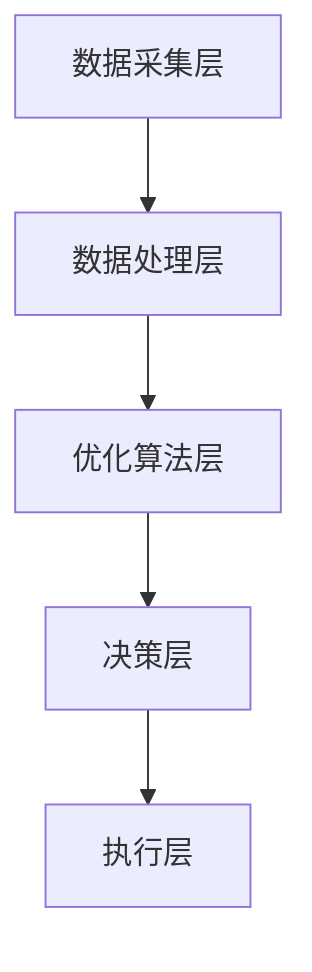
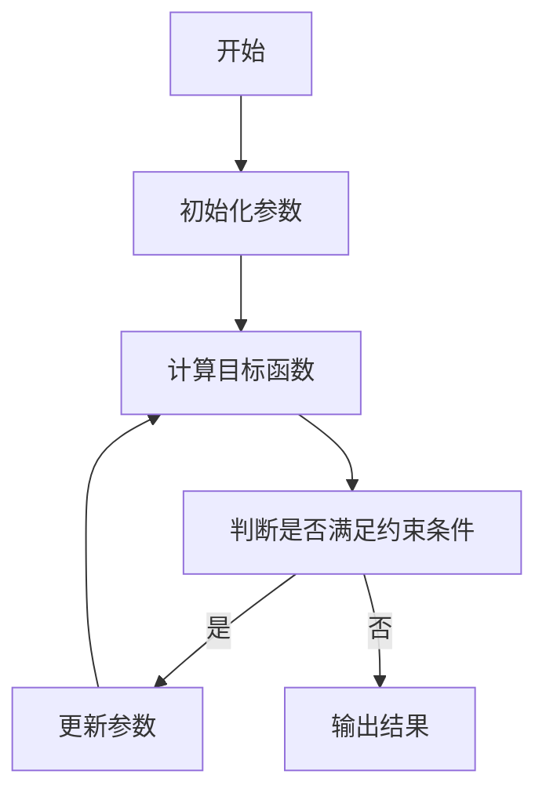

                 


# 价值投资中的智能城市能源管理系统分析

---

## 关键词：价值投资、智能城市、能源管理系统、优化算法、数学模型、系统架构、项目实战

---

## 摘要：  
本文深入分析了价值投资在智能城市能源管理系统中的应用与优化，探讨了如何通过技术手段提升能源管理效率，从而为投资者提供更科学的决策依据。文章从背景介绍、核心概念、算法原理、系统架构、项目实战等多角度展开，结合实际案例和数学模型，详细阐述了智能城市能源管理系统的优化方法及其对投资决策的深远影响。

---

# 第一部分: 价值投资与智能城市能源管理系统的背景与概念

## 第1章: 智慧城市能源管理系统的背景介绍

### 1.1 智慧城市能源管理系统的概念与特点  
#### 1.1.1 智慧城市能源管理系统的定义  
智慧城市能源管理系统（Smart City Energy Management System, SCEMS）是一种通过智能传感器、大数据分析和优化算法，实现城市能源资源高效配置和管理的系统。  

#### 1.1.2 智慧城市能源管理系统的属性特征对比表格  
| 特性         | 传统能源管理 | 智慧能源管理 |
|--------------|-------------|-------------|
| 数据来源     | 单一        | 多源        |
| 数据处理     | 离线        | 实时        |
| 决策方式     | 经验驱动     | 数据驱动     |
| 效率         | 低          | 高          |

#### 1.1.3 智慧城市能源管理系统的ER实体关系图  
```mermaid
er
actor(投资者, role: 投资决策者)
actor(能源供应商, role: 电力公司)
actor(城市规划者, role: 市政部门)
```

---

### 1.2 价值投资的基本原理与策略  
#### 1.2.1 价值投资的核心概念  
价值投资是一种长期投资策略，强调以低于内在价值的价格购买优质资产，通过长期持有实现收益最大化。  

#### 1.2.2 价值投资的策略与方法  
- **基本面分析**：通过财务数据、行业地位等因素评估企业的内在价值。  
- **长期视角**：关注企业的持续盈利能力，而非短期价格波动。  
- **安全边际**：买入价格低于内在价值，以降低风险。  

#### 1.2.3 价值投资在能源管理领域的应用潜力  
智慧能源管理系统提供了丰富的数据支持，为价值投资者提供了新的分析维度，例如能源消耗趋势、设备效率提升等。  

---

### 1.3 智慧城市能源管理系统与价值投资的结合  
#### 1.3.1 智慧城市能源管理系统的投资价值  
- 提高能源使用效率，降低成本。  
- 通过数据驱动的优化，提升企业盈利能力和抗风险能力。  

#### 1.3.2 价值投资在能源管理系统优化中的作用  
- 通过长期视角和基本面分析，筛选出具有潜力的能源管理技术或企业。  
- 优化投资组合，降低风险。  

#### 1.3.3 两者的结合对投资决策的影响  
- 提供更精准的投资决策依据。  
- 推动智慧能源管理系统的进一步优化和普及。  

---

## 第2章: 智慧城市能源管理系统的核心概念与联系  

### 2.1 智慧城市能源管理系统的原理与架构  
#### 2.1.1 系统的核心原理  
智慧能源管理系统通过实时采集和分析能源数据，利用优化算法制定最优的能源管理策略。  

#### 2.1.2 系统的架构设计  


#### 2.1.3 系统的关键组成部分  
- 数据采集模块：负责采集能源消耗数据。  
- 数据处理模块：对数据进行清洗和预处理。  
- 优化算法模块：基于数据生成优化方案。  
- 决策模块：根据优化结果制定投资策略。  

---

### 2.2 价值投资与能源管理系统的关系  
#### 2.2.1 价值投资在能源管理系统中的角色  
- 投资者通过分析能源管理系统提供的数据，评估企业的潜在价值。  

#### 2.2.2 能源管理系统对投资决策的影响  
- 提供实时数据支持，帮助投资者做出更科学的决策。  

#### 2.2.3 两者的协同效应  
- 通过数据驱动的投资决策，优化能源管理系统的运行效率。  
- 通过长期投资，推动能源管理系统的持续优化。  

---

### 2.3 核心概念的对比与联系  
#### 2.3.1 对比分析表格  
| 概念         | 智慧能源管理系统 | 价值投资策略 |
|--------------|-----------------|--------------|
| 核心目标     | 提高能源效率     | 实现投资收益 |
| 数据驱动     | 强             | 弱           |
| 优化方式     | 技术优化        | 财务优化      |

#### 2.3.2 ER实体关系图  
```mermaid
er
actor(投资者) <---|--- entity(能源数据)
actor(能源供应商) <---|--- entity(能源消耗)
actor(城市规划者) <---|--- entity(能源管理策略)
```

---

## 第3章: 智慧城市能源管理系统优化算法原理  

### 3.1 优化算法的基本原理  
#### 3.1.1 算法的数学模型  
目标函数：$$ \text{Minimize } \sum_{i=1}^{n} c_i x_i $$  
约束条件：$$ \sum_{i=1}^{n} x_i \leq C $$  

#### 3.1.2 算法的流程图  


#### 3.1.3 算法的实现步骤  
1. 初始化参数。  
2. 计算目标函数。  
3. 判断是否满足约束条件。  
4. 更新参数或输出结果。  

---

### 3.2 基于价值投资的优化算法  
#### 3.2.1 算法的设计思路  
结合价值投资的长期视角和优化算法的技术优势，制定最优的能源管理策略。  

#### 3.2.2 算法的数学公式  
$$ \text{Maximize } \sum_{i=1}^{n} (r_i - r_f) x_i $$  
其中，\( r_i \) 是第 \( i \) 项资产的预期收益率，\( r_f \) 是无风险利率。  

#### 3.2.3 算法的实现代码  
```python
def value_investment_optimization(data):
    # 初始化参数
    n = len(data)
    x = [0] * n
    max_return = 0
    # 遍历所有可能的组合
    for i in range(n):
        for j in range(i+1, n):
            x[i] = 1
            x[j] = 1
            # 计算收益率
            return_ = sum(data[k] * x[k] for k in range(n))
            if return_ > max_return:
                max_return = return_
    return max_return
```

---

## 第4章: 智慧城市能源管理系统优化算法的数学模型与公式  

### 4.1 算法的数学模型  
目标函数：  
$$ \text{Minimize } \sum_{i=1}^{n} c_i x_i $$  
约束条件：  
$$ \sum_{i=1}^{n} x_i \leq C $$  
$$ x_i \geq 0 $$  

---

## 总结  
通过对智慧城市能源管理系统与价值投资的深入分析，我们可以看到，技术的进步为投资决策提供了更强大的支持。未来，随着人工智能和大数据技术的进一步发展，智慧能源管理系统将在投资领域发挥更大的作用。  

---

## 作者：  
AI天才研究院/AI Genius Institute & 禅与计算机程序设计艺术 /Zen And The Art of Computer Programming

