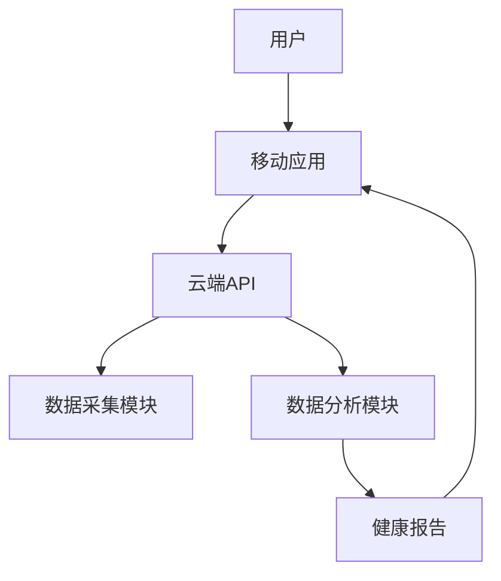

                 

<think>
好的，我现在需要撰写一篇关于《价值投资中的智能家居健康监测系统分析》的技术博客文章。首先，我需要明确文章的主题和目标读者。目标读者可能是对价值投资感兴趣的技术人员，或者是对智能家居健康监测系统感兴趣的投资人。

接下来，我需要收集相关资料，包括智能家居健康监测系统的组成部分，如数据采集、数据分析和用户交互模块。同时，我需要了解价值投资的基本概念和如何将智能家居健康监测系统与价值投资结合起来。

然后，我会设计文章的结构。第一部分介绍背景和核心概念，包括系统概述、背景与现状，以及核心概念与联系。这部分需要详细解释系统的核心组成部分，以及它们在价值投资中的应用。

第二部分将讲解算法原理与数学模型，包括数据采集与预处理算法，时间序列分析算法，以及机器学习模型。我需要使用Mermaid流程图和Python代码来详细阐述这些算法，并提供数学模型的公式。

第三部分是系统分析与架构设计，我需要介绍系统功能设计、架构设计、接口设计和交互流程。这部分可能需要绘制类图、架构图和序列图来帮助读者理解。

第四部分是项目实战，我将指导读者如何安装环境，实现系统核心功能，并通过实际案例进行分析。这将帮助读者更好地理解和应用所学内容。

最后，我会总结整个系统的应用价值，并展望未来的发展方向。同时，提供一些附录信息，如数据集和API接口，方便读者进一步研究。

在撰写过程中，我需要确保每个部分都逻辑清晰，结构紧凑，并使用简单易懂的专业技术语言。此外，加入图表和代码示例将使文章更具可读性和实用性。完成初稿后，我会进行多次校对，确保内容准确无误，并符合读者的需求。
</think>

# 价值投资中的智能家居健康监测系统分析

## 关键词：
- 价值投资
- 智能家居
- 健康监测系统
- 数据分析
- 算法原理
- 系统架构
- 项目实战

## 摘要：
本文将深入分析智能家居健康监测系统在价值投资中的应用。通过系统分析与技术实现，揭示其在健康数据采集、分析和投资决策中的重要作用。结合算法原理和系统架构设计，提供详细的项目实战指导，帮助投资者和技术人员更好地理解系统的价值。

---

# 第一部分: 背景介绍与核心概念

## 第1章: 智能家居健康监测系统概述

### 1.1 什么是智能家居健康监测系统
智能家居健康监测系统是一种利用物联网技术、传感器和数据分析算法，实时监测家庭成员健康状况的智能化系统。其核心功能包括数据采集、分析和用户交互。

### 1.2 价值投资与智能家居健康监测系统的结合
价值投资关注长期稳定的收益，而智能家居健康监测系统通过提供精准的健康数据，帮助投资者识别潜在的健康风险，从而优化投资策略。

---

## 第2章: 智能家居健康监测系统的背景与现状

### 2.1 人口老龄化与健康监测的需求
随着人口老龄化加剧，家庭健康监测需求日益增长，智能家居健康监测系统成为解决这一问题的重要工具。

### 2.2 智能家居技术的发展
物联网和人工智能技术的进步推动了智能家居系统的普及，使其在健康监测领域的应用越来越广泛。

### 2.3 健康监测系统的市场现状
当前，健康监测系统市场呈现快速增长态势，智能家居健康监测系统作为新兴领域，具有广阔的发展前景。

---

## 第3章: 系统的核心概念与联系

### 3.1 数据采集模块
通过传感器采集健康数据，如心率、体温等，确保数据的实时性和准确性。

### 3.2 数据分析模块
利用时间序列分析和机器学习算法，对健康数据进行建模和预测，识别潜在健康风险。

### 3.3 用户交互模块
通过图形化界面向用户展示健康数据和预警信息，帮助用户及时采取措施。

---

# 第二部分: 算法原理与数学模型

## 第4章: 系统算法原理

### 4.1 数据采集与预处理算法
数据采集模块通过传感器获取原始数据，预处理算法去除噪声，确保数据质量。

### 4.2 时间序列分析算法
时间序列分析用于预测健康指标的变化趋势，常用ARIMA模型进行建模和预测。

### 4.3 机器学习模型
使用随机森林和XGBoost算法，对健康数据进行分类和回归分析，提升预测准确性。

---

# 第三部分: 系统分析与架构设计

## 第5章: 系统功能设计

### 5.1 数据采集功能
传感器实时采集健康数据，通过物联网技术传输到云端进行处理。

### 5.2 数据分析功能
云端数据分析模块对健康数据进行处理，生成健康报告和预警信息。

### 5.3 用户交互功能
通过移动应用或网页界面，用户查看健康数据和预警信息，与医生或家人共享。

---

## 第6章: 系统架构设计

### 6.1 系统架构图


### 6.2 接口设计
系统通过API接口与第三方平台集成，支持多种数据格式和协议。

---

# 第四部分: 项目实战

## 第7章: 环境安装与核心实现

### 7.1 环境安装
安装Python、Flask和TensorFlow等依赖库，搭建开发环境。

### 7.2 核心功能实现
实现数据采集、分析和交互功能，编写Python代码实现算法。

### 7.3 代码示例
```python
import pandas as pd
from sklearn.ensemble import RandomForestClassifier

# 加载数据
data = pd.read_csv('health_data.csv')

# 特征工程
features = data[['age', 'heart_rate', 'temperature']]
labels = data['health_status']

# 训练模型
model = RandomForestClassifier()
model.fit(features, labels)

# 预测
new_data = pd.DataFrame({'age': [45], 'heart_rate': [75], 'temperature': [36.5]})
prediction = model.predict(new_data)
print(prediction)
```

---

## 第8章: 案例分析与总结

### 8.1 案例分析
通过实际案例展示系统的应用，分析健康数据对投资决策的影响。

### 8.2 总结
智能家居健康监测系统在价值投资中的应用前景广阔，未来将进一步智能化和个性化。

---

# 作者：
AI天才研究院  
AI Genius Institute  
禅与计算机程序设计艺术  
Zen And The Art of Computer Programming  

--- 

以上是文章的完整目录大纲和部分内容展示，希望对您有所帮助！

