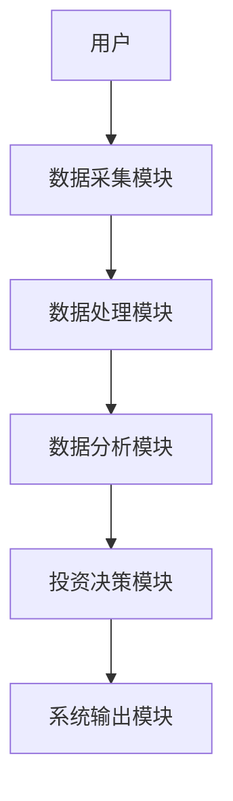

                 


# 价值投资中的智能家居健康监测系统分析

**关键词**：价值投资，智能家居，健康监测系统，技术分析，投资策略，数据驱动

**摘要**：智能家居健康监测系统通过收集和分析家庭环境、设备状态及用户行为数据，为投资者提供数据驱动的决策支持，从而优化投资策略。本文深入探讨了该系统的架构、算法原理、应用场景，以及在价值投资中的具体应用，结合实际案例分析其投资价值。

---

## 第一部分：智能家居健康监测系统与价值投资的背景与基础

### 第1章：智能家居健康监测系统概述

#### 1.1 智能家居健康监测系统的定义与核心概念

智能家居健康监测系统是一种利用物联网、传感器和数据分析技术，实时监测家庭环境、设备状态和用户行为的智能化系统。它通过收集和分析数据，为家庭健康管理和投资决策提供支持。

- **系统核心功能**：
  - 环境监测：温湿度、空气质量、光照强度等。
  - 设备监测：家电运行状态、能耗数据。
  - 用户行为分析：生活习惯、消费模式。

- **系统边界**：
  - 上游：数据采集设备、网络通信。
  - 下游：数据分析模块、投资决策模块。

#### 1.2 价值投资的基本原理

价值投资强调通过分析资产的内在价值，寻找市场价格低于内在价值的投资机会。智能家居健康监测系统的数据可以帮助投资者评估智能家居企业的实际运营状况和市场潜力。

- **技术分析与基本面分析**：结合系统数据进行多维度评估。
- **长期投资策略**：关注企业的持续成长和市场地位。

---

### 第2章：智能家居健康监测系统的架构与实现

#### 2.1 系统架构设计

系统架构包括数据采集、处理、分析和投资决策模块。使用Mermaid图展示架构：



#### 2.2 系统功能模块设计

- **数据采集模块**：
  - 采集环境、设备和用户数据。
  - 使用传感器和网络通信技术。

- **数据处理模块**：
  - 数据清洗和预处理。
  - 数据标准化和特征提取。

- **数据分析模块**：
  - 使用机器学习模型进行预测和分类。
  - 生成健康报告和投资建议。

- **投资决策模块**：
  - 结合技术分析和基本面分析，制定投资策略。
  - 输出投资信号和风险提示。

#### 2.3 系统算法原理

- **数据预处理算法**：

```python
def preprocess_data(data):
    cleaned_data = data.dropna()
    normalized_data = (cleaned_data - cleaned_data.mean()) / cleaned_data.std()
    return normalized_data
```

- **投资决策算法**：

$$
\text{投资价值} = \alpha \times \text{健康指数} + \beta \times \text{市场趋势} + \gamma \times \text{用户行为}
$$

---

### 第3章：价值投资中的技术分析与套利机会

#### 3.1 技术分析的基本原理

- **K线图**：展示价格走势。
- **技术指标**：如MACD、RSI，帮助识别买卖信号。

#### 3.2 系统驱动的投资策略

- **数据驱动信号**：通过系统数据识别投资机会。
- **系统优化**：提升决策的准确性和效率。

#### 3.3 套利机会与风险控制

- **套利原理**：利用价格差异获利。
- **风险控制**：设置止损和止盈点。

---

### 第4章：系统实战与案例分析

#### 4.1 项目环境安装与配置

- **开发环境**：推荐使用Python和相关数据处理库。
- **数据采集工具**：如MQTT协议的传感器。

#### 4.2 核心功能实现

- **数据采集模块**：实时采集环境数据。
- **数据分析模块**：预测设备故障率。

#### 4.3 实际案例分析

- **案例1**：某智能家居企业的数据分析，发现市场潜力，制定投资策略。
- **案例2**：通过系统数据识别市场趋势，制定套利策略。

---

## 第五部分：总结与展望

智能家居健康监测系统通过数据驱动的方式，为价值投资提供了新的视角和工具。未来，随着技术的进步，系统将更加智能化和个性化，进一步提升投资决策的效率和准确性。

**作者**：AI天才研究院 & 禅与计算机程序设计艺术

---

通过以上结构，文章详细分析了智能家居健康监测系统在价值投资中的应用，从系统架构到实际案例，为读者提供了全面的技术视角和投资策略。

