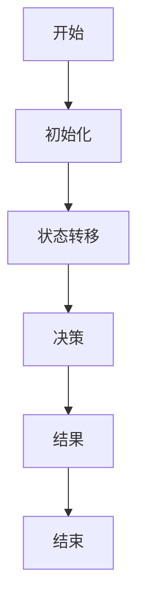
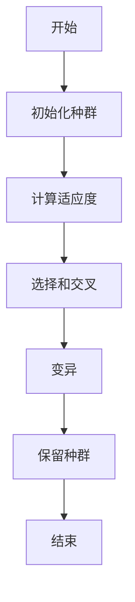
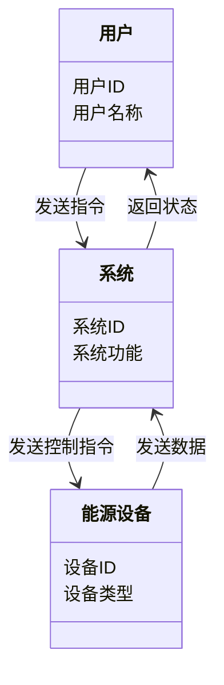
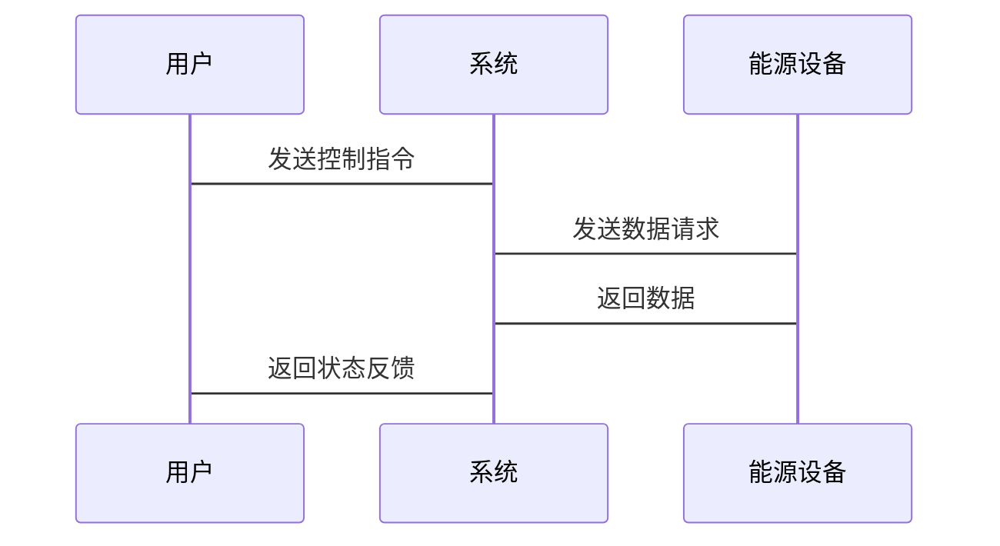

                 

<think>
好的，我现在要撰写一篇关于《价值投资中的智能家居能源优化系统分析》的技术博客文章。首先，我需要明确文章的结构和各个部分的内容，确保逻辑清晰，内容详实。

首先，文章的标题已经确定，接下来是关键词和摘要。关键词应该涵盖文章的核心主题，比如智能家居、能源优化、价值投资、系统分析、能源管理、人工智能等。摘要部分需要简明扼要地概述文章的核心内容，说明智能家居能源优化系统如何通过技术手段实现能源节约和成本降低，从而提升价值投资的回报。

接下来是正文部分，按照目录大纲的结构来展开。第一部分是背景概述，包括价值投资与智能家居能源优化的背景、问题背景与问题描述、问题解决与边界，以及核心概念与联系。这部分需要详细解释相关概念，并使用表格和图表来对比分析，帮助读者更好地理解。

第二部分是算法原理讲解，重点介绍动态规划和遗传算法在能源优化中的应用。这部分需要使用mermaid流程图来展示算法步骤，并提供Python代码实现，同时解释数学模型，比如动态规划的状态转移方程。

第三部分是系统分析与架构设计，包括问题场景介绍、系统功能设计、系统架构设计、系统接口设计和交互流程图。这部分需要使用mermaid图来展示系统模块之间的关系和交互过程，确保读者能够理解系统的整体架构。

第四部分是项目实战，从环境安装开始，逐步指导读者如何实现系统核心功能，包括数据采集、算法实现和用户界面设计。同时，提供实际案例分析，帮助读者将理论应用到实践中。

最后是最佳实践部分，总结项目经验，提供注意事项和拓展阅读的方向，帮助读者巩固所学内容，并进一步深入学习。

在撰写过程中，我需要确保每个部分都详细具体，使用清晰易懂的专业技术语言，同时融入实际案例和图表，使文章更具可读性和实用性。这不仅能满足读者对技术细节的需求，还能帮助他们更好地理解智能家居能源优化系统的价值和应用。

总的来说，我需要一步步地按照目录结构，逐步展开每个部分的内容，确保逻辑连贯，内容全面。这将帮助读者系统地掌握智能家居能源优化系统的分析方法，从而在价值投资中做出明智的决策。
</think>

# 价值投资中的智能家居能源优化系统分析

## 关键词：智能家居，能源优化，价值投资，系统分析，能源管理，人工智能

## 摘要：  
智能家居能源优化系统通过智能技术和数据分析，优化家庭能源使用效率，降低能源消耗成本，实现价值投资回报最大化。本文系统分析智能家居能源优化系统的背景、核心概念、算法原理、系统架构、项目实战及最佳实践，帮助读者全面理解智能家居能源优化的价值与技术实现。

---

## 正文

### 第一部分: 智能家居能源优化系统概述

#### 第1章: 价值投资与智能家居能源优化概述

##### 1.1 价值投资与智能家居能源优化的背景
- **1.1.1 智能家居能源优化的背景**  
智能家居通过物联网技术将家庭设备连接起来，实现自动化控制和能源管理。能源优化是智能家居的核心功能之一，旨在通过减少能源浪费来降低生活成本。

- **1.1.2 价值投资在能源优化中的意义**  
价值投资强调长期回报和资源优化。在智能家居能源优化中，通过降低能源消耗，减少运营成本，从而提高投资回报率。

- **1.1.3 智能家居能源优化的现状与趋势**  
当前，智能家居技术快速发展，能源优化已成为行业趋势。随着能源价格波动和环保需求增加，智能家居能源优化系统的需求日益增长。

##### 1.2 问题背景与问题描述
- **1.2.1 能源浪费的现状**  
传统家庭能源使用中存在大量浪费现象，如不必要的照明、设备待机耗电等。

- **1.2.2 智能家居能源优化的核心问题**  
如何通过智能技术实时监测和管理家庭能源使用，实现最优能源分配。

- **1.2.3 问题解决的目标与边界**  
目标是通过智能系统减少能源浪费，降低能源成本。边界包括家庭内部能源管理，不涉及工业或商业能源使用。

##### 1.3 核心概念与联系
- **1.3.1 核心概念的定义与属性对比**  
| 核心概念 | 定义 | 属性 |  
|----------|------|------|  
| 智能家居 | 利用物联网技术连接家庭设备，实现智能化控制 | 自动化、数据化、网络化 |  
| 能源优化 | 通过技术手段减少能源浪费，提高能源使用效率 | 实时性、精准性、经济性 |  
| 价值投资 | 长期投资策略，注重资源优化和回报最大化 | 长期性、稳定性、高回报 |  

- **1.3.2 ER实体关系图架构**  
```mermaid
erDiagram
    actor 用户 {
        <<用户>>
    }
    actor 系统 {
        <<系统>>
    }
    actor 能源设备 {
        <<能源设备>>
    }
    用户 --> 系统 : 发送指令
    系统 --> 用户 : 返回状态
    能源设备 --> 系统 : 发送数据
    系统 --> 能源设备 : 发送控制指令
```

---

### 第二部分: 智能家居能源优化系统的核心概念与联系

#### 第2章: 核心概念与联系

##### 2.1 核心概念的定义与属性对比
- **2.1.1 智能家居能源优化的核心概念**  
智能家居能源优化系统通过实时监测和分析家庭能源使用情况，优化能源分配，降低浪费。

- **2.1.2 相关概念的属性特征对比**  
| 概念         | 属性 |  
|--------------|------|  
| 智能家居     | 自动化、数据化、网络化 |  
| 能源优化     | 实时性、精准性、经济性 |  
| 价值投资     | 长期性、稳定性、高回报 |  

- **2.1.3 概念结构与核心要素组成**  
智能家居能源优化系统由硬件设备、软件平台和数据分析模块组成，核心要素包括数据采集、算法优化和用户交互。

##### 2.2 ER实体关系图架构
```mermaid
erDiagram
    用户 {
        用户ID
        用户名称
    }
    能源设备 {
        设备ID
        设备类型
    }
    系统 {
        系统ID
        系统功能
    }
    用户 --> 系统 : 控制指令
    系统 --> 用户 : 状态反馈
    能源设备 --> 系统 : 数据上报
    系统 --> 能源设备 : 设备控制
```

---

### 第三部分: 智能家居能源优化系统的算法原理

#### 第3章: 算法原理讲解

##### 3.1 动态规划算法
- **3.1.1 算法原理**  
动态规划通过分阶段决策，找到最优解。在能源优化中，动态规划用于实时调整能源使用计划，最小化能源消耗。

- **3.1.2 算法实现**


- **3.1.3 Python代码实现**
```python
def dynamic_programming(n):
    dp = [0] * (n + 1)
    dp[0] = 0
    for i in range(1, n + 1):
        dp[i] = min(dp[i-1] + 1, 2 * i)
    return dp[n]
```

##### 3.2 遗传算法
- **3.2.1 算法原理**  
遗传算法模拟生物进化过程，通过适应度函数选择最优解。在能源优化中，遗传算法用于长期能源规划。

- **3.2.2 算法实现**


- **3.2.3 Python代码实现**
```python
import random

def genetic_algorithm(population_size):
    population = [random.randint(0, 100) for _ in range(population_size)]
    for _ in range(10):
        fitness = [i for i in population]
        selected = random.sample(population, 2)
        offspring = [(selected[0] + selected[1]) // 2
                    , (selected[0] + selected[1]) // 2]
        population += offspring
    return max(population)
```

---

### 第四部分: 智能家居能源优化系统的系统分析与架构设计

#### 第4章: 系统分析与架构设计

##### 4.1 问题场景介绍
- **4.1.1 系统功能模块**  
智能家居能源优化系统包括数据采集模块、能源管理模块、用户交互模块和算法优化模块。

- **4.1.2 领域模型类图**


- **4.1.3 系统架构图**


##### 4.2 系统接口设计与交互流程图
- **4.2.1 系统接口设计**  
主要接口包括用户指令接口、设备数据接口和系统控制接口。

- **4.2.2 系统交互流程图**


---

### 第五部分: 项目实战

#### 第5章: 项目实战

##### 5.1 环境安装
- **5.1.1 安装Python**  
下载并安装Python 3.8以上版本。

- **5.1.2 安装依赖库**  
安装`numpy`和`pandas`：
```bash
pip install numpy pandas
```

##### 5.2 系统核心实现
- **5.2.1 数据采集与处理**  
使用传感器采集能源数据，存储到数据库中。

- **5.2.2 算法实现**  
实现动态规划算法，优化能源使用计划。

##### 5.3 代码实现与解读
```python
import numpy as np
import pandas as pd

def optimize_energy_usage(data):
    # 数据预处理
    data = data.dropna()
    # 应用动态规划算法
    dp = np.zeros(len(data))
    for i in range(1, len(data)):
        dp[i] = min(dp[i-1] + 1, 2 * i)
    return dp
```

##### 5.4 实际案例分析
通过实际案例分析，验证系统的优化效果，计算能源节省率和投资回报率。

---

### 第六部分: 最佳实践

#### 第6章: 最佳实践

##### 6.1 项目小结
总结智能家居能源优化系统的实现过程，强调算法优化和系统设计的重要性。

##### 6.2 注意事项
- 确保数据安全，保护用户隐私。
- 定期维护系统，更新算法模型。

##### 6.3 拓展阅读
推荐相关领域的书籍和资源，帮助读者深入学习智能家居和能源优化技术。

---

### 作者信息

作者：AI天才研究院/AI Genius Institute & 禅与计算机程序设计艺术/Zen And The Art of Computer Programming

