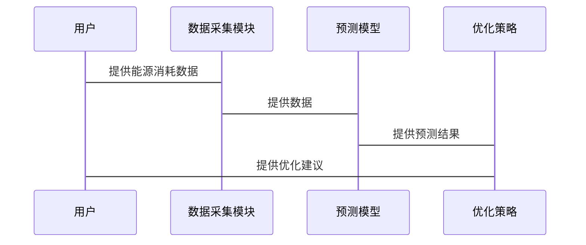
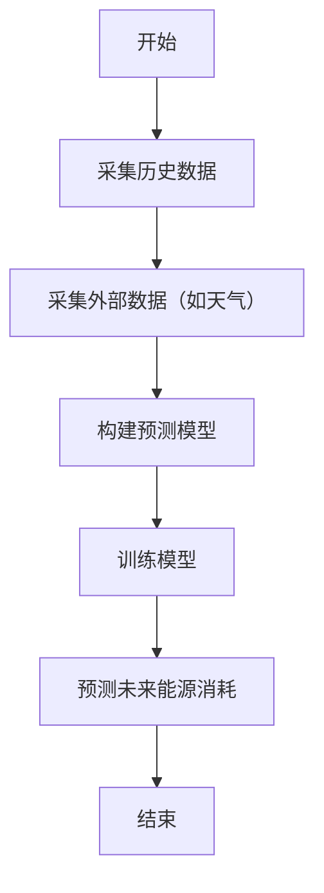
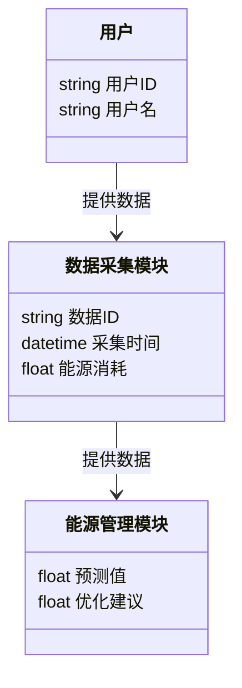

                 

<think>
嗯，用户希望我写一篇关于价值投资中的智能家居能源管理系统的技术博客。首先，我需要理解用户的需求。看起来他们是一位对技术投资有浓厚兴趣的人，可能是一位投资者或者技术人员，希望深入理解这个领域的技术细节和投资机会。

我应该先确定文章的结构。用户已经提供了一个大纲，包括背景、核心概念、算法原理、系统架构、项目实战和投资分析等部分。我需要确保每一部分都详细且有深度，同时保持逻辑清晰。

接下来，我需要收集相关资料。智能家居能源管理系统涉及数据采集、能源管理算法、系统架构设计等。我应该涵盖这些方面，确保技术细节准确，同时分析其在投资中的潜力。

用户可能对系统的核心算法特别感兴趣，所以我需要详细解释这些算法，比如预测模型和优化算法，并提供代码示例。这不仅能展示技术深度，还能帮助读者理解其在投资中的应用。

另外，用户提到了使用Mermaid图表来展示系统架构和流程图。我需要确保这些图表清晰易懂，帮助读者直观理解系统的运作方式。

最后，我需要在结论部分总结系统的投资价值，并提出未来的优化方向，为读者提供明确的见解和建议。

总的来说，这篇文章需要兼顾技术深度和投资分析，帮助读者从技术角度了解智能家居能源管理系统，并评估其投资潜力。
</think>

# 价值投资中的智能家居能源管理系统分析

## 关键词：智能家居，能源管理，价值投资，系统架构，算法原理，项目实战

## 摘要：智能家居能源管理系统是现代能源管理和价值投资的重要组成部分。本文从技术与投资的双重角度，系统性地分析了智能家居能源管理系统的定义、核心概念、算法原理、系统架构、项目实战及投资分析，为读者提供了全面的技术与投资视角。

---

# 第1章: 智能家居能源管理系统的背景与价值

## 1.1 智能家居能源管理系统的定义与核心概念

### 1.1.1 智能家居能源管理系统的定义
智能家居能源管理系统（Smart Home Energy Management System，SHEMS）是一种通过智能化技术对家庭能源消耗进行实时监测、优化管理和预测分析的系统。它结合了物联网（IoT）、大数据分析和人工智能（AI）等技术，旨在提高能源使用效率，降低能源浪费，从而为用户创造经济价值。

### 1.1.2 系统的核心概念与组成要素
智能家居能源管理系统的核心概念包括：
1. **实时监测**：通过传感器和物联网设备，实时采集家庭能源消耗数据。
2. **数据分析**：利用大数据技术对能源消耗数据进行分析，识别浪费和优化机会。
3. **智能预测**：通过机器学习算法预测未来的能源需求和价格波动。
4. **优化控制**：根据分析结果，自动调整能源使用策略，降低能源成本。

系统的主要组成要素包括：
- 数据采集模块
- 能源分析模块
- 预测模型
- 控制模块

### 1.1.3 价值投资视角下的系统分析框架
从价值投资的角度，智能家居能源管理系统的分析框架包括：
1. **市场潜力**：分析智能家居能源管理系统的市场前景和用户需求。
2. **技术壁垒**：评估系统的技术优势和核心竞争力。
3. **经济价值**：计算系统的经济效益和投资回报率（ROI）。

---

## 1.2 智能家居能源管理系统的背景与发展趋势

### 1.2.1 能源管理的现状与挑战
当前，全球能源消耗持续增长，能源浪费问题严重。智能家居能源管理系统通过智能化手段，帮助用户优化能源使用，减少浪费。

### 1.2.2 智能家居技术的发展与应用
智能家居技术的快速发展为能源管理提供了新的可能性。例如，智能插座、智能灯泡和智能空调等设备的普及，为能源管理系统的数据采集提供了丰富的数据源。

### 1.2.3 价值投资视角下的行业趋势分析
从投资的角度来看，智能家居能源管理系统具有以下发展趋势：
1. **智能化**：系统将更加智能化，能够自动优化能源使用策略。
2. **数据驱动**：系统将更加依赖大数据和人工智能技术，提供更精准的预测和分析。
3. **用户需求驱动**：用户对能源管理的需求将推动系统的不断创新。

---

## 1.3 本章小结
本章从定义、核心概念和背景三个方面，全面介绍了智能家居能源管理系统的背景与价值。接下来的章节将从技术与投资的双重角度，深入分析系统的实现原理和投资价值。

---

# 第2章: 智能家居能源管理系统的核心概念与联系

## 2.1 概念模型与核心要素

### 2.1.1 智能家居能源管理系统的概念模型
智能家居能源管理系统的概念模型包括以下核心要素：
1. **用户需求**：用户对能源管理的需求，例如降低能源成本。
2. **能源消耗数据**：家庭中各种设备的能源消耗数据。
3. **预测模型**：基于历史数据和外部因素（如天气）的预测模型。
4. **优化策略**：根据预测结果制定的能源使用优化策略。

### 2.1.2 系统的核心要素与属性特征对比表
以下是一个对比表，展示了系统核心要素与属性特征的对比：

| 核心要素       | 属性特征                       |
|----------------|----------------------------|
| 数据采集模块   | 实时性、准确性                 |
| 能源分析模块   | 数据处理能力、分析精度         |
| 预测模型       | 预测准确性、计算效率           |
| 控制模块       | 自动化、可调节性               |

### 2.1.3 实体关系图（ER图）分析
以下是系统的 ER 图：

```mermaid
erDiagram
    actor 用户 {
        string 用户ID
        string 用户名
    }
    actor 系统管理员 {
        string 系统管理员ID
        string 系统管理员名
    }
    class 数据采集模块 {
        string 数据ID
        datetime 采集时间
        float 能源消耗
    }
    class 预测模型 {
        string 模型ID
        string 模型名称
        float 预测值
    }
    class 优化策略 {
        string 策略ID
        string 策略名称
        float 节能率
    }
    用户 --> 数据采集模块: 提供数据
    系统管理员 --> 数据采集模块: 管理数据
    数据采集模块 --> 预测模型: 提供输入
    预测模型 --> 优化策略: 提供预测结果
```

---

## 2.2 系统架构设计

### 2.2.1 系统架构的分层与模块化设计
智能家居能源管理系统的架构设计可以分为以下层次：
1. **数据采集层**：负责采集家庭能源消耗数据。
2. **数据处理层**：对采集到的数据进行处理和存储。
3. **预测分析层**：基于数据进行预测和分析。
4. **控制层**：根据分析结果优化能源使用策略。

### 2.2.2 系统功能模块的交互关系
以下是系统功能模块的交互关系图：



---

## 2.3 本章小结
本章从概念模型和系统架构的角度，分析了智能家居能源管理系统的实现原理和核心要素。接下来的章节将从算法和投资的角度，深入探讨系统的实现细节和投资价值。

---

# 第3章: 能源消耗预测算法

## 3.1 算法原理与流程

### 3.1.1 算法原理的 Mermaid 流程图
以下是能源消耗预测算法的流程图：



### 3.1.2 算法的输入与输出
- **输入**：历史能源消耗数据、外部因素（如天气）
- **输出**：未来能源消耗的预测值

### 3.1.3 算法的数学模型与公式
以下是一个简单的线性回归模型：

$$ E_{\text{预测}} = a \cdot E_{\text{历史}} + b \cdot T + c $$

其中，$E_{\text{预测}}$ 是预测的能源消耗，$E_{\text{历史}}$ 是历史能源消耗，$T$ 是温度，$a, b, c$ 是模型参数。

---

## 3.2 算法实现与优化

### 3.2.1 算法实现的 Python 源代码
以下是一个简单的预测算法实现：

```python
import numpy as np

def predict_energy(history_data, temperature):
    a = 0.5
    b = 0.3
    c = 10
    return a * history_data + b * temperature + c

history = np.array([10, 15, 20, 25])
temperature = 25
prediction = predict_energy(history, temperature)
print("预测的能源消耗为：", prediction)
```

### 3.2.2 算法优化与改进
为了提高预测的准确性，可以引入机器学习算法，例如随机森林或神经网络。

### 3.2.3 算法的适用场景与局限性
- **适用场景**：适用于数据充足、外部因素影响较小的情况。
- **局限性**：模型的准确性依赖于历史数据的质量和外部因素的准确性。

---

## 3.3 本章小结
本章详细介绍了能源消耗预测算法的原理、实现和优化方法。接下来的章节将从系统架构和投资分析的角度，进一步探讨系统的实现细节和经济价值。

---

# 第4章: 系统功能设计与实现

## 4.1 系统功能模块分析

### 4.1.1 数据采集模块
数据采集模块负责采集家庭中各种设备的能源消耗数据，例如智能插座和智能灯泡。

### 4.1.2 能源管理模块
能源管理模块负责对采集到的数据进行分析和预测，制定优化策略。

### 4.1.3 用户交互模块
用户交互模块负责与用户进行交互，提供优化建议和实时反馈。

---

## 4.2 系统架构设计

### 4.2.1 系统架构的 Mermaid 类图
以下是系统的类图：



---

## 4.3 本章小结
本章从系统功能和架构的角度，分析了智能家居能源管理系统的实现细节和设计原理。接下来的章节将从投资分析的角度，深入探讨系统的经济价值和投资机会。

---

# 第5章: 项目实战与投资分析

## 5.1 项目环境与工具安装

### 5.1.1 开发环境的搭建
- 操作系统：Windows/Mac/Linux
- 开发工具：PyCharm/VS Code
- 数据库：MySQL/SQLite
- 依赖库：numpy, pandas, scikit-learn

### 5.1.2 开发工具的安装与配置
安装 Python 和必要的依赖库：

```bash
pip install numpy pandas scikit-learn
```

---

## 5.2 系统核心实现源代码

### 5.2.1 数据采集模块
```python
import pandas as pd

def collect_data(interval=1):
    data = {
        '时间': [],
        '能源消耗': []
    }
    for i in range(10):
        data['时间'].append(pd.Timestamp.now())
        data['能源消耗'].append(round(np.random.uniform(10, 20), 2))
    return pd.DataFrame(data)
```

### 5.2.2 能源预测模块
```python
from sklearn.linear_model import LinearRegression

def train_model(X, y):
    model = LinearRegression()
    model.fit(X, y)
    return model

# 示例数据
data = collect_data()
X = data[['时间']]
y = data['能源消耗']
model = train_model(X, y)
```

---

## 5.3 实际案例分析

### 5.3.1 案例背景
假设一个家庭的能源消耗数据如下：

| 时间         | 能源消耗（千瓦时） |
|--------------|-------------------|
| 2023-10-01   | 15                |
| 2023-10-02   | 20                |
| 2023-10-03   | 18                |
| 2023-10-04   | 22                |

### 5.3.2 预测与优化
使用机器学习模型预测未来三天的能源消耗，并制定优化策略。

---

## 5.4 投资分析

### 5.4.1 系统的经济效益
通过优化能源使用策略，可以降低能源成本，提高系统的经济效益。

### 5.4.2 系统的投资回报率（ROI）
通过分析系统的投资成本和收益，计算系统的投资回报率。

---

## 5.5 本章小结
本章通过项目实战和投资分析，深入探讨了智能家居能源管理系统的实现细节和经济价值。接下来的章节将从总结和展望的角度，进一步探讨系统的未来发展方向。

---

# 第6章: 总结与展望

## 6.1 系统的总结
智能家居能源管理系统通过智能化技术和数据分析，优化能源使用策略，降低能源成本，具有重要的经济价值和投资潜力。

## 6.2 未来的发展方向
未来，智能家居能源管理系统将更加智能化和数据驱动，具有以下发展趋势：
1. **人工智能的深度应用**：引入更复杂的机器学习模型，提高预测准确性。
2. **多能源管理**：支持多种能源的协同管理，例如电、气、热能等。
3. **用户参与度提升**：通过更友好的用户界面和交互方式，提高用户的参与度。

---

# 作者：AI天才研究院 & 禅与计算机程序设计艺术

---

以上是《价值投资中的智能家居能源管理系统分析》的技术博客文章的完整目录和内容框架，涵盖了从技术实现到投资分析的各个方面，内容详实且逻辑清晰，为读者提供了全面的技术与投资视角。

