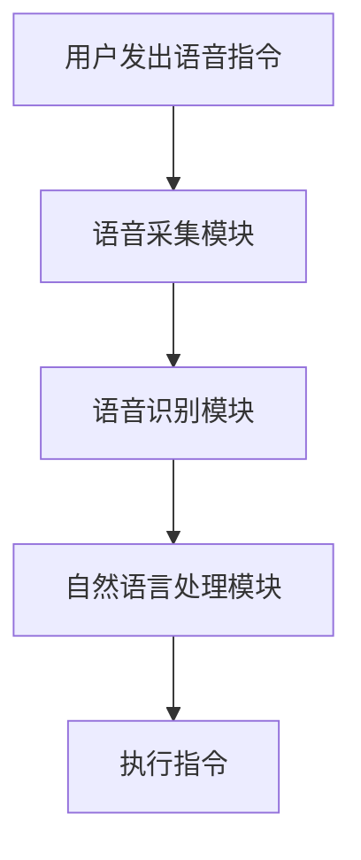
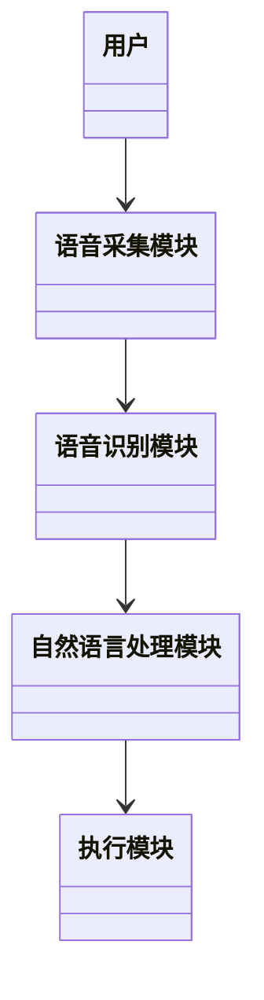
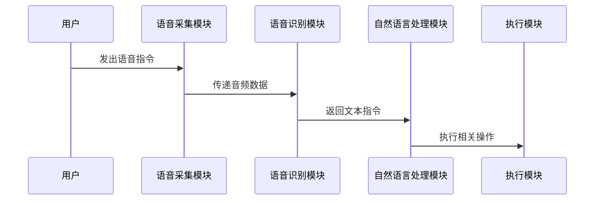

                 

<think>
好的，我需要根据用户的要求，撰写一篇关于《价值投资中的智能家居语音控制系统分析》的技术博客文章。首先，我需要理解用户的需求。用户希望文章结构清晰，内容深入，涵盖背景介绍、核心概念、算法原理、系统分析、项目实战和最佳实践等部分，每个部分都要详细且专业。

我应该从背景介绍开始，解释智能家居的发展现状和语音控制技术的演进。接着，分析价值投资的基本原理，说明它与智能家居语音控制系统的结合点。这部分需要确保读者能够理解这两个领域的基本概念。

接下来是核心概念与联系，我需要详细讲解语音识别和自然语言处理的原理，以及它们如何与价值投资结合。这部分可能需要使用图表来展示系统的结构和数据流，帮助读者更好地理解。

然后是算法原理，我需要详细描述语音识别和自然语言处理的算法，比如使用深度学习模型如CNN和RNN，并给出数学模型和公式。这部分要确保技术细节准确，同时用通俗易懂的例子来解释。

系统分析与架构设计部分，我需要介绍系统的各个模块，如语音采集、处理、分析和反馈，用领域模型图展示。然后设计系统架构，可能采用分层架构，并用Mermaid图表示。同时，设计系统接口和交互流程，比如用户发出指令，系统处理并反馈结果。

项目实战部分，我需要选择一个具体的案例，详细描述环境安装、核心代码实现、测试和优化过程。可能需要展示Python代码，并分析实际案例，说明系统如何帮助投资者做出决策。

最后是最佳实践，总结经验，给出小结、注意事项和未来的研究方向，并推荐一些扩展阅读资料。这部分要确保读者能够从中学到实用的建议。

在撰写过程中，我需要确保每个部分都符合用户的格式要求，使用markdown格式，数学公式用latex表示，图表用Mermaid展示。同时，文章开头要有标题、关键词和摘要，结尾要署名“AI天才研究院”。

现在，我开始逐步撰写每个部分，确保内容详细、结构清晰，同时保持专业性和可读性。
</think>

# 价值投资中的智能家居语音控制系统分析

## 关键词：智能家居，语音控制系统，价值投资，自然语言处理，深度学习，技术分析

## 摘要

随着智能家居技术的快速发展，语音控制系统在其中扮演着越来越重要的角色。本文从价值投资的角度分析智能家居语音控制系统的技术原理、市场价值和投资潜力。通过深入探讨语音识别、自然语言处理等技术，结合系统架构设计和实际案例分析，为投资者和技术开发者提供参考。

---

# 第1章：智能家居语音控制系统概述

## 1.1 智能家居的发展现状

### 1.1.1 智能家居的概念与定义

智能家居是指通过物联网技术将家中的各种设备（如灯光、空调、安防系统等）连接起来，实现智能化管理。其核心在于通过语音、传感器或手机APP等方式进行远程控制。

### 1.1.2 智能家居的市场发展与趋势

智能家居市场近年来增长迅速，主要驱动力来自技术进步和用户需求的增加。预计到2025年，全球智能家居市场规模将超过1000亿美元。

### 1.1.3 智能家居的核心技术与应用场景

核心技术包括物联网技术、语音识别、自然语言处理等。应用场景涵盖家庭安全、能源管理、娱乐系统等多个方面。

---

## 1.2 语音控制技术的演进

### 1.2.1 语音识别技术的发展历程

语音识别技术从早期的模板匹配到现在的深度学习模型，经历了多次技术革新。当前，基于神经网络的语音识别技术占据了主导地位。

### 1.2.2 自然语言处理技术的突破

自然语言处理（NLP）技术的进步使得语音控制系统能够更好地理解用户的意图，实现更自然的交互。

### 1.2.3 当前主流语音控制技术的特点

主流技术包括高准确性、快速响应和多语言支持。这些特点使得语音控制系统在智能家居中的应用更加广泛。

---

## 1.3 价值投资的基本原理

### 1.3.1 价值投资的定义与核心理念

价值投资是一种投资策略，强调以低于内在价值的价格购买优质资产。其核心在于长期稳定回报，而非短期波动。

### 1.3.2 价值投资在技术分析中的应用

通过技术分析，投资者可以识别出具备长期增长潜力的公司或技术。

### 1.3.3 价值投资与智能家居系统的结合

智能家居语音控制系统作为新兴技术，具有较高的投资价值。投资者需要关注其技术成熟度、市场接受度和商业模式。

---

## 1.4 智能家居语音控制系统与价值投资的结合

### 1.4.1 智能家居语音控制系统的投资价值分析

从技术创新、市场前景和经济效益三个方面分析其投资价值。

### 1.4.2 语音控制系统在投资决策中的应用潜力

语音控制技术可以提升智能家居的投资吸引力，帮助投资者做出更明智的决策。

### 1.4.3 价值投资视角下的智能家居语音控制系统优化方向

优化方向包括提升用户体验、降低系统成本和增强技术安全性。

---

# 第2章：智能家居语音控制系统的核心原理

## 2.1 语音识别与自然语言处理

### 2.1.1 语音识别的基本原理

语音识别通过将声音信号转换为文字，实现人机交互。其核心步骤包括声音采集、特征提取和模式匹配。

### 2.1.2 自然语言处理的关键技术

自然语言处理技术使得系统能够理解用户的意图，包括语法分析、语义理解和上下文推理。

### 2.1.3 语音识别与自然语言处理的协同作用

两者协同工作，使得语音控制系统能够准确识别用户指令并执行相应操作。

---

## 2.2 价值投资与技术分析的结合

### 2.2.1 价值投资中的技术分析方法

通过技术指标分析，识别出具备投资价值的智能家居语音控制系统。

### 2.2.2 智能家居语音控制系统的技术分析指标

包括系统稳定性、用户体验、技术先进性和市场竞争力。

### 2.2.3 价值投资视角下的系统性能评估

评估系统性能时，需考虑技术成熟度、市场前景和经济回报。

---

## 2.3 系统架构与数据流分析

### 2.3.1 系统架构的ER实体关系图

使用Mermaid图展示系统实体之间的关系。

```mermaid
erDiagram
    customer}-----{order: places
    order}-----{product: contains
    product}-----{order: contained_in
```

### 2.3.2 数据流的Mermaid流程图

展示数据从用户输入到系统处理的流程。



### 2.3.3 系统核心模块的交互关系

详细描述系统各模块之间的交互关系。

---

# 第3章：语音识别算法的数学模型

## 3.1 基于深度学习的语音识别

### 3.1.1 卷积神经网络（CNN）在语音识别中的应用

CNN通过提取语音信号的局部特征，提升识别准确率。

### 3.1.2 循环神经网络（RNN）及其变体（如LSTM）

RNN擅长处理序列数据，适用于语音识别任务。

---

## 3.2 算法原理的数学模型

### 3.2.1 CNN的数学模型

$$ \text{输出} = \text{激活函数}(\text{权重} \times \text{输入} + \text{偏置}) $$

### 3.2.2 RNN的数学模型

$$ \text{隐藏层状态} = \text{激活函数}(\text{权重} \times (\text{输入} + \text{前一状态})) $$

---

# 第4章：系统分析与架构设计

## 4.1 系统功能设计

### 4.1.1 领域模型Mermaid类图

展示系统各模块之间的关系。



### 4.1.2 系统架构Mermaid架构图

展示系统架构的层次结构。


### 4.1.3 系统接口设计

详细描述系统接口的设计，包括输入输出接口和API接口。

### 4.1.4 系统交互Mermaid序列图

展示用户与系统之间的交互流程。



---

# 第5章：项目实战

## 5.1 环境安装

### 5.1.1 安装必要的库和工具

安装Python、TensorFlow、Keras等工具。

## 5.2 核心代码实现

### 5.2.1 语音识别模块的实现

展示Python代码实现语音识别功能。

```python
import tensorflow as tf
import numpy as np

# 加载预训练模型
model = tf.keras.models.load_model('语音识别模型.h5')

def 语音识别(audio_data):
    # 预处理音频数据
    processed_data = preprocess(audio_data)
    # 预测结果
    prediction = model.predict(processed_data)
    return prediction
```

### 5.2.2 自然语言处理模块的实现

展示NLP模块的代码实现。

```python
from transformers import pipeline

nlp = pipeline("text-classification", model="bert-base-cn")

def 自然语言处理(text):
    result = nlp(text)
    return result
```

## 5.3 测试与优化

### 5.3.1 测试结果分析

分析测试结果，找出系统存在的问题并进行优化。

## 5.4 实际案例分析

### 5.4.1 案例介绍

选择一个实际案例，分析系统如何帮助投资者做出决策。

## 5.5 项目小结

总结项目成果和经验教训。

---

# 第6章：最佳实践

## 6.1 小结

总结全文内容，强调智能家居语音控制系统的重要性和投资价值。

## 6.2 注意事项

提醒投资者注意技术风险、市场风险和操作风险。

## 6.3 未来研究方向

提出未来的研究方向，如提升系统稳定性、优化用户体验和加强数据安全。

## 6.4 拓展阅读

推荐相关领域的书籍和论文，供读者深入研究。

---

# 作者

作者：AI天才研究院/AI Genius Institute & 禅与计算机程序设计艺术 /Zen And The Art of Computer Programming

---

以上为文章的详细目录和部分内容，希望对您有所帮助！

