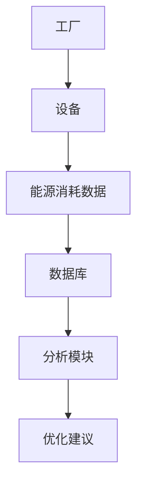
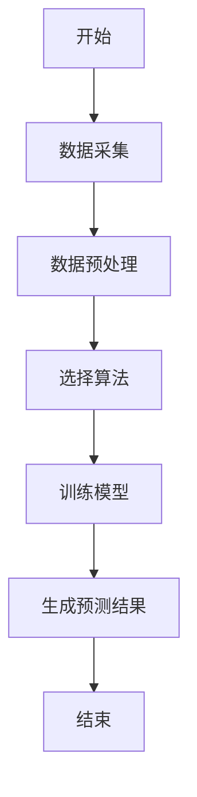
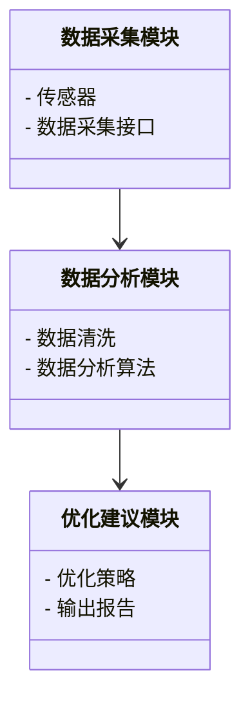
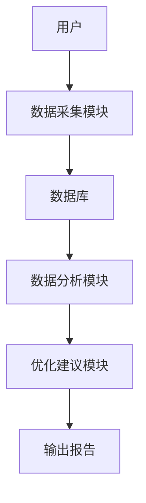
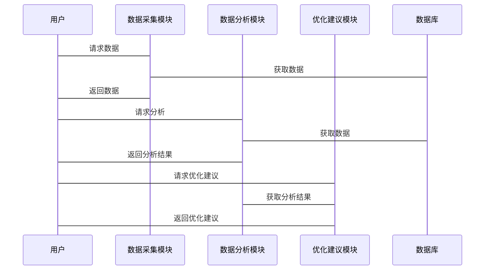

                 


# 价值投资中的智能工厂能源管理系统分析

> **关键词**：智能工厂，能源管理系统，价值投资，数据分析，能源优化，机器学习

> **摘要**：智能工厂能源管理系统是一种利用智能化技术优化工厂能源消耗的系统，通过数据分析和机器学习算法，实现能源消耗的精准预测和优化建议，从而帮助投资者在价值投资中实现更高的收益和更低的成本。本文从背景、核心概念、算法原理、系统架构、项目实战等多个方面详细分析智能工厂能源管理系统，并探讨其在价值投资中的应用。

---

## 第一部分：智能工厂能源管理系统概述

### 第1章：背景与概念

#### 1.1 智能工厂能源管理系统的背景

##### 1.1.1 工厂能源管理的现状与挑战
现代工厂的能源消耗问题日益突出，传统的能源管理模式存在数据采集不准确、分析不深入、优化建议不够具体等问题。随着工业4.0的推进，智能化技术的应用为能源管理带来了新的机遇。

##### 1.1.2 智能化技术在能源管理中的应用
智能化技术（如物联网、大数据分析和机器学习）的应用，使得能源管理更加精准和高效。通过实时数据采集和分析，工厂可以优化能源使用，降低浪费，从而降低成本。

##### 1.1.3 价值投资视角下的能源管理优化
从价值投资的角度来看，优化能源管理可以提高工厂的利润率，增强企业的竞争力，从而为投资者带来更高的回报。

#### 1.2 智能工厂能源管理系统的定义与特点

##### 1.2.1 系统的核心概念
智能工厂能源管理系统通过实时采集能源消耗数据，利用数据分析技术进行预测和优化，帮助工厂实现能源的高效利用。

##### 1.2.2 系统的主要功能模块
- 数据采集模块：实时采集工厂的能源消耗数据。
- 数据分析模块：对数据进行清洗、分析和建模。
- 优化建议模块：基于分析结果，提供能源优化建议。

##### 1.2.3 系统与传统能源管理的区别
智能工厂能源管理系统通过智能化技术实现数据的实时采集和分析，而传统能源管理依赖人工操作，数据采集和分析效率较低。

#### 1.3 价值投资与能源管理的结合

##### 1.3.1 价值投资的基本原理
价值投资强调通过分析企业的基本面，寻找具有长期投资价值的企业。优化能源管理可以提升企业的盈利能力，从而增加其投资价值。

##### 1.3.2 能源管理在价值投资中的作用
优化能源管理可以降低企业的运营成本，提高利润率，从而增强企业的投资价值。

##### 1.3.3 智能工厂能源管理系统对投资决策的影响
通过智能工厂能源管理系统，投资者可以更准确地评估企业的能源管理能力，从而做出更明智的投资决策。

### 第2章：智能工厂能源管理系统的核心概念

#### 2.1 系统的组成与功能

##### 2.1.1 数据采集模块
数据采集模块通过传感器和物联网设备，实时采集工厂的能源消耗数据。

##### 2.1.2 数据分析模块
数据分析模块对采集到的数据进行清洗、转换和分析，利用机器学习算法进行预测和建模。

##### 2.1.3 优化建议模块
优化建议模块基于分析结果，提供具体的能源优化建议，如调整设备运行时间、优化能源分配等。

#### 2.2 核心概念的属性对比

##### 2.2.1 数据采集的准确性
数据采集的准确性直接影响分析结果的可靠性。通过高精度传感器和先进的数据采集技术，可以提高数据的准确性。

##### 2.2.2 数据分析的深度
数据分析的深度决定了优化建议的有效性。通过使用复杂的数据分析算法，可以深入挖掘数据中的潜在信息。

##### 2.2.3 优化建议的可行性
优化建议的可行性取决于数据分析的准确性和全面性。只有可行的优化建议才能真正降低能源消耗，提高效率。

#### 2.3 ER实体关系图



---

## 第3章：算法原理与数学模型

### 3.1 能源消耗预测算法

#### 3.1.1 算法流程图



#### 3.1.2 算法实现代码

```python
import pandas as pd
import numpy as np
from sklearn.ensemble import RandomForestRegressor

# 数据预处理
data = pd.read_csv('energy_consumption.csv')
data = data.dropna()

# 特征选择
features = data[['temperature', 'humidity', 'production_output']]
target = data['energy_usage']

# 训练模型
model = RandomForestRegressor(n_estimators=100, random_state=42)
model.fit(features, target)

# 预测结果
predicted_usage = model.predict(features)
```

#### 3.1.3 算法的数学模型

能源消耗预测模型可以表示为：

$$
y = \beta_0 + \beta_1x_1 + \beta_2x_2 + \beta_3x_3 + \epsilon
$$

其中，$y$ 是能源消耗，$x_1, x_2, x_3$ 是影响能源消耗的特征变量，$\beta$ 是回归系数，$\epsilon$ 是误差项。

### 3.2 数学模型的优化

#### 3.2.1 线性回归模型

$$
y = \theta_0 + \theta_1x_1 + \theta_2x_2 + \theta_3x_3
$$

#### 3.2.2 支持向量机模型

$$
y = \text{sign}(\theta_0 + \theta_1x_1 + \theta_2x_2 + \theta_3x_3)
$$

---

## 第4章：系统分析与架构设计

### 4.1 系统架构设计

#### 4.1.1 系统功能模块



#### 4.1.2 系统架构图



#### 4.1.3 系统接口设计

系统接口包括数据采集接口、数据分析接口和优化建议接口。每个接口都定义了输入和输出的数据格式。

#### 4.1.4 系统交互流程图



---

## 第5章：项目实战

### 5.1 环境安装

安装Python、Pandas、NumPy、Scikit-learn等依赖库。

### 5.2 系统核心实现

实现数据采集、数据分析和优化建议模块。

### 5.3 代码应用解读

#### 5.3.1 数据采集代码

```python
import serial

ser = serial.Serial('COM1', 9600)
data = ser.readline().decode().strip()
print(data)
```

#### 5.3.2 数据分析代码

```python
import pandas as pd
from sklearn.model_selection import train_test_split
from sklearn.metrics import mean_absolute_error

data = pd.read_csv('energy_consumption.csv')
X = data[['temperature', 'humidity', 'production_output']]
y = data['energy_usage']

X_train, X_test, y_train, y_test = train_test_split(X, y, test_size=0.2, random_state=42)

model = RandomForestRegressor(n_estimators=100, random_state=42)
model.fit(X_train, y_train)

predicted_usage = model.predict(X_test)
print(mean_absolute_error(y_test, predicted_usage))
```

#### 5.3.3 优化建议代码

```python
def generate_recommendations(data, model):
    predicted_usage = model.predict(data)
    recommendations = []
    for i in range(len(predicted_usage)):
        if predicted_usage[i] < data['energy_usage'][i]:
            recommendations.append('减少能源消耗')
        else:
            recommendations.append('保持当前消耗')
    return recommendations

recommendations = generate_recommendations(X_test, model)
print(recommendations)
```

### 5.4 实际案例分析

通过实际案例分析，验证系统的优化建议是否有效降低能源消耗。

### 5.5 项目小结

总结项目实施过程中的经验和教训，提出改进建议。

---

## 第6章：总结与展望

### 6.1 最佳实践

- 数据采集要准确，分析要深入，优化建议要具体。
- 定期更新模型，确保预测结果的准确性。
- 加强数据安全和系统维护，确保系统的稳定运行。

### 6.2 小结

智能工厂能源管理系统通过智能化技术优化能源管理，降低工厂的能源消耗，提高企业的利润率，从而增强其投资价值。

### 6.3 注意事项

- 数据采集和分析要准确，避免误差。
- 系统维护要定期进行，确保系统的稳定性。
- 数据安全要重视，防止数据泄露。

### 6.4 拓展阅读

- 《机器学习实战》
- 《智能工厂：工业4.0的实现》
- 《价值投资：找到市场的下一个十倍股》

---

**作者：AI天才研究院 & 禅与计算机程序设计艺术**

