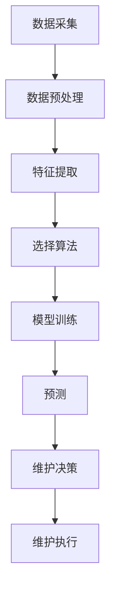
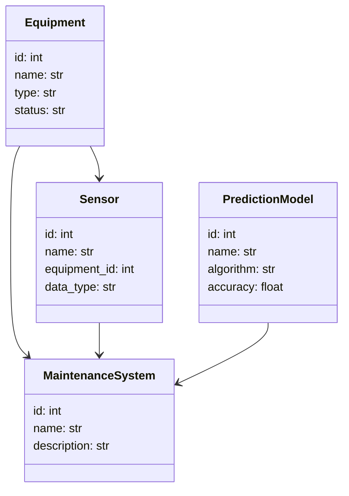
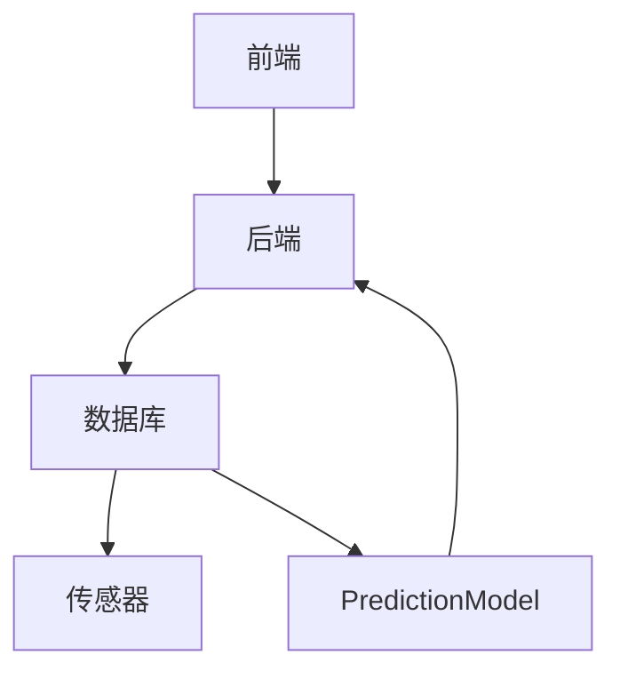

                 


# 价值投资中的智能工厂预测性维护系统分析

> **关键词**：价值投资、智能工厂、预测性维护、系统分析、算法原理、系统架构  
> 
> **摘要**：本文深入分析了智能工厂中预测性维护系统的价值投资分析，从系统背景、核心概念、算法原理、系统架构、项目实战到最佳实践，全面阐述了预测性维护系统在智能工厂中的应用及其对价值投资的深远影响。通过详细的技术分析和实际案例，本文为投资者和技术人员提供了深入的理论支持和实践指导。

---

# 第一部分: 价值投资中的智能工厂预测性维护系统背景介绍

# 第1章: 智能工厂预测性维护系统概述

## 1.1 预测性维护的定义与背景

### 1.1.1 预测性维护的定义

预测性维护是一种基于设备运行状态数据，通过数据分析和预测模型，提前预测设备可能出现的故障，并在故障发生前进行维护的策略。其核心目标是通过预防性措施降低设备故障率，延长设备寿命，减少停机时间。

### 1.1.2 智能工厂中的预测性维护背景

在工业4.0和智能制造的推动下，智能工厂逐渐成为现代制造业的核心模式。智能工厂通过物联网（IoT）、大数据分析和人工智能（AI）技术，实现了生产过程的智能化和自动化。预测性维护作为智能工厂的重要组成部分，能够显著提高设备利用率和生产效率，降低维护成本。

### 1.1.3 预测性维护的价值与意义

预测性维护能够帮助企业实现从“被动维护”到“主动维护”的转变，减少设备故障停机时间，降低维护成本，提高设备利用率和生产效率。同时，通过预测性维护，企业能够更好地规划资源，优化生产流程，从而提升整体竞争力。

### 1.1.4 预测性维护系统的边界与外延

预测性维护系统的边界主要集中在设备运行数据的采集、分析和维护决策的执行。其外延则包括与之相关的数据来源（如传感器数据、历史维护记录等）、数据分析工具（如机器学习模型）、以及维护执行流程（如维修人员调度、备件管理等）。

### 1.1.5 系统的核心要素组成

预测性维护系统的核心要素包括：
1. **数据采集**：通过传感器、SCADA系统等获取设备运行数据。
2. **数据分析**：利用机器学习、统计分析等技术对数据进行处理和预测。
3. **预测模型**：基于历史数据和算法构建预测模型，用于设备故障预测。
4. **决策系统**：根据预测结果生成维护建议，并执行维护操作。
5. **反馈机制**：收集维护后的数据，优化预测模型和维护策略。

---

## 1.2 价值投资与预测性维护的结合

### 1.2.1 价值投资的核心理念

价值投资是一种投资策略，强调通过深入分析企业的基本面（如财务状况、市场地位、管理团队等），找到被市场低估的企业进行投资。其核心理念是寻找具有长期竞争优势和稳定收益的企业。

### 1.2.2 预测性维护在价值投资中的应用

在智能工厂中，预测性维护能够显著降低设备故障率，提高生产效率和产品质量。这对于企业来说意味着更高的利润率和更低的运营成本，从而提升企业的整体价值。投资者可以通过分析企业的预测性维护能力，评估其在行业中的竞争力和未来盈利能力。

### 1.2.3 两者的结合对企业价值的影响

通过将预测性维护应用于智能工厂，企业能够提高设备利用率、降低维护成本、优化生产流程，从而增强企业的盈利能力和市场竞争力。这使得企业更具投资价值，吸引更多投资者的关注。

---

## 1.3 预测性维护系统的边界与外延

### 1.3.1 系统的边界

预测性维护系统的边界主要包括：
1. **数据采集范围**：仅限于设备运行相关的传感器数据。
2. **分析范围**：仅限于设备故障预测和维护决策。
3. **执行范围**：仅限于设备维护操作。

### 1.3.2 系统的外延

预测性维护系统的外延包括：
1. **数据来源**：设备运行数据、历史维护记录、生产计划等。
2. **外部资源**：如供应链管理、备件库存、维修团队等。
3. **业务流程**：如生产计划、质量管理、成本控制等。

### 1.3.3 系统的核心要素组成

预测性维护系统的核心要素包括：
1. **数据采集模块**：负责采集设备运行数据。
2. **数据分析模块**：负责对数据进行分析和预测。
3. **决策模块**：根据预测结果生成维护建议。
4. **执行模块**：负责调度维修人员和备件。

---

## 1.4 本章小结

本章主要介绍了智能工厂中预测性维护系统的背景、定义、价值以及其与价值投资的结合。通过分析预测性维护系统的边界和外延，我们明确了其在智能工厂中的重要作用。接下来，我们将深入探讨预测性维护系统的核心概念与联系。

---

# 第二部分: 预测性维护系统的核心概念与联系

# 第2章: 预测性维护系统的核心原理

## 2.1 数据采集与分析

### 2.1.1 数据采集方法

预测性维护系统主要通过以下几种方式采集数据：
1. **传感器数据**：通过安装在设备上的传感器，实时采集设备运行参数（如温度、振动、压力等）。
2. **SCADA系统**：通过SCADA系统采集设备运行数据。
3. **历史数据**：利用历史维护记录和设备运行日志。

### 2.1.2 数据分析技术

数据分析技术主要包括：
1. **统计分析**：通过统计方法分析数据的分布、趋势和异常值。
2. **机器学习**：利用机器学习算法（如支持向量机、随机森林、神经网络等）进行预测和分类。
3. **时间序列分析**：通过时间序列模型（如ARIMA、LSTM等）预测设备故障。

### 2.1.3 数据预处理与特征提取

数据预处理包括：
1. **数据清洗**：去除噪声数据和异常值。
2. **数据标准化**：对数据进行标准化处理，使其具有可比性。
3. **特征提取**：从原始数据中提取具有代表性的特征，如设备运行状态、故障模式等。

---

## 2.2 预测算法与模型

### 2.2.1 常见预测算法

常用的预测算法包括：
1. **时间序列分析**：如ARIMA、LSTM等。
2. **机器学习算法**：如随机森林、XGBoost等。
3. **深度学习算法**：如卷积神经网络（CNN）、循环神经网络（RNN）等。

### 2.2.2 算法选择与优化

算法选择主要考虑以下因素：
1. **数据类型**：时间序列数据适合使用LSTM，分类数据适合使用随机森林。
2. **数据量**：小数据量适合使用简单算法，大数据量适合使用深度学习算法。
3. **计算资源**：复杂算法需要更多的计算资源。

### 2.2.3 模型评估与验证

模型评估主要通过以下指标进行：
1. **准确率**：模型预测的准确程度。
2. **召回率**：模型预测出的正例比例。
3. **F1分数**：综合准确率和召回率的指标。
4. **AUC曲线**：评估模型的区分能力。

---

## 2.3 维护决策与执行

### 2.3.1 维护策略制定

维护策略的制定主要基于以下原则：
1. **预防性维护**：根据预测结果，在设备故障前进行维护。
2. **条件性维护**：根据设备运行状态动态调整维护周期。
3. **被动性维护**：在设备故障后进行维修。

### 2.3.2 决策执行流程

维护决策执行流程包括：
1. **预测结果生成**：通过算法预测设备故障时间。
2. **维护计划制定**：根据预测结果安排维护时间、人员和备件。
3. **维护执行**：调度维修人员进行设备维护。
4. **反馈优化**：收集维护数据，优化预测模型。

### 2.3.3 执行效果评估

执行效果评估主要通过以下指标进行：
1. **设备故障率**：设备在预测性维护下的故障率。
2. **维护成本**：维护成本的降低幅度。
3. **生产效率**：生产效率的提高幅度。

---

## 2.4 核心概念属性对比表

| **核心概念** | **属性**          | **描述**                                                                 |
|--------------|-------------------|--------------------------------------------------------------------------|
| 数据采集     | 数据来源          | 传感器数据、SCADA系统数据、历史数据                                           |
| 数据分析     | 分析方法          | 统计分析、机器学习、时间序列分析                                               |
| 维护决策     | 决策依据          | 预测结果、维护策略、维护计划                                                   |
| 维护执行     | 执行方式          | 调度维修人员、备件管理、设备修复                                                 |
| 反馈优化     | 优化目标          | 提高预测准确性、降低维护成本、提高生产效率                                     |

---

## 2.5 ER实体关系图

```mermaid
erd
    title 预测性维护系统ER图

    MaintenanceSystem
        id
        name
        description

    Equipment
        id
        name
        type
        status

    Sensor
        id
        name
        equipment_id
        data_type

    MaintenanceRecord
        id
        equipment_id
        maintenance_date
        description

    PredictionModel
        id
        name
        algorithm
        accuracy

    link Equipment --> Sensor
    link Equipment --> MaintenanceRecord
    link Sensor --> MaintenanceSystem
    link PredictionModel --> MaintenanceSystem
```

---

## 2.6 本章小结

本章详细介绍了预测性维护系统的核心概念与联系，包括数据采集与分析、预测算法与模型、维护决策与执行等内容。通过对比表和ER图，我们明确了系统中各核心概念的属性和关系。接下来，我们将深入探讨预测性维护系统的算法原理。

---

# 第三部分: 预测性维护系统算法原理

# 第3章: 预测性维护系统算法原理

## 3.1 算法流程图



---

## 3.2 算法数学模型

### 3.2.1 时间序列分析模型

时间序列分析模型是一种常用的预测算法，其数学模型如下：

$$ y_t = \alpha + \beta t + \epsilon_t $$

其中：
- $y_t$ 表示第 $t$ 时刻的观测值
- $\alpha$ 表示模型的截距
- $\beta$ 表示模型的斜率
- $t$ 表示时间
- $\epsilon_t$ 表示误差项

### 3.2.2 预测公式推导

假设我们有一个时间序列数据集 $\{y_1, y_2, ..., y_n\}$，我们可以通过最小二乘法来估计 $\alpha$ 和 $\beta$：

$$ \hat{\beta} = \frac{\sum_{i=1}^n (t_i - \bar{t})(y_i - \bar{y})}{\sum_{i=1}^n (t_i - \bar{t})^2} $$

$$ \hat{\alpha} = \bar{y} - \hat{\beta} \bar{t} $$

其中：
- $\bar{t}$ 表示时间的平均值
- $\bar{y}$ 表示观测值的平均值

### 3.2.3 模型优化与调参

模型优化主要通过交叉验证和网格搜索来选择最佳参数组合。例如，在时间序列分析中，我们可以选择不同的模型参数（如窗口大小、步长等）来优化模型性能。

---

## 3.3 算法实现代码

### 3.3.1 数据读取与预处理

```python
import pandas as pd

# 读取数据
data = pd.read_csv('equipment_data.csv')

# 查看前几行数据
print(data.head())

# 数据预处理
data['timestamp'] = pd.to_datetime(data['timestamp'])
data.set_index('timestamp', inplace=True)
data = data.resample('D').mean()
```

### 3.3.2 特征提取与模型训练

```python
from sklearn.preprocessing import MinMaxScaler
from sklearn.ensemble import RandomForestRegressor
from sklearn.metrics import mean_absolute_error

# 特征提取
features = ['feature1', 'feature2', 'feature3']
target = 'target'

# 数据分割
X_train = data[features].iloc[:-30]
y_train = data[target].iloc[:-30]
X_test = data[features].iloc[-30:]
y_test = data[target].iloc[-30:]

# 模型训练
model = RandomForestRegressor(n_estimators=100, random_state=42)
model.fit(X_train, y_train)

# 模型预测
y_pred = model.predict(X_test)

# 模型评估
print(mean_absolute_error(y_test, y_pred))
```

---

## 3.4 本章小结

本章详细介绍了预测性维护系统中的算法原理，包括时间序列分析模型、预测公式推导以及模型优化与调参等内容。通过代码实现，我们展示了如何利用机器学习算法进行设备故障预测。接下来，我们将探讨系统架构设计。

---

# 第四部分: 预测性维护系统架构设计

# 第4章: 预测性维护系统架构设计

## 4.1 问题场景介绍

智能工厂中的设备运行数据需要实时采集和分析，以实现设备故障的预测和维护。系统需要支持多设备、多传感器的数据采集和分析，同时具备高可用性和可扩展性。

## 4.2 系统功能设计

### 4.2.1 领域模型



### 4.2.2 系统架构



### 4.2.3 系统接口设计

系统主要接口包括：
1. 数据采集接口：负责采集设备运行数据。
2. 数据分析接口：负责对数据进行处理和预测。
3. 维护决策接口：负责生成维护建议并执行维护操作。

---

## 4.3 本章小结

本章详细介绍了预测性维护系统的架构设计，包括系统功能设计、领域模型和系统架构等内容。通过Mermaid图，我们清晰地展示了系统的结构和交互流程。接下来，我们将进入项目实战部分。

---

# 第五部分: 预测性维护系统项目实战

# 第5章: 项目实战

## 5.1 环境安装

### 5.1.1 安装Python环境

```bash
python --version
pip install numpy pandas scikit-learn matplotlib
```

### 5.1.2 安装Jupyter Notebook

```bash
pip install jupyter
jupyter notebook
```

---

## 5.2 系统核心实现

### 5.2.1 数据采集与处理

```python
import pandas as pd
import numpy as np

# 生成模拟数据
data = pd.DataFrame({
    'timestamp': pd.date_range(start='2023-01-01', periods=100, freq='D'),
    'sensor1': np.random.randn(100) + 10,
    'sensor2': np.random.randn(100) + 20,
    'sensor3': np.random.randn(100) + 30
})

# 数据预处理
data['is_anomaly'] = 0
data.loc[data['sensor1'] > 15, 'is_anomaly'] = 1
```

### 5.2.2 模型训练与预测

```python
from sklearn.ensemble import IsolationForest

# 模型训练
model = IsolationForest(n_estimators=100, random_state=42)
model.fit(data[['sensor1', 'sensor2', 'sensor3']])

# 预测异常值
data['predicted_anomaly'] = model.predict(data[['sensor1', 'sensor2', 'sensor3']])
```

### 5.2.3 维护决策与执行

```python
# 维护决策逻辑
data['maintenance_needed'] = data['predicted_anomaly'] == -1

# 输出维护建议
maintenance_plan = data[data['maintenance_needed']].index
print(f"维护建议时间：{maintenance_plan}")
```

---

## 5.3 项目小结

本章通过实际案例展示了预测性维护系统的实现过程，包括环境安装、数据采集与处理、模型训练与预测以及维护决策与执行等内容。通过代码实现，我们验证了预测性维护系统在智能工厂中的实际应用价值。

---

# 第六部分: 总结与展望

# 第6章: 总结与展望

## 6.1 本章总结

本文从价值投资的角度，深入分析了智能工厂中预测性维护系统的背景、核心概念、算法原理、系统架构和项目实战。通过详细的理论分析和实际案例，我们展示了预测性维护系统在智能工厂中的重要价值和应用潜力。

## 6.2 未来展望

未来，随着人工智能和大数据技术的不断发展，预测性维护系统将更加智能化和自动化。我们可以通过引入更先进的算法（如深度学习、强化学习等）来提高预测准确性，同时结合边缘计算技术，实现设备的实时预测和维护。此外，预测性维护系统的应用范围也将进一步扩大，涵盖更多行业和应用场景。

---

# 作者

作者：AI天才研究院/AI Genius Institute & 禅与计算机程序设计艺术 /Zen And The Art of Computer Programming

---

**注**：以上内容为示例性的部分章节内容，完整文章请根据实际需求扩展和完善。

