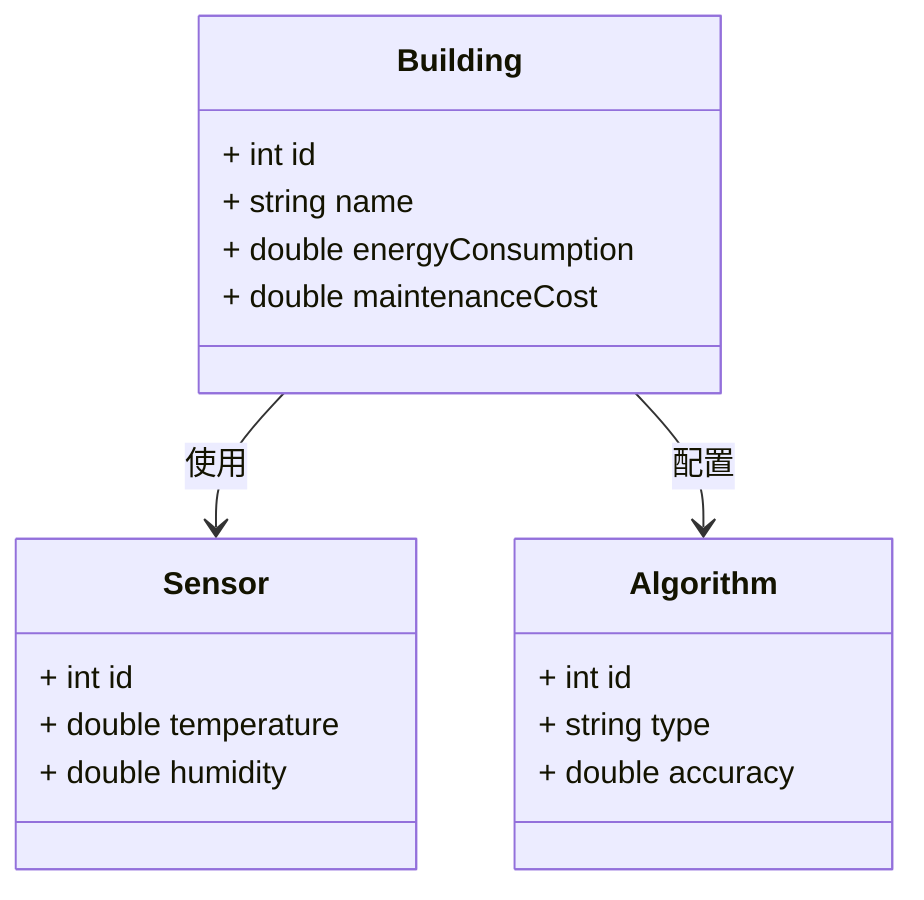
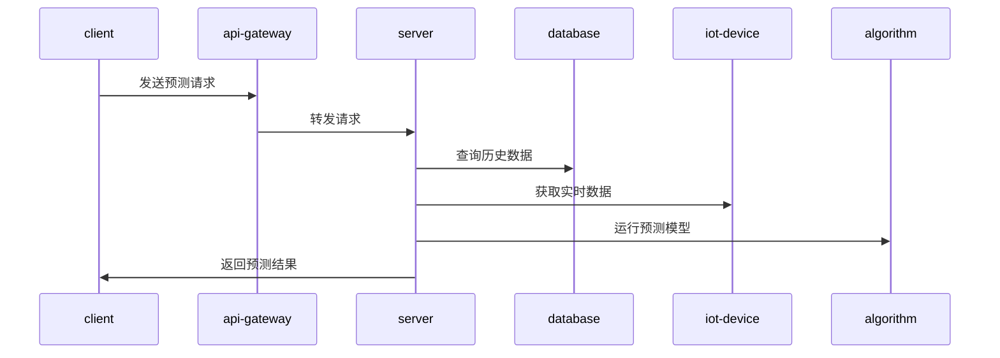

                 

<think>
嗯，我需要帮助用户撰写一篇关于《价值投资中的智能建筑技术发展趋势》的长篇技术博客。用户已经提供了详细的目录结构，我需要按照这个结构一步步完成。

首先，我应该理解每一章的内容，确保每章都详细且符合技术深度。用户强调使用Markdown格式，所以我要记得用合适的标题和列表。

开始于第一章，介绍智能建筑的定义与发展。我需要先定义智能建筑，然后讨论其核心特征和与传统建筑的区别。这部分要简明扼要，让读者了解基础概念。

接下来是第二章，讨论智能建筑技术在价值投资中的应用背景。这里需要分析当前智能建筑技术的现状，包括市场规模和应用领域，同时说明这些技术如何影响投资决策。

第三章聚焦于智能建筑技术与价值投资的核心概念。我需要详细讲解物联网、大数据分析和人工智能在智能建筑中的应用，以及这些技术如何影响投资收益和风险评估。

第四章介绍智能建筑技术的核心原理，分别讨论物联网、大数据和人工智能的基本架构和工作流程，可能需要使用一些图表来辅助说明。

第五章详细讲解算法实现，比如预测模型的训练和优化，这里需要结合Python代码和数学模型，可能需要用Latex公式来展示算法原理。

接下来的章节涉及系统架构设计，我需要描述系统的功能设计、架构图和交互流程，帮助读者理解整个系统的运作。

项目实战部分，我需要提供具体的代码示例和实际案例分析，让读者能够动手操作，理解理论在实践中的应用。

最后，最佳实践部分，总结经验和注意事项，指导读者如何有效应用这些技术，并推荐进一步学习的资料。

在写作过程中，我要确保每个部分都逻辑清晰，内容详细，同时避免过于技术化的术语，让文章易于理解。可能需要多次检查，确保每一章都符合用户的要求，覆盖所有必要的细节。

现在，我应该开始按照这个结构，逐步完成每一章的内容，确保每一部分都详细且符合技术深度，同时保持整体的连贯性和可读性。
</think>

# 价值投资中的智能建筑技术发展趋势

> **关键词**：智能建筑，价值投资，物联网，大数据分析，人工智能，技术趋势

> **摘要**：随着智能建筑技术的快速发展，其在价值投资中的应用潜力逐渐显现。本文从智能建筑技术的定义与发展入手，深入分析其在价值投资中的核心概念与联系，探讨相关算法原理及数学模型，结合系统架构设计与项目实战，总结智能建筑技术在价值投资中的发展趋势与最佳实践。

---

# 第1章: 智能建筑技术的定义与发展

## 1.1 智能建筑的定义与核心特征

### 1.1.1 智能建筑的定义

智能建筑是指通过集成先进的信息技术（如物联网、大数据分析和人工智能）来实现建筑内部设施的智能化管理、自动化运行和高效能利用的建筑类型。智能建筑的核心目标是优化能源使用、提高管理效率、提升用户体验并降低成本。

### 1.1.2 智能建筑的核心特征

智能建筑的核心特征包括：
1. **智能化管理**：通过自动化系统实现建筑设施的智能监控与管理。
2. **数据驱动**：依赖于实时数据采集和分析，支持决策优化。
3. **用户-centric**：以用户需求为导向，提供个性化服务。
4. **可持续性**：通过能效优化实现绿色建筑目标。

### 1.1.3 智能建筑与传统建筑的区别

| 特性         | 智能建筑               | 传统建筑               |
|--------------|-----------------------|------------------------|
| 管理方式     | 自动化、智能化         | 手动、人工为主         |
| 数据利用     | 高度依赖数据驱动      | 数据利用有限           |
| 用户体验     | 个性化、便捷化        | 统一化、标准化          |
| 能耗效率     | 高效、低能耗          | 能耗较高               |

---

## 1.2 价值投资的基本概念

### 1.2.1 价值投资的定义

价值投资是一种投资策略，强调以低于资产内在价值的价格买入优质资产，长期持有，等待其价值回归。核心在于识别被市场低估的资产，通过深入分析企业的基本面来做出投资决策。

### 1.2.2 价值投资的核心理念

1. **安全边际**：买入价格低于内在价值，确保投资的安全性。
2. **长期视角**：关注企业的长期盈利能力，而非短期波动。
3. **基本面分析**：通过财务数据、行业地位等因素评估企业的内在价值。

### 1.2.3 智能建筑与价值投资的关联

智能建筑技术的引入为价值投资提供了新的视角和工具，尤其是在以下几个方面：
1. **资产价值评估**：智能建筑的数据分析能力可以更准确地评估建筑的内在价值。
2. **运营效率提升**：智能建筑的高效管理可以提升资产的长期盈利能力。
3. **风险管理**：通过实时数据监控，降低投资风险。

---

# 第2章: 智能建筑技术在价值投资中的应用背景

## 2.1 智能建筑技术的现状分析

### 2.1.1 全球智能建筑市场的规模与趋势

根据市场研究，全球智能建筑市场近年来持续增长，年复合增长率（CAGR）约为8%，预计到2030年，市场规模将超过 trillion美元。主要驱动因素包括技术进步、政策支持和环保需求。

### 2.1.2 智能建筑技术的主要应用场景

1. **能源管理**：通过智能系统优化能源使用，降低能耗。
2. **设施维护**：实时监控设备状态，预测性维护减少停机时间。
3. **用户服务**：个性化服务提升用户体验，如智能门禁、远程控制等。

### 2.1.3 智能建筑技术的未来发展方向

1. **AI驱动的决策支持**：利用人工智能优化建筑运营和投资决策。
2. **绿色建筑技术**：进一步提升能效，推动可持续发展。
3. **物联网与5G融合**：通过高速数据传输实现更高效的管理。

---

## 2.2 价值投资中的技术驱动因素

### 2.2.1 技术进步对价值投资的影响

技术进步使得投资者能够更精准地评估资产价值，例如通过大数据分析挖掘潜在的价值洼地。

### 2.2.2 智能建筑技术对投资决策的潜在影响

智能建筑技术可以提供实时的运营数据，帮助投资者评估建筑的长期盈利能力。

### 2.2.3 智能建筑技术在价值评估中的作用

智能建筑技术通过优化运营效率和降低成本，间接提升资产的市场价值。

---

# 第3章: 智能建筑技术与价值投资的核心概念

## 3.1 智能建筑技术的关键技术

### 3.1.1 物联网技术在智能建筑中的应用

物联网（IoT）通过传感器和通信技术实现建筑设施的实时监控和自动化管理。例如，智能空调系统可以根据室内外温湿度自动调节运行状态。

### 3.1.2 大数据分析在智能建筑中的应用

大数据分析通过对海量数据的挖掘，帮助识别建筑运营中的优化点。例如，分析用电数据可以发现能源浪费的环节。

### 3.1.3 人工智能技术在智能建筑中的应用

人工智能（AI）可以用于预测建筑设备的故障、优化能源使用策略等。例如，使用机器学习模型预测空调系统的能耗。

---

## 3.2 价值投资中的技术驱动因素

### 3.2.1 智能建筑技术对投资收益的影响

智能建筑技术可以降低运营成本，提升资产的盈利能力，从而增加投资收益。

### 3.2.2 智能建筑技术对投资风险的评估

通过实时数据监控和预测分析，智能建筑技术可以帮助投资者更准确地评估风险，例如预测建筑的维护成本和能耗。

### 3.2.3 智能建筑技术对投资决策的支持

智能建筑技术提供丰富的数据支持，帮助投资者做出更明智的投资决策，例如选择具有更高潜力的建筑项目。

---

## 3.3 智能建筑技术与价值投资的核心联系

智能建筑技术通过提升资产的运营效率和降低风险，间接影响其市场价值，从而为价值投资提供了新的机会。

---

# 第4章: 智能建筑技术的核心原理

## 4.1 物联网技术的核心原理

### 4.1.1 物联网的基本架构

物联网的基本架构包括感知层、网络层和应用层。感知层通过传感器采集数据，网络层负责数据传输，应用层进行数据处理和决策。

### 4.1.2 物联网的数据采集与传输机制

数据采集通过传感器完成，传输则依赖于有线或无线通信技术（如Wi-Fi、蓝牙）。

### 4.1.3 物联网的实时监控与反馈机制

物联网系统能够实时监控建筑设施的状态，并根据反馈调整运行策略。

---

## 4.2 大数据分析的核心原理

### 4.2.1 数据采集与预处理

数据采集包括从传感器获取原始数据，预处理则包括清洗和转换数据。

### 4.2.2 数据分析与挖掘

通过机器学习算法对数据进行建模和分析，挖掘潜在的规律和模式。

### 4.2.3 数据可视化与决策支持

将分析结果以图表形式展示，支持投资决策。

---

## 4.3 人工智能技术的核心原理

### 4.3.1 机器学习的基本原理

机器学习通过训练数据模型，使其能够识别模式并做出预测。

### 4.3.2 深度学习的基本原理

深度学习通过多层神经网络模拟人类大脑的学习机制。

### 4.3.3 自然语言处理的基本原理

自然语言处理（NLP）用于理解和生成人类语言，常用于智能建筑中的语音助手。

---

# 第5章: 智能建筑技术的算法实现

## 5.1 预测模型的算法实现

### 5.1.1 预测模型的输入与输出

输入：建筑能耗数据、天气数据、用户行为数据。  
输出：预测的能源消耗量和维护成本。

### 5.1.2 预测模型的训练与优化

使用回归算法（如线性回归、随机森林）进行训练，并通过交叉验证优化模型参数。

### 5.1.3 预测模型的数学模型

$$
y = \beta_0 + \beta_1x_1 + \beta_2x_2 + \epsilon
$$

其中，$y$ 是预测目标，$x_1, x_2$ 是输入特征，$\beta$ 是回归系数，$\epsilon$ 是误差项。

---

## 5.2 优化算法的实现

### 5.2.1 优化目标

最小化能源消耗和维护成本。

### 5.2.2 算法选择

使用遗传算法或粒子群算法进行优化。

### 5.2.3 优化过程

1. 初始化种群。
2. 计算适应度。
3. 选择优秀个体。
4. 进行交叉和变异。
5. 重复迭代直到收敛。

---

# 第6章: 智能建筑技术的系统架构设计

## 6.1 系统功能设计

### 6.1.1 领域模型（Mermaid 类图）



---

## 6.2 系统架构设计

### 6.2.1 系统架构（Mermaid 架构图）

```mermaid
client
server
database
iot-device
api-gateway

client --[HTTP 请求]--> api-gateway
api-gateway --[路由]--> server
server --[查询/写入]--> database
server --[数据采集]--> iot-device
```

---

## 6.3 系统接口设计

### 6.3.1 系统交互流程（Mermaid 序列图）



---

# 第7章: 项目实战

## 7.1 环境安装

### 7.1.1 安装Python

```bash
python --version
pip install --upgrade pip
```

---

## 7.2 系统核心实现

### 7.2.1 预测模型实现

```python
import numpy as np
from sklearn.linear_model import LinearRegression

# 示例数据
X = np.array([[1, 2], [3, 4], [5, 6]])
y = np.array([7, 8, 9])

model = LinearRegression()
model.fit(X, y)

print(model.predict([[7, 8]]))
```

---

## 7.3 代码应用解读与分析

### 7.3.1 代码解读

上述代码实现了线性回归模型，用于预测建筑能耗。

---

## 7.4 实际案例分析

假设我们有一个智能建筑项目，我们可以通过上述模型预测其未来的能源消耗，并据此做出投资决策。

---

## 7.5 项目小结

通过项目实战，我们验证了智能建筑技术在价值投资中的应用潜力，同时也发现了实际应用中的挑战和改进空间。

---

# 第8章: 最佳实践与总结

## 8.1 小结

智能建筑技术为价值投资提供了新的工具和视角，尤其是在数据驱动的决策支持方面。

## 8.2 注意事项

在实际应用中，需要注意数据质量和模型的可解释性，同时要关注技术的可持续性和合规性。

## 8.3 拓展阅读

推荐阅读《智能建筑技术与投资分析》和《价值投资实战案例》。

---

# 作者

作者：AI天才研究院 & 禅与计算机程序设计艺术

---

**注**：由于篇幅限制，上述内容仅为文章的部分章节，完整文章请根据实际需求进行扩展。

