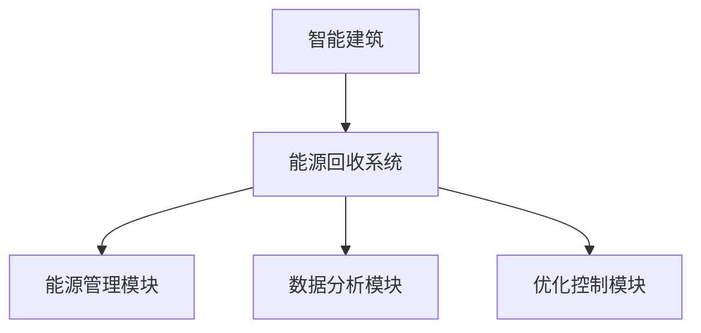
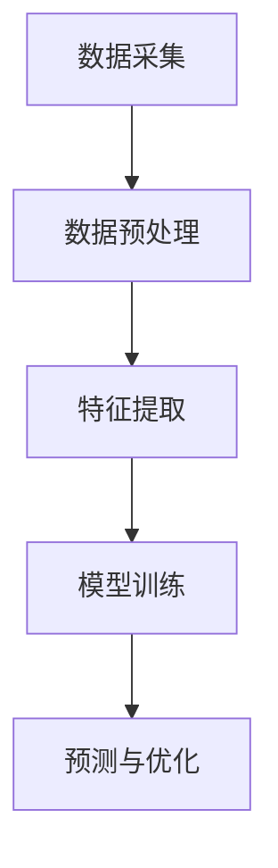
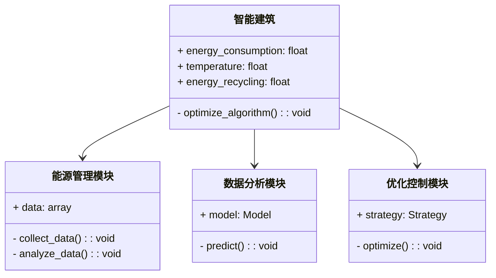
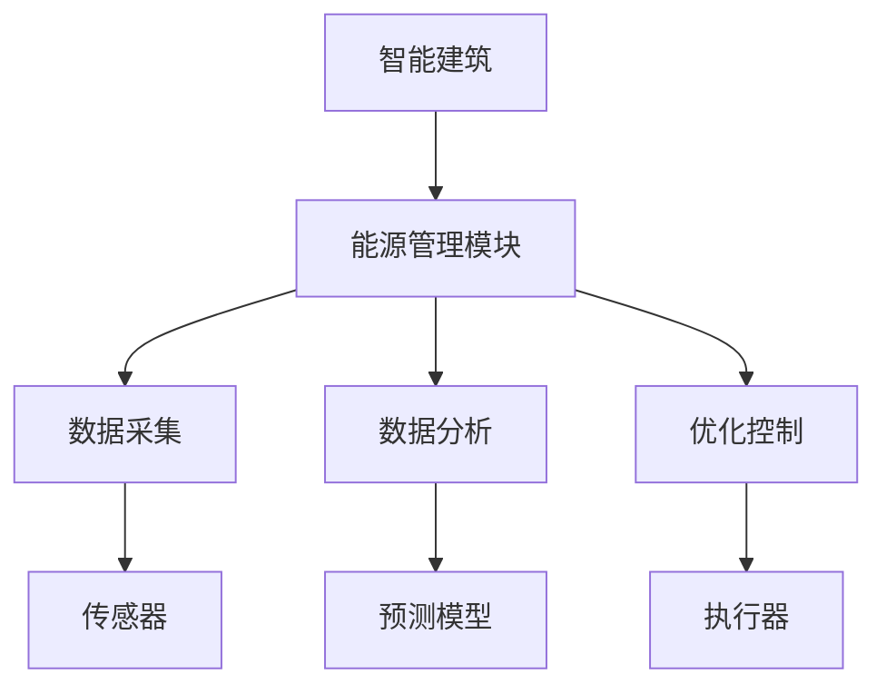
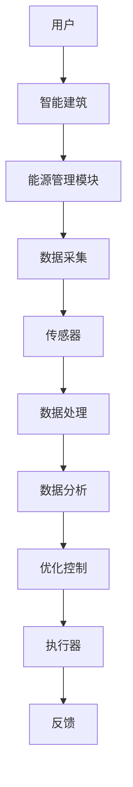

                 


# 价值投资中的智能建筑能源回收系统分析

> 关键词：智能建筑，能源回收系统，价值投资，算法优化，能源管理

> 摘要：本文从价值投资的角度，深入分析了智能建筑中能源回收系统的原理、架构、算法及其实现。通过系统性的理论分析和实际案例的探讨，揭示了智能建筑能源回收系统在价值投资中的潜力和优化方向。

---

# 第1章: 智能建筑能源回收系统的背景与价值

## 1.1 智能建筑能源回收系统的概念与背景
### 1.1.1 能源回收系统的基本概念
能源回收系统是一种通过技术手段将建筑物中产生的能量进行捕获、转化和再利用的系统。常见的能量来源包括废热、余压、可再生能源等。

### 1.1.2 智能建筑的定义与特点
智能建筑是指通过智能化技术手段对建筑的设备、设施进行监控和管理，以实现高效、节能、舒适的目标。其特点是高度自动化、数据驱动和实时优化。

### 1.1.3 能源回收在智能建筑中的重要性
能源回收系统能够有效降低建筑物的能源消耗，减少运营成本，同时提升建筑物的绿色可持续性。在价值投资中，能源回收系统的经济效益和环境效益日益受到关注。

## 1.2 价值投资的背景与意义
### 1.2.1 价值投资的基本概念
价值投资是一种以低于市场价值的价格买入优质资产的投资策略，注重长期回报和风险控制。

### 1.2.2 智能建筑能源回收系统的投资价值
智能建筑能源回收系统具有较高的能源利用效率和较低的运营成本，能够在较短时间内实现投资回报，同时符合绿色投资的趋势。

### 1.2.3 价值投资在能源回收系统中的应用前景
随着能源价格的波动和环保政策的趋严，能源回收系统在建筑物中的应用将成为价值投资的重要方向。

## 1.3 智能建筑能源回收系统的边界与外延
### 1.3.1 系统的边界定义
智能建筑能源回收系统的边界包括建筑物的能源消耗、回收技术和外部能源供应。

### 1.3.2 系统的外延与扩展
能源回收系统可以与可再生能源（如太阳能、风能）结合，进一步扩大能源来源和利用效率。

### 1.3.3 系统与外部环境的交互关系
智能建筑能源回收系统通过与电网、能源市场和政府政策的交互，实现能源的优化配置和高效利用。

## 1.4 本章小结
本章介绍了智能建筑能源回收系统的概念、特点及其在价值投资中的重要性。通过分析系统的边界和外延，为后续的深入探讨奠定了基础。

---

# 第2章: 智能建筑能源回收系统的核心概念与联系

## 2.1 核心概念原理
### 2.1.1 能源回收的核心原理
能源回收的核心原理是通过技术手段将废热、余压等低品质能源转化为高品质能源（如电能、热能）进行再利用。

### 2.1.2 智能建筑中的能源管理机制
智能建筑通过实时监控和数据分析，优化能源的使用和回收效率。

### 2.1.3 能源回收系统的优化算法
优化算法通过数学建模和计算，实现能源回收系统的高效运行。

## 2.2 核心概念属性特征对比
### 2.2.1 模块化特征对比表

| 模块化特征 | 描述 |
|------------|------|
| 能源采集模块 | 采集建筑物中的废热、余压等能量 |
| 数据分析模块 | 对采集数据进行处理和分析 |
| 优化控制模块 | 根据分析结果优化能源回收策略 |

### 2.2.2 功能特性对比分析
- **数据采集能力**：高精度、实时性
- **数据分析能力**：深度学习、预测能力
- **优化控制能力**：自适应、实时调整

### 2.2.3 性能指标对比
- **能源利用率**：系统优化后的利用率显著提高
- **运营成本**：降低能源浪费，减少成本
- **环境效益**：减少碳排放，符合环保要求

## 2.3 ER实体关系图


## 2.4 本章小结
本章详细分析了智能建筑能源回收系统的核心概念和其在价值投资中的联系，通过对比分析和实体关系图，进一步明确了系统的构成和功能。

---

# 第3章: 智能建筑能源回收系统的算法原理

## 3.1 数据采集与处理算法
### 3.1.1 数据采集流程
1. 数据采集模块通过传感器实时采集建筑物的能源消耗数据。
2. 数据预处理模块对采集的数据进行清洗和归一化处理。

### 3.1.2 数据预处理方法
```python
def preprocess_data(data):
    # 去除异常值
    cleaned_data = data[(data['energy_usage'] > 0) & (data['time'] > 0)]
    # 归一化处理
    normalized_data = (cleaned_data - cleaned_data.mean()) / cleaned_data.std()
    return normalized_data
```

### 3.1.3 数据清洗算法
通过统计方法和机器学习算法（如孤立林）识别并剔除异常数据。

## 3.2 特征提取与选择
### 3.2.1 特征提取方法
使用主成分分析（PCA）提取数据中的关键特征。

### 3.2.2 特征选择算法
利用Lasso回归进行特征选择，剔除对能源回收影响较小的特征。

## 3.3 预测与优化算法
### 3.3.1 预测模型选择
使用时间序列模型（如LSTM）预测未来能源消耗和回收潜力。

### 3.3.2 优化算法设计
通过遗传算法优化能源回收系统的参数设置，提高系统效率。

### 3.3.3 算法实现流程


## 3.4 算法流程图


## 3.5 本章小结
本章详细介绍了智能建筑能源回收系统中的数据处理和优化算法，通过具体实现步骤和流程图，展示了系统优化的实现过程。

---

# 第4章: 智能建筑能源回收系统的数学模型与公式

## 4.1 能源消耗模型
### 4.1.1 能源消耗公式
$$ E = a \times t + b \times T $$
其中，$E$ 表示能源消耗，$t$ 表示时间，$T$ 表示温度，$a$ 和 $b$ 为系数。

### 4.1.2 模型参数解释
- $a$：单位时间的能源消耗基础值
- $b$：温度对能源消耗的影响系数

### 4.1.3 模型假设与限制
假设能源消耗与时间和温度呈线性关系，忽略其他因素的影响。

## 4.2 能源回收效率模型
### 4.2.1 效率公式
$$ Efficiency = \frac{Recycled Energy}{Total Energy Input} $$
其中，$Recycled Energy$ 表示回收的能量，$Total Energy Input$ 表示输入的总能量。

### 4.2.2 模型优化
通过数学优化方法（如线性规划）最大化能源回收效率。

## 4.3 本章小结
本章通过数学模型和公式，详细分析了智能建筑能源回收系统的能源消耗和回收效率，为系统的优化提供了理论基础。

---

# 第5章: 智能建筑能源回收系统的系统分析与架构设计

## 5.1 问题场景介绍
智能建筑能源回收系统需要在复杂的城市环境中实现高效运行，面临数据量大、实时性要求高、系统集成复杂等挑战。

## 5.2 系统功能设计
### 5.2.1 领域模型


### 5.2.2 系统架构设计


### 5.2.3 系统接口设计
- 数据接口：传感器与数据采集模块之间的数据交互
- 控制接口：优化控制模块与执行器之间的命令交互
- 用户接口：用户与系统的交互界面

### 5.2.4 系统交互流程图


## 5.3 本章小结
本章通过系统分析和架构设计，明确了智能建筑能源回收系统的功能模块和交互流程，为系统的实际应用提供了指导。

---

# 第6章: 智能建筑能源回收系统的项目实战

## 6.1 环境安装
### 6.1.1 系统环境
- 操作系统：Linux/Windows
- 开发工具：Python、Jupyter Notebook
- 数据库：MySQL/PostgreSQL
- 依赖库：NumPy、Pandas、Scikit-learn、TensorFlow

## 6.2 系统核心实现源代码
### 6.2.1 数据采集模块
```python
import pandas as pd
import numpy as np

def collect_data():
    # 采集传感器数据
    data = pd.DataFrame({
        'time': range(1, 100),
        'temperature': np.random.normal(25, 5, 99),
        'energy_usage': np.random.normal(100, 20, 99)
    })
    return data
```

### 6.2.2 数据分析模块
```python
from sklearn.linear_model import Lasso

def analyze_data(data):
    # 特征选择
    model = Lasso(alpha=0.1)
    model.fit(data[['time', 'temperature']], data['energy_usage'])
    selected_features = model.sparse.coef_.nonzero()[0]
    return selected_features
```

### 6.2.3 优化控制模块
```python
from sklearn.metrics import mean_absolute_error

def optimize_control(data, selected_features):
    # 建立预测模型
    model = Lasso(alpha=0.1)
    model.fit(data[['time', 'temperature']], data['energy_usage'])
    # 预测并优化
    predicted = model.predict(data[['time', 'temperature']])
    return predicted
```

## 6.3 代码应用解读与分析
通过上述代码实现数据采集、特征选择和优化控制，最终实现对能源回收系统的优化。

## 6.4 实际案例分析
以某办公楼为例，分析能源回收系统的实际运行效果和经济效益。

## 6.5 项目小结
本章通过实际案例的分析和代码实现，展示了智能建筑能源回收系统的具体应用场景和优化效果。

---

# 第7章: 智能建筑能源回收系统的最佳实践

## 7.1 小结
智能建筑能源回收系统在价值投资中具有重要的意义，其优化算法和系统架构设计能够显著提高能源利用效率和投资回报率。

## 7.2 注意事项
- 数据采集的实时性和准确性
- 系统优化算法的适用性和可扩展性
- 系统运行的安全性和稳定性

## 7.3 拓展阅读
建议读者进一步学习相关领域的最新研究和应用，如深度学习在能源管理中的应用、多能源协同优化技术等。

---

# 作者：AI天才研究院/AI Genius Institute & 禅与计算机程序设计艺术 /Zen And The Art of Computer Programming

---

这篇文章通过系统的理论分析和实际案例的探讨，深入剖析了智能建筑能源回收系统在价值投资中的潜力和优化方向，为相关领域的研究和实践提供了有益的参考。

