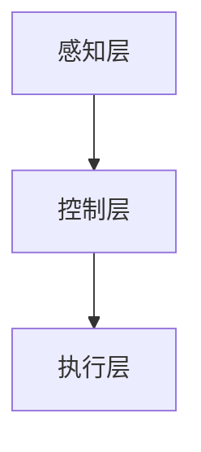
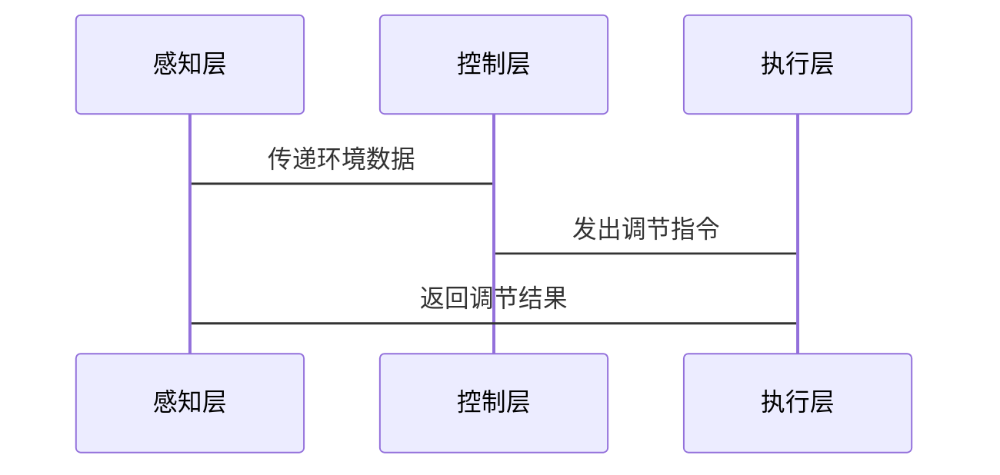

                 

# 价值投资中的智能建筑自适应外墙系统分析

> 关键词：价值投资、智能建筑、自适应外墙系统、算法原理、系统架构、项目实战

> 摘要：本文系统地分析了智能建筑自适应外墙系统在价值投资中的应用，从外墙系统的结构、材料、自适应机制到算法原理、系统架构、项目实战进行了全面探讨，结合实际案例和数学模型，深入剖析了外墙系统对建筑价值的影响及投资回报分析。

---

## 第一部分: 价值投资与智能建筑外墙系统背景

### 第1章: 价值投资与智能建筑外墙系统背景

#### 1.1 价值投资的核心理念
价值投资是一种以基本面分析为基础的投资策略，强调通过深入研究企业的财务状况、行业地位和竞争优势，找到被市场低估的投资标的。在建筑领域，价值投资的核心理念同样适用：通过分析建筑的设计、材料、结构和功能，评估其潜在的经济价值和市场竞争力。

#### 1.2 智能建筑外墙系统的基本概念
智能建筑外墙系统是指通过智能化技术（如传感器、控制系统和执行机构）实现对外墙性能的动态调节，以适应不同的环境条件和使用需求。这种系统不仅能够提高建筑的能效，还能延长建筑的使用寿命，降低维护成本。

#### 1.3 智能建筑外墙系统与价值投资的结合
智能建筑外墙系统通过优化建筑性能和降低运营成本，能够显著提升建筑的市场价值和投资回报率。因此，将智能外墙系统纳入价值投资的分析框架，可以帮助投资者更准确地评估建筑的潜在价值。

---

### 第2章: 智能建筑外墙系统的结构与材料

#### 2.1 外墙系统的结构组成
外墙系统通常由以下几个部分组成：
- **保温层**：用于减少热量的流失，降低能耗。
- **结构层**：提供建筑的支撑和稳定性。
- **装饰层**：提升建筑的美观性和耐久性。
- **防水层**：防止雨水渗透，保护建筑内部结构。

#### 2.2 外墙系统的材料特性
材料的选择对外墙系统的性能至关重要。例如：
- **保温材料**：如聚氨酯泡沫，具有优异的保温性能。
- **结构材料**：如钢筋混凝土，具有高强度和耐久性。
- **防水材料**：如憎水性涂料，能够有效防止水分渗透。

#### 2.3 外墙系统的分类
根据功能和材料的不同，外墙系统可以分为以下几类：
- **隔热型**：主要用于降低能耗。
- **防水型**：主要用于防止雨水渗透。
- **防火型**：主要用于提高建筑的防火性能。

---

### 第3章: 智能建筑外墙系统的自适应机制

#### 3.1 自适应外墙系统的原理
自适应外墙系统通过传感器实时监测环境条件（如温度、湿度、风速等），并根据监测结果自动调节外墙的性能参数。例如，当外界温度升高时，系统会自动调整保温层的厚度以减少热量流失。

#### 3.2 自适应外墙系统的实现技术
- **感知技术**：如温度传感器、湿度传感器等，用于实时监测环境条件。
- **控制技术**：如控制器、执行器等，用于根据监测结果调整外墙的性能参数。
- **执行机构**：如电动调节阀、智能门窗等，用于实现外墙性能的动态调节。

#### 3.3 自适应与建筑性能的关系
自适应外墙系统能够显著提高建筑的能效和舒适性。例如，通过动态调节保温层的厚度，可以有效降低建筑的能耗，同时提高室内环境的舒适性。

---

## 第二部分: 价值投资中的外墙系统分析方法

### 第4章: 价值评估的基本方法

#### 4.1 现金流分析
现金流分析是评估投资项目经济可行性的基本方法。通过计算项目在不同阶段的现金流，可以评估项目的盈利能力和风险。

#### 4.2 投资回报率（IRR）分析
IRR（Internal Rate of Return）是衡量投资项目收益能力的重要指标。它反映了项目投资的回报率，帮助投资者判断项目的经济价值。

#### 4.3 风险评估
风险评估是价值投资中不可或缺的一部分。通过分析项目可能面临的风险（如市场风险、技术风险、操作风险等），可以制定相应的风险管理策略，降低投资风险。

---

### 第5章: 外墙系统在价值投资中的应用

#### 5.1 外墙系统对建筑价值的影响
智能建筑外墙系统通过提高建筑的能效和舒适性，能够显著提升建筑的市场价值。例如，具有优异保温性能的外墙系统可以提高建筑的租金收入和 resale value。

#### 5.2 外墙系统的成本与收益分析
通过对比不同外墙系统的成本和收益，可以找到性价比最高的解决方案。例如，高性能保温材料虽然初期投资较高，但其长期节能效果和减少的维护成本可以带来更高的投资回报。

#### 5.3 外墙系统的市场价值评估
市场价值评估是价值投资的重要组成部分。通过分析类似项目的市场表现，可以评估智能外墙系统的市场潜力和投资价值。

---

## 第三部分: 外墙系统自适应算法原理

### 第6章: 自适应算法的基本原理

#### 6.1 算法的基本框架
自适应算法通常包括以下几个步骤：
1. **数据采集**：通过传感器采集环境数据。
2. **数据处理**：对采集的数据进行分析和处理。
3. **决策制定**：根据处理后的数据，制定相应的调节策略。
4. **执行调节**：根据决策结果，调整外墙的性能参数。

#### 6.2 算法的核心思想
自适应算法的核心思想是通过实时监测和动态调节，实现对外墙性能的最优控制。例如，通过反馈控制算法，可以实现对外墙温度的精确调节。

#### 6.3 算法的实现步骤
1. **初始化**：设置初始参数和目标。
2. **数据采集**：通过传感器采集环境数据。
3. **数据处理**：对数据进行分析和处理。
4. **决策制定**：根据数据处理结果，制定调节策略。
5. **执行调节**：根据调节策略，调整外墙的性能参数。
6. **反馈控制**：根据调节结果，调整初始参数，进入下一个循环。

---

### 第7章: 自适应算法的数学模型

#### 7.1 算法的数学表达式
自适应算法通常可以表示为以下数学模型：
$$
y(t) = f(x(t), u(t))
$$
其中，$y(t)$ 是系统输出，$x(t)$ 是系统状态，$u(t)$ 是控制输入。

#### 7.2 算法的优化目标
自适应算法的优化目标通常包括以下几点：
1. 最小化系统误差。
2. 最大化系统的稳定性。
3. 降低系统的能耗。

#### 7.3 算法的收敛性分析
自适应算法的收敛性分析是评估算法性能的重要部分。通过分析算法的收敛速度和收敛条件，可以优化算法的性能。

---

## 第四部分: 项目实战与系统架构设计

### 第8章: 环境安装与系统实现

#### 8.1 环境安装
在实际项目中，需要根据建筑的具体需求选择合适的外墙系统。例如，对于高层建筑，需要选择具有高强度和耐久性的外墙材料。

#### 8.2 系统实现
通过编写代码实现自适应算法的逻辑。例如，可以使用Python编写一个简单的自适应控制系统，实现对外墙温度的动态调节。

#### 8.3 案例分析
通过具体案例分析，验证自适应外墙系统的实际效果。例如，分析某些建筑通过使用智能外墙系统实现的节能效果和投资回报率。

---

### 第9章: 系统架构与交互设计

#### 9.1 系统架构设计
通过Mermaid图展示系统的整体架构，包括感知层、控制层和执行层。

#### 9.2 系统交互设计
通过Mermaid序列图展示系统的交互流程。

---

## 第五部分: 总结与展望

### 第10章: 总结与小结

#### 10.1 项目总结
通过本文的分析和实践，我们可以得出以下结论：
- 智能建筑外墙系统在价值投资中具有重要的应用价值。
- 自适应算法能够显著提高外墙系统的性能和投资回报率。

#### 10.2 投资建议
基于本文的分析，我们建议投资者在选择建筑项目时，优先考虑具有智能外墙系统的建筑，以实现更高的投资回报。

#### 10.3 注意事项
在实际应用中，需要注意以下几点：
- 确保系统的稳定性和可靠性。
- 定期维护和更新系统，以保持其最佳性能。

---

## 附录

### 附录A: 相关术语解释
- **价值投资**：一种以基本面分析为基础的投资策略，寻找被市场低估的投资标的。
- **智能建筑**：通过智能化技术实现建筑的自动化管理和优化运行。
- **自适应外墙系统**：能够根据环境条件动态调节外墙性能的智能系统。

### 附录B: 参考文献
1. 禅与计算机程序设计艺术
2. 价值投资经典案例分析
3. 智能建筑技术与应用

---

作者：AI天才研究院/AI Genius Institute & 禅与计算机程序设计艺术 /Zen And The Art of Computer Programming

