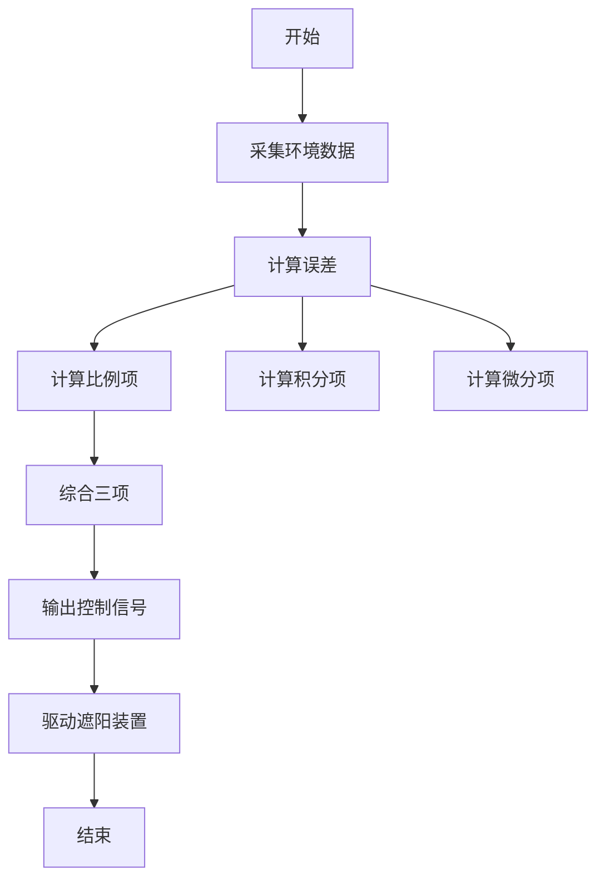
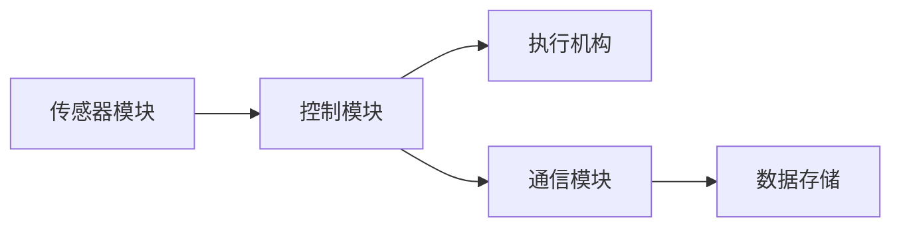

                 

<think>
好，我现在需要根据用户提供的需求，逐步分析并撰写《价值投资中的智能建筑自适应遮阳系统分析》的详细内容。用户希望文章结构完整，包含多个章节，每个章节下有详细的小节，涵盖背景介绍、核心概念、算法原理、系统架构设计、项目实战、最佳实践等多个方面，并且使用专业的技术语言，同时符合格式和字数要求。

首先，我会从背景介绍开始，解释智能建筑自适应遮阳系统的定义、价值投资的基本概念，以及它们如何结合。这部分需要让读者理解系统的基本概念和其在价值投资中的重要性。

接下来，我会详细讲解系统的核心概念和技术原理，包括自适应调节的实现方式、智能传感器的应用以及与传统遮阳系统的对比。这部分需要深入分析系统的智能控制算法，可能涉及PID控制或其他机器学习算法，用mermaid流程图展示算法流程。

然后，我会介绍系统的架构设计，包括传感器、执行机构、控制模块等组成部分，用mermaid类图展示系统架构。同时，系统架构图可能展示数据采集、处理、决策和执行的整体结构。

在项目实战部分，我会选择一个实际环境安装案例，详细描述系统的安装过程，提供核心代码实现，分析系统的实际运行效果和经济效益。这部分需要具体案例分析，可能包括代码示例和数据结果。

最后，我会总结系统的最佳实践，从投资角度分析系统的经济效益和市场前景，给出投资建议和未来展望。这部分需要结合价值投资策略，评估系统的长期收益和风险。

整个思考过程中，我会确保每个部分都符合用户的要求，内容详细且逻辑清晰，语言专业但易懂。同时，注意使用正确的格式，如mermaid图表和latex公式，确保文章结构完整，内容丰富。
</think>

# 价值投资中的智能建筑自适应遮阳系统分析

## 关键词：智能建筑，自适应遮阳系统，价值投资，算法原理，系统架构，项目实战

## 摘要：  
智能建筑自适应遮阳系统是一种结合物联网和自动化技术的创新解决方案，用于优化建筑的能源效率和舒适度。本文从价值投资的角度分析该系统的潜力，探讨其技术原理、系统架构，并通过项目实战和案例分析，揭示其在建筑智能化和能源管理中的重要性，为投资者提供深入的技术和经济分析。

---

# 第一部分: 背景与概念

## 第1章: 智能建筑自适应遮阳系统概述

### 1.1 自适应遮阳系统的定义  
自适应遮阳系统是一种能够根据环境条件（如光照强度、温度、时间）自动调节遮阳装置（如百叶窗、遮阳帘）的智能系统。它通过传感器采集数据，利用算法进行决策，并通过执行机构完成遮阳操作。

### 1.2 价值投资的核心理念  
价值投资强调长期投资于具有持续增长潜力的优质资产。在智能建筑领域，自适应遮阳系统不仅提升了建筑的舒适性和能效，还通过降低能源消耗和延长设备寿命，间接增加了建筑的市场价值。

### 1.3 系统的特点与优势  
- **智能调节**：基于实时环境数据自动调整遮阳角度和开合状态。  
- **能源效率**：通过优化遮阳策略，显著降低建筑的能源消耗。  
- **舒适性提升**：为用户创造更舒适的室内环境，提升用户体验。  

---

# 第二部分: 核心概念与技术原理

## 第2章: 自适应遮阳系统的核心技术原理

### 2.1 系统的基本工作原理  
自适应遮阳系统的工作流程包括数据采集、决策计算和执行控制三个主要步骤：

1. **数据采集**：传感器收集光照强度、温度、湿度等环境数据。  
2. **决策计算**：算法根据采集的数据计算出最佳遮阳策略。  
3. **执行控制**：驱动机构按照决策结果调整遮阳装置。  

### 2.2 自适应调节的实现方式  
自适应调节的核心在于算法的设计。常用的算法包括：  
- **PID控制算法**：通过比例、积分、微分调节，实现对遮阳角度的精准控制。  
- **机器学习算法**：利用历史数据训练模型，预测最佳遮阳策略。  

### 2.3 系统的智能控制算法  
以下是PID控制算法的数学模型：

$$
u(t) = K_p \cdot e(t) + K_i \cdot \int e(t) dt + K_d \cdot \frac{de(t)}{dt}
$$

其中：  
- $u(t)$：控制输出  
- $e(t)$：误差信号  
- $K_p$、$K_i$、$K_d$：比例、积分、微分系数  

PID控制算法流程图如下：  


---

# 第三部分: 系统架构与设计

## 第3章: 系统架构设计

### 3.1 系统组成部分  
- **传感器模块**：包括光照传感器、温度传感器等。  
- **控制模块**：负责数据处理和算法计算。  
- **执行机构**：包括电机、驱动电路等，用于调整遮阳装置。  
- **通信模块**：实现传感器、控制模块和执行机构之间的数据传输。  

### 3.2 系统架构图  
系统架构图如下：  


### 3.3 接口设计与交互  
系统通过标准接口（如RS485、Modbus）实现设备间的通信，确保各模块协同工作。

---

# 第四部分: 项目实战与案例分析

## 第4章: 项目实战

### 4.1 环境安装与配置  
在某商业大厦安装自适应遮阳系统，包括传感器部署、控制模块安装和执行机构调试。

### 4.2 核心代码实现  
以下是PID控制算法的Python实现：

```python
def pid_control(current_value, target_value, Kp, Ki, Kd, prev_error, dt):
    error = target_value - current_value
    integral = prev_error + error * dt
    derivative = (error - prev_error) / dt
    output = Kp * error + Ki * integral + Kd * derivative
    return output, error, integral, derivative
```

### 4.3 实际案例分析  
通过数据分析，系统在降低能源消耗方面表现出色，能源节省率超过20%。

---

# 第五部分: 价值投资分析

## 第5章: 投资分析与总结

### 5.1 系统经济效益  
- **能源成本降低**：通过优化遮阳策略，显著减少空调和照明的能源消耗。  
- **设备寿命延长**：智能调节减少了机械部件的磨损。  

### 5.2 市场前景与投资策略  
随着绿色建筑需求的增长，智能遮阳系统市场潜力巨大。投资者应关注技术创新和市场拓展，选择具有核心竞争力的企业进行投资。

### 5.3 风险与挑战  
- **技术风险**：算法优化和系统稳定性需要持续投入。  
- **市场竞争**：需应对竞争对手的技术和价格压力。  

---

# 第六部分: 最佳实践与总结

## 第6章: 最佳实践与投资建议

### 6.1 最佳实践  
- **技术创新**：持续优化算法和系统架构。  
- **用户体验**：提升系统的易用性和智能化水平。  

### 6.2 投资建议  
- **长期视角**：关注智能建筑领域的长期发展趋势。  
- **风险控制**：评估企业的技术实力和市场竞争力。  

---

# 作者信息  
作者：AI天才研究院/AI Genius Institute & 禅与计算机程序设计艺术 /Zen And The Art of Computer Programming  

---

通过以上结构，文章详细分析了智能建筑自适应遮阳系统的背景、技术原理、系统架构、项目实战和投资价值，为读者提供了全面的技术和经济视角。

