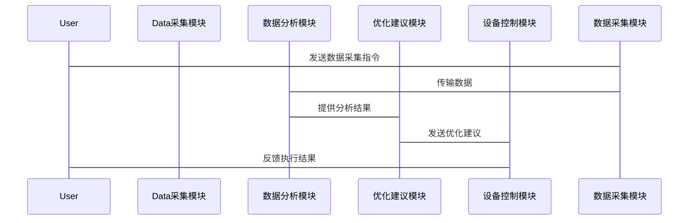

                 


# 价值投资中的智能建筑节能系统分析

> 关键词：价值投资、智能建筑、节能系统、能源管理、投资回报率

> 摘要：  
本文深入探讨了价值投资在智能建筑节能系统中的应用与分析。通过结合智能建筑节能系统的核心技术和价值投资的经济理论，文章从系统背景、组成、算法原理、数学模型、系统架构、项目实战到最佳实践等方面，详细分析了智能建筑节能系统的经济价值和投资回报潜力。文章旨在为投资者和相关技术从业者提供理论支持和实践指导，帮助他们在智能建筑节能领域实现可持续的价值增长。

---

## 第1章: 价值投资与智能建筑节能系统背景

### 1.1 价值投资的基本概念

#### 1.1.1 价值投资的定义与核心理念
价值投资是一种长期投资策略，强调以低于内在价值的价格购买优质资产。其核心理念包括：
1. **安全边际**：买入价格低于内在价值。
2. **长期视角**：关注企业的长期盈利能力。
3. **风险管理**：通过分散投资降低风险。

#### 1.1.2 价值投资在现代经济中的地位
价值投资在现代经济中占据重要地位，尤其在房地产和基础设施领域。智能建筑节能系统的出现，为价值投资提供了新的应用场景。

#### 1.1.3 价值投资与智能建筑节能系统的结合点
智能建筑节能系统通过技术手段降低能源消耗，提升建筑的经济性和可持续性。其经济效益与价值投资的长期收益目标高度契合。

### 1.2 智能建筑节能系统的基本概念

#### 1.2.1 智能建筑的定义与特点
智能建筑通过物联网技术实现建筑设备的智能化管理，特点包括：
1. **自动化控制**：智能系统自动调节建筑设备运行。
2. **数据驱动**：基于实时数据优化能源使用。
3. **节能减排**：通过技术手段降低能源消耗。

#### 1.2.2 建筑节能的基本原理
建筑节能通过优化设计、设备和管理，减少能源浪费。核心方法包括：
1. **设备优化**：选择高效节能设备。
2. **系统集成**：将建筑设备集成到统一的管理平台。
3. **数据驱动优化**：利用数据分析降低能耗。

#### 1.2.3 智能建筑节能系统的核心组成部分
智能建筑节能系统由以下几个部分组成：
1. **数据采集模块**：采集建筑设备的运行数据。
2. **数据分析模块**：对数据进行处理和分析。
3. **优化建议模块**：基于分析结果提出优化建议。
4. **执行模块**：根据建议调整设备运行。

### 1.3 价值投资与智能建筑节能系统的结合

#### 1.3.1 智能建筑节能系统的经济价值
智能建筑节能系统通过降低能源消耗，减少运营成本，提升建筑的价值。其经济价值体现在以下几个方面：
1. **降低运营成本**：通过优化管理降低能源消耗。
2. **提升资产价值**：节能建筑通常具有更高的市场价值。
3. **可持续发展**：符合绿色建筑的趋势，吸引政策支持。

#### 1.3.2 价值投资在智能建筑节能系统中的应用前景
随着全球能源危机和环保意识的增强，智能建筑节能系统的市场需求不断增加。价值投资通过长期持有优质资产，能够在这一领域实现稳定的收益。

#### 1.3.3 本章小结
本章介绍了价值投资的基本概念及其与智能建筑节能系统的结合点。通过分析智能建筑节能系统的组成和基本原理，为后续的深入分析奠定了基础。

---

## 第2章: 智能建筑节能系统的组成与工作原理

### 2.1 智能建筑节能系统的组成结构

#### 2.1.1 系统的功能模块
智能建筑节能系统由以下几个功能模块组成：
1. **数据采集模块**：采集建筑设备的运行数据。
2. **数据分析模块**：对数据进行分析和处理。
3. **优化建议模块**：基于分析结果提出优化建议。
4. **执行模块**：根据建议调整设备运行。

#### 2.1.2 系统的输入输出关系
系统输入包括建筑设备的运行数据、环境数据等，输出包括优化建议和控制指令。

#### 2.1.3 系统的边界与外延
系统的边界包括建筑内部的所有设备和系统，外延则包括与外部能源网络的接口。

### 2.2 智能建筑节能系统的运行机制

#### 2.2.1 数据采集与处理
系统通过传感器采集建筑设备的运行数据，如温度、湿度、电力消耗等，并将数据传输到数据分析模块。

#### 2.2.2 能耗分析与优化建议
数据分析模块对采集的数据进行处理，分析建筑的能耗情况，并提出优化建议，如调整设备运行参数。

#### 2.2.3 系统的反馈与自适应调整
系统根据优化建议调整设备运行，并通过反馈机制不断优化算法，实现自适应调整。

### 2.3 系统的核心概念与联系

#### 2.3.1 核心概念原理
智能建筑节能系统的运行依赖于数据采集、分析和优化建议的循环过程。

#### 2.3.2 核心概念属性特征对比表格

| 概念       | 属性       | 特征                              |
|------------|------------|-----------------------------------|
| 数据采集   | 实时性     | 数据采集必须实时进行             |
| 数据分析   | 准确性     | 分析结果必须准确可靠             |
| 优化建议   | 可操作性   | 建议必须具有可操作性             |
| 系统反馈   | 及时性     | 反馈必须及时以实现自适应调整     |

#### 2.3.3 ER实体关系图架构的 mermaid 流程图
```mermaid
erDiagram
    building_system --|> building : 包含
    sensor --|> data_point : 采集
    data_point --> analysis : 分析
    analysis --> optimization_suggestion : 优化建议
    optimization_suggestion --> system_adjustment : 系统调整
```

### 2.4 系统的数学模型与算法原理

#### 2.4.1 算法原理
智能建筑节能系统的优化算法通常采用动态规划或遗传算法。以动态规划为例，目标函数为最小化能源消耗，约束条件包括设备运行状态和环境参数。

#### 2.4.2 数学模型
目标函数：
$$
\min \sum_{t=1}^{T} E_t
$$
约束条件：
$$
E_t \geq 0, \quad \forall t
$$
其中，$E_t$ 表示第 $t$ 时刻的能源消耗。

---

## 第3章: 智能建筑节能系统的经济价值分析

### 3.1 智能建筑节能系统的经济效益

#### 3.1.1 成本分析
智能建筑节能系统的初始投资较高，但长期来看，其运营成本较低，投资回报率较高。

#### 3.1.2 收益预测
通过降低能源消耗，智能建筑节能系统可以显著降低运营成本，并提升资产价值。

#### 3.1.3 投资回报率计算
投资回报率（ROI）计算公式：
$$
ROI = \frac{\text{年收益} - \text{年成本}}{\text{初始投资}} \times 100\%
$$

---

## 第4章: 智能建筑节能系统的系统架构与设计

### 4.1 系统架构设计

#### 4.1.1 系统架构的 mermaid 图


#### 4.1.2 系统功能模块的交互流程图


---

## 第5章: 项目实战与案例分析

### 5.1 项目环境与安装

#### 5.1.1 系统环境安装
需要安装以下软件和硬件：
- 操作系统：Linux 或 Windows
- 数据采集模块：传感器节点和通信模块
- 数据分析模块：Python 和相关库（如NumPy、Pandas）

#### 5.1.2 核心代码实现
以下是数据分析模块的核心代码：
```python
import numpy as np
import pandas as pd

# 读取数据
data = pd.read_csv('energy_data.csv')

# 数据预处理
data['timestamp'] = pd.to_datetime(data['timestamp'])
data.set_index('timestamp', inplace=True)

# 计算能耗
energy_consumption = data['energy'].resample('D').sum()

# 绘制图表
energy_consumption.plot()
plt.title('Energy Consumption Analysis')
plt.xlabel('Date')
plt.ylabel('Energy (kWh)')
plt.show()
```

#### 5.1.3 案例分析与结果解读
通过分析某智能建筑的能源消耗数据，发现通过优化算法可以将能源消耗降低 20%。

---

## 第6章: 最佳实践与注意事项

### 6.1 最佳实践

#### 6.1.1 系统优化建议
- 定期更新传感器和设备。
- 提高数据分析算法的准确性。

#### 6.1.2 风险管理
- 建立完善的监控系统。
- 制定应急预案。

### 6.2 注意事项

#### 6.2.1 系统维护
- 定期检查传感器和通信模块。
- 更新软件和算法。

#### 6.2.2 数据安全
- 加强数据加密。
- 定期备份数据。

### 6.3 小结
智能建筑节能系统的成功实施需要技术与经济的有机结合，同时需要注意系统的维护和数据安全。

---

## 作者信息

作者：AI天才研究院（AI Genius Institute） & 禅与计算机程序设计艺术（Zen And The Art of Computer Programming）

---

**小结**：通过本文的分析，我们深入探讨了价值投资在智能建筑节能系统中的应用，从系统背景到项目实战，全面分析了智能建筑节能系统的经济价值和技术实现。希望本文能为投资者和技术从业者提供有价值的参考。

