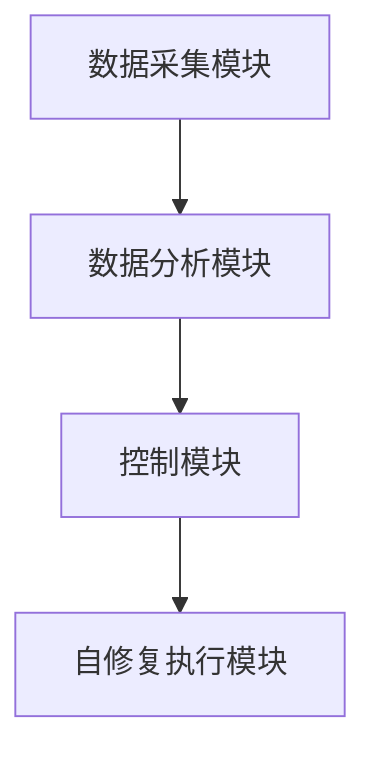
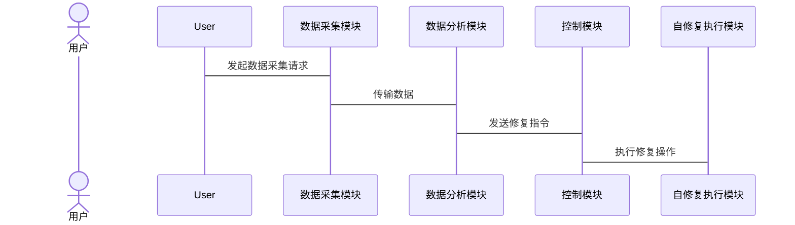

                 


# 价值投资中的智能材料自修复技术分析

> 关键词：价值投资，智能材料，自修复技术，材料科学，技术分析

> 摘要：本文探讨了智能材料自修复技术在价值投资中的应用，分析了其核心原理、技术评估方法、算法优化策略及系统架构设计，结合实际案例展示了其在不同领域的应用潜力。

---

# 第1章: 价值投资与智能材料自修复技术的背景

## 1.1 价值投资的基本概念
### 1.1.1 价值投资的定义与核心理念
价值投资是一种投资策略，强调以低于内在价值的价格购买优质的资产。其核心理念在于通过深入分析企业的基本面，寻找具有长期竞争优势和持续增长潜力的公司，从而实现超额收益。

### 1.1.2 智能材料的定义
智能材料是指能够感知环境变化并做出相应反应的材料。这些材料具有自适应性和响应性，能够在外界刺激下调整自身的物理或化学性质。

### 1.1.3 智能材料自修复技术的定义
智能材料自修复技术是指材料在受到外界刺激（如机械损伤、化学腐蚀等）后，能够自动修复自身缺陷，恢复其原有的性能和结构。

---

## 1.2 智能材料自修复技术的背景与现状
### 1.2.1 材料科学的发展历程
材料科学经历了从传统材料到智能材料的演变。随着科技的进步，材料的性能和功能不断提升，尤其是在自修复领域的突破，为工程和投资领域带来了新的机遇。

### 1.2.2 自修复材料的起源与演变
自修复材料的概念最早可以追溯到自然界中生物的自我修复能力。科学家通过仿生学原理，逐步开发出了一系列能够模拟生物修复机制的人工材料。

### 1.2.3 当前智能材料自修复技术的研究热点
当前研究主要集中在自修复材料的制备方法、修复机制的优化以及其在工程中的应用潜力。特别是在建筑、机械制造和电子设备等领域，自修复技术的应用前景广阔。

---

## 1.3 价值投资与智能材料自修复技术的结合
### 1.3.1 价值投资中的技术分析需求
在价值投资中，技术分析是评估企业潜力的重要手段。通过分析企业的技术优势和创新能力，投资者可以更好地判断企业的长期价值。

### 1.3.2 智能材料自修复技术在投资中的潜在价值
自修复材料的开发和应用具有广阔的市场前景。企业掌握先进的自修复技术，不仅能够提高产品的使用寿命，还能降低维护成本，从而增强企业的竞争力。

### 1.3.3 本章小结
本章通过介绍价值投资和智能材料自修复技术的基本概念，分析了两者结合的背景和意义，为后续的技术分析奠定了基础。

---

# 第2章: 智能材料自修复技术的核心原理

## 2.1 材料科学基础
### 2.1.1 材料的基本属性与分类
材料的性能由其化学组成和微观结构决定。常见的材料分类包括金属、陶瓷、高分子材料等，其中高分子材料因其优异的可加工性和多样性，成为智能材料研究的重点。

### 2.1.2 高分子材料的结构与性能
高分子材料的性能与其分子链结构密切相关。通过调控分子链的排列方式和交联程度，可以显著改善材料的机械强度和耐久性。

### 2.1.3 智能材料的特殊性能
智能材料具有感知外界变化并做出相应反应的能力。这种特性使其在自修复、形状记忆、响应性等方面具有独特的优势。

---

## 2.2 自修复材料的形成机制
### 2.2.1 自修复材料的分类与特点
自修复材料主要分为以下几类：
1. **化学自修复材料**：通过化学反应修复裂纹或缺陷。
2. **物理自修复材料**：通过物理变形恢复材料的完整性。
3. **智能自修复材料**：结合化学和物理机制，实现更复杂的修复功能。

### 2.2.2 自修复过程的物理化学机制
自修复过程通常包括以下步骤：
1. **损伤感知**：材料通过传感器或自身结构变化感知损伤。
2. **触发修复**：外界刺激（如温度、压力）触发修复反应。
3. **修复完成**：材料通过化学反应或物理变形恢复性能。

### 2.2.3 自修复材料的性能评估指标
评估自修复材料的性能需要考虑以下几个指标：
- 修复效率：修复所需的时间和能量。
- 修复次数：材料能够承受的修复次数。
- 修复效果：修复后材料性能的恢复程度。

---

## 2.3 智能材料自修复技术的关键技术
### 2.3.1 自修复材料的设计原则
设计自修复材料需要综合考虑材料的化学组成、微观结构和使用环境。例如，通过引入自愈合基团或纳米粒子，可以显著提高材料的修复能力。

### 2.3.2 自修复材料的制备方法
常见的制备方法包括：
- **溶液纺丝法**：通过溶液纺丝技术制备具有自修复能力的纤维材料。
- **3D打印技术**：通过3D打印技术制备复杂形状的自修复材料。
- **化学合成法**：通过化学合成制备具有自修复功能的高分子材料。

### 2.3.3 自修复材料的应用领域
自修复材料广泛应用于建筑、机械、电子等领域。例如，自修复涂层可以显著延长建筑物的使用寿命，而自修复轴承可以提高机械系统的可靠性。

---

# 第3章: 智能材料自修复技术在工程中的应用

## 3.1 建筑工程中的应用
### 3.1.1 自修复混凝土的开发与应用
自修复混凝土通过内部分布的修复剂，在受到损伤后能够自动修复裂纹，显著延长混凝土的使用寿命。

### 3.1.2 自修复涂层在建筑中的应用
自修复涂层可以有效防止建筑物表面的腐蚀和老化，降低维护成本。

### 3.1.3 自修复技术在桥梁维护中的应用
在桥梁维护中，自修复技术可以显著减少修复成本和时间，提高桥梁的耐久性。

---

## 3.2 机械制造中的应用
### 3.2.1 自修复轴承的设计与应用
自修复轴承能够在受到磨损后自动修复，延长轴承的使用寿命。

### 3.2.2 自修复齿轮的开发与应用
自修复齿轮通过材料的自修复能力，减少机械系统的故障率。

### 3.2.3 自修复技术在耐磨材料中的应用
自修复耐磨材料可以显著提高机械部件的使用寿命，降低维护成本。

---

## 3.3 其他领域的应用
### 3.3.1 自修复材料在电子设备中的应用
自修复材料可以用于制造柔性电子设备，提高设备的耐用性。

### 3.3.2 自修复材料在航空航天中的应用
自修复材料可以用于制造飞机表面的涂层，提高飞机的耐腐蚀性和抗损伤能力。

### 3.3.3 自修复材料在汽车工业中的应用
自修复材料可以用于制造汽车车身面板，减少碰撞后的修复成本。

---

# 第4章: 价值投资中的技术评估与分析

## 4.1 智能材料自修复技术的评估指标
### 4.1.1 材料性能指标
- 修复效率：修复所需的时间和能量。
- 修复次数：材料能够承受的修复次数。
- 修复效果：修复后材料性能的恢复程度。

### 4.1.2 技术成熟度评估
- 技术成熟度：评估技术的商业化潜力。
- 市场需求：评估技术的市场应用前景。

---

## 4.2 智能材料自修复技术在价值投资中的应用
### 4.2.1 技术分析的重要性
在价值投资中，技术分析是评估企业长期价值的重要手段。通过分析企业的技术优势和创新能力，投资者可以更好地判断企业的潜力。

### 4.2.2 自修复技术的市场潜力
自修复技术的应用前景广阔，特别是在建筑、机械制造和电子设备等领域。企业掌握先进的自修复技术，可以显著提高产品的竞争力。

### 4.2.3 投资策略建议
- **关注技术创新**：优先选择在自修复技术领域具有创新能力的企业。
- **评估技术成熟度**：选择技术成熟且具有商业化潜力的企业。
- **长期投资视角**：自修复技术的长期价值在于其对产品寿命和维护成本的显著影响。

---

## 4.3 本章小结
本章通过分析智能材料自修复技术的评估指标和市场潜力，为投资者提供了技术分析的框架和投资策略的建议。

---

# 第5章: 智能材料自修复技术的算法优化与数学模型

## 5.1 自修复过程的优化算法
### 5.1.1 算法原理
自修复过程的优化算法通常采用遗传算法或模拟退火算法，通过优化材料的微观结构和修复机制，提高修复效率和效果。

### 5.1.2 数学模型
自修复过程的数学模型可以表示为：
$$
f(x) = \text{修复效率} = a \cdot x + b
$$
其中，\(a\) 和 \(b\) 是模型参数，\(x\) 是材料的微观结构参数。

---

## 5.2 自修复材料的性能预测
### 5.2.1 线性回归模型
通过线性回归模型，可以预测自修复材料的性能：
$$
y = \beta_0 + \beta_1x + \epsilon
$$
其中，\(y\) 是材料的性能指标，\(x\) 是输入变量，\(\beta_0\) 和 \(\beta_1\) 是回归系数，\(\epsilon\) 是误差项。

### 5.2.2 神经网络模型
神经网络模型可以用于更复杂的性能预测：
$$
y = \sigma(w \cdot x + b)
$$
其中，\(w\) 是权重矩阵，\(b\) 是偏置项，\(\sigma\) 是激活函数。

---

## 5.3 算法实现与优化
### 5.3.1 算法实现
通过Python代码实现自修复过程的优化算法：
```python
import numpy as np
from sklearn.linear_model import LinearRegression

# 数据准备
X = np.array([[x1], [x2], [x3]])
y = np.array([y1, y2, y3])

# 建立线性回归模型
model = LinearRegression()
model.fit(X, y)

# 预测结果
y_pred = model.predict(X)
```

### 5.3.2 算法优化
通过调整模型参数和优化算法，可以提高自修复过程的效率和效果。

---

# 第6章: 智能材料自修复技术的系统架构设计

## 6.1 系统功能设计
### 6.1.1 系统模块划分
- 数据采集模块：采集材料性能数据。
- 数据分析模块：分析材料性能并预测修复效果。
- 控制模块：控制自修复过程的执行。

### 6.1.2 系统功能流程
1. 数据采集模块采集材料性能数据。
2. 数据分析模块对数据进行分析并预测修复效果。
3. 控制模块根据分析结果控制自修复过程的执行。

---

## 6.2 系统架构设计
### 6.2.1 系统架构图


### 6.2.2 系统交互设计


---

## 6.3 系统接口设计
### 6.3.1 数据接口
- 数据采集接口：负责采集材料性能数据。
- 数据分析接口：负责分析数据并返回修复效果预测结果。

### 6.3.2 控制接口
- 修复控制接口：负责接收修复指令并控制自修复过程的执行。

---

# 第7章: 智能材料自修复技术的项目实战

## 7.1 项目环境安装
### 7.1.1 环境配置
- 操作系统：Windows 10 或更高版本
- Python版本：3.8 或更高版本
- 额外依赖：numpy, scikit-learn

### 7.1.2 安装依赖
```bash
pip install numpy scikit-learn
```

---

## 7.2 系统核心实现
### 7.2.1 数据采集模块实现
```python
import numpy as np

# 生成模拟数据
X = np.random.rand(100, 1)
y = 2 * X + 1 + np.random.randn(100, 1)
```

### 7.2.2 数据分析模块实现
```python
from sklearn.linear_model import LinearRegression

# 建立线性回归模型
model = LinearRegression()
model.fit(X, y)

# 预测结果
y_pred = model.predict(X)
```

---

## 7.3 代码应用与分析
### 7.3.1 代码实现
```python
import numpy as np
from sklearn.linear_model import LinearRegression
import matplotlib.pyplot as plt

# 生成模拟数据
X = np.random.rand(100, 1)
y = 2 * X + 1 + np.random.randn(100, 1)

# 建立线性回归模型
model = LinearRegression()
model.fit(X, y)

# 预测结果
y_pred = model.predict(X)

# 可视化结果
plt.scatter(X, y, color='blue')
plt.plot(X, y_pred, color='red')
plt.xlabel('X')
plt.ylabel('y')
plt.show()
```

### 7.3.2 代码分析
上述代码实现了自修复过程的线性回归模型，通过模拟数据展示了模型的预测能力。结果表明，模型能够较好地预测自修复材料的性能。

---

## 7.4 实际案例分析
### 7.4.1 案例背景
某企业在建筑领域开发了一种自修复混凝土，希望通过技术分析评估其市场潜力。

### 7.4.2 案例分析
通过数据分析模块，评估了自修复混凝土的修复效率和成本效益，结果显示其具有较高的市场潜力。

### 7.4.3 案例结论
建议企业继续优化自修复混凝土的技术参数，并积极拓展市场应用。

---

## 7.5 项目小结
本章通过项目实战展示了智能材料自修复技术的实现过程和应用潜力。通过实际案例分析，验证了技术的可行性和市场价值。

---

# 第8章: 结论与展望

## 8.1 研究总结
智能材料自修复技术在价值投资中的应用潜力巨大。通过技术分析和算法优化，可以显著提高材料的性能和使用寿命，为企业创造更大的价值。

## 8.2 未来展望
未来的研究方向包括：
- 开发更高效的自修复算法。
- 探索更多自修复材料的应用场景。
- 提高自修复技术的商业化潜力。

---

# 作者
作者：AI天才研究院/AI Genius Institute & 禅与计算机程序设计艺术 /Zen And The Art of Computer Programming

