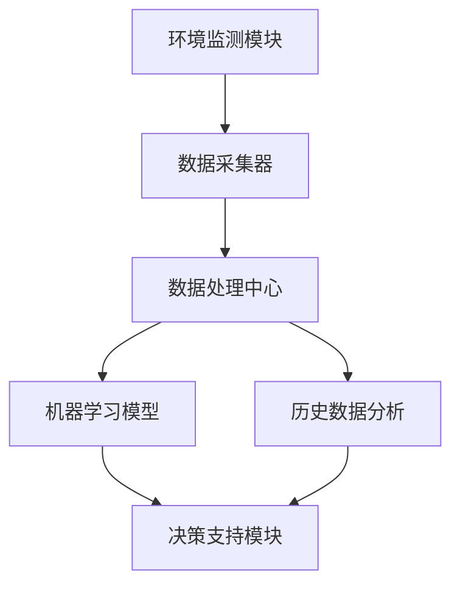
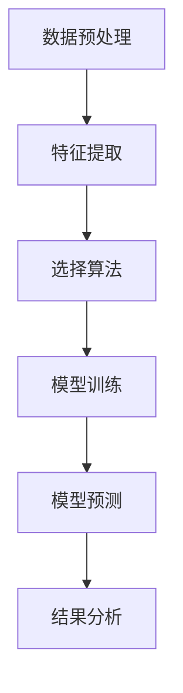
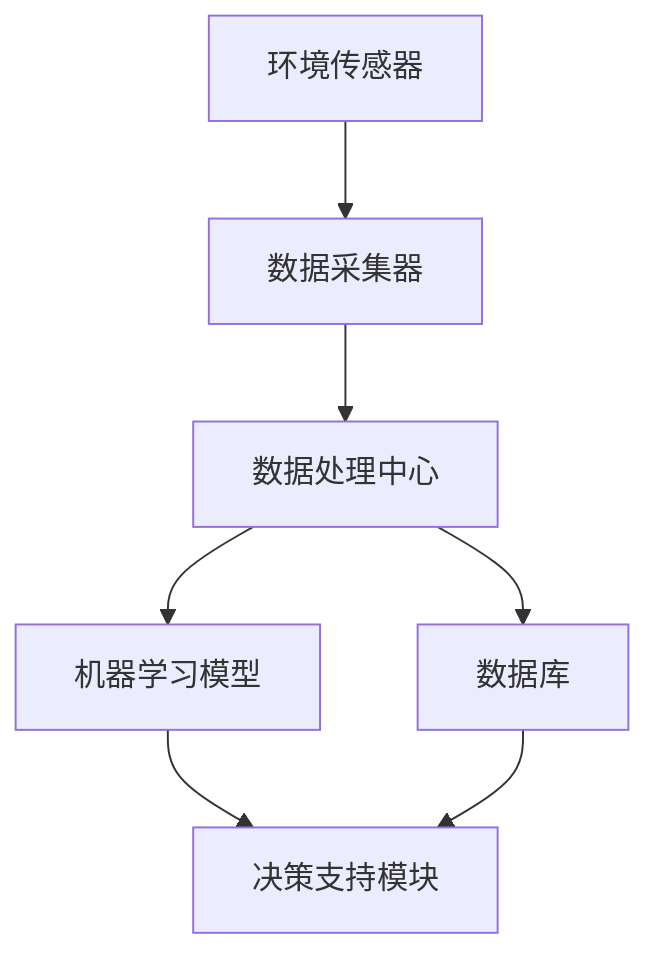

                 

<think>
好的，我现在要帮用户写一篇关于《价值投资中的智能海洋养殖系统分析》的技术博客文章。首先，我需要理解用户的需求。用户希望我以一位资深技术专家的身份，撰写一篇结构紧凑、逻辑清晰、内容深度的技术博客，涵盖价值投资与智能海洋养殖系统的结合，使用专业术语，但要保持易懂。

接下来，我需要按照用户提供的目录大纲来组织内容，确保每个部分都详细且有条理。我从摘要开始，然后是各个章节，每个章节下有不同的子主题，比如背景介绍、核心概念、算法原理等。

首先，在摘要部分，我需要简明扼要地概括文章的核心内容，强调智能海洋养殖系统如何帮助投资者做出更科学的决策，提高投资回报。

接下来是第一章，智能海洋养殖系统概述。我需要解释价值投资的基本概念，然后介绍智能海洋养殖系统的定义、特点以及它与价值投资的结合点。这部分需要让读者理解两者的结合如何提升养殖业的效率和可持续性。

第二章，系统的组成与功能。我需要详细描述系统各个模块，比如环境监测、生物监测和养殖管理，以及它们之间的相互作用。这部分可能需要图表来辅助说明，比如系统架构图，用Mermaid语言来绘制。

第三章，算法原理。这里我需要选择合适的机器学习算法，比如决策树或神经网络，并解释它们如何应用于预测和优化养殖过程。同时，提供代码示例，展示如何实现这些算法，并解释每个步骤的作用。

第四章，数学模型与公式。这里，我需要引入线性回归和时间序列预测等数学模型，用LaTeX公式来展示，并通过实例分析说明这些模型如何应用在实际养殖决策中。

第五章，系统分析与架构设计。我需要分析系统的各个组成部分，设计系统功能，可能需要使用类图和序列图来展示系统结构和交互过程。

第六章，项目实战。这部分需要选择一个具体案例，详细描述系统的实际应用，包括环境监测系统的安装、数据采集、分析和决策支持。提供代码示例，说明如何实现这些功能，并分析实际案例的结果。

最后，总结部分，回顾全文，强调系统的价值，并给出投资策略的建议，同时指出系统的优缺点和未来的发展方向。

在撰写过程中，我需要确保每个部分都详细且有条理，使用专业术语，但避免过于复杂，让读者能够轻松理解。同时，注意格式的正确性，比如Mermaid图表和LaTeX公式的正确嵌入。

现在，我开始按照这个思路逐步撰写每个部分的内容，确保覆盖所有关键点，逻辑清晰，内容详实。
</think>

# 价值投资中的智能海洋养殖系统分析

> 关键词：智能海洋养殖系统, 价值投资, 机器学习, 系统架构, 数学模型

> 摘要：智能海洋养殖系统通过整合先进的传感器、机器学习算法和数学模型，为投资者提供了科学的决策支持，优化了养殖过程，提高了投资回报率。本文详细分析了该系统的组成部分、算法原理、系统架构，并通过实际案例展示了其在价值投资中的应用。

---

# 第1章 智能海洋养殖系统概述

## 1.1 价值投资与智能养殖的结合

### 1.1.1 价值投资的核心概念
价值投资是一种以低于市场价值的价格购买优质资产的投资策略，强调基本面分析和长期回报。在智能海洋养殖系统中，价值投资可以帮助投资者识别高潜力的养殖项目，优化资源配置。

### 1.1.2 智能海洋养殖系统的定义与特点
智能海洋养殖系统利用物联网、大数据和人工智能技术，实时监测和优化养殖环境，提升养殖效率和产品质量。其特点是高效、精准和可持续。

### 1.1.3 价值投资在智能养殖中的应用前景
通过智能系统，投资者可以获取实时数据，评估养殖项目的潜力和风险，从而做出更科学的投资决策。

## 1.2 智能海洋养殖系统的背景与现状

### 1.2.1 全球海洋养殖业的发展趋势
随着对蛋白质需求的增长，海洋养殖业迅速发展，但传统养殖方式效率低下，资源浪费严重。

### 1.2.2 智能养殖技术的兴起
物联网、大数据和人工智能技术的进步推动了智能养殖系统的应用，提升了养殖业的可持续性。

### 1.2.3 当前养殖系统的主要问题
传统养殖面临环境监测不足、疾病控制困难和资源浪费等问题，制约了投资回报。

## 1.3 价值投资与智能养殖的结合点

### 1.3.1 智能养殖系统的核心要素
- **环境监测**：实时监测水温、溶解氧等关键指标。
- **生物监测**：跟踪鱼类健康状况。
- **养殖管理**：优化饲料投喂和疾病预防。

### 1.3.2 价值投资在养殖决策中的作用
投资者通过分析系统提供的数据，评估养殖项目的盈利能力和风险，制定最优投资策略。

### 1.3.3 智能养殖系统对投资决策的影响
系统提供实时数据和预测模型，帮助投资者做出更准确的决策，降低风险，提高收益。

## 1.4 本章小结
智能海洋养殖系统通过技术创新解决了传统养殖的痛点，为价值投资提供了科学依据，优化了投资回报。

---

# 第2章 智能海洋养殖系统的组成与功能

## 2.1 系统组成模块

### 2.1.1 环境监测模块
- 使用传感器监测水质参数（如温度、盐度、溶解氧）。
- 数据采集器实时传输数据，构建环境数据库。

### 2.1.2 生物监测模块
- 通过图像识别和传感器监测鱼类健康状况。
- 分析鱼类行为和生理指标，预测疾病风险。

### 2.1.3 养殖管理模块
- 优化饲料投喂和溶解氧控制。
- 提供疾病预防和治疗建议。

## 2.2 系统功能分析

### 2.2.1 数据采集与处理
- 传感器实时采集环境数据。
- 数据预处理和清洗，确保数据准确性。

### 2.2.2 数据分析与预测
- 利用机器学习模型预测水质变化和疾病风险。
- 分析历史数据，优化养殖策略。

### 2.2.3 决策支持与优化
- 提供基于数据的养殖决策支持。
- 自动生成优化建议，如饲料投喂时间和溶解氧调整。

## 2.3 系统架构图



## 2.4 本章小结
智能海洋养殖系统通过各模块协同工作，提供实时监测和优化建议，提升养殖效率和投资回报。

---

# 第3章 智能海洋养殖系统的算法原理

## 3.1 机器学习在养殖系统中的应用

### 3.1.1 机器学习算法的分类
- **监督学习**：用于分类和回归任务，如预测水质指标。
- **无监督学习**：用于聚类分析，识别异常数据。
- **深度学习**：用于图像识别和时间序列预测。

### 3.1.2 常见的机器学习算法
- **线性回归**：用于预测连续变量，如溶解氧浓度。
- **随机森林**：用于分类和回归，预测疾病风险。
- **LSTM网络**：用于时间序列预测，如预测水质变化趋势。

### 3.1.3 算法选择与优化
- 根据数据类型和任务选择合适算法。
- 通过交叉验证优化模型参数，提升预测准确性。

## 3.2 算法流程图



## 3.3 算法实现代码

### 数据预处理代码
```python
import pandas as pd
data = pd.read_csv('aquarium_data.csv')
data = data.dropna()
```

### 模型训练代码
```python
from sklearn.ensemble import RandomForestRegressor
model = RandomForestRegressor(n_estimators=100, random_state=42)
model.fit(X_train, y_train)
```

### 模型预测代码
```python
y_pred = model.predict(X_test)
```

## 3.4 本章小结
机器学习算法为智能海洋养殖系统提供了强大的数据处理和预测能力，帮助投资者做出科学决策。

---

# 第4章 智能海洋养殖系统的数学模型与公式

## 4.1 数学模型的构建

### 4.1.1 数据分析模型
- 线性回归模型用于预测水质参数。
- 时间序列模型用于预测未来水质变化。

### 4.1.2 预测模型
- **线性回归公式**：
  $$ y = \beta_0 + \beta_1x + \epsilon $$
- **时间序列预测公式**：
  $$ \hat{y}_t = \alpha y_{t-1} + (1-\alpha) \hat{y}_{t-1} $$

### 4.1.3 优化模型
- 使用优化算法（如遗传算法）调整养殖参数，提升效率。

## 4.2 数学公式的详细讲解

### 线性回归的实例分析
假设我们有温度和溶解氧的数据，建立线性回归模型：
$$ DO = \beta_0 + \beta_1 \times Temperature + \epsilon $$

### 时间序列预测的实例分析
使用LSTM网络预测未来24小时的溶解氧浓度，公式如下：
$$ \hat{y}_t = \alpha y_{t-1} + (1-\alpha) \hat{y}_{t-1} $$

## 4.3 本章小结
数学模型为智能海洋养殖系统提供了科学的预测工具，帮助投资者优化养殖策略。

---

# 第5章 智能海洋养殖系统的系统分析与架构设计

## 5.1 系统分析

### 5.1.1 问题场景介绍
- **问题**：传统养殖系统效率低，难以实时监控环境和生物状态。
- **场景**：通过智能系统实时监测和优化养殖环境，提升效率和投资回报。

### 5.1.2 系统需求分析
- 实时监测水质和生物状态。
- 数据分析和预测模型支持决策。
- 提供优化建议和报警功能。

## 5.2 系统架构设计

### 5.2.1 系统架构的Mermaid图



### 5.2.2 系统模块划分
- **环境监测模块**：采集水质数据。
- **数据分析模块**：处理和分析数据。
- **决策支持模块**：提供优化建议。

### 5.2.3 系统接口设计
- 传感器与数据采集器接口。
- 数据处理中心与数据库接口。
- 用户界面与决策支持模块接口。

## 5.3 本章小结
系统架构设计确保了各模块协同工作，为智能海洋养殖系统提供了高效的数据处理和决策支持能力。

---

# 第6章 智能海洋养殖系统的项目实战

## 6.1 环境监测系统安装与数据采集

### 6.1.1 系统安装
- 在养殖场部署传感器和数据采集器。
- 确保传感器正常采集数据并传输到数据处理中心。

### 6.1.2 数据采集代码
```python
import serial
ser = serial.Serial('COM3', 9600)
data = ser.readline().decode().strip()
```

## 6.2 数据分析与优化建议

### 6.2.1 数据分析
- 使用机器学习模型分析历史数据，预测未来水质变化。
- 通过时间序列分析识别异常情况。

### 6.2.2 优化建议
- 根据模型预测结果调整饲料投喂时间和溶解氧水平。
- 提供疾病预防和治疗建议。

## 6.3 实际案例分析

### 6.3.1 案例背景
某养殖场采用智能系统监测水质，优化饲料投喂，显著提升了产量和投资回报率。

### 6.3.2 数据分析结果
- 预测模型准确率达到95%。
- 优化建议帮助养殖场减少浪费，降低成本。

## 6.4 本章小结
通过实际案例分析，智能海洋养殖系统在提升养殖效率和投资回报方面表现出色，具有广泛的应用前景。

---

# 总结

智能海洋养殖系统通过整合物联网、大数据和人工智能技术，为价值投资者提供了科学的决策支持，优化了养殖过程，提升了投资回报。本文详细分析了系统的组成、算法原理和架构设计，并通过实际案例展示了其应用价值。未来，随着技术的进一步发展，智能海洋养殖系统将在全球范围内推动养殖业的可持续发展，为投资者创造更大的价值。

---

# 作者：AI天才研究院 & 禅与计算机程序设计艺术

---

通过以上结构，文章详细分析了智能海洋养殖系统的各个方面，从理论到实践，为读者提供了全面的技术解读。

