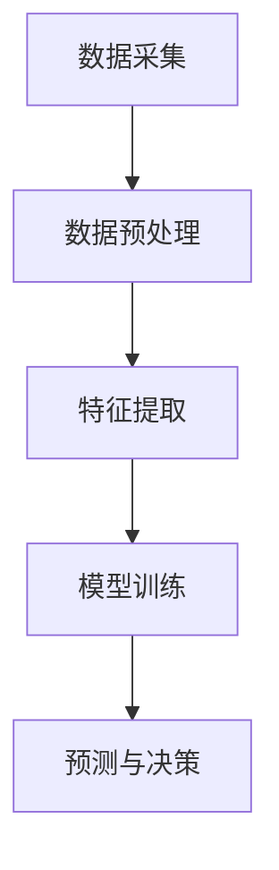
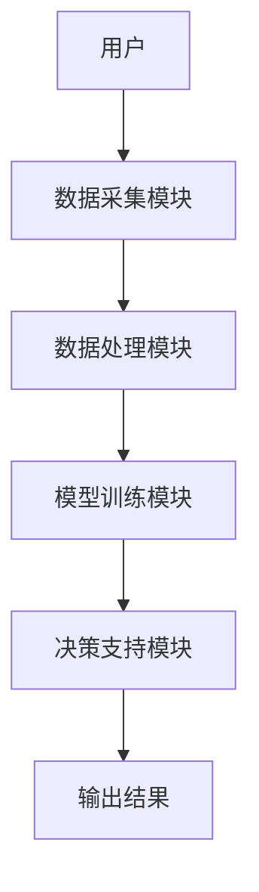

                 


# 价值投资中的智能海洋环境监测系统分析

---

## 关键词：  
- 价值投资  
- 智能海洋环境监测系统  
- 数据分析  
- 机器学习  
- 系统架构  

---

## 摘要：  
本文深入探讨了价值投资与智能海洋环境监测系统的结合，分析了智能监测系统在价值投资中的潜在应用价值。通过系统化的技术分析，本文详细阐述了智能监测系统的核心算法、系统架构设计以及实际项目实现，旨在为投资者提供一种基于数据驱动的投资决策新思路。  

---

## 第一部分: 价值投资与智能海洋环境监测系统概述  

### 第1章: 价值投资与智能海洋环境监测系统背景  

#### 1.1 价值投资的核心理念  
- **定义与特点**：价值投资是一种以基本面分析为基础的投资策略，强调以低于内在价值的价格买入优质资产。其核心在于寻找市场低估的股票，长期持有以实现超额收益。  
- **在现代金融中的应用**：随着金融市场复杂化，传统的价值投资方法逐渐融入技术分析和量化投资理念。  
- **与技术分析的对比**：价值投资注重长期基本面分析，而技术分析则关注短期价格波动和技术指标。  

#### 1.2 智能海洋环境监测系统的概念  
- **海洋环境监测的基本原理**：通过传感器和数据采集设备，实时监测海洋环境参数（如温度、盐度、溶解氧等）。  
- **智能监测系统的核心技术**：结合物联网、大数据分析和人工智能技术，实现对海洋环境数据的实时采集、分析和预测。  
- **在价值投资中的潜在应用**：通过智能监测系统获取的环境数据，分析其对相关行业（如渔业、能源业）的影响，辅助投资者做出更精准的投资决策。  

---

### 第2章: 价值投资中的智能监测系统核心概念  

#### 2.1 价值投资与智能监测系统的结合  
- **数据驱动的投资决策**：利用智能监测系统获取的环境数据，分析其对上市公司业绩的影响。  
- **智能监测系统在市场分析中的作用**：通过环境数据预测行业趋势，识别潜在投资机会。  
- **系统化投资策略的实现路径**：从数据采集到模型训练，最终输出投资建议的全流程。  

#### 2.2 智能监测系统的数据处理流程  
- **数据采集与预处理**：传感器数据的采集、清洗和标准化。  
- **数据分析与特征提取**：利用统计方法提取关键特征，为后续分析提供基础。  
- **数据可视化与决策支持**：通过可视化工具展示环境数据，辅助投资决策。  

---

### 第3章: 价值投资中的智能监测系统算法原理  

#### 3.1 数据分析算法  
- **时间序列分析**：用于分析环境数据的时间依赖性，预测未来趋势。  
- **聚类分析**：将相似的环境数据进行分组，识别潜在的市场机会。  
- **回归分析**：建立环境因素与股价之间的关系模型。  

#### 3.2 机器学习算法  
- **监督学习**：基于历史数据训练分类或回归模型，预测股票价格。  
- **非监督学习**：用于发现数据中的隐藏结构，识别异常情况。  
- **强化学习**：通过模拟投资决策过程，优化投资策略。  

#### 3.3 算法流程图  


---

### 第4章: 价值投资中的智能监测系统架构设计  

#### 4.1 系统功能模块  
- **数据采集模块**：负责采集海洋环境数据。  
- **数据处理模块**：对数据进行清洗和特征提取。  
- **模型训练模块**：基于特征数据训练机器学习模型。  
- **决策支持模块**：根据模型输出生成投资建议。  

#### 4.2 系统架构图  


---

### 第5章: 价值投资中的智能监测系统项目实战  

#### 5.1 环境安装与配置  
- **Python安装与配置**：安装Python 3.8及以上版本，配置虚拟环境。  
- **数据库安装与配置**：安装MySQL或MongoDB，用于存储环境数据。  
- **开发工具安装与配置**：安装Jupyter Notebook、PyCharm等开发工具。  

#### 5.2 系统核心实现  
- **数据采集代码实现**：使用Python的pandas库读取数据，代码如下：  
  ```python
  import pandas as pd
  data = pd.read_csv('environment_data.csv')
  print(data.head())
  ```  
- **数据处理代码实现**：使用scikit-learn库进行特征提取，代码如下：  
  ```python
  from sklearn.preprocessing import StandardScaler
  scaler = StandardScaler()
  scaled_data = scaler.fit_transform(data)
  ```  

---

## 第六部分: 总结与展望  

### 6.1 总结  
本文详细分析了价值投资与智能海洋环境监测系统的结合，从理论到实践，全面探讨了智能监测系统在投资决策中的应用。通过系统的架构设计和算法实现，展示了如何利用技术手段提升投资效率和准确性。  

### 6.2 展望  
未来，随着人工智能和大数据技术的不断发展，智能监测系统在价值投资中的应用潜力将更加巨大。建议进一步研究多模态数据融合技术，提升系统的预测精度和决策能力。  

---

## 作者：  
AI天才研究院/AI Genius Institute & 禅与计算机程序设计艺术 /Zen And The Art of Computer Programming

