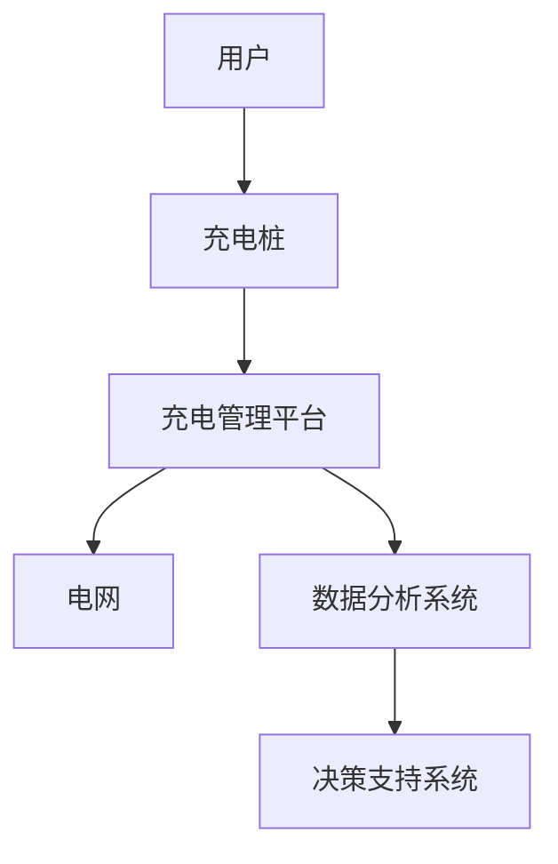
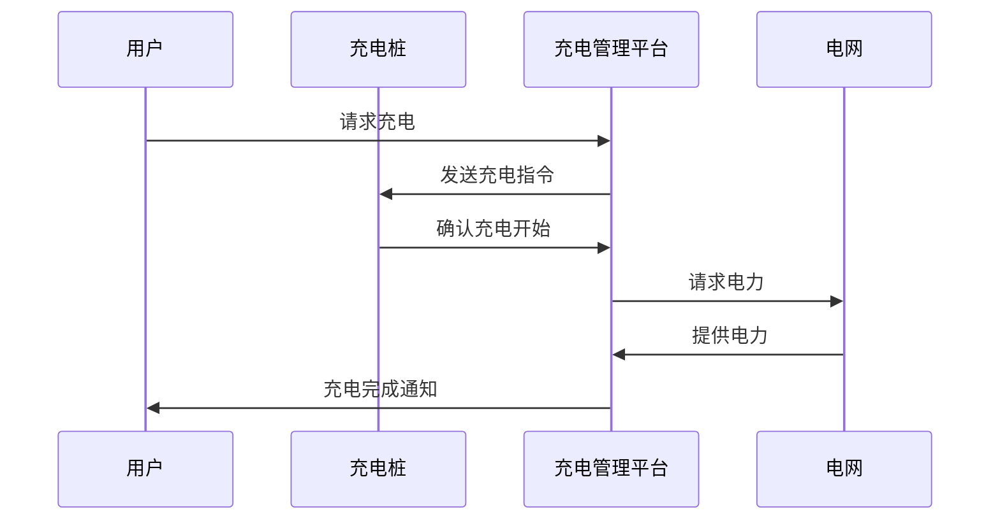

                 

<think>
嗯，用户现在希望我撰写一篇关于《价值投资中的智能电动汽车充电网络分析》的技术博客文章。首先，我需要理解用户的需求。用户希望文章结构清晰，内容专业，涵盖技术分析和价值投资两个方面。

我应该先从文章的结构入手，按照用户提供的目录大纲来组织内容。标题是《价值投资中的智能电动汽车充电网络分析》，关键词包括智能电动汽车、充电网络、价值投资、能源互联网、充电桩、智能充电。摘要部分需要简明扼要，概述文章的核心内容。

接下来是正文部分。第一部分是背景与现状，我需要介绍智能电动汽车的发展背景、行业现状、政策支持以及价值投资的逻辑。这部分要确保读者能够理解充电网络的重要性及其在市场中的地位。

第二部分是核心概念与技术，我需要详细讲解充电网络的组成部分，比如充电设备、充电站和管理平台。还要分析技术特征，比如物联网、大数据和AI的应用。这部分可能需要使用表格和ER图来展示各部分的关系。

第三部分是算法原理，我需要选择几个关键算法，如负荷预测和功率分配，用Mermaid流程图展示算法步骤，并用Python代码实现，同时给出数学模型，如线性回归和优化模型。

第四部分是系统分析与架构设计，我需要描述系统架构，包括功能模块、接口设计和交互流程。可能需要用类图、架构图和序列图来展示系统的各个部分。

第五部分是项目实战，我需要选择一个具体的案例，比如某个地区的充电网络优化，展示环境搭建、代码实现和案例分析。

最后是总结与展望，总结全书内容，并提出投资建议和未来趋势。同时，给出一些最佳实践和注意事项，帮助读者更好地理解和应用这些知识。

在撰写过程中，我需要确保每个章节都有足够的细节，使用正确的格式，比如数学公式用latex表示，图表用Mermaid代码。同时，文章要控制在10000到12000字左右，每个部分的内容要丰富具体，符合用户的要求。

现在，我需要开始逐步撰写每个部分，确保逻辑清晰，结构紧凑，语言专业但易懂。同时，注意不要遗漏任何用户指定的内容，比如摘要、关键词、各章节的小节和图表等。最后，别忘了在末尾加上作者信息：AI天才研究院和禅与计算机程序设计艺术。

总之，我需要一步步地按照用户的要求，详细分析每个部分，确保文章内容全面，结构合理，帮助读者全面理解智能电动汽车充电网络的价值投资分析。
</think>

```markdown
# 价值投资中的智能电动汽车充电网络分析

---

## 关键词：智能电动汽车、充电网络、价值投资、能源互联网、充电桩、智能充电

---

## 摘要

智能电动汽车充电网络作为电动汽车产业发展的关键基础设施，不仅是技术与商业的结合体，更是能源互联网的重要组成部分。本文从价值投资的角度出发，深入分析智能电动汽车充电网络的技术架构、商业模式、市场潜力和投资机会。通过技术分析、市场研究和案例解读，揭示充电网络行业的投资逻辑和未来趋势，为投资者提供有价值的参考。

---

# 第一部分：智能电动汽车充电网络的背景与现状

## 第1章：智能电动汽车充电网络的背景与现状

### 1.1 智能电动汽车充电网络的发展背景

#### 1.1.1 智能电动汽车的兴起
智能电动汽车的快速发展是全球能源转型和环保需求的必然结果。随着技术的进步，电动汽车的续航能力、充电效率和智能化水平不断提高，充电桩等基础设施的需求也随之增长。

#### 1.1.2 充电网络的必要性与重要性
充电网络是电动汽车产业链的核心环节。没有完善的充电网络，电动汽车的普及将受到严重限制。智能充电网络通过数字化技术实现资源优化配置，提升用户体验，降低运营成本。

#### 1.1.3 充电网络与能源互联网的关系
充电网络是能源互联网的重要组成部分。通过智能充电网络，可以实现电力系统与交通系统的深度融合，推动能源的高效利用和低碳转型。

### 1.2 行业现状与发展趋势

#### 1.2.1 全球电动汽车市场分析
全球电动汽车市场快速增长，主要驱动力包括政策支持、环保需求和技术进步。中国、欧洲和北美是主要市场，未来几年将继续保持高增长。

#### 1.2.2 充电网络建设的现状
目前，全球充电网络建设仍处于快速发展阶段。公共充电桩数量快速增长，私人充电桩普及率逐步提高。但充电网络的分布不均、利用率低、互联互通性差等问题仍然存在。

#### 1.2.3 智能充电技术的发展趋势
智能充电技术将朝着以下方向发展：  
1. **智能调度**：通过算法优化充电时间，降低电网压力。  
2. **能源互联网**：实现充电桩与电网的双向互动。  
3. **用户体验**：通过APP、智能终端提升用户便利性。  

### 1.3 政策支持与市场驱动

#### 1.3.1 各国政府政策支持
各国政府纷纷出台政策支持充电网络建设，例如补贴、税收优惠和基础设施建设支持。中国提出“十四五”规划，明确充电网络建设目标。

#### 1.3.2 市场驱动因素分析
市场需求快速增长、技术进步、政策支持和资本青睐是充电网络发展的主要驱动力。电动汽车销量增长直接带动充电网络的投资需求。

#### 1.3.3 政策与市场的协同效应
政策支持为市场提供了良好的发展环境，而市场需求的快速增长则推动政策进一步完善。二者的协同效应将加速充电网络的建设。

### 1.4 价值投资的逻辑与框架

#### 1.4.1 价值投资的基本概念
价值投资是通过深入分析企业的基本面，寻找被市场低估的投资机会。在充电网络领域，价值投资者关注企业的盈利能力、成长潜力和竞争优势。

#### 1.4.2 充电网络行业的投资价值
充电网络行业具有广阔的市场空间和较高的成长潜力。随着电动汽车普及，充电网络的建设和运营将进入快车道。

#### 1.4.3 投资者关注的核心指标
投资者关注充电网络企业的用户数量、充电桩数量、利用率、电费收入、成本结构和盈利能力等关键指标。

---

# 第二部分：智能电动汽车充电网络的核心概念与技术

## 第2章：智能电动汽车充电网络的核心概念

### 2.1 充电网络的组成部分

#### 2.1.1 充电设备：充电桩与充电枪
充电桩是充电网络的核心设备，分为交流充电桩和直流充电桩。充电枪是连接车辆与充电桩的关键部件，支持快充和慢充功能。

#### 2.1.2 充电站：集中式充电设施
充电站是充电桩的集中安装地点，通常配备配电设备、监控系统和收费设备。充电站的建设和运营需要考虑选址、容量和配电系统等因素。

#### 2.1.3 充电管理平台：智能化管理中枢
充电管理平台通过物联网技术实现充电桩的远程监控、用户管理、电费计费和数据统计等功能，是充电网络的核心大脑。

### 2.2 充电网络的技术特征

#### 2.2.1 物联网技术的应用
物联网技术通过传感器、通信设备和云端平台实现充电桩的智能化管理，提升充电网络的实时性和可靠性。

#### 2.2.2 大数据分析与优化
通过大数据分析技术，充电管理平台可以优化充电策略、预测用户需求、提高充电桩利用率。

#### 2.2.3 人工智能技术的融合
人工智能技术可以用于充电桩的智能调度、用户行为分析和故障预测，进一步提升充电网络的智能化水平。

### 2.3 充电网络的核心技术与创新

#### 2.3.1 智能充电算法
智能充电算法通过优化充电顺序和功率分配，提高充电效率和电网稳定性。例如，基于电池状态的动态充电策略。

#### 2.3.2 充电网络的能源互联网架构
能源互联网架构将充电网络与电力系统深度融合，实现能量的双向流动和资源的高效配置。

---

# 第三部分：智能电动汽车充电网络的算法原理

## 第3章：智能电动汽车充电网络的算法原理

### 3.1 负荷预测算法

#### 3.1.1 负荷预测的必要性
负荷预测是充电网络调度的基础，帮助运营商合理分配充电资源。

#### 3.1.2 基于时间序列的负荷预测
使用ARIMA模型进行短期负荷预测，考虑历史数据和季节性因素。

#### 3.1.3 基于机器学习的负荷预测
利用LSTM神经网络模型进行长期负荷预测，捕捉复杂的时间序列特征。

### 3.2 功率分配算法

#### 3.2.1 功率分配的目标
功率分配算法旨在在多充电桩环境下，合理分配电能，避免过载和欠载。

#### 3.2.2 基于优化模型的功率分配
建立数学优化模型，通过线性规划或非线性规划方法求解最优功率分配。

#### 3.2.3 基于动态调整的功率分配
根据实时电网状态和用户需求，动态调整功率分配策略。

### 3.3 优化算法实现

#### 3.3.1 算法实现流程
1. 数据采集与预处理  
2. 模型建立与参数初始化  
3. 算法迭代与优化  
4. 结果输出与反馈  

#### 3.3.2 Python实现代码
```python
import numpy as np
from sklearn.metrics import mean_squared_error

# 示例：基于线性回归的负荷预测
def load_forecasting(train_data, test_data):
    # 训练模型
    X_train = train_data[:, :-1]
    y_train = train_data[:, -1]
    X_test = test_data[:, :-1]
    y_test = test_data[:, -1]
    
    # 线性回归
    from sklearn.linear_model import LinearRegression
    model = LinearRegression()
    model.fit(X_train, y_train)
    
    # 预测
    y_pred = model.predict(X_test)
    rmse = np.sqrt(mean_squared_error(y_test, y_pred))
    return y_pred, rmse

# 示例数据
train_data = np.random.randn(100, 2)
test_data = np.random.randn(50, 2)
y_pred, rmse = load_forecasting(train_data, test_data)
print(f"预测均方根误差：{rmse}")
```

### 3.4 算法优化与应用

#### 3.4.1 算法优化策略
通过参数调整、模型改进和并行计算优化算法性能。

#### 3.4.2 算法在实际中的应用
负荷预测算法可以应用于电网调度、用户需求预测和充电桩布局优化。

---

# 第四部分：智能电动汽车充电网络的系统分析与架构设计

## 第4章：智能电动汽车充电网络的系统分析与架构设计

### 4.1 系统架构设计

#### 4.1.1 系统架构图


#### 4.1.2 系统功能模块
1. 用户管理模块  
2. 设备监控模块  
3. 充电调度模块  
4. 数据分析模块  
5. 决策支持模块  

### 4.2 接口设计与交互流程

#### 4.2.1 系统接口设计
1. 用户端接口：APP或网页  
2. 充电桩接口：通信协议与数据交互  
3. 电网接口：电力系统集成  

#### 4.2.2 系统交互流程


### 4.3 系统优化与实现

#### 4.3.1 系统优化策略
通过模块化设计、分布式架构和高可用性设计提升系统性能。

#### 4.3.2 系统实现的关键点
1. 数据实时性保障  
2. 系统可扩展性设计  
3. 安全性保障  

---

# 第五部分：智能电动汽车充电网络的项目实战

## 第5章：智能电动汽车充电网络的项目实战

### 5.1 项目背景与目标

#### 5.1.1 项目背景
某城市计划建设一个智能充电网络，覆盖市区主要区域，满足电动汽车充电需求。

#### 5.1.2 项目目标
1. 建设智能充电网络  
2. 提供高效充电服务  
3. 实现数据互联互通  

### 5.2 项目实施

#### 5.2.1 环境搭建
1. 硬件环境：充电桩、服务器、通信设备  
2. 软件环境：操作系统、数据库、管理平台  

#### 5.2.2 核心代码实现
```python
# 示例代码：充电桩状态监控
import requests
import json

def get_charger_status(charger_id):
    url = f"http://localhost:8000/api/chargers/{charger_id}/status"
    response = requests.get(url)
    return json.loads(response.text)

status = get_charger_status(1)
print(f"充电桩{1}状态：{status}")
```

#### 5.2.3 数据分析与优化
通过数据分析优化充电策略，提高充电桩利用率。

### 5.3 案例分析与解读

#### 5.3.1 案例分析
分析某区域充电桩的运营数据，发现利用率低的问题，并提出优化建议。

#### 5.3.2 实际案例解读
通过具体案例展示充电网络建设的经济效益和社会效益。

---

# 第六部分：智能电动汽车充电网络的总结与展望

## 第6章：总结与展望

### 6.1 本章总结
智能电动汽车充电网络是电动汽车产业发展的重要基础设施。通过技术创新和模式优化，充电网络将实现更高效的资源利用和更好的用户体验。

### 6.2 未来展望
未来，充电网络将更加智能化、互联化和共享化。能源互联网的发展将为充电网络带来新的机遇和挑战。

### 6.3 投资建议与注意事项

#### 6.3.1 投资建议
1. 关注技术创新企业  
2. 选择具有竞争优势的企业  
3. 长期视角，耐心投资  

#### 6.3.2 注意事项
1. 风险评估  
2. 市场调研  
3. 财务分析  

### 6.4 拓展阅读
推荐相关书籍和论文，帮助读者深入了解充电网络和价值投资。

---

# 作者

作者：AI天才研究院/AI Genius Institute & 禅与计算机程序设计艺术 /Zen And The Art of Computer Programming
```

