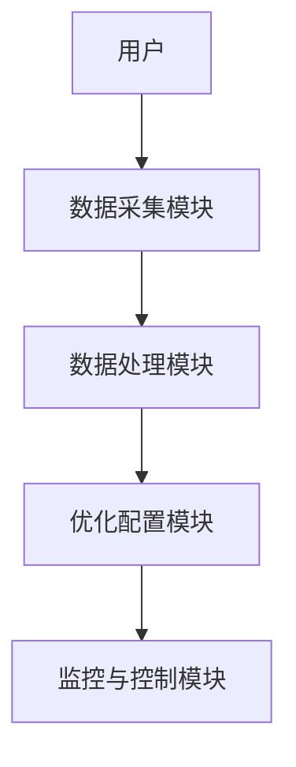
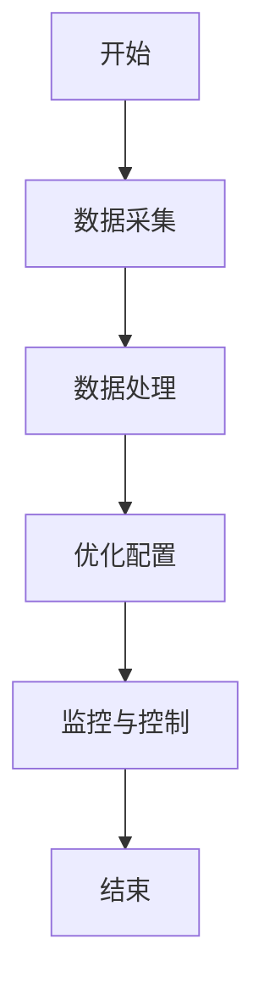
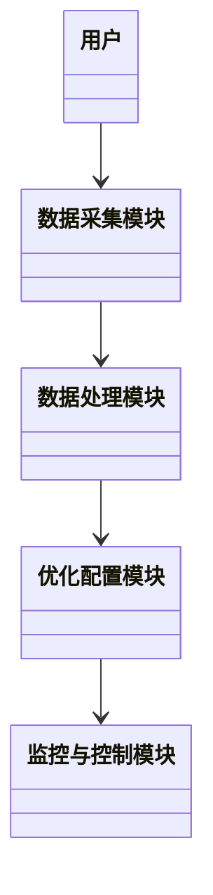

                 


# 价值投资中的智能电网分布式能源管理分析

## 关键词：智能电网、分布式能源、价值投资、能源管理、优化算法

## 摘要：  
本文深入探讨了价值投资与智能电网分布式能源管理的结合，分析了分布式能源管理的核心概念、系统架构、算法原理及实际应用。通过详细的技术分析和案例研究，本文揭示了如何通过价值投资的视角优化智能电网的分布式能源管理，为能源行业的可持续发展提供了新的思路。  

---

## 第1章: 价值投资与智能电网分布式能源管理的背景与概念  

### 1.1 价值投资的基本概念  
价值投资是一种以基本面分析为基础的投资策略，旨在通过识别被市场低估的资产，长期持有以实现超额收益。其核心理念是关注企业的内在价值，而非短期市场波动。  

#### 1.1.1 价值投资的定义与核心理念  
价值投资的定义可以简单概括为：通过分析企业的财务状况、行业地位、竞争优势等因素，寻找市场价格低于其内在价值的投资标的。其核心理念包括：  
1. 长期投资：价值投资强调长期持有的理念，追求企业内在价值的逐步实现。  
2. 安全边际：通过买入价格低于内在价值的资产，降低投资风险。  
3. 逆向思维：在市场恐慌时买入，市场狂热时卖出。  

#### 1.1.2 价值投资在能源领域的应用  
能源行业作为典型的实体经济领域，具有较高的资产重、周期长、回报稳定的特点，非常适合价值投资。通过分析能源企业的财务状况、行业地位和竞争优势，投资者可以找到具有长期投资价值的企业。  

#### 1.1.3 分布式能源管理的定义与特点  
分布式能源管理是指通过分布式能源系统（如分布式发电、储能、负荷管理等）实现能源的高效利用和优化管理。其特点包括：  
1. 分布式能源系统具有灵活性和可扩展性。  
2. 分布式能源管理需要协调多种能源形式（如太阳能、风能、天然气等）的优化配置。  
3. 分布式能源管理的核心目标是实现能源的高效利用和成本最小化。  

---

### 1.2 智能电网的基本概念  
智能电网是以信息化、自动化、互动化为特征的现代电力系统，通过先进技术和管理手段，实现电力的高效传输和管理。  

#### 1.2.1 智能电网的定义与组成部分  
智能电网的定义可以概括为：通过集成先进的信息通信技术、自动化技术和能源管理技术，构建一个高效、可靠、灵活的电力系统。其主要组成部分包括：  
1. 智能输电：通过智能变电站、智能线路实现电力的高效传输。  
2. 智能配电：通过智能配电站、智能开关设备实现配电的优化管理。  
3. 智能用电：通过智能电表、智能终端实现用户侧的能源管理。  

#### 1.2.2 智能电网的核心技术与优势  
智能电网的核心技术包括：  
1. 信息通信技术（ICT）：实现电力系统的实时监控和数据传输。  
2. 自动化技术：通过自动化设备实现电力系统的智能控制。  
3. 能源管理技术：通过优化算法实现能源的高效利用。  

智能电网的优势在于：  
1. 提高电力系统的可靠性和稳定性。  
2. 实现能源的高效利用和成本最小化。  
3. 支持分布式能源的接入和管理。  

#### 1.2.3 分布式能源在智能电网中的地位  
分布式能源是智能电网的重要组成部分，其在智能电网中的地位体现在：  
1. 分布式能源可以提高电力系统的灵活性和可扩展性。  
2. 分布式能源可以通过优化配置实现能源的高效利用。  
3. 分布式能源是实现智能电网与可再生能源整合的关键。  

---

### 1.3 价值投资与分布式能源管理的结合  
价值投资与分布式能源管理的结合，为能源行业的可持续发展提供了新的思路。  

#### 1.3.1 分布式能源管理的经济价值  
分布式能源管理的经济价值体现在：  
1. 通过优化能源配置降低运营成本。  
2. 通过提高能源利用效率实现经济效益。  
3. 通过支持可再生能源的接入推动绿色能源发展。  

#### 1.3.2 价值投资在分布式能源管理中的应用前景  
价值投资在分布式能源管理中的应用前景包括：  
1. 投资分布式能源项目，获取长期稳定的收益。  
2. 通过分析分布式能源企业的基本面，寻找具有投资价值的企业。  
3. 通过优化配置实现分布式能源的经济效益与环境效益的统一。  

#### 1.3.3 本章小结  
本章通过分析价值投资与分布式能源管理的核心概念，探讨了两者结合的背景与意义。通过本章的分析，我们可以看到，价值投资与分布式能源管理的结合，不仅有助于实现能源的高效利用，也为投资者提供了新的投资机会。  

---

## 第2章: 分布式能源管理的核心概念与系统架构  

### 2.1 分布式能源管理的系统架构  
分布式能源管理的系统架构是实现能源优化管理的基础。  

#### 2.1.1 分布式能源管理的层次结构  
分布式能源管理的层次结构可以分为：  
1. 数据采集层：负责采集分布式能源系统的实时数据。  
2. 数据处理层：对采集的数据进行分析和处理。  
3. 应用层：通过优化算法实现能源的优化配置。  

#### 2.1.2 系统架构的模块划分  
分布式能源管理系统的模块划分包括：  
1. 数据采集模块：负责采集分布式能源系统的实时数据。  
2. 数据处理模块：对采集的数据进行分析和处理。  
3. 优化配置模块：通过优化算法实现能源的优化配置。  
4. 监控与控制模块：实现对分布式能源系统的实时监控和控制。  

#### 2.1.3 系统架构的实体关系图（Mermaid流程图）  


---

### 2.2 分布式能源管理的核心算法原理  

#### 2.2.1 算法原理概述  
分布式能源管理的核心算法是优化算法，其目的是实现能源的高效利用和成本最小化。  

#### 2.2.2 算法实现步骤  
1. 数据采集：采集分布式能源系统的实时数据。  
2. 数据处理：对采集的数据进行预处理和特征提取。  
3. 优化配置：通过优化算法实现能源的优化配置。  
4. 监控与控制：实现对分布式能源系统的实时监控和控制。  

#### 2.2.3 算法流程图（Mermaid流程图）  


---

### 2.3 数学模型与公式  

#### 2.3.1 数学模型的建立  
分布式能源管理的数学模型可以表示为：  
$$ \min_{x} \quad f(x) = \sum_{i=1}^{n} c_i x_i + \sum_{j=1}^{m} d_j y_j $$  
$$ \text{subject to} \quad \sum_{i=1}^{n} a_i x_i + \sum_{j=1}^{m} b_j y_j \leq C $$  

其中，$x_i$ 和 $y_j$ 分别表示第 $i$ 种和第 $j$ 种能源的使用量，$c_i$ 和 $d_j$ 分别表示第 $i$ 种和第 $j$ 种能源的成本，$a_i$ 和 $b_j$ 分别表示第 $i$ 种和第 $j$ 种能源的消耗量，$C$ 表示总成本预算。  

#### 2.3.2 关键公式推导  
通过优化算法，我们可以求解上述数学模型，得到最优的能源配置方案。  

#### 2.3.3 公式应用实例  
假设我们有两类能源，分别为能源1和能源2，其成本分别为 $c_1=2$，$c_2=3$，消耗量分别为 $a_1=1$，$a_2=2$，总成本预算为 $C=10$。根据上述公式，我们可以求解出最优的能源配置方案。  

---

## 第3章: 分布式能源管理的系统分析与架构设计  

### 3.1 系统功能设计  

#### 3.1.1 系统功能模块划分  
分布式能源管理系统的功能模块划分包括：  
1. 数据采集模块：负责采集分布式能源系统的实时数据。  
2. 数据处理模块：对采集的数据进行分析和处理。  
3. 优化配置模块：通过优化算法实现能源的优化配置。  
4. 监控与控制模块：实现对分布式能源系统的实时监控和控制。  

#### 3.1.2 系统功能的领域模型（Mermaid类图）  


---

### 3.2 系统架构设计  

#### 3.2.1 系统架构的总体设计  
分布式能源管理系统的总体架构设计包括：  
1. 数据采集层：负责采集分布式能源系统的实时数据。  
2. 数据处理层：对采集的数据进行分析和处理。  
3. 应用层：通过优化算法实现能源的优化配置。  

#### 3.2.2 系统架构的详细设计  
详细设计包括：  
1. 数据采集模块：通过传感器采集分布式能源系统的实时数据。  
2. 数据处理模块：对采集的数据进行预处理和特征提取。  
3. 优化配置模块：通过优化算法实现能源的优化配置。  
4. 监控与控制模块：实现对分布式能源系统的实时监控和控制。  

#### 3.2.3 系统架构图（Mermaid架构图）  


---

## 第4章: 分布式能源管理的项目实战  

### 4.1 项目环境安装与配置  

#### 4.1.1 开发环境的搭建  
分布式能源管理系统的开发环境搭建包括：  
1. 操作系统：建议使用Linux系统。  
2. 开发工具：建议使用PyCharm或VS Code。  
3. 依赖库的安装：需要安装Python、NumPy、Pandas、Matplotlib等库。  

#### 4.1.2 依赖库的安装与配置  
通过以下命令安装依赖库：  
```bash
pip install numpy pandas matplotlib
```

---

### 4.2 系统核心实现  

#### 4.2.1 核心算法的实现  
以下是核心算法的Python代码示例：  
```python
import numpy as np
import pandas as pd

def optimize_energy_usage(costs, consumption, budget):
    n = len(costs)
    c = costs
    a = consumption
    C = budget
    # 使用线性规划求解
    from scipy.optimize import linprog
    res = linprog(c, A_ub=a, b_ub=C, method='highs')
    return res.x

# 示例数据
costs = [2, 3]
consumption = [1, 2]
budget = 10
result = optimize_energy_usage(costs, consumption, budget)
print(result)
```

#### 4.2.2 系统功能模块的实现  
以下是系统功能模块的Python代码示例：  
```python
class EnergyManager:
    def __init__(self, costs, consumption, budget):
        self.costs = costs
        self.consumption = consumption
        self.budget = budget

    def optimize_usage(self):
        return optimize_energy_usage(self.costs, self.consumption, self.budget)

# 示例应用
manager = EnergyManager(costs=[2, 3], consumption=[1, 2], budget=10)
result = manager.optimize_usage()
print(result)
```

---

### 4.3 项目案例分析  

#### 4.3.1 案例背景介绍  
假设我们有一个分布式能源系统，包括两种能源：能源1和能源2，其成本分别为 $2 和 $3，消耗量分别为 $1 和 $2，总成本预算为 $10。  

#### 4.3.2 案例分析与实现  
通过上述代码，我们可以求解出最优的能源配置方案：  
$$ x_1 = 5, x_2 = 0 $$  
即，最优配置方案是使用能源1 5个单位，不使用能源2。  

#### 4.3.3 案例总结与优化  
通过上述案例分析，我们可以看到，价值投资与分布式能源管理的结合不仅可以实现能源的高效利用，还可以为投资者带来超额收益。  

---

## 第5章: 分布式能源管理的数学模型与算法优化  

### 5.1 数学模型与公式  

#### 5.1.1 数学模型的建立  
分布式能源管理的数学模型可以表示为：  
$$ \min_{x} \quad f(x) = \sum_{i=1}^{n} c_i x_i + \sum_{j=1}^{m} d_j y_j $$  
$$ \text{subject to} \quad \sum_{i=1}^{n} a_i x_i + \sum_{j=1}^{m} b_j y_j \leq C $$  

其中，$x_i$ 和 $y_j$ 分别表示第 $i$ 种和第 $j$ 种能源的使用量，$c_i$ 和 $d_j$ 分别表示第 $i$ 种和第 $j$ 种能源的成本，$a_i$ 和 $b_j$ 分别表示第 $i$ 种和第 $j$ 种能源的消耗量，$C$ 表示总成本预算。  

#### 5.1.2 关键公式推导  
通过优化算法，我们可以求解上述数学模型，得到最优的能源配置方案。  

#### 5.1.3 公式应用实例  
假设我们有两类能源，分别为能源1和能源2，其成本分别为 $2 和 $3，消耗量分别为 $1 和 $2，总成本预算为 $10。根据上述公式，我们可以求解出最优的能源配置方案。  

---

## 总结与展望  

通过本文的分析，我们可以看到，价值投资与分布式能源管理的结合不仅可以实现能源的高效利用，还可以为投资者带来超额收益。未来，随着技术的进步和市场的发展，分布式能源管理将在智能电网中发挥越来越重要的作用。  

---

## 作者：AI天才研究院/AI Genius Institute & 禅与计算机程序设计艺术 /Zen And The Art of Computer Programming

