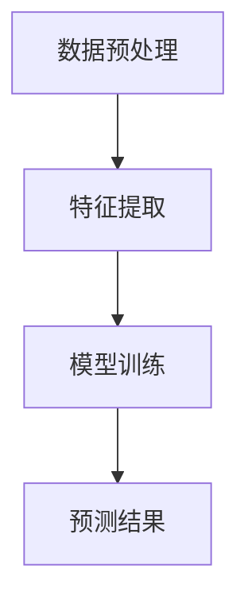
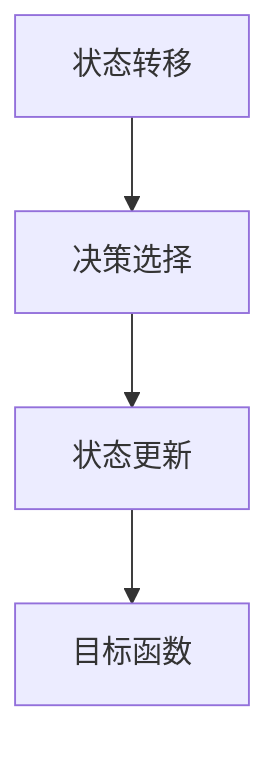
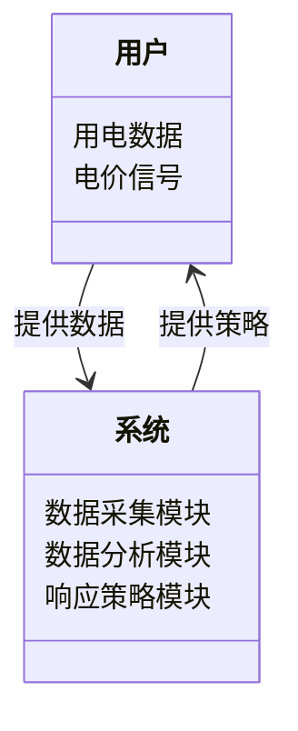
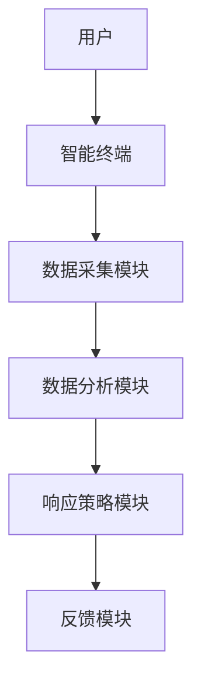

                 


# 价值投资中的智能电网需求侧响应系统分析

> 关键词：智能电网，需求侧响应，价值投资，电力系统，优化算法

> 摘要：本文深入分析了智能电网需求侧响应系统在价值投资中的应用，从系统概述、核心概念、算法原理、系统架构到项目实战，逐步解析了如何通过技术手段实现电力需求侧的智能响应，并结合投资分析，为相关领域提供理论支持和实践指导。

---

## 第一部分：智能电网与需求侧响应系统概述

### 第1章：智能电网的基本概念

#### 1.1 智能电网的定义
智能电网是一种通过先进信息通信技术和自动化设备，实现电力系统各个环节（发电、输电、配电、用电）智能化运行和管理的新型电力系统。

#### 1.2 智能电网的核心特征
智能电网具有以下核心特征：
- **自愈性**：能够自动检测和修复电网故障。
- **响应性**：能够快速适应负荷变化和电源波动。
- **高效性**：通过优化资源配置提高能源利用效率。
- **互动性**：支持用户与电网之间的双向互动。

#### 1.3 智能电网的发展背景
随着全球能源需求的增长和环境问题的加剧，智能电网成为实现清洁能源高效利用和电力系统可持续发展的关键。

---

### 第2章：需求侧响应系统的基本概念

#### 2.1 需求侧响应的定义
需求侧响应（Demand Response，DR）是指通过价格信号、激励机制或其他手段，引导用户调整用电行为，以优化电力系统运行的管理方式。

#### 2.2 需求侧响应的主要功能
- **负荷预测**：基于历史数据和外部因素，预测用户用电需求。
- **响应策略**：制定最优的响应策略，确保电力系统的稳定运行。
- **用户互动**：通过实时信息反馈，与用户进行互动，优化用电行为。

#### 2.3 需求侧响应与智能电网的关系
需求侧响应是智能电网的重要组成部分，通过实时互动和优化管理，实现电力系统的高效运行。

---

### 第3章：价值投资与智能电网的结合

#### 3.1 价值投资的基本概念
价值投资是一种投资策略，通过分析企业的内在价值，寻找市场价格低于内在价值的投资机会。

#### 3.2 智能电网中的投资机会
智能电网的建设和运营涉及多个领域，如智能设备制造、能源管理平台开发、储能技术等，这些领域都存在丰富的投资机会。

#### 3.3 需求侧响应系统在价值投资中的作用
通过分析需求侧响应系统的成本效益、市场前景和竞争优势，投资者可以做出更明智的投资决策。

---

## 第二部分：需求侧响应系统的核心概念与联系

### 第4章：需求侧响应系统的原理

#### 4.1 系统的实现机制
需求侧响应系统通过采集用户用电数据，分析需求变化，制定响应策略，并通过反馈机制优化系统运行。

#### 4.2 系统的核心功能模块
- 数据采集模块：采集用户的用电数据。
- 数据分析模块：分析数据，预测需求。
- 响应策略模块：制定最优响应策略。
- 反馈模块：将结果反馈给用户和系统。

#### 4.3 系统的输入输出关系
- **输入**：用户用电数据、电价信号、系统运行状态。
- **输出**：响应策略、优化建议、反馈信息。

---

### 第5章：核心概念对比表

#### 5.1 智能电网与传统电网的对比
| 特性          | 智能电网              | 传统电网              |
|---------------|----------------------|----------------------|
| 自动化水平     | 高                   | 低                   |
| 可再生能源利用率 | 高                   | 低                   |
| 用户互动性     | 高                   | 低                   |

#### 5.2 需求侧响应与供给侧调节的对比
| 特性          | 需求侧响应            | 供给侧调节            |
|---------------|----------------------|----------------------|
| 调节方式       | 减少需求              | 增加供给              |
| 调节主体       | 用户                  | 电力公司              |
| 调节目的       | 优化用电              | 保证供电              |

---

### 第6章：系统实体关系图

#### 6.1 用户与系统的关系
用户通过智能终端与系统互动，接收电价信号和响应策略。

#### 6.2 系统与电力公司的关系
系统与电力公司共享数据，优化电力供应。

#### 6.3 系统与投资机构的关系
系统为投资机构提供数据支持和分析报告，辅助投资决策。

---

## 第三部分：需求侧响应系统的算法原理

### 第7章：需求预测算法

#### 7.1 时间序列分析
- **方法**：使用ARIMA模型预测用电需求。
- **步骤**：数据预处理、模型建立、参数估计、预测。

#### 7.2 机器学习算法
- **方法**：使用XGBoost或LSTM模型进行需求预测。
- **流程图**：


#### 7.3 算法实现代码
```python
import pandas as pd
from sklearn.model_selection import train_test_split
from sklearn.linear_model import LinearRegression

# 数据加载
data = pd.read_csv('demand.csv')

# 特征与目标分离
X = data[['time', 'temperature']]
y = data['demand']

# 数据分割
X_train, X_test, y_train, y_test = train_test_split(X, y, test_size=0.2)

# 模型训练
model = LinearRegression()
model.fit(X_train, y_train)

# 预测
y_pred = model.predict(X_test)
```

---

### 第8章：响应策略优化算法

#### 8.1 线性规划模型
- **目标**：最小化系统运行成本。
- **约束**：满足用户需求，保证系统稳定。

#### 8.2 动态规划算法
- **方法**：通过动态规划优化响应策略。
- **流程图**：


#### 8.3 算法数学模型
$$\text{min} \quad \sum_{i=1}^{n} c_i x_i$$

---

## 第四部分：系统分析与架构设计

### 第9章：系统分析

#### 9.1 项目背景
随着智能电网的普及，需求侧响应系统的需求日益增加。

#### 9.2 系统功能设计
- 用户界面：展示用电数据和响应策略。
- 数据处理：实时采集和分析数据。
- 策略执行：根据预测结果制定响应策略。

#### 9.3 领域模型


---

### 第10章：系统架构设计

#### 10.1 系统架构图


---

## 第五部分：项目实战

### 第11章：环境安装与系统实现

#### 11.1 环境安装
- 安装Python、Pandas、Scikit-learn等工具。

#### 11.2 核心功能实现
```python
def demand_prediction(data):
    # 数据预处理
    data = data.dropna()
    # 特征提取
    features = data[['time', 'temperature']]
    target = data['demand']
    # 模型训练
    model = LinearRegression()
    model.fit(features, target)
    return model

# 示例运行
data = pd.read_csv('demand.csv')
model = demand_prediction(data)
print(model.predict([[10, 25]]))
```

---

### 第12章：案例分析与总结

#### 12.1 案例分析
通过实际案例分析，验证系统的有效性和投资回报。

#### 12.2 项目小结
系统实现需求侧响应功能，能够有效优化电力系统运行，为投资决策提供支持。

---

## 结语

智能电网需求侧响应系统是电力系统优化和价值投资的重要工具。通过本文的分析，读者可以深入了解系统的原理和应用，为实际投资和系统建设提供参考。

---

**作者：AI天才研究院/AI Genius Institute & 禅与计算机程序设计艺术 /Zen And The Art of Computer Programming**

