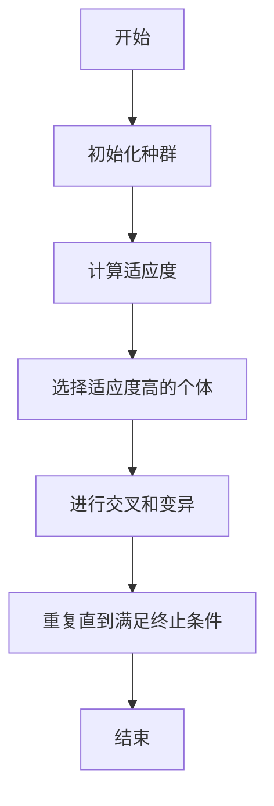
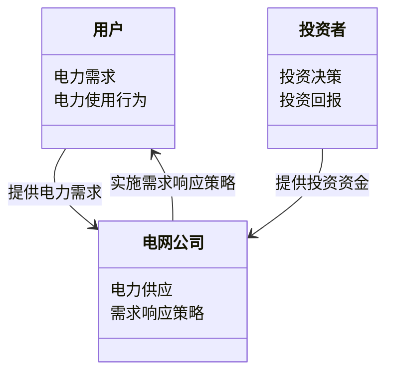

                 

<think>
嗯，我需要帮助写一篇关于《价值投资中的智能电网需求响应优化分析》的技术博客文章。让我先理清楚这个问题。

首先，什么是智能电网？它是一个现代化的电力系统，利用先进的技术来提高电力输送的效率和可靠性。而需求响应则是智能电网中的一个重要组成部分，它通过调整用户的电力使用，来平衡电力供应和需求。

接下来，价值投资是指通过分析和评估，选择那些具有长期投资价值的资产。将价值投资应用到智能电网的需求响应优化中，意味着我们需要找到那些能够提高需求响应效率和效果的投资项目。

那么，如何将价值投资与智能电网的需求响应优化结合起来呢？可能需要分析智能电网中的各种技术、项目和策略，评估它们的投资价值，从而优化需求响应的整体效果。

在分析过程中，我需要考虑以下几个方面：

1. 智能电网的基本概念和组成部分，包括输电、配电、用电等环节。
2. 需求响应的具体机制，如价格机制、激励机制等。
3. 价值投资的理论和方法，如何应用到智能电网项目中。
4. 结合具体案例，分析哪些项目具有较高的投资价值，并能有效优化需求响应。

我还需要使用一些工具和方法，如数学模型、算法流程图、系统架构图等，来详细阐述我的分析过程。

可能遇到的挑战包括如何量化需求响应的投资价值，如何选择合适的评估指标，以及如何将复杂的理论转化为实际的应用案例。

为了克服这些挑战，我需要深入研究相关的理论，参考已有的研究成果，同时结合实际的项目案例，进行详细的分析和验证。

总之，我需要系统地分析智能电网的需求响应优化问题，结合价值投资的理论，找到那些能够带来长期效益的投资项目，并通过具体的实施步骤和案例，展示如何优化需求响应，实现智能电网的高效运行。
</think>

# 价值投资中的智能电网需求响应优化分析

## 关键词：智能电网、需求响应、价值投资、优化分析、能源管理

## 摘要

智能电网作为现代电力系统的核心组成部分，通过先进的技术手段优化电力的传输和使用。需求响应作为智能电网的重要功能，能够有效平衡电力供需，提升电网运行效率。本文将深入探讨如何运用价值投资的理论和方法，优化智能电网中的需求响应策略，通过数学建模和算法设计，结合实际案例，分析如何选择具有投资价值的项目，以实现需求响应的最优配置。文章内容涵盖智能电网概述、需求响应优化的数学模型、基于价值投资的优化策略、项目实施与案例分析等方面，为智能电网的需求响应优化提供理论支持和实践指导。

---

# 目录

1. [智能电网概述](#智能电网概述)
2. [需求响应的基本概念](#需求响应的基本概念)
3. [价值投资的理论基础](#价值投资的理论基础)
4. [需求响应优化的数学模型](#需求响应优化的数学模型)
5. [基于价值投资的优化策略](#基于价值投资的优化策略)
6. [项目实战与案例分析](#项目实战与案例分析)
7. [总结与展望](#总结与展望)

---

## 1. 智能电网概述

### 1.1 智能电网的定义与特点

智能电网是一种集成现代信息技术的电力系统，具有实时监测、智能控制和优化管理的特点。它通过先进的传感器、通信技术和数据分析，实现电力的高效传输和使用。

### 1.2 智能电网的核心组成部分

- **输电网络**：负责电力的长距离传输。
- **配电网络**：将电力分配到各个用户端。
- **用电设备**：包括各种家用电器和工业设备。
- **智能测量与控制设备**：用于实时监测和调整电力使用。

### 1.3 智能电网的优势

- 提高电力输送效率
- 降低能源消耗
- 增强电网的稳定性
- 支持可再生能源的接入

---

## 2. 需求响应的基本概念

### 2.1 需求响应的定义

需求响应是指通过价格信号或激励机制，引导用户调整电力使用行为，以适应电力供应的变化。

### 2.2 需求响应的主要机制

- **价格机制**：根据电力供需情况调整电价。
- **激励机制**：通过补贴或奖励鼓励用户节约用电。
- **反馈机制**：实时反馈电力使用情况，帮助用户优化用电行为。

### 2.3 需求响应的应用场景

- **高峰负荷管理**：在用电高峰期减少负荷。
- **可再生能源整合**：平衡可再生能源的波动性。
- **电力市场优化**：提高电力市场的运行效率。

---

## 3. 价值投资的理论基础

### 3.1 价值投资的定义

价值投资是一种投资策略，强调以低于内在价值的价格购买优质资产，长期持有，以获得超额收益。

### 3.2 价值投资的核心原则

- **安全边际**：购买价格低于内在价值。
- **长期视角**：关注企业的长期盈利能力。
- **基本面分析**：通过分析企业的财务状况、行业地位等因素，评估其投资价值。

### 3.3 价值投资在智能电网中的应用

- **技术评估**：评估智能电网技术的创新性和实用性。
- **市场分析**：分析智能电网市场的增长潜力和竞争格局。
- **项目选择**：选择具有长期投资价值的智能电网项目。

---

## 4. 需求响应优化的数学模型

### 4.1 数学模型的构建

需求响应优化的目标是最大化电力使用效率，同时最小化能源成本。模型如下：

$$
\text{目标函数：} \quad \min_{x} \text{Cost}(x) + \text{Energy}(x)
$$

其中，$x$ 表示电力使用策略，$\text{Cost}(x)$ 表示能源成本，$\text{Energy}(x)$ 表示能源使用量。

### 4.2 模型的约束条件

- **电力需求约束**：电力使用必须满足用户需求。
- **供应能力约束**：电力供应不能超过电网的承载能力。
- **经济性约束**：投资成本和运营成本必须在可接受范围内。

### 4.3 算法实现

使用遗传算法对模型进行优化。以下是算法流程图：



---

## 5. 基于价值投资的优化策略

### 5.1 优化策略的制定

- **项目筛选**：基于价值投资的理论，筛选具有长期投资价值的智能电网项目。
- **风险评估**：评估项目的市场风险和运营风险。
- **投资组合优化**：构建最优的投资组合，分散风险，提高收益。

### 5.2 博弈论模型的应用

使用博弈论模型分析不同参与者的行为，构建如下系统架构：



---

## 6. 项目实战与案例分析

### 6.1 项目环境配置

- **开发环境**：使用Python和相关数据处理工具。
- **数据源**：获取智能电网的历史用电数据和市场数据。

### 6.2 核心代码实现

以下是一个简单的优化算法实现：

```python
def value_investment_analysis(data):
    # 数据预处理
    processed_data = preprocess(data)
    # 计算内在价值
    intrinsic_value = calculate_intrinsic_value(processed_data)
    # 筛选低估资产
    undervalued_assets = select_undervalued(intrinsic_value)
    return undervalued_assets

def calculate_intrinsic_value(data):
    # 假设市盈率模型
    return data['每股收益'] * data['合理市盈率']
```

### 6.3 案例分析

以某智能电网项目为例，分析其投资价值：

1. **项目背景**：建设智能配电网络，提升电力输送效率。
2. **财务分析**：预计投资回报率高，风险可控。
3. **市场分析**：智能电网市场增长迅速，竞争优势明显。

---

## 7. 总结与展望

### 7.1 总结

本文通过分析智能电网的需求响应优化问题，结合价值投资的理论，提出了一种基于数学模型和博弈论的优化策略，并通过实际案例验证了其可行性。

### 7.2 展望

未来的研究可以进一步探索更复杂的数学模型，结合人工智能技术，提高优化的精度和效率。同时，可以拓展到更多的智能电网应用场景，如能源互联网和分布式能源管理。

---

## 作者

作者：AI天才研究院/AI Genius Institute & 禅与计算机程序设计艺术/Zen And The Art of Computer Programming

