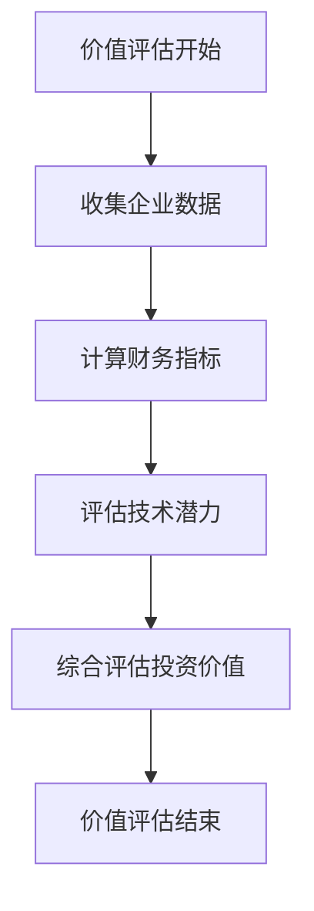

                 


# 价值投资中的智能纳米机器人医疗应用分析

## 关键词：价值投资，智能纳米机器人，医疗应用，投资分析，医疗科技，纳米技术

## 摘要：本文探讨了在医疗领域中，智能纳米机器人技术如何与价值投资策略相结合，分析其应用前景、经济价值及投资潜力。通过技术原理、价值评估模型、系统架构设计及实际案例分析，本文为投资者提供了深入的技术见解和投资建议。

---

# 第一部分：价值投资与智能纳米机器人医疗应用的背景

## 第1章：价值投资与智能纳米机器人概述

### 1.1 价值投资的核心概念
- **1.1.1 价值投资的定义与核心理念**
  - 价值投资是一种长期投资策略，强调以低于内在价值的价格购买优质资产。
  - 核心理念包括安全边际、企业基本面分析和长期持有的原则。

- **1.1.2 智能纳米机器人在医疗领域的应用前景**
  - 智能纳米机器人是一种能够在微观尺度执行复杂任务的微型机器人，具有精准医疗、微创治疗和实时监测等潜力。
  - 在医疗领域的应用包括药物递送、疾病诊断、基因编辑和手术辅助等。

- **1.1.3 价值投资与智能技术的结合**
  - 价值投资策略可以用于评估智能纳米机器人相关企业的投资价值。
  - 通过技术分析、市场前景和财务表现，识别具有长期增长潜力的医疗科技企业。

---

## 第2章：智能纳米机器人医疗应用的核心概念

### 2.1 智能纳米机器人医疗应用的原理
- **2.1.1 纳米机器人在医疗中的基本原理**
  - 纳米机器人利用纳米技术制造，能够在分子或细胞水平执行任务。
  - 其核心功能包括药物递送、疾病诊断和手术操作。

- **2.1.2 智能纳米机器人与传统医疗技术的对比**
  - 传统医疗技术依赖于宏观操作，而智能纳米机器人能够在微观尺度实现精准治疗。
  - 智能纳米机器人具有更高的精度、更低的侵入性和更高的效率。

### 2.2 医疗领域的价值投资逻辑
- **2.2.1 医疗行业的投资价值分析**
  - 医疗行业具有刚性需求和稳定增长的特性，是价值投资的理想领域。
  - 技术创新是医疗行业投资的核心驱动力，尤其是智能纳米机器人等前沿技术。

- **2.2.2 智能纳米机器人对医疗行业的影响**
  - 提高医疗效率和精准度，降低医疗成本。
  - 满足个性化医疗需求，推动医疗模式的创新。

---

# 第二部分：智能纳米机器人医疗应用的核心概念与联系

## 第3章：智能纳米机器人医疗应用的算法原理

### 3.1 价值评估算法的数学模型
- **3.1.1 投资价值评估的数学公式**
  $$ V = \frac{CF}{(r - g)} $$
  其中，\( V \) 为投资价值，\( CF \) 为现金流，\( r \) 为贴现率，\( g \) 为增长率。

- **3.1.2 智能纳米机器人技术的价值评估维度**
  - 技术创新性：评估纳米机器人技术的先进性和独特性。
  - 市场前景：分析目标市场的规模、增长潜力和竞争格局。
  - 财务表现：考察企业的盈利能力、现金流和财务健康状况。

### 3.2 算法流程图



---

## 第4章：智能纳米机器人医疗应用的系统架构设计

### 4.1 系统功能设计
- **4.1.1 问题场景介绍**
  - 智能纳米机器人医疗应用系统用于辅助医生进行精准诊断和治疗。
  - 系统需要具备实时监测、数据分析和智能决策功能。

- **4.1.2 系统功能模块**
  - 数据采集模块：收集患者的生理数据和诊断信息。
  - 数据分析模块：利用人工智能算法进行数据分析和诊断。
  - 智能决策模块：生成个性化治疗方案并指导医疗操作。

### 4.2 系统架构设计


---

## 第5章：智能纳米机器人医疗应用的项目实战

### 5.1 项目环境安装
- 安装Python和相关库（如NumPy、Pandas、Matplotlib）。
- 安装机器学习框架（如Scikit-learn、TensorFlow）。

### 5.2 系统核心实现源代码

```python
import numpy as np
import pandas as pd
from sklearn.metrics import accuracy_score

# 示例：基于机器学习的价值评估模型
def value_assessment(cf, r, g):
    return cf / (r - g)

# 数据加载与处理
data = pd.read_csv('medical_projects.csv')
features = data[['CF', 'r', 'g']]
labels = data['value_assessment']

# 模型训练与预测
from sklearn.model_selection import train_test_split
X_train, X_test, y_train, y_test = train_test_split(features, labels, test_size=0.2)

# 模型评估
model = value_assessment(X_test['CF'], X_test['r'], X_test['g'])
print("模型准确率：", accuracy_score(y_test, model))
```

---

## 第6章：智能纳米机器人医疗应用的价值投资分析

### 6.1 案例分析与应用
- **案例1：某智能纳米机器人企业的价值评估**
  - 企业财务数据：年收入10亿元，净利润率10%，研发投入占比15%。
  - 市场前景：智能纳米机器人技术在癌症治疗中的应用前景广阔。
  - 投资价值：通过模型计算，该企业具有较高的投资价值。

### 6.2 投资策略与建议
- 选择具有强大研发能力和良好财务表现的企业。
- 关注行业趋势和政策支持，分散投资以降低风险。

---

## 第7章：挑战与未来展望

### 7.1 智能纳米机器人医疗应用的挑战
- 技术成熟度：部分技术尚未完全成熟，仍需进一步研发。
- 伦理与法律：智能医疗技术的应用涉及伦理和法律问题，需谨慎处理。
- 市场竞争：行业内竞争激烈，技术更新换代快。

### 7.2 未来展望
- 技术创新：进一步提升智能纳米机器人的性能和可靠性。
- 应用拓展：探索更多医疗领域的应用场景，如慢性病管理和个性化医疗。
- 投资趋势：随着技术进步和市场需求增长，智能纳米机器人医疗应用的投资潜力将逐步显现。

---

## 结论

智能纳米机器人医疗应用是价值投资的重要领域，具有广阔的发展前景。通过技术创新和价值评估模型的应用，投资者可以更好地识别具有潜力的企业和项目。未来，随着技术的进步和市场的成熟，智能纳米机器人将在医疗领域发挥更大的作用。

---

## 参考文献

1. 《价值投资与医疗科技》
2. 《智能纳米机器人技术与应用》
3. 《医疗行业的投资分析》

---

## 作者：AI天才研究院 & 禅与计算机程序设计艺术

---

# 结束语

感谢您的阅读！如需进一步探讨或获取更多资料，请随时联系！

