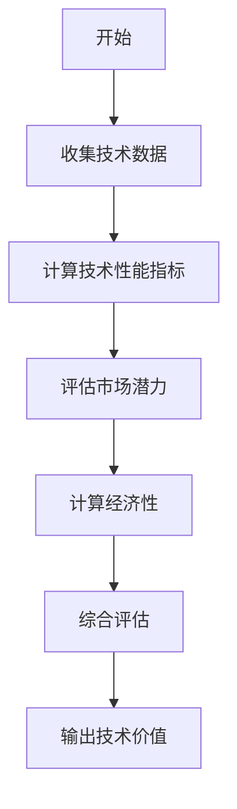

                 


```markdown
# 价值投资中的智能纳米材料自清洁技术分析

## 关键词
价值投资, 智能纳米材料, 自清洁技术, 投资分析, 纳米材料性能

## 摘要
智能纳米材料自清洁技术作为一种新兴的科技，正在改变多个行业的面貌。本文从价值投资的角度，分析智能纳米材料自清洁技术的核心原理、市场潜力及投资价值。通过构建数学模型，评估技术的经济性与可行性，帮助投资者识别高潜力的技术与企业，为投资决策提供科学依据。

---

# 第一部分: 价值投资与智能纳米材料自清洁技术的背景介绍

## 第1章: 价值投资的核心概念

### 1.1 价值投资的定义与特点
价值投资是一种长期投资策略，强调以低于公平价值的价格购买优质资产。其核心理念在于寻找市场低估的公司，通过长期持有分享企业成长的收益。价值投资具有以下特点：
- **长期性**: 强调长期持有，避免短期波动干扰。
- **安全性**: 重点关注企业的财务健康与竞争优势。
- **边际成本递减**: 随着持有时间的延长，单位成本逐步降低。

### 1.2 智能纳米材料自清洁技术的定义与特点
智能纳米材料自清洁技术利用纳米尺度的材料特性，实现表面的自清洁功能。其特点包括：
- **纳米尺度效应**: 利用纳米材料的微观结构实现特定功能。
- **自适应性**: 材料表面可根据环境变化自动调节清洁能力。
- **节能环保**: 自清洁功能可减少清洁剂的使用，降低能耗。

## 第2章: 价值投资与智能纳米材料自清洁技术的联系

### 2.1 价值投资在科技领域的应用
科技领域的价值投资注重技术创新的商业价值与市场潜力。智能纳米材料自清洁技术作为一项颠覆性创新，具有广阔的市场应用前景。

### 2.2 智能纳米材料自清洁技术的市场潜力
随着环保意识的增强与技术进步，智能纳米材料自清洁技术在建筑、汽车、电子等领域展现出巨大潜力。

### 2.3 价值投资与技术创新的互动关系
技术创新推动企业价值增长，而价值投资为企业技术创新提供了资金支持，形成良性循环。

---

# 第二部分: 智能纳米材料自清洁技术的核心概念与联系

## 第3章: 智能纳米材料的结构与功能

### 3.1 纳米材料的基本结构
纳米材料的微观结构决定了其宏观性能。例如，纳米级的二氧化钛具有光催化性能，可用于自清洁表面。

### 3.2 自清洁技术的物理化学机制
自清洁技术通常基于超疏水或超亲水表面的特性。通过构建特定的纳米结构，材料表面可实现自清洁功能。

### 3.3 智能纳米材料的性能指标
包括表面粗糙度、接触角、耐久性等关键指标。

## 第4章: 价值投资中的技术评估

### 4.1 技术评估的核心要素
包括技术成熟度、市场应用前景、技术壁垒等。

### 4.2 技术评估的指标体系
构建包含技术性能、市场潜力、经济性等多维度的评估指标。

### 4.3 技术与市场的匹配度分析
评估技术是否与市场需求相匹配，是否具备商业化潜力。

---

# 第三部分: 智能纳米材料自清洁技术的算法原理讲解

## 第5章: 纳米材料自清洁技术的数学模型

### 5.1 自清洁效果的数学表达
自清洁效果与表面粗糙度和化学成分有关，可通过公式量化。

$$
S = f(r, c)
$$

其中，$S$ 表示自清洁效果，$r$ 表示表面粗糙度，$c$ 表示化学成分。

### 5.2 纳米材料性能的数学模型
材料性能与制备工艺密切相关，可通过回归分析建立性能预测模型。

$$
P = \beta_0 + \beta_1x + \epsilon
$$

其中，$P$ 表示性能，$x$ 表示制备参数，$\beta$ 为回归系数，$\epsilon$ 为误差项。

### 5.3 自清洁技术的优化算法
通过遗传算法优化纳米材料的结构参数，提升自清洁效果。

## 第6章: 价值投资中的技术评估模型

### 6.1 技术评估的数学公式
构建包含技术性能、市场潜力和经济性的多维度评估模型。

$$
V = \alpha_1P + \alpha_2M + \alpha_3E
$$

其中，$V$ 表示技术价值，$P$ 表示技术性能，$M$ 表示市场潜力，$E$ 表示经济性，$\alpha$ 为权重系数。

### 6.2 价值评估的流程图


---

# 第四部分: 智能纳米材料自清洁技术的系统分析与架构设计方案

## 第7章: 项目实战

### 7.1 项目背景
选择一家专注于智能纳米材料研发的公司作为分析对象。

### 7.2 系统功能设计
构建技术评估系统，包括数据采集、性能计算、价值评估等功能。

### 7.3 系统架构设计


### 7.4 核心代码实现
```python
def calculate_value(technology_data):
    performance = technology_data['performance']
    market_potential = technology_data['market_potential']
    economic_factors = technology_data['economic_factors']
    return (0.4 * performance) + (0.3 * market_potential) + (0.3 * economic_factors)
```

### 7.5 案例分析
分析某纳米材料企业的技术指标与市场表现，验证评估模型的有效性。

---

# 第五部分: 最佳实践与投资策略

## 第8章: 投资策略与风险管理

### 8.1 投资策略
制定基于技术评估的分阶段投资策略，分散投资风险。

### 8.2 风险管理
建立风险评估机制，定期复评估技术与市场的匹配度。

## 第9章: 技术发展趋势

### 9.1 技术创新方向
关注新型纳米材料的开发与应用。

### 9.2 市场拓展策略
探索新兴市场的应用潜力，扩大技术应用范围。

---

# 结论

智能纳米材料自清洁技术作为一项具有广阔前景的创新技术，其价值投资潜力不容忽视。通过科学的技术评估与价值分析，投资者可以在技术创新中发现机遇，实现长期稳健的投资回报。

---

# 作者

作者：AI天才研究院/AI Genius Institute & 禅与计算机程序设计艺术 /Zen And The Art of Computer Programming
```

